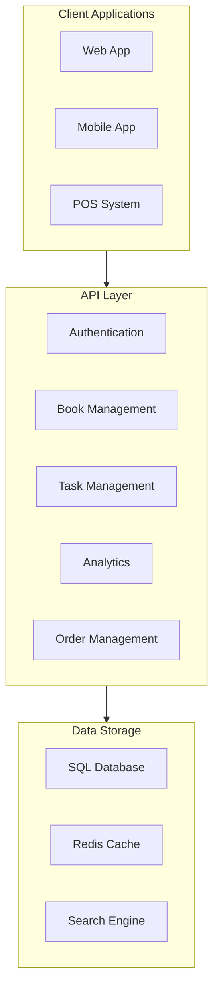
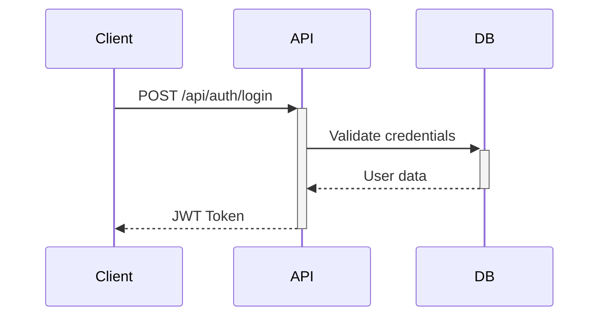
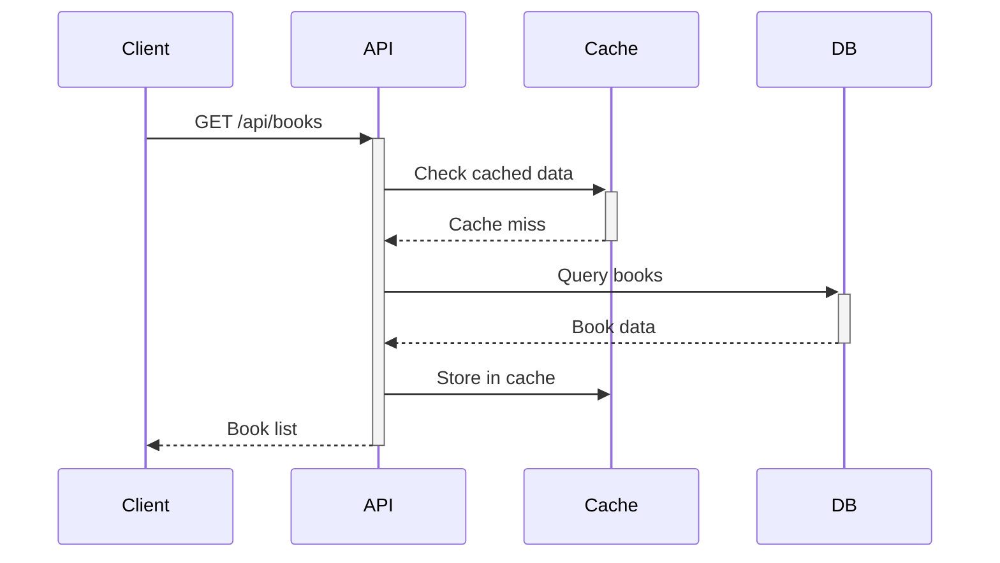
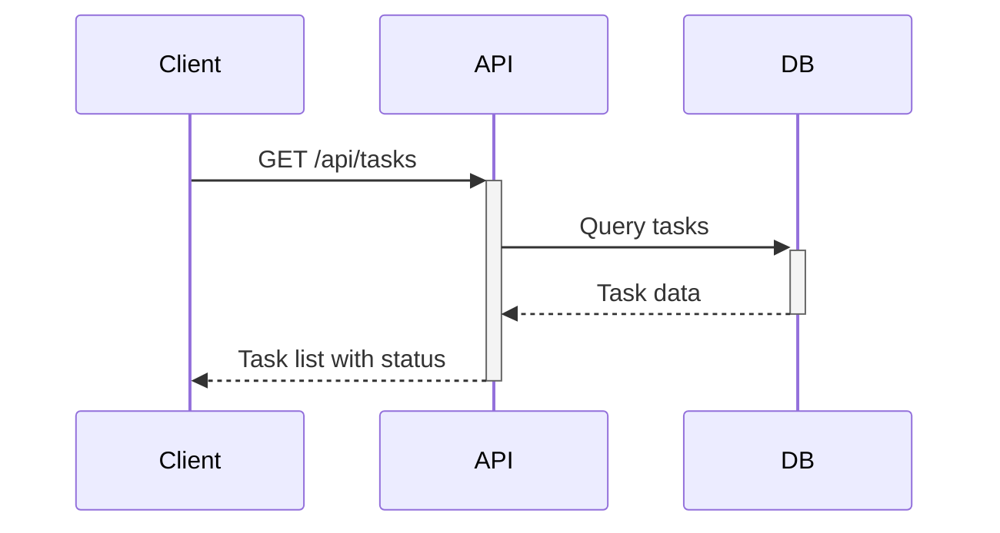
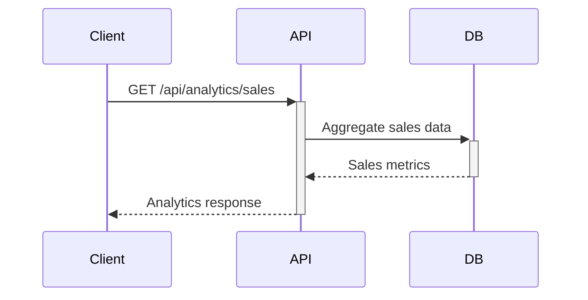
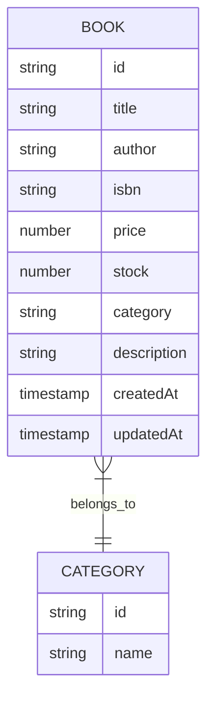
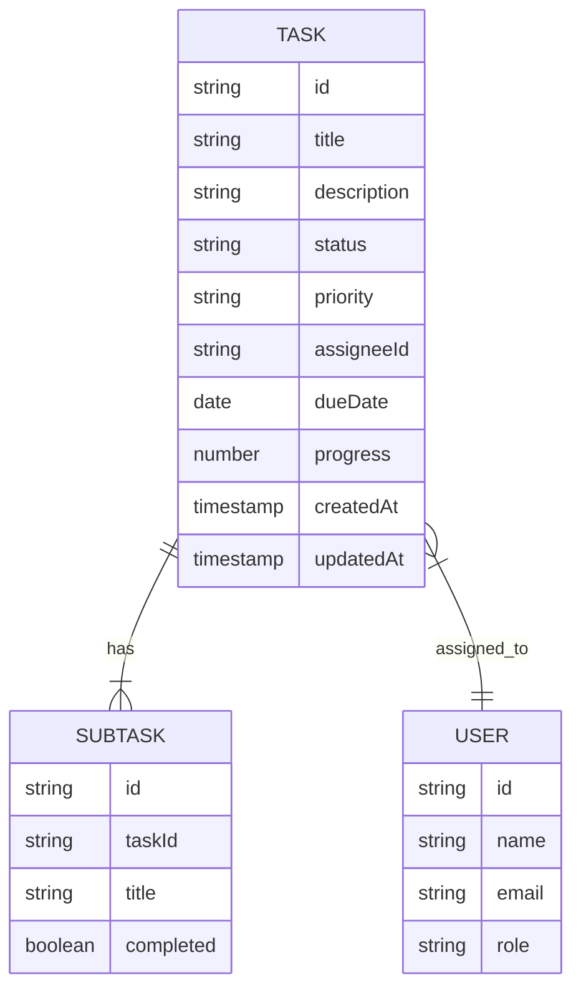
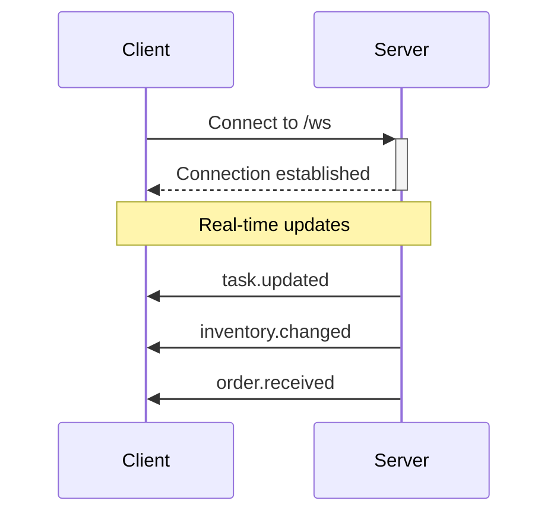

# Bookstore Management System API Documentation

## Overview
This documentation covers the RESTful API endpoints for the Bookstore Management System, including inventory management, task tracking, analytics, and customer journey features.

## System Architecture



## Authentication

### POST /api/auth/login
Authenticates a user and returns an access token.



#### Request Body
```json
{
  "email": "string",
  "password": "string"
}
```

#### Response
```json
{
  "token": "string",
  "user": {
    "id": "string",
    "email": "string",
    "role": "string"
  }
}
```

## Book Management

### GET /api/books
Retrieves a paginated list of books.



#### Query Parameters
| Parameter | Type | Description |
|-----------|------|-------------|
| page | number | Page number |
| limit | number | Items per page |
| category | string | Filter by category |
| search | string | Search query |

#### Response
```json
{
  "books": [
    {
      "id": "string",
      "title": "string",
      "author": "string",
      "isbn": "string",
      "price": "number",
      "stock": "number",
      "category": "string"
    }
  ],
  "total": "number",
  "page": "number",
  "totalPages": "number"
}
```

### POST /api/books
Adds a new book to the inventory.

#### Request Body
```json
{
  "title": "string",
  "author": "string",
  "isbn": "string",
  "price": "number",
  "stock": "number",
  "category": "string",
  "description": "string"
}
```

## Task Management

### GET /api/tasks
Retrieves tasks for the store management.



#### Query Parameters
| Parameter | Type | Description |
|-----------|------|-------------|
| status | string | Filter by status |
| priority | string | Filter by priority |
| assignee | string | Filter by assignee |

#### Response
```json
{
  "tasks": [
    {
      "id": "string",
      "title": "string",
      "description": "string",
      "status": "string",
      "priority": "string",
      "assignee": "string",
      "dueDate": "string",
      "progress": "number"
    }
  ]
}
```

### POST /api/tasks
Creates a new task.

#### Request Body
```json
{
  "title": "string",
  "description": "string",
  "priority": "string",
  "assignee": "string",
  "dueDate": "string"
}
```

## Analytics

### GET /api/analytics/sales
Retrieves sales analytics data.



#### Query Parameters
| Parameter | Type | Description |
|-----------|------|-------------|
| startDate | string | Start date for analysis |
| endDate | string | End date for analysis |
| interval | string | Data grouping interval |

#### Response
```json
{
  "totalSales": "number",
  "averageOrderValue": "number",
  "topSellingBooks": [
    {
      "bookId": "string",
      "title": "string",
      "quantity": "number",
      "revenue": "number"
    }
  ],
  "salesByPeriod": [
    {
      "period": "string",
      "sales": "number",
      "orders": "number"
    }
  ]
}
```

## Error Handling

### Error Response Format
```json
{
  "error": {
    "code": "string",
    "message": "string",
    "details": "object (optional)"
  }
}
```

### Common Error Codes
| Code | Description |
|------|-------------|
| 400 | Bad Request |
| 401 | Unauthorized |
| 403 | Forbidden |
| 404 | Not Found |
| 422 | Validation Error |
| 500 | Internal Server Error |

## Data Models

### Book Model


### Task Model


## Rate Limiting
The API implements rate limiting to ensure fair usage:

| Endpoint | Rate Limit | Window |
|----------|------------|--------|
| /api/auth/* | 5 requests | 1 minute |
| /api/books | 100 requests | 1 minute |
| /api/tasks | 50 requests | 1 minute |
| /api/analytics | 20 requests | 1 minute |

## Webhook Events

### Available Events
| Event | Description | Payload Example |
|-------|-------------|-----------------|
| book.created | New book added | `{"bookId": "string", "title": "string"}` |
| book.updated | Book details updated | `{"bookId": "string", "changes": {}}` |
| task.assigned | Task assigned to user | `{"taskId": "string", "assigneeId": "string"}` |
| task.completed | Task marked as complete | `{"taskId": "string", "completedAt": "string"}` |

## WebSocket Events



### Event Types
- task.updated
- inventory.changed
- order.received
- analytics.updated

## Implementation Examples

### Authentication Example
```javascript
fetch('/api/auth/login', {
  method: 'POST',
  headers: {
    'Content-Type': 'application/json'
  },
  body: JSON.stringify({
    email: 'user@example.com',
    password: 'password123'
  })
})
.then(response => response.json())
.then(data => {
  localStorage.setItem('token', data.token);
});
```

### Task Creation Example
```javascript
fetch('/api/tasks', {
  method: 'POST',
  headers: {
    'Content-Type': 'application/json',
    'Authorization': `Bearer ${token}`
  },
  body: JSON.stringify({
    title: 'Inventory Check',
    description: 'Perform monthly inventory audit',
    priority: 'high',
    dueDate: '2024-03-15'
  })
})
.then(response => response.json())
.then(data => console.log(data));
```

## Security Considerations
1. Authentication required for all endpoints except public book listings
2. JWT tokens expire after 24 hours
3. CORS policies implemented
4. Rate limiting enforced
5. Input validation on all endpoints
6. SQL injection prevention
7. XSS protection headers

## API Versioning
The API uses URL versioning:
- Current version: `v1`
- Base URL: `/api/v1/`
- Legacy support: Previous versions supported for 6 months after deprecation

