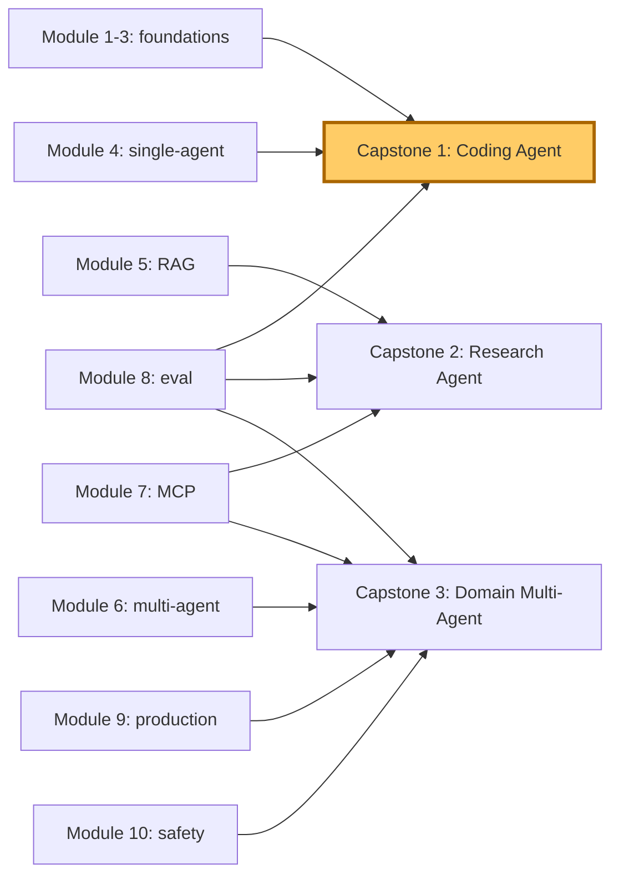

# Capstones — Integrated Lab Specifications

> Three end-to-end projects that exercise everything from Modules 1–13. Each capstone is specified as a runnable brief: business scenario, success criteria, suggested architecture, eval plan, and stretch goals. Solutions are deliberately omitted — these are open-ended.

## Capstone Index

Mermaid source

---

# Capstone 1 — Build a Coding Agent

> **Duration:** 20–40 hours. **Target depth:** production-quality on a narrow slice.

## Brief

Build an agent that, given a real GitHub issue from a chosen open-source repo, produces a working pull request. Target: 30% pass rate on 30 held-out issues from your chosen repo.

## Business scenario

*Your team is evaluating "AI-augmented engineering."* Leadership wants a defensible answer to: *can an agent reliably ship low-complexity bug fixes for our codebase?* You have 4 weeks and one engineer (you).

## Success criteria

1. Agent reads a GitHub issue from a chosen repo (suggest: a TypeScript or Python repo with ~50K LOC).
2. Agent explores the codebase, locates relevant files.
3. Agent proposes a fix as a unified diff.
4. Agent verifies the fix by running tests in a sandbox.
5. Agent opens a PR with the diff + a description.
6. ≥ 30% of 30 held-out issues result in a PR that passes CI.

## Suggested architecture

| Layer | Module reference | Choice |
|---|---|---|
| Agent paradigm | 1.4, 4.1 | ReAct |
| Memory | 4.2 | Episodic across issues; procedural for repo conventions |
| Tools | 7.1, 7.2 | MCP server: file ops, grep, run-tests, write-pr |
| Sandbox | 7.3 | E2B or Firecracker (test execution must be isolated) |
| Termination | 2.1, 4.1 | Tests pass + diff < N lines + confidence > 0.8 |
| Eval | 8.1 | 30-issue regression set with known ground truth |
| Production | 9.1 | Durable execution (each issue is one workflow) |
| Safety | 10.2 | Privilege separation: explorer vs writer agents |

## Eval plan

- **Locked regression**: 30 issues from your target repo, with known correct fixes.
- **Metrics**: pass rate, lines changed (smaller is better), tool calls, cost, latency.
- **Per-slice**: easy issues (typo / config) vs medium (logic bug) vs hard (cross-file).

## Stretch goals

- Add Reflexion (4.3) on failed PR attempts.
- Add multi-agent (6.1): planner + explorer + writer + tester.
- Support repos in languages you didn't design for (TypeScript-trained agent on Python).
- Compare against SWE-bench's published baselines.

## Deliverables

- Working repo with the agent code.
- Eval report: pass rate, cost, latency, error analysis.
- 1-page architecture diagram.
- 1-page failure-mode analysis (top 5 reasons for failures).

---

# Capstone 2 — Build a Research Agent

> **Duration:** 20–40 hours. **Target depth:** publishable-quality reasoning + faithful citations.

## Brief

Build an agent that, given an open research question, synthesises findings from primary sources with verifiable citations. Target: 80% citation faithfulness on a 50-question eval, judged by a domain expert (or LLM-as-judge calibrated against one).

## Business scenario

*Helix is evaluating agent-assisted literature synthesis.* The criterion: would Maya trust the agent's output enough to cite it in a grant application? "Trust" = every factual claim traces to a real, supportive source.

## Success criteria

1. Agent accepts a research question (e.g., "What is the current evidence on combination therapy for BRCA2-positive patients with PARP-inhibitor resistance?").
2. Agent retrieves from a real source (PubMed open access; arXiv; a curated corpus you choose).
3. Agent reads multiple sources (≥ 5).
4. Agent produces a 500-1500 word synthesis.
5. Every factual claim is cited.
6. Cited claims are *supported* by the cited source (faithfulness).
7. ≥ 80% citation faithfulness on a 50-question eval.

## Suggested architecture

| Layer | Module reference | Choice |
|---|---|---|
| Retrieval | 5.1, 5.2 | Hybrid (dense + BM25), reranker on top-50 |
| Paradigm | 1.4, 5.3 | Plan-and-Solve (decompose question) + ReAct (per sub-question) |
| Memory | 5.4 | Compact retrieved chunks; preserve cite-grounded fragments |
| Tools | 7.1 | retrieve, read_paper, extract_claim, cite |
| Verification | 5.3 | Post-synthesis: re-read each cited passage, confirm support |
| Safety | 10.4 | Citation faithfulness is the primary safety property |
| Eval | 8.2 | LLM-as-judge for synthesis quality; programmatic check for faithfulness |

## Eval plan

- **50 questions**: 25 in-distribution (well-covered by corpus) + 25 hard (require multi-hop or rare evidence).
- **Faithfulness check**: for each cited claim, send (claim, citation passage) to a verifier; binary supported/unsupported.
- **Synthesis quality**: LLM-as-judge with rubric (specificity, coverage, accuracy).
- **Cost / latency** measured throughout.

## Stretch goals

- Multi-hop retrieval (5.3): agent reformulates queries based on what it finds.
- Disagreement detection: when sources conflict, surface explicitly.
- Cross-disciplinary synthesis (combine multiple corpus types).

## Deliverables

- Repo with agent.
- Eval results: faithfulness, quality, cost.
- Sample synthesis outputs (10 questions with full traces).
- Failure-mode analysis: where does the agent hallucinate or under-cite?

---

# Capstone 3 — Build a Domain Multi-Agent System

> **Duration:** 40–80 hours. **Target depth:** end-to-end production-shape for a chosen domain.

## Brief

Pick a real domain in your org (or pick from: e-commerce support, IT helpdesk, sales-lead qualification, claims processing, scheduling). Build a 3-agent system that handles the domain's main workflows with the full discipline of Modules 1–10.

## Business scenario

You are launching agent-assisted operations in your chosen domain. The goal is a system that:
- Handles 80% of routine cases autonomously,
- Routes 20% to humans with structured context,
- Survives production constraints (latency, cost, safety, audit).

## Success criteria

1. 3-agent system with clear roles (e.g., triage, specialist, supervisor).
2. Real or realistic tool integrations (3+ tools via MCP).
3. Privilege-separated (10.2) for any user-input handling.
4. Durable execution (9.1).
5. Eval harness (8.1) with ≥ 100 case regression set.
6. Audit-queryable trace storage (10.4).
7. Cost ≤ chosen budget; accuracy ≥ chosen target.
8. Runbook for top 3 incident types (9.4).

## Suggested architecture

| Layer | Module reference | Choice |
|---|---|---|
| Topology | 6.1 | Orchestrator-worker, 3 agents |
| Communication | 6.2 | Strict schema for cross-agent messages |
| Tools | 7.1, 7.2 | MCP servers (custom or open) |
| Sandboxing | 7.3 | For any code-exec tools |
| Auth | 7.4, 10.2 | ACLs + privilege separation |
| Memory | 4.2, 5.4 | Tiered: working / episodic / procedural |
| Production | 9.1, 9.2, 9.3 | Durable execution + retry + caching |
| Eval | 8.1, 8.4 | Regression set + CI gates |
| Safety | 10.1, 10.3 | Prompt-injection defences + quarterly red-team |
| Audit | 10.4 | Full trace, queryable, 7-yr retention pattern |

## Eval plan

- **Regression set**: 100 historical-style cases stratified by case type.
- **Adversarial set**: 30 red-team attempts (prompt injection, tool abuse).
- **Shadow run**: if you have real traffic, shadow for 1 week before going live.
- **Metrics**: accuracy, escalation rate, cost per case, p95 latency, attack success rate.

## Stretch goals

- Add Reflexion (4.3) for high-value, low-volume cases.
- Add multi-modal (vision for screenshots, audio for voice).
- Build the operator dashboard (8.3) end-to-end.
- Implement the rollback procedure (9.4) and demo it under simulated failure.

## Deliverables

- Repo with all three agents + MCP servers + sandbox + eval.
- Architecture diagram showing every component from Module 9's deployment shape.
- Eval report covering all 8 success criteria.
- Runbook + incident-response plan.
- 1-hour walkthrough video (optional but valuable for org buy-in).

---

# Capstone Grading Rubric (for self-assessment)

| Dimension | Pass | Strong | Exceptional |
|---|---|---|---|
| Functionality | Meets success criteria | + stretch goals | + novel design choice |
| Eval discipline | Regression set + metrics | + adversarial + per-slice | + LLM-as-judge calibrated |
| Production quality | Runs reliably | + observability + runbooks | + rollback demoed |
| Safety | Basic prompt-injection defences | + privilege separation + red-team | + audit-ready |
| Documentation | README + architecture | + failure-mode analysis | + replication-ready |
| Cost / latency | Within budget | + cost optimisations | + benchmarked at multiple scales |

---

*End of capstones. End of course.*
