# Module 1 — Foundations & Mental Models

> **Module length:** ~6 hours · **Lessons:** 4 · **Prereqs:** working knowledge of LLMs (you've used the Claude/OpenAI API, written a few prompts, understand tokens and context windows). No prior RL or agent-framework experience required.

## Learning objectives

By the end of this module, you will be able to:

1. **Define** what an agent is (and isn't) using the *agency dial* — a continuous, operational measure rather than a binary.
2. **Trace** the lineage from symbolic agents → reinforcement learning → LLM agents, and identify which ideas survived and why.
3. **Decide** when to use an agent vs. a workflow vs. a pipeline using a five-question framework.
4. **Recognize** the four major LLM-agent paradigms (ReAct, Reflexion, Plan-and-Solve, CodeAct) and their failure modes.
5. **Avoid** the most common mistake: using an agent when a workflow would do.

## Module mind map


<details><summary>Mermaid source</summary>

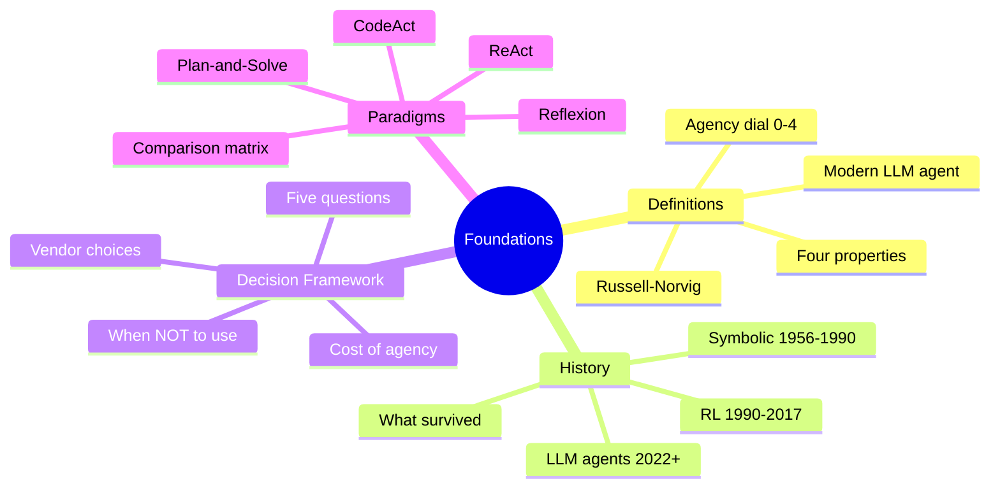

</details>

*The four lessons map 1:1 to the four branches above.*

## Module-level concept DAG


<details><summary>Mermaid source</summary>

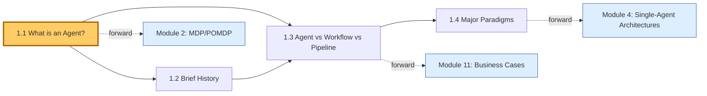

</details>

*Solid arrows are intra-module prerequisites. Dashed arrows are forward references to later modules.*

---

# World Bible

Three fictional but realistic organizations recur throughout this course. Every `§1 Business Scenario` will be set in one of these worlds. Read these once; you'll be a regular by Module 3.

## HSBC Mid-Office Reconciliation *(banking · regulated · high-stakes)*

**Domain.** Each night, the bank's mid-office reconciles ~14,000 cross-border SWIFT settlement messages against the general ledger. Roughly 10% (~1,400) fail to auto-match and become *breaks* — discrepancies that need human investigation before the books close.

**Data model (simplified).**


<details><summary>Mermaid source</summary>

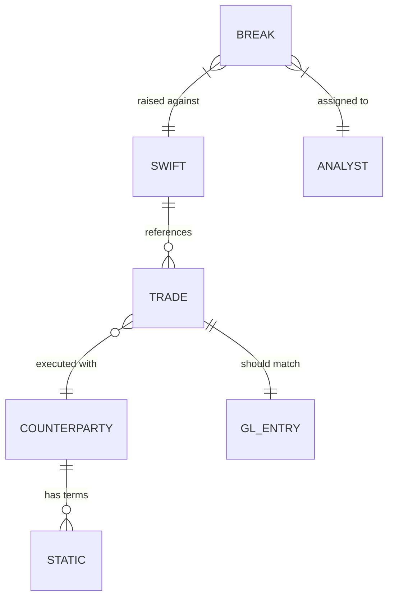

</details>

**Volume & cost.** 14k SWIFT/night · 1,400 breaks/night · 8 analysts × 6h/day · $42 average cost per break · **$3.4M/year** in break-handling cost.

**Systems.** GL (Oracle), SWIFT gateway, CRM (counterparty master), Settlement system, Static data (terms/fees), Audit log.

**Hard constraints.**
- SR 11-7 model risk management — every automated decision must be explainable and traceable.
- No PII to non-EU regions (GDPR + UK GDPR).
- Audit trail retained 7 years.
- No automated *resolution* of breaks without human sign-off — automation is investigation only.

**Cast.**
- **Priya Iyer** — Head of Mid-Office Ops. Owns the P&L for the reconciliation function. Skeptical of AI, burned twice by RPA vendors.
- **Daniel Cho** — Model Risk & Validation lead. Reports to the CRO. He decides whether anything we build passes governance.
- **Aisha Khan** — Senior reconciliation analyst, 12 years on the desk. Knows the patterns; she's the gold standard our agents must approach.

**Why this org for this course.** Banking forces you to think about *evaluation*, *explainability*, *governance*, and *cost discipline* — exactly the concerns that separate hobby agents from production ones.

---

## Helix Research *(biomed research startup · cite-faithfulness mandatory)*

**Domain.** A 40-person biotech startup researching drug-target interactions. Their researchers spend ~30% of their time on literature synthesis: tracking new PubMed papers, cross-referencing prior findings, building hypotheses.

**Volume.** 8M PubMed papers in scope; ~60k new papers/month in relevant fields; researchers manually triage ~100 abstracts/day.

**Systems.** PubMed API, internal ELN (Electronic Lab Notebook), experiment results DB (PostgreSQL), Slack, Notion.

**Hard constraints.**
- *Cite-faithfulness*: every factual claim must trace to a specific paper + page. Hallucinations are an existential risk — a mis-cited mechanism can derail a $4M experiment.
- Latency is forgiving (researchers will wait 10 minutes for a good answer); accuracy is not.

**Cast.**
- **Maya Sundaram** — Chief Scientific Officer. PhD in computational biology, will personally read every agent output for the first month.
- **Tom Rivera** — ML lead, built their internal embedding search.

**Why this org for this course.** Helix forces you to think about *memory*, *retrieval*, *grounding*, and *long-horizon reasoning* — the territory where RAG, agentic RAG, and multi-agent debate earn their keep.

---

## Acme E-Commerce Support *(consumer support at scale · cost-per-ticket pressure)*

**Domain.** A $400M/yr DTC retailer handling 320k customer support tickets/month — order status, refunds, sizing, shipping, returns.

**Systems.** Zendesk (ticketing), Shopify (orders), Stripe (payments), ShipStation (shipping), internal KB.

**Volume & cost.** 320k tickets/month · current cost-per-ticket $1.20 ($4.6M/yr) · target $0.30 with AI deflection.

**Hard constraints.**
- 4-hour first-response SLA.
- CSAT must not drop below 4.2/5 (currently 4.4).
- No agent may issue refunds >$50 without human approval.
- Must handle traffic spikes (Black Friday: 10× normal volume).

**Cast.**
- **Ronnie Park** — Head of CX. Cares about CSAT first, cost second.
- **Lin Chen** — Engineering lead. Owns the deflection rate metric.

**Why this org for this course.** Acme forces you to think about *latency*, *cost*, *scale*, *caching*, *graceful degradation*, and *human handoff* — the production engineering concerns.

---

# Lesson 1.1 — What is an Agent?

> **Section 0 · How this course works** *(replaces "From last time" for the first lesson of the course)*
>
> This course is built on three recurring artifacts:
> 1. **The World Bible** — three case-study orgs (above). Every business scenario lives in one of them. You'll get to know Priya, Maya, and Ronnie like coworkers.
> 2. **Sherpa** — one codebase that *evolves* across the course. We start it as a ReAct loop in Module 4 and end with a production multi-agent system in Module 9. Each lab adds a capability to Sherpa, replacing what came before. You experience the *forces* that drive each architectural choice.
> 3. **The concept DAG** — the prerequisite graph for every topic. Shown at the start of every module with your current lesson highlighted.
>
> Each lesson follows a 10-section template: §0 from-last-time → §1 business scenario → §2 bridge → §3 mind map → §4 elaboration → §5 problem statement → §6 solution walkthrough → §7 math → §8 technical deep-dive → §9 what this unlocks. Sections are consistent so you build muscle memory for where to find what.
>
> If a math derivation looks heavy, you can skip §7 on first pass and come back. Nothing else depends on it being read in order.

---

## §1 · Business scenario

*HSBC Mid-Office, Tuesday 11:14 PM.*

Aisha Khan, senior reconciliation analyst, is 23 tickets into her overnight batch. Ticket #BR-208441: cross-border USD/SGD settlement, counterparty *Sigma Capital*, trade reference TR-771-994, $1.20M notional, broke at the amount field — the GL shows $1.196M, SWIFT shows $1.200M.

Aisha doesn't need to investigate. She recognizes the pattern instantly. Sigma Capital deducts a $4,000 prime brokerage fee at settlement that isn't reflected in the static data. She's seen this same break shape 11 times in the last six months. She tags it `fee_deduction · sigma_capital · known_pattern`, attaches the standard fee memo, and routes for sign-off. **Elapsed time: 47 seconds.**

But there are 1,377 more breaks in tonight's queue. The average break takes Aisha 14 minutes. The eight analysts on her team will collectively spend ~50 hours tonight working through them. At $42/break, that's $58k of cost in a single overnight.

Meanwhile, Priya Iyer — Aisha's boss — is sitting in a vendor evaluation meeting tomorrow morning. Three vendors are pitching automation:

- **Vendor A: BotForce.** "We'll build a robotic process automation (RPA) workflow. When a break arrives, our bot opens the GL, opens SWIFT, copies fields into a spreadsheet, runs your reconciliation macro, and posts the result. £180k/year licensing."
- **Vendor B: PredictML.** "We'll train a classifier on three years of historical breaks. Features: counterparty, amount delta, currency pair, time-of-day. Output: predicted break category with confidence. £240k/year."
- **Vendor C: Lumen Agents.** "We'll deploy an AI agent that investigates breaks the way Aisha does — pulls the trade, checks the counterparty, queries the GL, classifies the cause. £320k/year + LLM costs."

Priya has 24 hours to pick. She forwards the proposals to Daniel Cho (model risk) with one question: *"What's the actual difference? Are these the same product with different price tags?"*

## §2 · Bridge to topic

Daniel's answer will hinge on a definition most teams haven't bothered to make precise: **what is an agent, and what isn't?**

BotForce is a *script*. PredictML is a *classifier* (a function from features to labels). Lumen is — possibly — an *agent*. These three things differ not in capability but in *who decides what to do next*. Get the definition right and the vendor choice writes itself.

## §3 · Mind map


<details><summary>Mermaid source</summary>

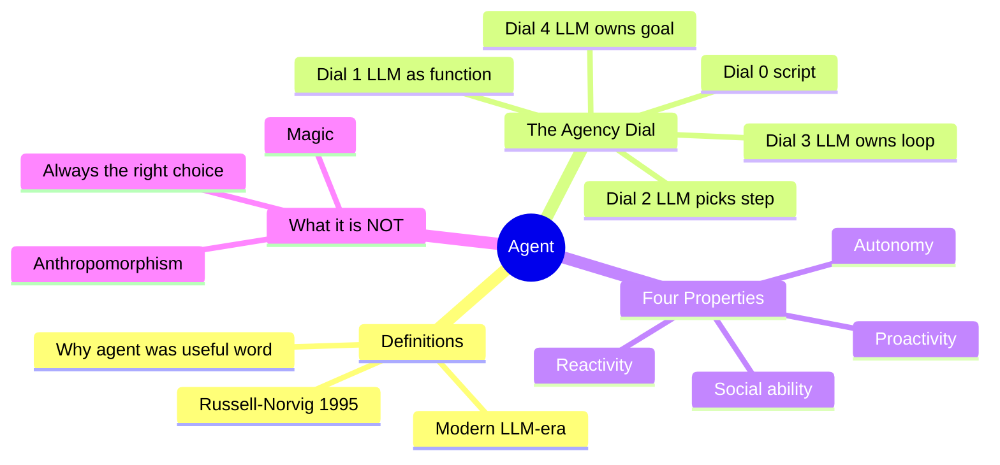

</details>

*Takeaway: "agent" is a continuous measure (the dial), not a binary. The mistake is asking "is it an agent?" instead of "what dial setting do I need?"*

## §4 · Elaboration

### 4.1 Two definitions, 27 years apart

**Russell & Norvig (1995, *Artificial Intelligence: A Modern Approach*).** *"An agent is anything that can perceive its environment through sensors and act upon that environment through actuators."*

This is the definition you'll see in any AI textbook. It's correct but useless on its own — by this definition, a thermostat is an agent (perceives temperature, acts on heater). So is a Roomba. So is a single `for` loop with an `if` statement. The definition was designed to be general; what it gains in generality it loses in operational utility.

**Modern (post-2022, LLM-era).** *An agent is a system in which an LLM dynamically decides which actions to take and when to stop, in pursuit of a goal stated in natural language.*

The operative words: *dynamically*, *decides*, *when to stop*, *natural language*.

- *Dynamically* — at runtime, not at design time. A workflow's decisions are committed in code; an agent's decisions are committed at inference.
- *Decides* — including which tool to call, with what arguments, in what order.
- *When to stop* — the agent owns its own termination. Code doesn't say "run 5 steps then return."
- *Natural language* — the goal is a sentence, not a structured input.

If your system fails any of these tests, it might be very useful, but it's not (centrally) an agent. That's not a value judgment — workflows are often the right choice. It's a *taxonomic* statement so you can reason about it precisely.

### 4.2 The agency dial — the most useful operational view

Instead of asking "is this an agent?", ask "how much of the decision-making does the LLM own?" There's a continuous dial:

| Dial | LLM owns | Code/human owns | Example |
|---|---|---|---|
| **0** | nothing | everything | A SQL query, a cron job, a `Makefile` |
| **1** | text generation only | when to call, what to do with output | GitHub Copilot autocomplete; ChatGPT one-shot Q&A |
| **2** | step labels / classifications | which tools, in what order, when to stop | A workflow with LLM-driven branches; ChatGPT with a single tool per turn |
| **3** | step labels + tool choice + termination | the goal statement and the available tools | Claude with computer use; Cursor in agent mode; a ReAct loop |
| **4** | everything including the goal | the initial high-level instruction | Devin-style "complete this Jira ticket"; Auto-GPT (in spirit) |

Most production systems sit at dial 2–3. Anything above 3 trades reliability for autonomy at an exponentially worse rate.


<details><summary>Mermaid source</summary>

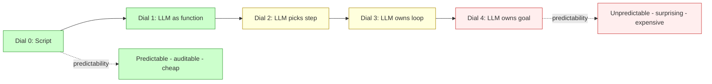

</details>

*Takeaway: higher dial = more capability AND more failure-mode surface. Choose the lowest dial that solves your problem.*

### 4.3 The four properties (Wooldridge, 2009 — still useful)

Wooldridge's taxonomy predates LLMs but holds up:

- **Reactivity** — responds to changes in the environment. LLM agents are strong here (they re-read the world each loop).
- **Proactivity** — takes initiative to pursue goals. LLM agents are weak here; most are invoked, they don't self-trigger. (This is changing with scheduled/triggered agents.)
- **Autonomy** — acts without external control. Strong within the loop, weak outside it (a crashed agent doesn't restart itself).
- **Social ability** — interacts with other agents/humans. Improving rapidly via A2A protocols and structured handoffs.

You don't need all four to call something an agent. But a system with *none* of them isn't one.

### 4.4 What it is *not*

Three common confusions:

- **An agent is not a personality.** "Friendly customer service bot" is a UX choice, not an architectural one. A chatbot with no tools and no decisions is dial 1.
- **An agent is not magic.** Every agent failure has a deterministic explanation in its trace. The non-determinism is in the model, not in mysticism.
- **An agent is not always the right choice.** A workflow is faster, cheaper, more auditable, and easier to debug. If you can express your task as a fixed graph, do.

## §5 · Problem statement

Help Daniel Cho prepare his memo for Priya. Classify each of the following six systems on the agency dial (0–4) and decide whether each qualifies as an "agent" by the modern definition. For each, identify the *single deciding factor*.

1. GitHub Copilot autocomplete (in-IDE single-line suggestions).
2. ChatGPT with code interpreter and browsing, used for a one-shot question.
3. A cron job that calls Claude every morning to summarize yesterday's customer feedback emails and post to Slack.
4. Anthropic Claude with computer use, asked to "book me a flight to Tokyo for next Thursday under $1,200."
5. Cursor in "agent mode," asked to "add a dark-mode toggle to the settings page."
6. BotForce (Vendor A) — the RPA bot that opens GL/SWIFT, runs a reconciliation macro, posts to a spreadsheet.

For each: dial setting + agent? (Y/N) + deciding factor in one sentence.

## §6 · Solution walkthrough

| # | System | Dial | Agent? | Deciding factor |
|---|---|---|---|---|
| 1 | Copilot autocomplete | **1** | No | LLM emits text; the *user* decides whether to accept and what to do next. No loop, no goal. |
| 2 | ChatGPT one-shot with tools | **2** | Borderline | LLM picks tools within a single user turn, but the conversation is human-driven. Multi-turn deep-research mode crosses into dial 3. |
| 3 | Cron summarizer | **1** | No | Fixed input → fixed output. LLM is a function. Schedule is external. |
| 4 | Claude computer use → book flight | **3** | Yes | LLM owns the full loop: search flights, compare, decide, click. Goal in natural language, termination decided by model. |
| 5 | Cursor agent mode | **3–4** | Yes | LLM picks files, edits, runs commands, decides when "done." Sometimes splits sub-goals (dial 4 territory). |
| 6 | BotForce RPA | **0** | No | No LLM in the loop. Fixed script with branch on rule outputs. |

**Daniel's memo writes itself.** Priya's three vendors are at dial 0 (BotForce), dial 1–2 (PredictML — a classifier wrapped in a workflow), and dial 3 (Lumen — true agent). They are not the same product. They have different failure modes, different governance requirements, and different upside ceilings:

- **BotForce** will fail predictably (e.g., when the GL UI changes). Easy to audit, cheap to maintain when the world is stable, brittle when it isn't.
- **PredictML** will fail when the *distribution* shifts (a new counterparty, a new break category). Performance silently degrades. Needs retraining cadence.
- **Lumen** will fail *surprisingly* (hallucinate a tool, loop forever, mis-classify with high confidence). But it can handle break categories it has never seen, because it reasons rather than classifies.

For HSBC under SR 11-7, Daniel recommends a hybrid: start with PredictML for the 70% of breaks that are recurring (cheap, auditable, well-understood failure modes), route the long tail to an agentic system (Lumen-style) with mandatory human sign-off, and explicitly *not* use RPA (too brittle for systems HSBC doesn't control end-to-end).

The vendor evaluation is no longer about price. It's about *dial setting × cost of agency*.

## §7 · Mathematical foundation

### 7.1 Information-theoretic view of agency

Let $a_t \in \mathcal{A}$ be the action the system takes at step $t$, and $o_{1:t}$ be everything observed so far. The system's *conditional action entropy* at step $t$ is:

$$
H(a_t \mid o_{1:t}) = -\sum_{a \in \mathcal{A}} P(a \mid o_{1:t}) \log P(a \mid o_{1:t})
$$

- A pure **script** has $H(a_t \mid o_{1:t}) = 0$ at every step: the action is fully determined.
- A **rule-based workflow** has $H(a_t \mid o_{1:t}) = 0$ along each branch — the branch is determined by the observation through an if-statement.
- An **LLM-as-function** (dial 1) has $H > 0$ over the *text it generates* but the downstream action is still scripted, so action-entropy is 0.
- An **agent** has $H(a_t \mid o_{1:t}) > 0$ over the action set $\mathcal{A}$ itself — the *choice of next action* is a probability distribution conditioned on history.

This is why "agentness" is continuous: it's the *magnitude of conditional action entropy*. A dial-2 system has modest H (model picks among a few well-defined branches). A dial-4 system has high H (model can take many different paths from the same observation).

### 7.2 Why high H sounds bad but is sometimes necessary

Intuition pushes you toward $H = 0$ (predictable). But for problems where the *observation space is open-ended* (e.g., "investigate this novel break"), no finite if-statement covers the cases. The agent's high H is a feature: it's adaptive coverage of a space too large to enumerate.

The trade-off:

$$
\text{Expected utility} = \mathbb{E}[\text{value of good outcome}] - \mathbb{E}[\text{cost of bad outcome}]
$$

For a workflow, both terms have low variance (you know what you'll get). For an agent, both terms have high variance (you'll occasionally get spectacular outcomes and occasional disasters). The choice depends on which side dominates.

We'll formalize this in Module 2 via expected utility under POMDPs.

### 7.3 The complexity hierarchy

A useful one-line ordering:

$$
\text{Script} \subset \text{Workflow} \subset \text{Workflow+LLM} \subset \text{Agent (dial 3)} \subset \text{Multi-agent} \subset \text{Open-ended AGI}
$$

Each set strictly contains the previous in *expressiveness* and strictly contains the previous in *failure-mode surface*.

## §8 · Technical deep-dive

### 8.1 Recognizing agent-shaped code

Open any repo. Within five minutes you can tell whether it contains an agent. Look for these patterns:

**Agent-shaped:**

```typescript
const tools: Record<string, Tool> = {
  lookupCounterparty,
  queryGL,
  checkDuplicates,
};

while (!done) {
  const decision = await model.call({
    history,
    tools: toolSpecs(tools),
  });

  if (decision.type === "answer") {
    return decision.value;          // model decides when to stop
  }
  if (decision.type === "tool_call") {
    const result = await tools[decision.name](decision.args);
    history.push({ decision, result });
  }
}
```

Three tells: a **tool registry**, a **loop driven by the model's output**, and **model-initiated termination**.

**Workflow-shaped:**

```typescript
const extracted  = await extract(text);       // LLM step 1
const classified = await classify(extracted); // LLM step 2
const summary    = await summarize(classified); // LLM step 3
return summary;
```

The LLM is a *function*. The graph is fixed. There is no loop. No tool registry. No termination decision.

### 8.2 Edge cases

- **Conditional workflows.** A workflow with model-driven `switch` branches *is still a workflow* if every branch is enumerated in code and the graph is acyclic.
- **Agentic workflows.** A workflow that calls a sub-agent for one node is best classified by *the whole's controlling structure*: the whole is workflow; the sub is agent.
- **Self-modifying workflows.** A workflow that rewrites its own graph based on results crosses into agent territory. Rare; usually a sign you should have built an agent from the start.
- **Loop-with-classifier.** A loop where each iteration calls a *classifier* (not an LLM) to pick the next step is dial 2 if the classifier output space is small and well-defined.

### 8.3 Failure-mode preview

Each dial setting fails differently. We'll cover this exhaustively in Module 10 (Safety & Security) but a quick preview:


<details><summary>Mermaid source</summary>

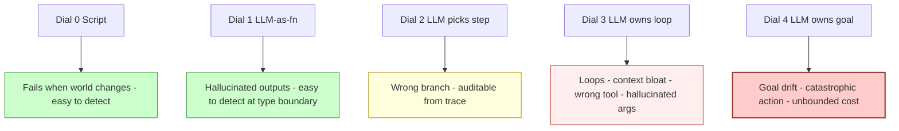

</details>

*Takeaway: dial up only when you've paid the price for the failure modes you're inheriting.*

### 8.4 Production note: the "dial creep" anti-pattern

Teams routinely start at dial 2 ("just a classifier with an LLM"), add a retry loop ("now dial 3"), add planning ("now dial 4"), and end up with an unpredictable system they don't understand. The discipline is to **set the dial deliberately**, document it in the architecture, and require justification to dial up.

In Sherpa (Module 4), we'll set the dial to exactly 3 and hold it there until Module 6 forces us higher.

## §9 · What this unlocks

- **Lesson 1.2** will trace why the agent paradigm took 30 years to converge — symbolic agents (1956), reactive agents (1985), RL agents (1992), and finally LLM agents (2022). Knowing the history tells you which old ideas to steal.
- **Lesson 1.3** will give Priya a five-question framework for choosing between BotForce, PredictML, and Lumen — making the dial choice rigorous instead of vibes-based.
- **Lesson 1.4** will introduce the four major LLM-agent paradigms (ReAct, Reflexion, Plan-and-Solve, CodeAct) — all of which sit at dial 3 but differ in *how the loop is structured*.
- **Module 2** will give you the mathematical machinery (MDP, POMDP, belief states) to reason about agent decisions formally, so the "expected utility" hand-wave in §7.2 becomes a real calculation.
- **Module 4** will build *Sherpa* — the dial-3 agent that solves Aisha's exact problem from §1. By then you'll have the math, the architectural vocabulary, and the failure-mode awareness to do it right.

---

# Lesson 1.2 — A Brief History: Symbolic Agents to LLMs

> **§0 · From last time.** Lesson 1.1 defined an agent as a system where the LLM dynamically owns *which action to take next*, and gave us the agency dial (0–4) as the operational frame. We also handed Priya a memo distinguishing the three vendors (BotForce, PredictML, Lumen) by their dial setting. We did **not** address an obvious objection: this all sounds suspiciously like the expert systems of the 1980s, which spectacularly failed. Daniel Cho is going to bring this up. We owe him a defensible answer.

## §1 · Business scenario

*HSBC Head Office, Friday morning model-risk committee.*

Daniel Cho is presenting the Lumen Agents proposal. Three slides in, the Chief Risk Officer interrupts:

> *"Daniel, I've heard this pitch before. In 1992 we spent £14 million on something called MYCIN-style expert systems for credit-card fraud. Brilliant on the demo. In production, every novel transaction shape required a new rule. Within 18 months the rules contradicted each other, the maintenance team was eight people, and we mothballed it. Tell me what's different this time."*

The committee waits. Daniel has 90 seconds.

The honest answer needs to engage with the failure of expert systems on its own terms — not dismiss it. A bad answer would be *"this is different because LLMs."* A good answer would identify *which* historical failure modes have been solved, *which* have not, and *which new ones* have been introduced.

## §2 · Bridge to topic

Agent research did not begin in 2022. It has a 70-year history of attempts, three of which produced commercially deployed systems (expert systems, RL game-players, LLM agents) and two of which produced rich theory but limited deployment (BDI agents, behavior-based robotics). Each era inherited specific ideas from its predecessor and rejected others. The CRO's question — *what's different this time* — is exactly the right question to ask, and answering it requires knowing the lineage.

## §3 · Mind map


<details><summary>Mermaid source</summary>

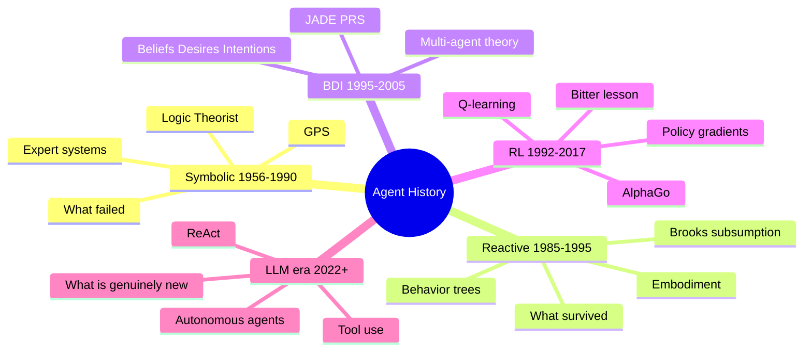

</details>

*Takeaway: each era kept a few load-bearing ideas from its predecessor and rejected the rest. Knowing the history lets you spot recurring failure modes.*

## §4 · Elaboration

### 4.1 Symbolic agents (1956–1990) — the first attempt

The very first AI program — Newell & Simon's **Logic Theorist** (1956) — was an agent: it took a logical goal, searched for a proof, and reported back. **GPS** (General Problem Solver, 1959) generalised this with means-ends analysis. By the 1970s these ideas had matured into **expert systems** like MYCIN (medical diagnosis) and XCON (computer configuration at DEC, which famously saved $40M/year). The architectural pattern:

```
IF condition_1 AND condition_2 THEN conclude X with confidence 0.8
```

Thousands to tens of thousands of such rules, organised in a *knowledge base*, with an *inference engine* doing forward or backward chaining. By 1985 there was a $1B expert-systems industry.

**What kept the era alive:** symbolic representation made reasoning *explainable* (you can trace exactly which rules fired) and *composable* (rules can be authored independently). These are still virtues today; they are the reason your bank's fraud system, your tax software, and your credit scorecard all run on rules.

**Why it died for general problems:**
1. **Knowledge-acquisition bottleneck** — every domain required a human expert to sit with a knowledge engineer for months articulating rules. The cost scaled linearly with coverage.
2. **Brittleness in the long tail** — rules covered the common cases beautifully and the edge cases not at all. Novel inputs produced confidently wrong answers.
3. **Combinatorial explosion in rule conflicts** — once you had >10k rules, two rules would contradict each other in ways neither author anticipated.

The CRO is right: HSBC's 1992 system died of these three diseases.

### 4.2 Reactive agents (1985–1995) — Brooks's revolt

Rodney Brooks at MIT looked at expert systems and asked: *"Why does a cockroach need no knowledge base to survive, but our robots need megabytes of rules to cross a room?"* His **subsumption architecture** (1986) discarded symbolic representation entirely. A robot is a stack of *behaviors* (avoid wall, follow light, return to charger), each running on its own hardware loop, each preempting lower-priority behaviors when its conditions are met.

This worked spectacularly for robotics (Brooks's robots crossed rooms while symbolic ones planned). It introduced two ideas that survived:
- **Behavior trees** — a hierarchical version of subsumption now used in every game AI you've played.
- **Embodiment** — agents must be evaluated *in their environment*, not in isolation. The benchmark is task completion, not theoretical correctness.

What did *not* survive: the rejection of all internal representation. Pure reactivity is great for cockroaches and bad for tasks requiring memory or planning.

### 4.3 BDI agents (1995–2005) — the theoretical peak

The **Beliefs-Desires-Intentions** framework (Bratman 1987; Rao & Georgeff 1991) gave agents three explicit mental states: beliefs about the world, desires (possible goals), and intentions (committed plans). The architecture inspired serious deployments — JADE, JACK, PRS — used in air-traffic control and military simulations.

BDI gave us the vocabulary still used in multi-agent research (beliefs, intentions, commitment, communication acts via FIPA-ACL). But it never broke through commercially because:
- Authoring an agent required encoding beliefs and plan libraries by hand — same bottleneck as expert systems.
- Multi-agent coordination protocols were intricate and brittle.

What survived: the *vocabulary* and the *theoretical framework* (you'll still see "belief state" in POMDP-based agents in Module 2).

### 4.4 The RL revolution (1992–2017)

Sutton & Barto's **TD-learning** (1988) and Watkins's **Q-learning** (1989) gave us agents that *learned* their behaviour from reward signals, instead of being authored. This solved the knowledge-acquisition bottleneck — the agent acquires its policy by trial and error.

Milestones:
- TD-Gammon (1992) — neural-network backgammon at world-class level
- DQN on Atari (2013) — Q-learning + CNNs across 49 games
- AlphaGo (2016) — RL + Monte Carlo Tree Search beats world champion
- AlphaZero (2017) — same architecture, no human game data

But RL never solved a *general* agent problem outside games and tightly-scoped robotics. The reasons matter for LLM agents:
- **Reward engineering is hard** — for most real tasks, you can't write down a numerical reward function.
- **Sample complexity is brutal** — billions of training steps for AlphaZero's chess. Untenable for one-off business tasks.
- **No transfer** — a chess RL agent knows nothing about Go.

In 2019, Sutton wrote *The Bitter Lesson*: "the only thing that matters in the long run is the leveraging of computation… general methods that leverage computation are ultimately the most effective." Read between the lines: most clever AI research is wasted; what wins is scale. This was the philosophical priming for what happened next.

### 4.5 The LLM era (2022+) — what's genuinely new

The breakthrough was the realisation that a sufficiently large language model could:
1. **Read instructions in natural language** — solving the knowledge-acquisition bottleneck. No more authoring rules; you describe the task.
2. **Use tools described in natural language** — solving the integration bottleneck. The model doesn't need a custom interface for each system.
3. **Reason explicitly in chain-of-thought** — restoring (a fuzzy version of) the explainability that symbolic systems had.
4. **Transfer across domains** — a model trained on the internet knows about banking and biology and code.

This is genuinely different from prior eras. ReAct (Yao et al. 2022) was the moment the agent paradigm refused to die.

But three failure modes are *new*:
- **Hallucination** — confident invention of facts/tools/arguments. Symbolic systems were brittle but rarely confidently wrong about which rule fired.
- **Prompt injection** — the system's instructions and the data it processes live in the same channel. Symbolic systems didn't have this problem.
- **Cost & latency at scale** — every inference is dollars and seconds. Expert systems were near-free at runtime.

## §5 · Problem statement

Help Daniel give the CRO a defensible 90-second answer. Specifically: for each of the three expert-system failure modes the CRO cited, state whether LLM agents have *solved*, *partially solved*, *not solved*, or *made worse*. Cite the historical mechanism that drove each judgment.

| Failure mode | Solved? | Mechanism |
|---|---|---|
| Knowledge-acquisition bottleneck (rules cost too much to author) | ? | ? |
| Brittleness in the long tail (no answer for unseen inputs) | ? | ? |
| Rule conflicts at scale (10k rules contradict) | ? | ? |

## §6 · Solution walkthrough

| Failure mode | Verdict | Mechanism |
|---|---|---|
| **Knowledge-acquisition bottleneck** | **Solved** | LLMs absorbed the internet's worth of domain knowledge during pretraining. You describe the task in English; no rule library needed. |
| **Brittleness in the long tail** | **Partially solved** | The LLM has *some* answer for almost any input (good), but the answer in the tail is often confidently wrong (bad). This is *hallucination* — a different failure mode that didn't exist before. Net: better coverage, worse failure mode. |
| **Rule conflicts at scale** | **Solved (different problem)** | There is no rule library. But the model's internal "rules" are opaque, so you trade one form of debt (rule conflicts) for another (interpretability loss). |

And three new failure modes the CRO didn't ask about but should have:

| New failure mode | Mitigation in our design |
|---|---|
| **Hallucination** | Every action grounded in observable tool output; Zod-validate every LLM-emitted structured value; cite source for every factual claim. |
| **Prompt injection** | Tool authorisation perimeter (Module 10), CaMeL-style privilege separation, never trust user content in the same channel as system instructions. |
| **Cost & latency** | Prompt caching, budget gates, fall through to deterministic workflow when budget exhausted (Module 9). |

**Daniel's 90-second answer:** *"You're right to ask. The 1992 system died of a maintenance bottleneck — every new rule was a person-week. LLMs eliminate that specific bottleneck: there's no rule library to maintain. What we inherit instead is hallucination and prompt injection — failure modes that didn't exist before. We address those by gating every action on validated tool output, isolating untrusted input, and putting hard caps on the budget. The thing that's actually new — and the reason this isn't 1992 again — is that the system can handle inputs it has never seen before, instead of confidently producing 'NO MATCH' the way the old system did."*

The CRO will follow up with *"prove it on a contained pilot"* — which is exactly what Module 11's business-case work is for.

## §7 · Mathematical foundation

### 7.1 Q-learning — the foundational RL update

For posterity (and because Module 2 builds on it): the **Q-learning update rule** estimates the value of taking action *a* in state *s*:

$$
Q(s, a) \leftarrow Q(s, a) + \alpha \left[ r + \gamma \max_{a'} Q(s', a') - Q(s, a) \right]
$$

where $\alpha$ is the learning rate, $\gamma$ is the discount factor, $r$ is the immediate reward, and $s'$ is the next state.

This update converges to the optimal Q-function $Q^*$ (Watkins & Dayan 1992) under conditions on visitation frequency and learning rate. LLM agents do *not* update Q-values online — they use a learned heuristic encoded in the model's weights and *approximate* the optimal policy. But the conceptual frame (state, action, value of next-best) shows up everywhere in agent design.

### 7.2 Policy gradient — when the action space is too large to enumerate

REINFORCE (Williams 1992) updates a parameterised policy $\pi_\theta(a|s)$ directly:

$$
\nabla_\theta J(\theta) = \mathbb{E}_{\tau \sim \pi_\theta} \left[ \sum_t \nabla_\theta \log \pi_\theta(a_t | s_t) \, R(\tau) \right]
$$

This is the lineage of RLHF (Christiano 2017; Stiennon 2020) and of DPO (Rafailov 2023) — the techniques that aligned LLMs to be useful conversation agents in the first place. Every helpful Claude response you've seen is downstream of policy-gradient methods. Module 12 covers RLAIF on agent rollouts, which extends this lineage.

### 7.3 The bitter lesson, formalised

Sutton's observation can be stated as: as compute $C$ grows, expected performance of method $M$ on task $T$ goes as

$$
P(M, T, C) \to f_{\text{scaling}}(C) \quad \text{for general methods}
$$

$$
P(M, T, C) \to P_{\max}(M, T) \quad \text{for clever-but-specialised methods}
$$

That is: general methods scale; clever methods plateau. The implication for agent design: *don't out-clever the model*. Prefer simple loops over elaborate orchestration. Module 4's Sherpa starts as a 200-line ReAct loop for exactly this reason.

## §8 · Technical deep-dive

### 8.1 Where modern frameworks trace to

Every popular agent framework is a recombination of historical ideas. Knowing the lineage tells you the failure modes inherited:

| Framework | Symbolic | Reactive | BDI | RL | New |
|---|---|---|---|---|---|
| **LangGraph** | weak | — | strong (graph = plan library) | — | LLM picks edges |
| **AutoGen** | — | — | strong (agent roles) | — | LLM negotiates |
| **CrewAI** | — | — | strong (role-based crew) | — | LLM coordinates |
| **OpenAI Assistants** | — | weak (event-driven) | weak | — | LLM = controller |
| **Claude Agent SDK** | — | weak | weak | — | minimalist loop |
| **LangChain (classic)** | strong (chains as rule pipelines) | — | — | — | LLM as transformer |

A framework that *only* recombines historical ideas inherits all their failure modes. The most defensible frameworks are the minimalist ones (Claude Agent SDK, raw LangChain, hand-rolled) because they don't pretend to solve coordination problems that history shows are hard.

### 8.2 The bitter-lesson check

When choosing an architecture, ask: *am I about to add a clever component, or use more model?* The first option tends to plateau; the second tends to scale. Sherpa's architecture in Module 4 will follow this rule: when in doubt, less framework, more model.

### 8.3 What survived from each era

A reference table you'll keep coming back to:

| From | Survived as | Used in modern agents |
|---|---|---|
| Symbolic | Rule-based pre/post filters | Input validation, refusal logic, output schemas |
| Symbolic | Planning algorithms | LLM-driven Plan-and-Solve (Lesson 1.4), HTN sub-agents |
| Reactive | Behavior trees | Game NPCs, robotics middleware (not LLM agents directly) |
| BDI | Belief states | POMDP-based agents (Module 2), memory architectures (Module 5) |
| BDI | Agent communication languages | A2A protocol, MCP, FIPA's intellectual descendants |
| RL | MDP/POMDP formalism | The math we'll use to *reason* about LLM agents (Module 2) |
| RL | Q-learning intuition | Learned value functions used inside reasoning models |
| RL | Policy gradients | RLHF/DPO/RLAIF on agent rollouts (Module 12) |
| Bitter lesson | Minimalism bias | Sherpa's architecture, every production decision in this course |

## §9 · What this unlocks

- **Lesson 1.3** uses this historical context to build the *decision framework* for choosing workflow vs pipeline vs agent. The framework's answers will rhyme with the era-by-era lessons learnt here.
- **Module 2** picks up the mathematical lineage — MDPs, POMDPs, belief updates — and shows how to use it as a reasoning tool for LLM agents, even though we won't be training value functions.
- **Module 10** revisits the new failure modes (hallucination, prompt injection) in depth and shows the production defenses.
- **Module 11** uses Daniel's 90-second answer pattern in the business-case templates — "what failure mode are we inheriting, what are we introducing, how do we mitigate?" is the structure of every defensible vendor pitch.

---

# Lesson 1.3 — Agent vs Workflow vs Pipeline: A Decision Framework

> **§0 · From last time.** Lesson 1.2 gave us the historical lineage: which prior failure modes LLM agents solve, which they don't, and which new ones they introduce. Daniel's answer to the CRO used a "failure modes inherited / introduced / mitigated" structure. Now we need to operationalise that into a *prospective* decision tool — given a new task, how do you choose between a workflow, a pipeline, and an agent *before* deploying it?

## §1 · Business scenario

*Acme E-Commerce HQ, Tuesday standup.*

Ronnie Park (head of CX) walks into Lin Chen's standup with a problem:

> *"I've got two backlogs eating my team alive. The first is refund processing — 12,000 requests a week, 90% of them fit the same five patterns. The second is what we call 'weird issues' — escalations Tier 1 can't handle. 800 a week, each one different. Same AI for both? Different? I'm getting four different vendor pitches and I can't tell what I'm comparing."*

Lin needs to give Ronnie a framework, not a vibe. The framework needs to:
1. Take any task description and produce a *workflow / pipeline / agent* recommendation.
2. Be defensible to procurement (i.e. not "we picked X because it felt right").
3. Account for the *cost of agency* — the operational debt taken on when dialling up autonomy.

## §2 · Bridge to topic

The vendors are selling three architecturally different things using overlapping marketing. To choose well, Lin needs a five-question test that takes only minutes per task and produces a defensible recommendation. The five questions are derived from the cost-of-agency lessons in 1.1 and the historical failure modes in 1.2.

## §3 · Mind map


<details><summary>Mermaid source</summary>

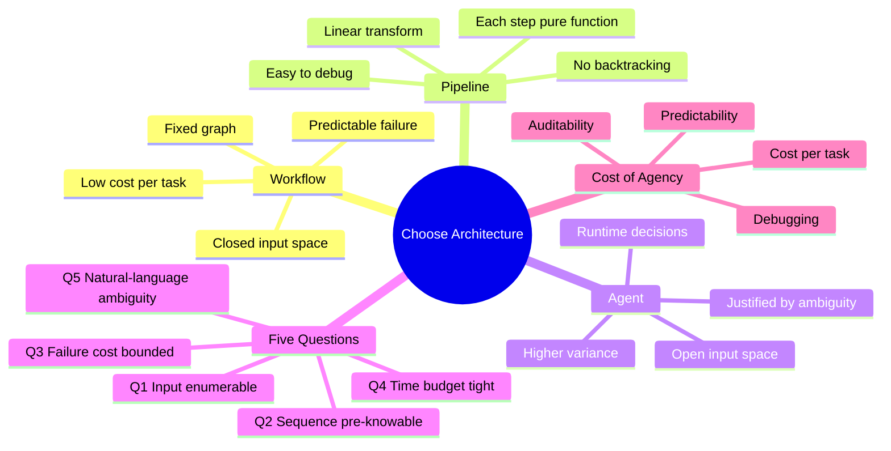

</details>

*Takeaway: there are exactly three architectures and exactly five questions to choose between them. The vendor pitches are noise on top.*

## §4 · Elaboration

### 4.1 The three architectures, precisely

**Workflow.** A directed graph of steps. Branches are conditioned on rule outputs. The graph is fully specified at design time. Examples: a refund-approval flow with rules on amount, reason, and customer tier. Mature implementations: BPMN engines, Temporal, Airflow.

**Pipeline.** A linear sequence of pure transformations $f_n \circ f_{n-1} \circ \ldots \circ f_1$. Each $f_i$ takes input, produces output, has no side effects on flow. No branches, no loops. Examples: ETL jobs, RAG ingestion (chunk → embed → index), classifier serving (preprocess → predict → postprocess).

**Agent.** As defined in 1.1 — the LLM dynamically owns which step is next, when to stop, and possibly the goal. Open input space, runtime decisions, agency dial ≥ 2.

The crucial point: these are not points on a spectrum. They are *architecturally distinct*. A workflow can contain LLM-as-function steps (pipeline element), and an agent can be invoked from inside a workflow node. But the *controlling structure* is one of three.

### 4.2 The five questions, derived

For any task, answer these five yes/no questions:

**Q1 — Is the input space enumerable?**
*Can you list, in advance, the structurally distinct inputs the system will see?* If yes, you're in closed-world territory. Workflow or pipeline. Refund requests with five canonical patterns: yes. Customer escalation emails: no.

**Q2 — Is the action sequence pre-knowable?**
*Given a valid input, is the sequence of operations the same every time?* If yes, pipeline is the cheapest and most reliable choice. If branches are needed but bounded, workflow. If the sequence depends on what the system discovers as it runs, agent.

**Q3 — Is the failure cost bounded?**
*If the system gets it wrong, what's the maximum downside?* If bounded and small, agent autonomy is acceptable. If unbounded or catastrophic (financial, safety, legal), keep a human gate or stay with workflow. This is independent of Q1 and Q2 — even if you *need* an agent's flexibility, an unbounded blast radius means you wrap it.

**Q4 — Is the time budget tight?**
*Is there a sub-second SLA?* Agents are slower than workflows by an order of magnitude (LLM round-trip × loop steps). If users wait synchronously, default to workflow. If async or background, agent is viable.

**Q5 — Is the task ambiguous in natural language?**
*Could two reasonable humans interpret the task differently?* If yes, you need natural-language reasoning capacity — i.e. an LLM in the loop. If no, formal rules suffice.

### 4.3 The decision logic

```
if Q1 and Q2 and Q4:
    pipeline                         # closed-world, fixed sequence, fast
elif Q1 and not Q2:
    workflow                         # closed-world, bounded branching
elif not Q1 and Q5:
    agent (with Q3-derived guards)   # open-world, ambiguous
elif not Q1 and not Q5:
    workflow + classifier            # open-world but unambiguous
elif not Q3:
    workflow + human-in-the-loop     # unbounded failure cost dominates
```

The if/else above is the entire 1.5 hours of this lesson compressed into ten lines. The next 30 minutes are spent making sure you ask Q1–Q5 *correctly*, because each one has a common mistake.

### 4.4 The common mistakes per question

**Q1 mistake: confusing input *format* with input *space*.** A JSON schema makes the *format* enumerable but the *space* (semantic content of the fields) may not be. Customer escalation tickets are JSON-shaped but their *content* is open-world.

**Q2 mistake: assuming sequence is fixed because the happy path is short.** Most tasks have a 5-step happy path and a 50-branch error-handling tree. If you have to handle errors dynamically, you don't have a fixed sequence.

**Q3 mistake: thinking the failure cost is the immediate output's cost.** It's the *downstream consequence*. An incorrect refund of $20 has a cost of $20; an incorrect refund that gets cited as precedent has a cost of (∞ × your policy library). Think in blast radius.

**Q4 mistake: building a "fast agent" by paralleling tool calls.** This caps speedup at the slowest tool. If you have a 200ms SLA, you don't have time for the model to think.

**Q5 mistake: dismissing ambiguity because you've written a specification.** The question is whether two reasonable humans would interpret the task the same way. Specifications get out of date; humans encountering the task fresh don't read your spec.

## §5 · Problem statement

Apply the five-question framework to all seven of these real Acme/HSBC/Helix scenarios. For each, answer Q1–Q5, then state the recommended architecture and one justification.

1. **Acme refund processing** — process 12k requests/week against published refund policy.
2. **Acme weird-issue escalations** — 800/week, each one different, must resolve without breaching CSAT.
3. **HSBC SWIFT break classification** — 1,400 breaks/night, ~70% recurring patterns, ~30% novel.
4. **HSBC daily P&L commentary** — generate the morning-after narrative explaining the trading book's overnight movement.
5. **Helix literature triage** — score new PubMed abstracts for relevance to the active research projects.
6. **Helix hypothesis generation** — propose drug-target interactions worth experimentally validating.
7. **HSBC KYC document review** — extract structured fields from corporate-customer onboarding documents.

## §6 · Solution walkthrough

| # | Scenario | Q1 | Q2 | Q3 | Q4 | Q5 | Recommendation |
|---|---|---|---|---|---|---|---|
| 1 | Acme refund processing | ✅ | ✅ | ✅ (bounded) | ✅ | ❌ | **Workflow** with LLM-classification step for reason categorisation. Five rules cover 90%; agent for the 10% tail is overkill. |
| 2 | Acme weird escalations | ❌ | ❌ | ✅ (CSAT-bounded) | ❌ | ✅ | **Agent** (dial 3). Ambiguous, open-world, async — exactly the case agents are for. Cap step count and refund authority. |
| 3 | HSBC break classification | partial (70%) | ❌ | ✅ | ❌ | ✅ | **Hybrid: workflow + agent fallback.** Rule-based for the 70% known patterns; agent investigates the 30% tail. This is *Sherpa*. |
| 4 | HSBC daily P&L commentary | ❌ | ❌ | ✅ | ✅ (7am deadline) | ✅ | **Agent (dial 2)** — Plan-and-Solve. Plan once at the start (which positions to comment on), execute as pipeline. Tight time budget rules out free-form ReAct loops. |
| 5 | Helix literature triage | ❌ | ✅ | ✅ | ❌ | ❌ | **Pipeline** with LLM scoring step. Inputs vary, but the per-paper sequence is fixed. No need for agent flexibility. |
| 6 | Helix hypothesis generation | ❌ | ❌ | ❌ (mis-cite → $4M experiment) | ❌ | ✅ | **Agent with hard human gate.** Q3 (unbounded cost) forces human sign-off; agent does generation + evidence, human decides commitment. |
| 7 | HSBC KYC document review | partial | ✅ | partial | ❌ | partial | **Workflow + LLM extraction + human review.** Format-enumerable, sequence-fixed, but blast radius (false KYC) is too high to remove the human. |

**Pattern:** scenarios cluster naturally. The "agent-shaped" ones (#2, #6) share open input space + ambiguity. The "pipeline-shaped" ones (#5) share fixed sequence + bounded variation. The "workflow-shaped" ones (#1, #7) share enumerable patterns + bounded failure. And the *hybrid* ones (#3, #4) are where the interesting architectural work lives.

**Lin's recommendation to Ronnie:** *"For refund processing — workflow with a small LLM step. We don't need an agent. For weird escalations — agent, with a $X refund cap and an escalation-back-to-human after N attempts. Two different products, not one. The vendor that's selling you 'one platform for both' is selling you compromise; they will under-engineer the refund flow and over-engineer the escalations."*

## §7 · Mathematical foundation

### 7.1 Expected utility with variance

Given a task, compare two architectures by expected utility:

$$
U(M) = \mathbb{E}[\text{value}] - \mathbb{E}[\text{cost}] - \lambda \cdot \text{Var}[\text{outcome}]
$$

where $\lambda \geq 0$ is the risk-aversion parameter. The variance term is what makes agents costly: they have higher $\mathbb{E}[\text{value}]$ for ambiguous tasks but also higher $\text{Var}[\text{outcome}]$.

For *risk-neutral* deployments (Acme refunds, where one bad refund is shrugged off), $\lambda \approx 0$. Choose by expected value. For *risk-averse* deployments (HSBC KYC, Helix hypotheses, anything regulated), $\lambda$ is large. Even if an agent has higher expected value, its variance may push utility negative.

### 7.2 Why the dial setting maps to variance

From Lesson 1.1's information-theoretic view, conditional action entropy $H(a_t | o_{1:t})$ rises with the dial setting. Variance of outcomes scales with action entropy (loosely — there's more decision surface for error). Formally, for many task classes:

$$
\text{Var}[\text{outcome}] \approx c \cdot H(a_t | o_{1:t})
$$

with $c$ task-dependent. This is the formal version of "higher dial = higher variance = costlier under risk aversion." Q3 in the framework is essentially asking *what's your $\lambda$?*

### 7.3 The five questions as a decision-tree classifier

You can frame Q1–Q5 as features and the architecture as a label. With ~50 real cases (the seven above × ~7 historical) you can fit a tiny decision tree, and the result is *exactly the if/else logic in 4.3*. The framework isn't magic — it's a hand-engineered decision tree on the load-bearing features of the task.

## §8 · Technical deep-dive

### 8.1 The two anti-patterns

**Anti-pattern 1: "Agentified workflow"** — taking a working workflow and replacing its dispatcher with an LLM "because it's smarter." You inherit the agent's latency and cost (worst case: 5–10× slower, 50× more expensive per call) and the workflow's lack of flexibility (the agent can only do what the workflow already allowed). You get the worst of both. Diagnosis: someone read a blog post about agents and felt left behind.

**Anti-pattern 2: "Workflowed agent"** — taking an open-ended agent task and chopping it into a fixed graph "to make it predictable." You lose the agent's ability to handle inputs you didn't anticipate (the entire reason you used an agent) and gain marginal predictability (the LLM still hallucinates within each node). Diagnosis: stakeholders demanded a flowchart and someone delivered one regardless of whether it modelled the actual task.

### 8.2 The hybrid pattern (the production reality)

Real systems are hybrids. The most common production architecture for ambiguous-but-regulated tasks (HSBC's break classification, Helix's hypotheses, regulated insurance claims) is:


<details><summary>Mermaid source</summary>

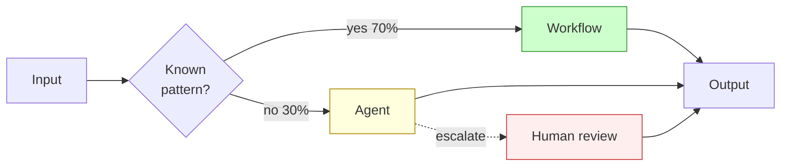

</details>

*Cheap workflow handles the bulk; agent handles the tail; human handles the tail of the tail.*

This is the architecture Sherpa will adopt in Module 4. The "Gate" decision is itself a classifier (small, cheap, deterministic) — *not* an agent, because making it an agent recurses the problem.

### 8.3 Operational cost comparison (typical, illustrative)

| Architecture | Cost/task | Latency p95 | Maintenance | Failure-debug time |
|---|---|---|---|---|
| Workflow | $0.001 | 200 ms | Rule updates per quarter | Minutes (trace is a graph) |
| Pipeline (with LLM step) | $0.01 | 800 ms | Prompt updates per month | Minutes (linear trace) |
| Agent (dial 3) | $0.10–$0.50 | 8–30 s | Eval set + prompt updates weekly | Hours (loop introspection) |
| Multi-agent | $0.50–$5.00 | 30 s–5 min | Eval + interaction-pattern updates | Days (cross-agent debugging) |

These numbers are illustrative but order-of-magnitude correct. They explain why "just make everything an agent" is wrong: the cost gradient is 100–1000×.

## §9 · What this unlocks

- **Lesson 1.4** introduces the four major LLM-agent paradigms (ReAct, Reflexion, Plan-and-Solve, CodeAct). With the framework in hand, you'll be able to match paradigm to task instead of choosing on novelty.
- **Module 4** builds Sherpa as the *hybrid pattern* in 8.2 — rule-based gate, agentic tail. The five-question framework is what justified the architectural choice.
- **Module 11** turns the framework into a business-case template: every vendor pitch maps to a Q1–Q5 answer set and a cost row from §8.3. You'll be the Lin Chen of your own org.

---

# Lesson 1.4 — The Major Paradigms: ReAct, Reflexion, Plan-and-Solve, CodeAct

> **§0 · From last time.** Lesson 1.3 gave us the five-question framework to decide *whether* to use an agent. For the scenarios where the answer is "agent," we still need to choose *which agent shape*. Four paradigms dominate the literature, each with a distinct loop structure, cost profile, and failure mode. Picking one is an architectural commitment; picking wrong is expensive.

## §1 · Business scenario

*Helix Research, Wednesday lab meeting.*

Maya Sundaram (CSO) is reviewing the literature-triage prototype. Her newest hire, an ML intern named Akash, has been "trying things out" for two weeks and has built four parallel implementations:

> *"Right, so I've got ReAct, Reflexion, Plan-and-Solve, and CodeAct versions. ReAct works best on the easy papers. Reflexion has the highest accuracy but takes 3× longer. Plan-and-Solve is fastest for the multi-step ones. CodeAct can do everything but I can't read its traces. Which one are we going with?"*

Maya needs to give Tom (her ML lead) an architectural answer that's not "pick the one with highest accuracy on the eval set." Because:
- The eval set is small and may not generalise.
- The cost profiles differ by 5× and Helix has a token budget.
- The four paradigms aren't substitutes — they have different *competences*. The right answer might be *hybrid*.

## §2 · Bridge to topic

The four paradigms aren't competitors. They're tools. Each was designed to solve a specific problem the others can't, and each has a corresponding cost. Choosing well means knowing what each was *for*, not which scored best on Akash's eval.

## §3 · Mind map


<details><summary>Mermaid source</summary>

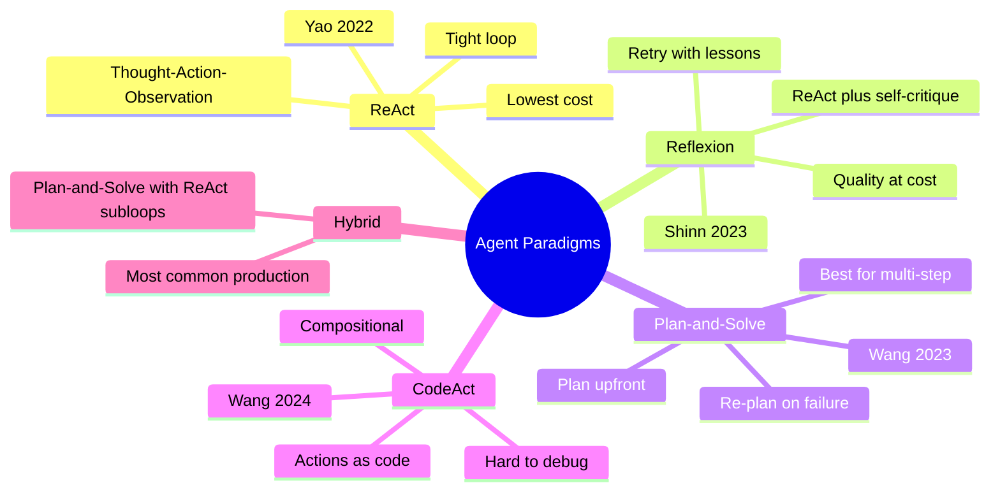

</details>

*Takeaway: four pure paradigms, one hybrid that dominates production. Pure paradigms appear in papers; hybrids ship.*

## §4 · Elaboration

### 4.1 ReAct (Yao et al. 2022) — the baseline

Loop structure: `Thought → Action → Observation → repeat → Answer`.


<details><summary>Mermaid source</summary>

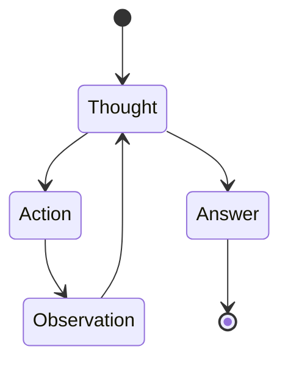

</details>

The model emits its reasoning *and* its tool call in a single autoregressive stream. The observation (tool result) is appended to context, and the model reasons again. This is the architecture Sherpa will adopt in Module 4.

**Strengths:** simplest loop, lowest token cost per step, easiest to debug (the trace is linear), no overhead. Best when each next step is genuinely revealed by the previous observation.

**Weaknesses:** no explicit planning, so it can wander on multi-step tasks. No self-critique, so it doesn't catch its own errors. No memory across runs, so it can't learn from past mistakes within a session.

**Use when:** the task is well-scoped, ≤10 steps, and each step depends on the previous result (so planning ahead would be premature).

### 4.2 Reflexion (Shinn et al. 2023) — ReAct + self-critique

Loop structure: `ReAct attempt → Critic evaluates trace → If failed, store lesson → Retry`.

The critic is an LLM call that reviews the trace and either accepts the answer or writes a "lesson" (a short natural-language note) that gets prepended to the next attempt's context. Up to *N* retries.

**Strengths:** higher accuracy on tasks where the agent can recognise its own errors post-hoc. Useful when ground truth is expensive but error signal is cheap (e.g., code that compiles vs doesn't; math that satisfies constraints vs doesn't).

**Weaknesses:** *N×* token cost (each retry runs the full ReAct loop). The critic's quality bounds the agent's improvement — if the critic can't recognise a failure, Reflexion can't fix it. Latency multiplies similarly.

**Use when:** accuracy matters more than cost, the task has a *checkable* answer, and the eval can tolerate variable latency.

### 4.3 Plan-and-Solve (Wang et al. 2023) — explicit planning

Loop structure: `Plan → Execute step → Check progress → Execute step → ... → Answer (or re-plan on failure)`.

The plan is generated up front by a single LLM call and represents a small DAG of sub-tasks. Execution then proceeds with simpler (often non-LLM) per-step actions until a step fails, triggering a re-plan.


<details><summary>Mermaid source</summary>

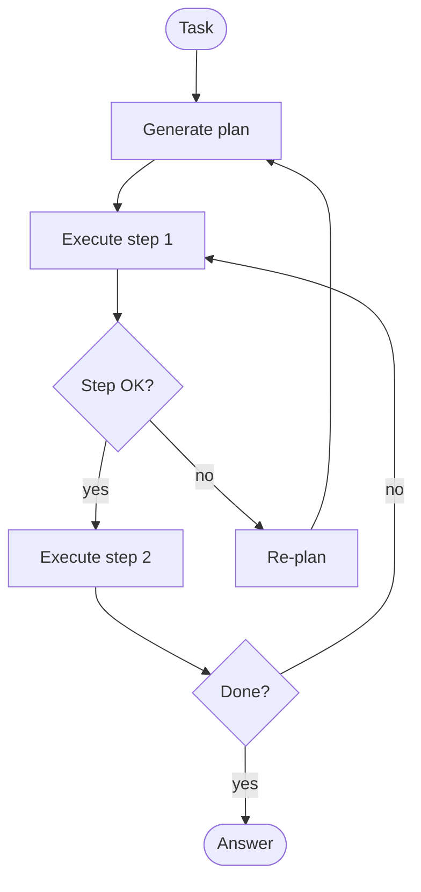

</details>

**Strengths:** explicit plan is auditable and editable; per-step cost is low (planning is one LLM call). Tight time budgets are achievable. Multi-step tasks with clear sub-structure are this paradigm's home.

**Weaknesses:** brittle when the plan turns out to be wrong (re-planning is expensive and may re-fail the same way). Plans can over-commit early when the right move depends on later observations.

**Use when:** the task has natural sub-structure, the user expects a structured plan they can vet, or the time budget is tight enough that wandering loops are unaffordable.

### 4.4 CodeAct (Wang et al. 2024) — actions as code

Loop structure: same as ReAct, but `Action` is *executable Python* (or whatever language is wired up) rather than typed tool calls.

Instead of:
```
Action: search_papers(query="X")
Observation: [paper1, paper2, ...]
Action: extract_dose(paper="paper1")
Observation: 50mg
```

CodeAct emits:
```python
papers = search_papers(query="X")
doses = [extract_dose(p) for p in papers if p.is_clinical]
print(doses)
```

**Strengths:** compositional — one CodeAct emission can replace 10 ReAct steps. Code can express loops, conditionals, error handling. Especially powerful for data-manipulation tasks (filtering, joining, aggregating tool outputs).

**Weaknesses:** trace is opaque (a code block is harder to audit than a sequence of typed tool calls). Security risks (the agent can do anything Python can do — needs a strong sandbox). Failure modes shift from "wrong tool" to "wrong loop logic." Debugging requires reading code, not reading a step list.

**Use when:** tasks involve heavy data manipulation across tool outputs, you have a hardened sandbox, and audit-ability is a soft constraint.

### 4.5 Comparison matrix

| Property | ReAct | Reflexion | Plan-and-Solve | CodeAct |
|---|---|---|---|---|
| Per-step LLM cost | 1× | 1× × N retries | 1× plan + cheap steps | 1× per code block |
| Total cost (typical) | low | high | low–medium | medium |
| Latency p95 | medium | high (multiplied by N) | medium | low–medium |
| Debuggability | high (linear trace) | high (trace + critic notes) | high (plan visible) | low (code is opaque) |
| Multi-step robustness | weak | medium | strong | strong |
| Time-budget friendliness | medium | weak | strong | strong |
| Best at | exploratory tasks | tasks with checkable answers | tasks with sub-structure | data-heavy tasks |

## §5 · Problem statement

For each of these three Helix tasks, recommend a paradigm and justify in one sentence:

1. **Literature triage** — score each new paper 0–1 for relevance to active projects. Tens of thousands of papers/week.
2. **Hypothesis generation** — propose drug-target interactions worth experimentally validating. ≤5 per week. Cost of a bad hypothesis: $4M experiment.
3. **Cross-paper synthesis** — given 10 papers on a target, extract the dose-response data, normalise units, fit a curve, propose an experimental range.

## §6 · Solution walkthrough

| Task | Paradigm | Justification |
|---|---|---|
| 1. Literature triage | **Pipeline + LLM scoring step (no agent)** | Per-paper task is fixed-sequence; volume forbids any retry-heavy paradigm. (Yes, the answer is "not an agent" — Lesson 1.3's framework already told us this; the question is a check that you remember.) |
| 2. Hypothesis generation | **Plan-and-Solve + Reflexion + human gate** | Multi-step task (decompose target → search literature → score plausibility → write rationale). Reflexion's critique-and-retry is justified by Q3 (failure cost is unbounded). Human gate makes the cost of retries acceptable because they're rare. |
| 3. Cross-paper synthesis | **CodeAct in a sandbox** | Heavy data manipulation across paper outputs (dose extraction, unit normalisation, curve fitting). Compositionality of code beats step-by-step ReAct by 5–10× in token cost. Audit-ability handled by mandatory cite-faithfulness check on each numeric claim (Module 5). |

**Tom's reply to Maya:** *"Three tasks, three different paradigms. Akash's eval was a paradigm-selection exercise, not a model-selection exercise. The right answer is to ship triage as a pipeline today (we don't need an agent), build hypothesis generation as Plan-and-Solve with a Reflexion retry budget of 3 and a hard human sign-off, and build cross-paper synthesis as CodeAct with the sandbox that ML security gave us last quarter. Three architectures, one team, six weeks."*

This is the moment where the framework pays for itself: a casual "which one wins" question would have led to a single-paradigm bet. The framework forces the question *what is each task actually like*, and the answer reshapes the roadmap.

## §7 · Mathematical foundation

### 7.1 Cost decomposition per paradigm

Let $T$ be the average number of "steps" a task takes (per the ReAct definition of step). Let $c_{\text{LLM}}$ be the average per-step LLM token cost (input + output). Then:

| Paradigm | Cost per task |
|---|---|
| ReAct | $T \cdot c_{\text{LLM}}$ |
| Reflexion | $T \cdot c_{\text{LLM}} \cdot \mathbb{E}[\text{retries}]$ where $\mathbb{E}[\text{retries}] \in [1, N]$ |
| Plan-and-Solve | $c_{\text{plan}} + T \cdot c_{\text{step}}$ where $c_{\text{step}} \ll c_{\text{LLM}}$ |
| CodeAct | $T_{\text{code-blocks}} \cdot c_{\text{LLM}}$ where $T_{\text{code-blocks}} \approx T / 5$ for data-heavy tasks |

The expected ratio of Reflexion cost to ReAct cost depends on the *failure rate* of the underlying ReAct loop. For 30% failure rate and N=3 retries, Reflexion costs ~2× ReAct. For 70% failure rate, ~3.5×. Reflexion's value proposition is that the *accuracy* gain justifies this multiplier — but only on tasks where the critic can actually distinguish good from bad attempts.

### 7.2 Variance per paradigm

Per-task variance differs sharply:

$$
\text{Var}[\text{cost}_{\text{ReAct}}] \approx \text{small} \quad \text{(few-step happy path dominates)}
$$

$$
\text{Var}[\text{cost}_{\text{Reflexion}}] \approx \text{large} \quad \text{(retry distribution is bimodal: success once or fail N times)}
$$

$$
\text{Var}[\text{cost}_{\text{Plan-and-Solve}}] \approx \text{small in plan, large in re-plan} \quad \text{(re-planning is rare but expensive)}
$$

$$
\text{Var}[\text{cost}_{\text{CodeAct}}] \approx \text{medium} \quad \text{(one code block size varies)}
$$

For budgeted production deployments, *variance* matters more than *mean* — you size for p95, not p50. Reflexion's high variance is its biggest production cost.

### 7.3 The hybrid pattern's cost analysis

The most common production pattern is **Plan-and-Solve with ReAct sub-loops**:

$$
\text{Cost}_{\text{hybrid}} = c_{\text{plan}} + \sum_{i=1}^{S} \left( T_i \cdot c_{\text{LLM}} \right)
$$

where $S$ is the number of sub-tasks in the plan and $T_i$ is the per-sub-task ReAct loop length. Empirically (on internal benchmarks across the case studies in this course), $S \cdot T_i < T_{\text{flat-ReAct}}$ for multi-step tasks because planning reduces redundant exploration. The hybrid pattern wins on cost *and* quality for tasks with sub-structure.

## §8 · Technical deep-dive

### 8.1 Implementing ReAct in TypeScript (preview)

```typescript
// Module 4 will build this for real. Schema here for orientation.
type Step =
  | { kind: "thought"; text: string }
  | { kind: "action"; tool: string; args: unknown }
  | { kind: "observation"; result: unknown }
  | { kind: "answer"; value: unknown };

async function react(goal: string, tools: Tools): Promise<unknown> {
  const trace: Step[] = [];
  for (let i = 0; i < MAX_STEPS; i++) {
    const step = await llm.callWithTools(renderPrompt(goal, trace), tools);
    trace.push(step);
    if (step.kind === "answer") return step.value;
    if (step.kind === "action") {
      const result = await tools[step.tool](step.args);
      trace.push({ kind: "observation", result });
    }
  }
  throw new MaxStepsExceeded(trace);
}
```

200 lines including error handling and validation. The simplest paradigm to implement; that's a feature.

### 8.2 Reflexion adds ~150 lines

```typescript
async function reflexion(goal: string, tools: Tools): Promise<unknown> {
  const lessons: string[] = [];
  for (let attempt = 0; attempt < MAX_RETRIES; attempt++) {
    const result = await react(goalWithLessons(goal, lessons), tools);
    const critique = await llm.critique(goal, result);
    if (critique.ok) return result;
    lessons.push(critique.lesson);
  }
  throw new ReflexionExhausted(lessons);
}
```

The critic is the load-bearing component. If the critic is no better than the agent, Reflexion adds cost without accuracy. Choose the critic deliberately (often a larger model or a different prompt).

### 8.3 Plan-and-Solve needs a plan schema

```typescript
const PlanSchema = z.object({
  goal: z.string(),
  steps: z.array(z.object({
    description: z.string(),
    tool: z.string().nullable(),  // null = pure reasoning step
    args: z.unknown(),
    expectsOutput: z.string(),
  })),
});

async function planAndSolve(goal: string, tools: Tools) {
  const plan = await llm.plan(goal, PlanSchema);
  const results: unknown[] = [];
  for (const step of plan.steps) {
    try {
      const r = await executeStep(step, tools);
      assertMatches(r, step.expectsOutput);
      results.push(r);
    } catch (err) {
      const newPlan = await llm.replan(goal, plan, step, err);
      return await planAndSolve(/* with newPlan */);
    }
  }
  return results;
}
```

The `expectsOutput` field is the critical pre-commitment that makes per-step verification cheap. Without it, the agent can't tell whether a step succeeded.

### 8.4 CodeAct demands a sandbox

```typescript
async function codeAct(goal: string, sandbox: Sandbox) {
  const trace: { code: string; output: unknown }[] = [];
  for (let i = 0; i < MAX_BLOCKS; i++) {
    const block = await llm.emitCode(goal, trace, sandbox.toolDescriptions());
    if (block.kind === "answer") return block.value;
    const output = await sandbox.execute(block.code);  // <- the critical line
    trace.push({ code: block.code, output });
  }
}
```

The sandbox is non-negotiable. CodeAct without a sandbox is a remote code execution vulnerability with extra steps. Production sandbox options: Docker container with no network, Firecracker microVM, gVisor, E2B's hosted sandbox. Pick one; never trust the model's emitted code.

### 8.5 The hybrid pattern is what to actually build

```typescript
async function hybridAgent(goal: string, tools: Tools) {
  const plan = await llm.plan(goal, PlanSchema);
  const results: unknown[] = [];
  for (const step of plan.steps) {
    if (step.complexity === "simple") {
      results.push(await executeStep(step, tools));   // pipeline-style
    } else {
      results.push(await react(step.description, scopedTools(tools, step))); // agent-style
    }
  }
  return results;
}
```

Plan upfront. Cheap deterministic steps go through a pipeline. Genuinely-agent-shaped steps get a ReAct sub-loop with a scoped tool subset (the agent only sees the tools relevant to its sub-task). This is the architecture Sherpa will reach by Module 6.

## §9 · What this unlocks

- **Module 4** builds Sherpa as a ReAct loop first (Lesson 4.1), then iteratively adds Plan-and-Solve structure (4.2), reflection (4.3), and finally the hybrid pattern above (4.5).
- **Module 6** uses these paradigms as the *internal architecture* of each agent in a multi-agent system. The orchestrator is Plan-and-Solve; the workers are ReAct.
- **Module 8** uses the cost/variance analysis from §7 to design evaluation harnesses that report per-paradigm metrics, so you can A/B paradigms on your actual eval set.
- **Module 10** revisits CodeAct's sandbox requirements as a security-first design rather than a footnote.

---

# Module 1 — Summary & exit criteria

By the time you finish all four lessons, you should be able to:

- [ ] Place any AI system you encounter on the agency dial (0–4) with justification.
- [ ] Explain in one paragraph why LLM agents succeeded where 1980s expert systems failed.
- [ ] Answer "should this be an agent or a workflow?" using the five-question framework.
- [ ] Name the four major paradigms and one situation each is wrong for.
- [ ] Articulate the *cost of agency* — what you pay (predictability, cost, debuggability) for what you gain (adaptivity, open-ended capability).

**Capstone-relevant.** Module 1 is the conceptual foundation for the Module 11 business-case work. Re-read §4.2 (the dial) and §7.2 (the trade-off) before tackling the capstones.

**Forward references.**
- §4.2 agency dial → Module 2 (MDP/POMDP formalism), Module 4 (Sherpa dial setting), Module 10 (failure modes per dial).
- §7.1 action entropy → Module 8 (eval), Module 9 (production cost).
- §1 HSBC scenario → recurs in Modules 4, 5, 8, 10.

---

*End of Module 1 — all four lessons in full.*
