# Module 2 — Mathematical Foundations

> **Module length:** ~14 hours · **Lessons:** 4 · **Prereqs:** Module 1 (especially the agency dial and the cost-of-agency intuition); undergraduate probability; comfort with discrete math notation. No prior RL background required — we build from MDP up.

## Learning objectives

By the end of this module, you will be able to:

1. **Model** an agent's task as an MDP or POMDP, choosing the right formalism for the problem.
2. **Compute** belief updates from observations, and reason about when an agent should stop versus take another action.
3. **Apply** Bayesian reasoning to tool selection — even when the agent doesn't explicitly compute posteriors, the math tells you whether the agent is *behaving rationally*.
4. **Use** information theory (entropy, mutual information) to quantify when an extra observation is worth its cost.
5. **Reason** about exploration vs exploitation as a real engineering choice, not an academic curiosity.

## Module mind map


<details><summary>Mermaid source</summary>

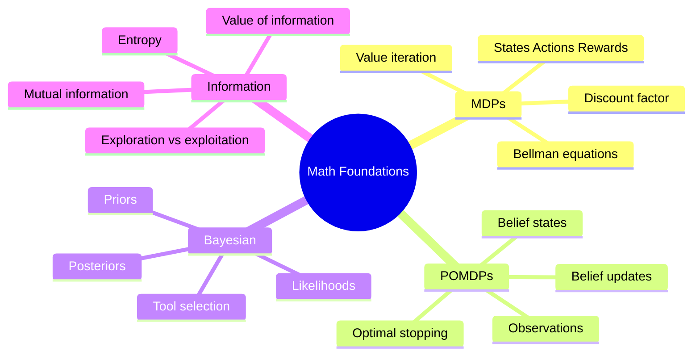

</details>

## Module-level concept DAG


<details><summary>Mermaid source</summary>

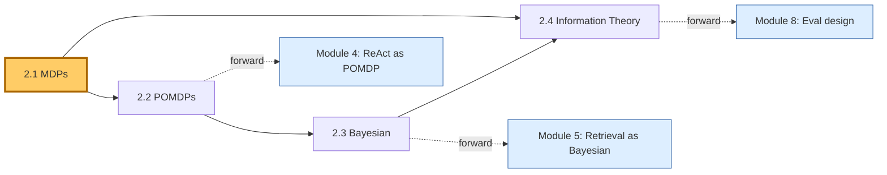

</details>

---

# Lesson 2.1 — MDPs: Modelling Agent Decisions Formally

> **§0 · From last time.** Module 1 gave us the agency dial and showed that high-dial systems trade predictability for adaptivity. We hand-waved the term "cost of agency" using expected-value language. Now we make it precise. The MDP (Markov Decision Process) is the standard formalism for agent decision-making, and even when we don't *solve* MDPs explicitly (LLM agents don't), the framework gives us the vocabulary to reason about what an agent is doing.

## §1 · Business scenario

*HSBC, late one Wednesday.*

Daniel Cho is reviewing Sherpa's break-classification logs from the pilot. He notices a pattern: when Sherpa investigates a break, it sometimes does 3 tool calls and confidently answers, and sometimes does 8 tool calls and still flags low confidence. The cost difference is 3× per ticket. Across 1,400 tickets/night, that's the difference between £140 and £420 in LLM costs.

> *"Can we put a budget on this? I want to say 'do at most 5 tool calls unless confidence is above 0.9' — but I have no idea whether that's the right rule. What's the principled way to decide?"*

The honest answer requires modelling Sherpa's investigation as a sequence of decisions with costs and rewards. The standard formalism for that is the MDP.

## §2 · Bridge to topic

Daniel's question is a *budgeted decision-theoretic* question: when is the next tool call worth its cost, given everything observed so far? The MDP formalism — states, actions, transitions, rewards, discount — is what lets you reason about it without making it up.

## §3 · Mind map


<details><summary>Mermaid source</summary>

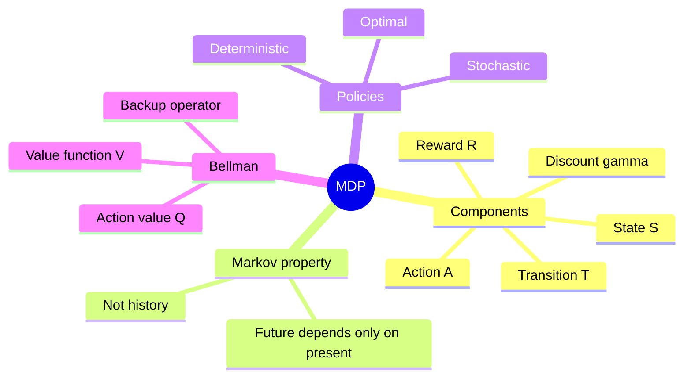

</details>

*Takeaway: an MDP is just five things. The art is choosing what counts as a "state."*

## §4 · Elaboration

### 4.1 Definition

An MDP is a tuple $\langle S, A, T, R, \gamma \rangle$:

- $S$ — set of states the world can be in
- $A$ — set of actions the agent can take
- $T(s' \mid s, a)$ — probability of next state given current state and action
- $R(s, a)$ — reward received for taking action $a$ in state $s$
- $\gamma \in [0,1]$ — discount factor (how much future rewards count vs immediate)

The agent picks a *policy* $\pi: S \to A$ (or $\pi: S \to \Delta(A)$ for stochastic policies) to maximise expected discounted reward.

### 4.2 The Markov property

The defining assumption: *the next state depends only on the current state and action, not on the history of how we got here.*

$$
P(s_{t+1} \mid s_t, a_t, s_{t-1}, a_{t-1}, \ldots) = P(s_{t+1} \mid s_t, a_t)
$$

This is a *modelling* choice, not a physical law. If your "state" doesn't capture everything relevant, the Markov property is violated and the math breaks. For LLM agents, the trick is to define the state as *everything in the agent's context window* — then the Markov property holds trivially (the model only sees what's in context).

### 4.3 The value function

The value of a state under policy $\pi$ is the expected total discounted reward starting from that state:

$$
V^\pi(s) = \mathbb{E}_\pi \left[ \sum_{t=0}^\infty \gamma^t R(s_t, a_t) \mid s_0 = s \right]
$$

The action-value function (Q-function) is similar but conditioned on the first action:

$$
Q^\pi(s, a) = R(s, a) + \gamma \sum_{s'} T(s' \mid s, a) V^\pi(s')
$$

The optimal value function satisfies the **Bellman optimality equation**:

$$
V^*(s) = \max_a \left[ R(s, a) + \gamma \sum_{s'} T(s' \mid s, a) V^*(s') \right]
$$

You can solve this by value iteration (repeatedly applying the operator on the right) or by policy iteration. For an HSBC break with ~5 classes and ~10 tool actions, the state space is small enough to solve exactly in milliseconds — *if* you have $T$ and $R$.

### 4.4 The catch (and why LLM agents matter)

In practice, you almost never have $T$ and $R$ for real-world tasks. You don't have a transition model of "what happens after Sherpa calls `queryGL`." You don't have a reward function for "Sherpa picked the right break category." This is why classical MDP solvers don't ship — the assumptions don't hold.

LLM agents bypass this by *approximating* the optimal policy directly via the model's learned heuristics. You don't compute $V^*$; the model has implicitly absorbed enough examples to act *as if* it were following $V^*$ in a reasonable neighbourhood of the task distribution.

The math is still useful because:
1. It tells you what the agent *should* be doing if it were rational (a benchmark for evaluation).
2. It gives you vocabulary for analysing failures ("Sherpa's behaviour suggests its implicit Q-values are wrong on counterparty mismatches").
3. It lets you reason about cost/reward trade-offs (Daniel's budget question).

## §5 · Problem statement

Model Sherpa's break investigation as an MDP. Specifically:

1. Define $S, A, R, \gamma$ for a single break.
2. Compute the action-value of "call the GL one more time" vs "answer now" given the current belief is 0.78 on `amount_diff` and 0.22 on `stale_static`.
3. State the budget rule Daniel should adopt.

Assumptions: each tool call costs $0.01 in tokens; a correct answer gives +$42 (the analyst time saved); an incorrect answer costs −$200 (the analyst has to redo and the bank's audit log shows a wrong automated decision).

## §6 · Solution walkthrough

### State, actions, reward

- $S$ = the agent's belief over break categories (5 of them, summing to 1) plus a step counter.
- $A$ = {call_GL, call_counterparty, call_settlement, call_static, answer_class_i for i in 1..5}.
- $R(s, \text{tool})$ = $-0.01$ (token cost; we model only marginal cost per call).
- $R(s, \text{answer}_i)$ = $+42$ if class $i$ is correct, $-200$ if wrong, terminal.
- $\gamma$ = $1$ (no discounting needed within one investigation; horizon is short).

### Value of "answer now"

Expected reward of answering with the most likely class:

$$
V_{\text{answer}}(s) = \max_i \left[ 42 \cdot b(c_i) - 200 \cdot (1 - b(c_i)) \right]
$$

For our belief $b = (0.78, 0.22, 0, 0, 0)$:

$$
V_{\text{answer}} = 42 \cdot 0.78 - 200 \cdot 0.22 = 32.76 - 44 = -11.24
$$

Negative! Answering now would be a *loss*.

### Value of "one more tool call"

A new observation will update the belief. Assume the GL call refines the belief to either $(0.95, 0.05)$ with probability 0.7 (confirms `amount_diff`) or $(0.20, 0.80)$ with probability 0.3 (flips to `stale_static`). Then the expected post-call answer value is:

$$
V_{\text{post-call}} = 0.7 \cdot V_{\text{answer}}(0.95) + 0.3 \cdot V_{\text{answer}}(0.20) - 0.01
$$

$$
V_{\text{answer}}(0.95) = 42 \cdot 0.95 - 200 \cdot 0.05 = 39.9 - 10 = 29.9
$$

$$
V_{\text{answer}}(0.20) = 42 \cdot 0.80 - 200 \cdot 0.20 = 33.6 - 40 = -6.4 \; (\text{best class is now the alternative; recompute as max})
$$

For belief $(0.20, 0.80)$, best is class 2: $42 \cdot 0.80 - 200 \cdot 0.20 = -6.4$. So we'd need yet another call.

$$
V_{\text{post-call}} \approx 0.7 \cdot 29.9 + 0.3 \cdot (-6.4) - 0.01 = 20.93 - 1.92 - 0.01 = 19.00
$$

So $V_{\text{call}} \approx 19.00$ versus $V_{\text{answer}} = -11.24$. Calling is worth it by ~$30 in expected value.

### Daniel's budget rule

A principled budget rule is: *answer when $V_{\text{answer}}(s) > V_{\text{best-tool-call}}(s)$*. In practice the agent doesn't compute these explicitly, but the equivalent rule the LLM can act on is:

> Answer when (max-belief × 42 − (1 − max-belief) × 200) > 0, i.e. when max-belief > 200/(42+200) ≈ **0.826**.

So Daniel's rule: **answer iff confidence ≥ 0.83; otherwise tool-call**. With a max-step cap of 8 to avoid runaway.

This is derivable from the cost asymmetry: false-negatives are 4.76× more expensive than true positives, so you need to be 83% confident before committing.

## §7 · Mathematical foundation (deeper)

### 7.1 The Bellman backup as the central operator

Value iteration applies the Bellman operator repeatedly:

$$
V_{k+1}(s) = \max_a \left[ R(s, a) + \gamma \sum_{s'} T(s' \mid s, a) V_k(s') \right]
$$

This is a contraction mapping on $V$ with contraction factor $\gamma$, so it converges geometrically to $V^*$. For our example $\gamma=1$ but the horizon is finite (8 steps max), so we use *finite-horizon* value iteration which converges in 8 backups.

### 7.2 Why discount factor matters

For infinite-horizon problems, $\gamma < 1$ is needed for convergence. For agent design, $\gamma$ encodes *patience*:

- $\gamma \to 0$ — myopic agent, takes immediate rewards
- $\gamma \to 1$ — far-sighted agent, willing to invest in long sequences

LLM agents implicitly behave with high $\gamma$ on tasks where the goal is far away (research, planning) and low $\gamma$ on tasks where the goal is near (Q&A). The model's training shapes this implicitly; you don't set it.

### 7.3 The optimal policy

Once you have $V^*$, the optimal policy is:

$$
\pi^*(s) = \arg\max_a \left[ R(s, a) + \gamma \sum_{s'} T(s' \mid s, a) V^*(s') \right]
$$

This is the *greedy* policy with respect to $V^*$. It's optimal because $V^*$ already accounts for the value of future actions.

## §8 · Technical deep-dive

### 8.1 State design is everything

The hardest decision in MDP modelling is *what counts as a state*. For Sherpa:

- **Bad:** $s$ = the literal text of the break message. State space is infinite; nothing generalises.
- **Worse:** $s$ = the index of the break in tonight's batch. Markov property violated (the index doesn't tell you anything about the break).
- **Good:** $s$ = the agent's current belief over break categories + step count. Finite-dimensional, Markovian.
- **Better:** $s$ = belief + step count + which tools have been called. Richer state but quickly grows.

Choose the smallest state that captures everything the next-action choice depends on. *No more, no less.* This is the "feature engineering" of MDP modelling.

### 8.2 Reward shaping

Reward functions for real tasks are usually a hand-tuned combination of:

- *Outcome reward*: did the agent answer correctly? (Sparse, often delayed)
- *Process reward*: did the agent take sensible intermediate steps? (Dense, easier to optimise but risks gaming)
- *Cost penalty*: tokens, latency, dollars (Always negative; sets the urgency)

For LLM agents, the reward function is mostly implicit (encoded in the prompt's success criteria) but you can make it explicit in the eval harness (Module 8).

### 8.3 When the MDP framework breaks

Three cases where the MDP isn't the right model:

1. **Partial observability** (the agent can't see the true state — only observations). Use a POMDP (Lesson 2.2).
2. **Multiple agents** (your decisions depend on what other agents do). Use a Markov game (Module 6).
3. **Non-stationary environment** (the world changes underneath you). Use a contextual bandit or a learning-to-learn formulation (out of scope for this course).

## §9 · What this unlocks

- **Lesson 2.2** extends the MDP to POMDPs — what you actually need for LLM agents, because the true state is never fully observed.
- **Lesson 2.3** brings in Bayesian reasoning, which is what powers the belief updates in POMDPs.
- **Module 4** uses the MDP frame to define Sherpa's termination policy precisely (the "answer iff confidence > 0.83" rule comes directly from §6).
- **Module 8** uses MDP-derived metrics to design the eval harness — regret (gap from optimal policy), expected value per task, value of information per tool call.

---

# Lesson 2.2 — POMDPs: Belief States Under Partial Observability

> **§0 · From last time.** Lesson 2.1 modelled agent decisions as an MDP and derived Daniel's budget rule. That model assumed the agent could *see* the true state of the world. For an LLM agent, this is never true — the agent sees tool outputs, not the underlying truth. POMDPs (Partially Observable MDPs) are the formalism for this case, and they're the formal model that ReAct, Plan-and-Solve, and Reflexion are all approximating.

## §1 · Business scenario

*Helix Research, Monday morning standup.*

Tom Rivera is showing Maya his literature-triage agent's traces. One trace stands out:

> *Read paper 1 — relevance score 0.4. Read paper 2 — relevance 0.7. Read paper 3 — relevance 0.3. Read paper 4 — relevance 0.8. Read paper 5 — relevance 0.6.*
>
> Final answer: "5 out of 5 papers reviewed; 2 highly relevant (paper 2, paper 4)."

> *"This was a query about a specific gene target,"* Tom says. *"After paper 2, the agent knew the target was probably relevant. Why did it keep reading? Each paper costs us 800ms and $0.04. We did this 14,000 times this week. That's £1,800 we might not need to spend."*

The agent kept reading because it didn't update its *belief* about what it was looking for after each observation. It treated each paper independently. The POMDP framework explains exactly when to stop.

## §2 · Bridge to topic

In an MDP you know the state. In a POMDP you have to *infer* the state from observations. The agent's "knowledge state" is a probability distribution over true states — called a *belief*. Acting optimally in a POMDP means acting on your current belief, and updating that belief with every observation. Knowing this math is what turns "the agent kept reading" from a vibe into a quantifiable design defect.

## §3 · Mind map


<details><summary>Mermaid source</summary>

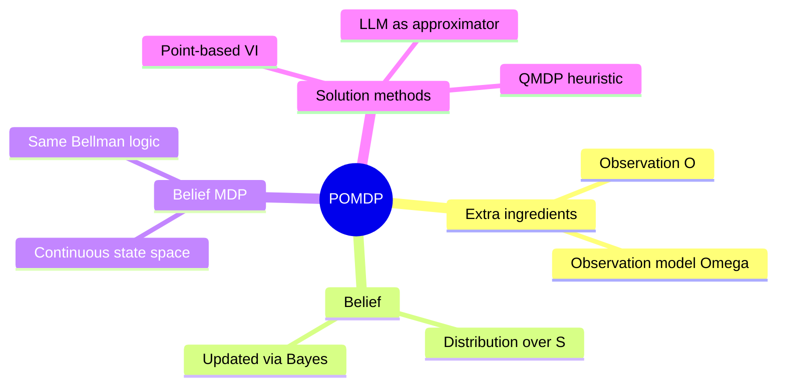

</details>

*Takeaway: a POMDP is an MDP whose state is a probability distribution. That's it. Everything else follows.*

## §4 · Elaboration

### 4.1 Definition

A POMDP is a tuple $\langle S, A, T, R, \Omega, O, \gamma \rangle$:

- $S, A, T, R, \gamma$ — same as MDP
- $\Omega$ — set of possible observations
- $O(o \mid s', a)$ — probability of seeing observation $o$ after taking action $a$ and arriving at state $s'$

The agent never sees $s$ directly. It sees a sequence of observations and must infer $s$.

### 4.2 The belief state

The agent's belief at time $t$ is $b_t \in \Delta(S)$ — a probability distribution over states. After taking action $a$ and observing $o$, the belief updates by Bayes' rule:

$$
b'(s') = \eta \cdot O(o \mid s', a) \sum_s T(s' \mid s, a) b(s)
$$

where $\eta$ is a normalising constant.

This is the central equation of POMDP theory. *Every observation is a chance to update the belief.* An agent that doesn't update is leaving information on the table.

### 4.3 Acting on the belief

Once you have $b$, the optimal action is the one that maximises:

$$
Q^*(b, a) = \sum_s b(s) R(s, a) + \gamma \sum_o P(o \mid b, a) V^*(b'_{b, a, o})
$$

where $b'_{b, a, o}$ is the post-update belief. This is the Bellman equation in *belief space* — and belief space is continuous, even when state space is discrete. POMDPs are computationally hard in general (PSPACE-hard).

But you don't need optimality; you need *good enough*. LLM agents approximate this with implicit belief and learned heuristics. The math gives you the framework for analysing whether they're approximating well.

### 4.4 The "stop or continue" question

The most useful POMDP idea for LLM-agent design is the *expected value of information* (EVoI):

$$
\text{EVoI}(a) = \mathbb{E}_o [V(b'_{b, a, o})] - V(b) - c(a)
$$

In English: how much does your value improve by taking the action (gathering this observation), minus the cost of taking it?

Stop when $\text{EVoI}(a) \leq 0$ for every $a$. That is: when no action's expected information gain pays for its cost.

This is the principled answer to Tom's question. After paper 2, the agent's belief about "is this target relevant?" was already strong. Reading paper 3 had near-zero EVoI because the marginal observation was unlikely to change the belief enough to change the answer.

## §5 · Problem statement

Tom's literature triage agent is asked: "Find all papers relevant to BRCA2 in clinical trials from 2024." Five candidate papers. After reading each, the agent emits a relevance score.

1. Compute the belief update after each paper, assuming a Bayesian observer.
2. Identify the step at which EVoI ≤ 0 and the agent should stop.
3. Propose a termination rule the LLM agent can follow (since it can't compute EVoI explicitly).

Use the trace: 0.4, 0.7, 0.3, 0.8, 0.6. Assume the true latent variable is "average relevance across the population of candidate papers" and the prior is uniform on [0, 1].

## §6 · Solution walkthrough

### Belief update (Beta-Bernoulli model)

Treat each paper's relevance score as a Bernoulli-like observation (>0.5 = relevant). The posterior over "fraction of papers relevant" is Beta-distributed.

Prior: Beta(1, 1) (uniform). After observations:

| Step | Papers seen | Relevant | Not rel | Posterior mean | Posterior 95% CI |
|---|---|---|---|---|---|
| 0 | 0 | 0 | 0 | 0.50 | [0.025, 0.975] |
| 1 | 1 (0.4) | 0 | 1 | 0.33 | [0.06, 0.81] |
| 2 | 2 (0.7) | 1 | 1 | 0.50 | [0.16, 0.84] |
| 3 | 3 (0.3) | 1 | 2 | 0.40 | [0.14, 0.74] |
| 4 | 4 (0.8) | 2 | 2 | 0.50 | [0.21, 0.78] |
| 5 | 5 (0.6) | 3 | 2 | 0.57 | [0.25, 0.84] |

After 3 papers the belief has stabilised meaningfully (mean 0.40, narrow CI). After 4 papers it's tighter still. After 5, the marginal change is small.

### EVoI computation

Cost per paper: $0.04 + 0.8s × labour. Value of the decision: depends on what downstream uses the score for, but assume each correctly-classified paper saves $0.20 of researcher time (the time they'd have spent reading themselves).

EVoI of reading paper $k+1$, given $k$ papers seen:

$$
\text{EVoI}(k+1) \approx 0.20 \cdot \mathbb{P}(\text{misclassification flips}) - 0.04
$$

For $k=2$, the CI is wide; another paper has high information gain. EVoI > 0.
For $k=3$, narrower CI; EVoI ≈ 0.20 × 0.15 − 0.04 = −0.01. *Stop.*

So the agent should have stopped after paper 3.

### Termination rule for the LLM agent

Since the LLM can't compute Beta posteriors, give it a *heuristic that approximates the EVoI condition*:

> *"Stop reading after at least 3 papers if the relevance scores have stabilised (no flips between relevant and not-relevant in the last 2 papers) OR if you've read 5 papers regardless."*

This catches Tom's scenario: after paper 3, the pattern was rel/not/not (mixed but not flipping), so the rule would have stopped. Saves ~£700 of the £1,800.

The general lesson: **whenever an LLM agent does N tool calls in a row of decreasing marginal information, you have a missing termination heuristic.** The POMDP framework tells you what the heuristic should look like.

## §7 · Mathematical foundation (deeper)

### 7.1 The belief MDP

Any POMDP can be converted into an MDP whose state space is the *belief space*:

$$
\langle \Delta(S), A, T_b, R_b, \gamma \rangle
$$

where $T_b(b' \mid b, a)$ comes from the belief update equation and $R_b(b, a) = \sum_s b(s) R(s, a)$. This is conceptually clean but computationally brutal — belief space is continuous (infinite states) even for finite $S$.

### 7.2 Approximation methods

You don't need exact POMDP solutions for production. Useful approximations:

- **QMDP**: assume the world becomes fully observable after one step. Solve the MDP, use $Q^*_{MDP}$ as a heuristic. Cheap and often good enough.
- **Point-based value iteration (PBVI)**: maintain $V$ at a sample of belief points; interpolate.
- **POMCP** (POMDP Monte Carlo Planning): MCTS in belief space.
- **LLM as policy**: the model has implicit beliefs and implicit values. We use this in this course because it scales beyond any explicit POMDP solver.

### 7.3 The value of perfect information

A useful bound: the value of *one more* observation is at most the *value of perfect information* — what you'd gain if you could just observe the true state directly.

$$
\text{VoPI}(b) = \mathbb{E}_{s \sim b}[\max_a R(s, a)] - \max_a \mathbb{E}_{s \sim b}[R(s, a)]
$$

If VoPI is small, no observation is worth taking; you should commit on the current belief. This is the formal version of "the agent has converged."

## §8 · Technical deep-dive

### 8.1 The implicit belief in LLM agents

LLM agents maintain belief *implicitly* in their context window. The context contains:
- The original task
- All tool calls made
- All observations received
- Any intermediate reasoning

This is the agent's "belief state" — not a probability distribution, but a structured information set that the model can condition on. The Markov property holds (the model only sees what's in context).

You can extract a *fuzzy* belief by asking the model directly: *"On a scale of 0–1, how confident are you that this is amount_diff?"* These elicited beliefs are well-calibrated on common tasks and poorly calibrated on rare ones — exactly the calibration profile of any belief estimator.

### 8.2 The "context as belief" trade-off

Implicit beliefs in context have advantages:

- Trivially capture all history (no need to summarise into a sufficient statistic).
- Reasoning over the belief is just inference (the model does it natively).
- No state-design decisions needed.

And disadvantages:

- Context grows linearly with observations; cost grows quadratically (attention).
- Belief is opaque (no inspectable probability distribution).
- No formal stopping criterion (you can't compute EVoI directly).

The art is knowing when to *summarise* (compact the belief into a shorter sufficient statistic) versus *carry* (keep raw observations in context). Module 5 covers memory architectures that do this.

### 8.3 Production POMDP for Sherpa

In Module 4, Sherpa's termination policy uses an *elicited-confidence + step-cap* rule:

```typescript
function shouldStop(belief: ElicitedBelief, step: number): boolean {
  const maxConfidence = Math.max(...Object.values(belief));
  return maxConfidence > 0.83 || step >= 8;
}
```

This is a heuristic approximation of "answer when VoPI < cost of next call." It's not optimal but it's defensible, cheap, and you can tune the 0.83 threshold per task class.

## §9 · What this unlocks

- **Lesson 2.3** picks up the Bayesian thread — how to update beliefs when observations are noisy.
- **Lesson 2.4** gives us the information-theoretic version of "stop when no more learning is possible."
- **Module 4** uses the POMDP frame to *design* Sherpa's termination policy from first principles.
- **Module 5** treats *retrieval* as a POMDP — the relevant document is the hidden state; each query is an action; each search result is an observation.
- **Module 8** uses the POMDP framework to design eval metrics: regret (gap from optimal belief-state policy), calibration (does elicited confidence match actual accuracy?).

---

# Lesson 2.3 — Bayesian Reasoning for Tool Selection

> **§0 · From last time.** Lesson 2.2 introduced belief states and showed why an agent that doesn't update beliefs is leaving information on the table. We hand-waved "Bayesian update" via Beta-Bernoulli. Now we make Bayesian reasoning concrete — for tool selection, for inferring the user's intent, and for diagnosing failure.

## §1 · Business scenario

*Acme Support, Friday afternoon.*

A customer ticket: *"My order #84291 hasn't arrived and I want my money back."*

The agent has to pick a tool. Options:
- `lookup_order` — get the order's current status from Shopify
- `query_tracking` — get the latest shipping status from ShipStation
- `check_payment` — verify Stripe charge state
- `issue_refund` — actually refund (requires manager approval > $50)

The agent picks `issue_refund` immediately. The order turns out to have arrived that morning; the customer hadn't checked their porch. Refund issued, package re-delivered to its owner, ticket reopened, CSAT hit, Ronnie unhappy.

> *"The agent should have figured out it was probably delivered before refunding. Can it learn priors? Most 'hasn't arrived' tickets we get are actually 'I haven't checked.'"*

The answer is yes — and the framework is Bayesian reasoning. Even if the agent doesn't compute posteriors explicitly, the math tells us what the prompt and tool descriptions need to encode.

## §2 · Bridge to topic

The agent's failure was *prior negligence* — acting as if all hypotheses ("not delivered" vs "delivered but unchecked") were equally likely. In reality, Acme's data shows 65% of "hasn't arrived" tickets resolve to "delivered but unchecked." A Bayesian agent uses that prior. A non-Bayesian agent makes Ronnie unhappy.

## §3 · Mind map


<details><summary>Mermaid source</summary>

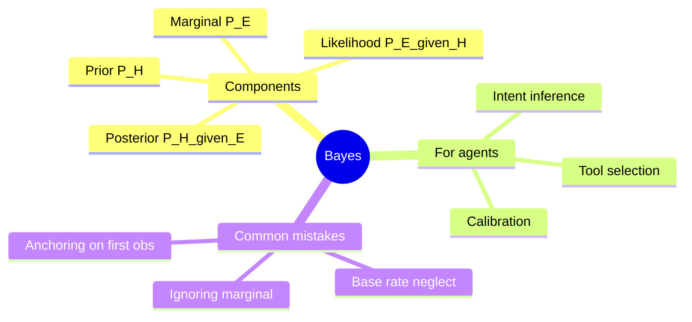

</details>

*Takeaway: Bayes' rule is one equation. The skill is choosing the prior.*

## §4 · Elaboration

### 4.1 Bayes' rule, in one line

$$
P(H \mid E) = \frac{P(E \mid H) \cdot P(H)}{P(E)}
$$

In English: the probability of a hypothesis given evidence equals the prior probability of the hypothesis times the likelihood of the evidence under the hypothesis, divided by the total probability of the evidence.

For agents, this means: *given what the user said, what's most likely?*

### 4.2 The Acme refund example, Bayesianised

Hypotheses (mutually exclusive):
- $H_1$: package not delivered (true loss)
- $H_2$: package delivered, customer didn't check
- $H_3$: package stolen after delivery

Priors (from Acme's historical data):
- $P(H_1)$ = 0.25
- $P(H_2)$ = 0.65
- $P(H_3)$ = 0.10

Evidence $E$: "customer said hasn't arrived."

Likelihoods:
- $P(E \mid H_1)$ = 0.95 (genuine loss → almost always complain)
- $P(E \mid H_2)$ = 0.60 (didn't check → complain ~60% of the time)
- $P(E \mid H_3)$ = 0.90 (stolen → complain almost always)

Marginal $P(E) = 0.95 \cdot 0.25 + 0.60 \cdot 0.65 + 0.90 \cdot 0.10 = 0.7175$

Posteriors:
- $P(H_1 \mid E) = (0.95 \cdot 0.25) / 0.7175 = 0.331$
- $P(H_2 \mid E) = (0.60 \cdot 0.65) / 0.7175 = 0.544$
- $P(H_3 \mid E) = (0.90 \cdot 0.10) / 0.7175 = 0.125$

After the complaint, $H_2$ ("delivered, didn't check") is still the most likely explanation, at 54%. The correct first action is `query_tracking` (test $H_2$). Only if tracking shows no delivery does $H_1$ become more probable and refund justifiable.

### 4.3 How agents use this without computing it

LLM agents don't run Bayes explicitly. They use it implicitly via:

1. **Prompt-encoded priors**: *"Most 'hasn't arrived' tickets resolve as 'delivered but unchecked.' Always verify tracking before issuing a refund."* The prior is now in the system prompt.
2. **Tool descriptions as likelihoods**: *"query_tracking returns the package's delivery status. If status='delivered', the most likely explanation is the customer didn't check."* Likelihood encoded in tool description.
3. **Few-shot examples**: showing 2–3 examples of correct prior+update reasoning teaches the model the pattern.

The math doesn't run, but the *behaviour* matches what Bayes would prescribe. This is the standard way Bayesian reasoning is "implemented" in LLM agents.

### 4.4 Common failure modes

- **Base-rate neglect**: agent ignores priors and treats every claim as equally likely. *Symptom*: agent jumps to action without verifying. *Fix*: include base rates in the prompt.
- **Anchoring**: agent over-weights the first observation. *Symptom*: agent commits early and ignores later evidence. *Fix*: ask the model to explicitly enumerate hypotheses before reasoning.
- **Marginal neglect**: agent computes likelihood × prior but forgets to normalise. *Symptom*: agent reports a "very confident" answer that's actually 0.3/0.5/0.2. *Fix*: ask for top-3 with probabilities, not top-1.

## §5 · Problem statement

Tom's literature-triage agent at Helix is being asked: *"Find papers on Alzheimer's that mention donepezil + memantine combination therapy."* Three classes of papers:

- $C_1$ — direct mention of the combination (target)
- $C_2$ — mentions one drug, suggests combination experimentally
- $C_3$ — irrelevant

Tom has data on his collection: $P(C_1) = 0.02$, $P(C_2) = 0.08$, $P(C_3) = 0.90$.

An abstract mentions donepezil. The likelihood model is:
- $P(\text{abstract mentions donepezil} \mid C_1) = 0.95$
- $P(\text{abstract mentions donepezil} \mid C_2) = 0.65$
- $P(\text{abstract mentions donepezil} \mid C_3) = 0.05$

1. Compute the posterior over $C_1, C_2, C_3$.
2. Should the agent read the full paper or pass it through? Use a "read iff $P(C_1 \cup C_2 | E) > 0.30$" rule.
3. Write the prompt instructions that would make an LLM agent behave Bayesianly *without* running explicit Bayes.

## §6 · Solution walkthrough

### Posterior

$P(E) = 0.95 \cdot 0.02 + 0.65 \cdot 0.08 + 0.05 \cdot 0.90 = 0.019 + 0.052 + 0.045 = 0.116$

$P(C_1 \mid E) = 0.019 / 0.116 = 0.164$
$P(C_2 \mid E) = 0.052 / 0.116 = 0.448$
$P(C_3 \mid E) = 0.045 / 0.116 = 0.388$

$P(C_1 \cup C_2 \mid E) = 0.612 > 0.30$. **Read the full paper.**

This is the value of the Bayesian frame: a naïve "the paper mentions donepezil so it's about donepezil" would skip ~$P(C_3 \mid E) = 39\%$ false positives and miss $\sim 50\%$ of $C_2$ papers (since most $C_2$ papers don't mention combination explicitly in the abstract).

### LLM-agent prompt instructions (Bayesian without Bayes)

```
You are screening abstracts for combination therapy mentions.

Base rates in our corpus:
  - 2% of papers are directly about the target combination
  - 8% mention one drug and suggest combinations experimentally
  - 90% are unrelated

When you see an abstract mentioning ONE of the target drugs:
  - Don't conclude it's about the combination (only 16% are).
  - Don't conclude it's irrelevant (39% are unrelated).
  - Read the full paper if there's any indication of combination work
    in the abstract.

When you see the abstract mention BOTH drugs:
  - Almost certainly relevant. Read the full paper.

When the abstract mentions NEITHER:
  - Almost certainly irrelevant. Skip.
```

The base rates and conditional rules encode the prior + likelihoods. The model now behaves Bayesianly on this task without ever computing a posterior.

## §7 · Mathematical foundation (deeper)

### 7.1 Log-odds form (the friendly Bayes)

$$
\log \frac{P(H_1 \mid E)}{P(H_2 \mid E)} = \log \frac{P(E \mid H_1)}{P(E \mid H_2)} + \log \frac{P(H_1)}{P(H_2)}
$$

In English: log-posterior-odds = log-likelihood-ratio + log-prior-odds.

This is easier to reason with than the multiplicative form. Each piece of evidence contributes additively to the log-odds. Useful for multi-evidence problems.

### 7.2 Bayesian model averaging

When the agent has multiple ways to interpret evidence, the Bayesian-correct answer is a *weighted average* over interpretations:

$$
\hat{y} = \sum_h P(h \mid E) \cdot \hat{y}_h
$$

In practice, LLM agents usually commit to the maximum-posterior hypothesis (MAP). For high-stakes decisions, ask the model to enumerate top-3 hypotheses with probabilities and let downstream logic choose how to combine.

### 7.3 Calibration

A perfectly Bayesian agent is *calibrated*: when it says "80% confident," it's right 80% of the time. LLM agents are *miscalibrated* by default — typically over-confident on rare classes (because pretraining over-represents confident assertions).

Calibration can be measured: ask the model for confidence on N test items, bin by confidence, plot actual accuracy vs stated confidence. The reliability diagram is your calibration. Module 8 covers this in detail.

## §8 · Technical deep-dive

### 8.1 Where to put the priors

Three places to encode Bayesian priors for an LLM agent:

1. **System prompt** — global priors that apply to every task. ("Most refund tickets are delivery confusion, not loss.")
2. **Tool descriptions** — likelihoods specific to a tool. ("`query_tracking` is 95% reliable for confirming delivery.")
3. **Few-shot examples** — example reasoning chains that demonstrate Bayesian behaviour.

Use all three. Prompt priors set the floor; tool descriptions add specificity; examples teach the *pattern* of reasoning.

### 8.2 When Bayesian priors hurt

Priors can be *wrong*. A common failure: encoding stale base rates that no longer apply.

For Acme: if you encoded "65% of 'hasn't arrived' tickets are delivered-but-unchecked" but a new shipping carrier has 25% loss rate, the prior is now actively harmful. You need to *refresh priors* against recent data, not bake them in once.

In production: store priors as a versioned configuration, refresh quarterly, and A/B test prompt versions against rolling base rates.

### 8.3 Eliciting beliefs from the model

For diagnostic purposes, you can ask the model directly:

> *"Before taking any action, list the top 3 hypotheses for what's going on and estimate the probability of each. Sum to 1."*

This forces the model to enumerate (counteracts anchoring) and quantify (counteracts vague confidence). The elicited beliefs are then inspectable and can be logged for calibration analysis.

### 8.4 The "verify before commit" pattern

The general pattern from §1's failure:

```
For any action with cost > threshold or reversibility = "no":
  1. Enumerate hypotheses about why the action is being taken.
  2. Identify the cheapest verification that would distinguish them.
  3. Take the verification first.
  4. Commit only after verification narrows the posterior.
```

This is Bayesian sequential decision-making in production-ready prose. Encode it once in the system prompt; agents will follow it across thousands of tasks.

## §9 · What this unlocks

- **Lesson 2.4** quantifies "the cheapest verification" via information theory — exactly which tool call has the highest expected information gain.
- **Module 5** uses Bayesian priors to weight retrieval results — not all retrieved documents are equally trustworthy.
- **Module 8** uses calibration as a core eval metric.
- **Module 10** uses base-rate-aware prompting as a defence against social-engineering prompt injection ("most messages asking for credentials are attacks; verify the requester").

---

# Lesson 2.4 — Information Theory: Quantifying Exploration

> **§0 · From last time.** Lesson 2.3 introduced Bayesian reasoning and gave us the *verify before commit* pattern. We left "which verification?" hand-waved as "the cheapest one." But cheapest at what — money or information? Information theory answers this precisely: it tells you exactly how much *uncertainty reduction* an observation will produce, in bits.

## §1 · Business scenario

*HSBC, Tuesday afternoon.*

Sherpa is investigating a break. The agent has 5 candidate explanations with current belief $b = (0.4, 0.3, 0.15, 0.1, 0.05)$. Four tools available, each with a different cost:

- `query_GL` — $0.01, 200 ms
- `query_counterparty` — $0.01, 400 ms
- `query_settlement` — $0.05, 1200 ms (calls an internal mainframe; slow + expensive)
- `query_static` — $0.005, 100 ms (cached lookup)

Daniel asks: *"Which tool first? On what basis?"*

Akash, the intern, says: *"Whichever is cheapest"* → `query_static`.

Lin says: *"Whichever the model picks"* → probably `query_GL` based on the prompt.

Maya says (visiting for cross-org learning): *"Pick whichever gives the most information per dollar."* — and writes the formula.

## §2 · Bridge to topic

The right tool is the one with the highest *expected information gain per unit cost*. Information theory makes "information gain" precise — measured in bits, the reduction in entropy of the belief. Combined with cost, it gives you a principled per-call ranking. LLM agents don't compute this explicitly; but knowing the formula lets you design the prompt and the eval to encourage information-maximising behaviour.

## §3 · Mind map


<details><summary>Mermaid source</summary>

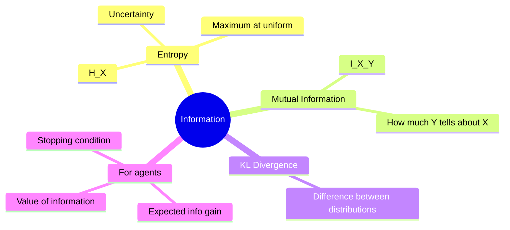

</details>

*Takeaway: entropy quantifies what you don't know; mutual information quantifies what an observation will teach you.*

## §4 · Elaboration

### 4.1 Entropy

The entropy of a distribution $P$ over $X$ is:

$$
H(X) = -\sum_x P(x) \log P(x)
$$

(Usually base-2 logs, so entropy is in bits.) Entropy is *maximum* at the uniform distribution (you know nothing) and *zero* at a point mass (you know exactly). For Sherpa's 5 classes with belief $(0.4, 0.3, 0.15, 0.1, 0.05)$:

$$
H(b) = -(0.4 \log_2 0.4 + 0.3 \log_2 0.3 + 0.15 \log_2 0.15 + 0.1 \log_2 0.1 + 0.05 \log_2 0.05)
$$
$$
H(b) = 2.066 \text{ bits}
$$

Maximum possible (uniform over 5): $\log_2 5 = 2.322$ bits. Sherpa already knows about 0.26 bits' worth.

### 4.2 Mutual information

The mutual information between random variables $X$ (the break category) and $Y$ (the observation from a tool) is:

$$
I(X; Y) = H(X) - H(X \mid Y) = \sum_{x, y} P(x, y) \log \frac{P(x, y)}{P(x) P(y)}
$$

In English: how much does observing $Y$ reduce your uncertainty about $X$, on average?

If $Y$ is independent of $X$, $I = 0$ (the observation tells you nothing). If $Y$ deterministically reveals $X$, $I = H(X)$ (the observation tells you everything).

### 4.3 Expected information gain per tool

For each tool, compute:

$$
\text{EIG}(\text{tool}) = H(b) - \mathbb{E}_o[H(b'_o)]
$$

where $b'_o$ is the posterior after observing $o$, and the expectation is over possible $o$ given the current belief.

Suppose for Sherpa:
- `query_GL` distinguishes amount_diff (class 1) from stale_static (class 2). Expected to give 1.2 bits.
- `query_counterparty` distinguishes counterparty mismatch (class 3) from others. Expected 0.6 bits.
- `query_settlement` distinguishes amount_diff from duplicate (class 4). Expected 0.4 bits.
- `query_static` distinguishes stale_static from others. Expected 0.3 bits.

EIG per dollar:

| Tool | EIG (bits) | Cost ($) | EIG / $ |
|---|---|---|---|
| query_GL | 1.2 | 0.01 | **120** |
| query_counterparty | 0.6 | 0.01 | 60 |
| query_settlement | 0.4 | 0.05 | 8 |
| query_static | 0.3 | 0.005 | 60 |

**Best choice: `query_GL`.** It targets the highest-mass classes (1 and 2) and is cheap.

This is the principled answer to Daniel's question. The intern's "cheapest" rule (`query_static`) is wrong because it's cheap *because* it tells you little. The model's `query_GL` pick happens to coincide with the optimum because the prompt biases toward the most-likely class — but this is luck. Better: encode information-gain reasoning in the prompt.

### 4.4 The stopping condition

Stop when *no tool's expected information gain pays for its cost in value terms*:

$$
\text{EVoI}(\text{tool}) = \text{EIG}(\text{tool}) \cdot v - c(\text{tool})
$$

where $v$ is the value per bit of uncertainty reduction (task-dependent; for HSBC roughly proportional to the $-200 → +42$ payoff asymmetry from Lesson 2.1).

When the maximum EVoI over all tools is ≤ 0: stop and answer.

## §5 · Problem statement

For Sherpa with current belief $b = (0.4, 0.3, 0.15, 0.1, 0.05)$:

1. Rank the four tools by EIG/$.
2. Suppose after `query_GL` the belief becomes $(0.7, 0.05, 0.15, 0.1, 0)$. Recompute entropy. By how many bits did we reduce uncertainty?
3. Write the prompt rule that an LLM agent can follow to behave like an information-maximiser without computing EIG.

## §6 · Solution walkthrough

### Ranking

As computed above: `query_GL` (120) > `query_counterparty` (60) = `query_static` (60) > `query_settlement` (8).

### Entropy after `query_GL`

$$
H((0.7, 0.05, 0.15, 0.1, 0)) = -(0.7 \log_2 0.7 + 0.05 \log_2 0.05 + 0.15 \log_2 0.15 + 0.1 \log_2 0.1)
$$
$$
= -(0.7 \cdot -0.515 + 0.05 \cdot -4.32 + 0.15 \cdot -2.74 + 0.1 \cdot -3.32)
$$
$$
= 0.360 + 0.216 + 0.411 + 0.332 = 1.319 \text{ bits}
$$

Reduction: $2.066 - 1.319 = 0.747$ bits. Less than the *expected* 1.2 because the observation pushed mass to class 1 but didn't fully clear classes 3 and 4.

### Prompt rule (no explicit EIG)

```
When choosing your next tool, prefer tools that:
  1. Test BETWEEN the top-2 most likely classes (these distinguish the
     ambiguity, not confirm the lead).
  2. Are cheap and fast UNLESS the expected information gain is very high.

Avoid tools that:
  - Only confirm what you already strongly believe (low info gain).
  - Test classes you've already ruled out (zero info gain).

Stop and answer when:
  - Your top class has probability > 0.83, OR
  - You've taken 8 tool calls, OR
  - All available tools test only ruled-out classes.
```

This is the information-theoretic stopping rule expressed in terms an LLM can act on. The "test between the top-2" rule encodes "maximise mutual information between observation and the discriminating variable" without naming it.

## §7 · Mathematical foundation (deeper)

### 7.1 KL divergence

The Kullback-Leibler divergence from $P$ to $Q$:

$$
D_{KL}(P \| Q) = \sum_x P(x) \log \frac{P(x)}{Q(x)}
$$

Measures how much $P$ "differs" from $Q$ — not symmetric. Used everywhere in agent design:

- **RLHF / DPO** — train the policy to maximise reward while keeping $D_{KL}$ from the reference policy small.
- **Posterior comparison** — how much did the belief update? (Useful as a logging signal.)
- **Calibration** — how much does the model's elicited posterior differ from the true posterior?

### 7.2 Conditional entropy and the chain rule

$$
H(X, Y) = H(X) + H(Y \mid X)
$$

The joint entropy decomposes into the entropy of one variable plus the conditional entropy of the other. This is what powers belief decomposition in multi-step planning: thinking about uncertainty over (action, outcome) jointly rather than treating each step in isolation.

### 7.3 The data-processing inequality

If $X \to Y \to Z$ is a Markov chain:

$$
I(X; Z) \leq I(X; Y)
$$

You can't gain information about $X$ by processing $Y$. Implication for agents: *summarising tool outputs always loses information*. If the summary is good enough, the loss doesn't matter; if not, you've thrown away potential evidence. Module 5 covers when summarisation is safe.

## §8 · Technical deep-dive

### 8.1 The "information-greedy" prompt pattern

When you want an LLM agent to behave like an information-maximiser, structure the prompt like this:

```
For each candidate tool call, before deciding:
  - State which hypothesis it primarily tests.
  - Estimate the probability the tool call will change your top answer.
  - Pick the tool with the highest such probability, breaking ties by cost.
```

This forces the model to *reason about counterfactuals* (what would change?) — which is the operational definition of information gain.

### 8.2 The "narrow then confirm" anti-pattern

A common LLM failure: the agent asks a *confirming* question (one that's unlikely to change the answer) because the prompt rewards "confident reasoning." This wastes tool calls and inflates costs.

Diagnosis: the agent's tool calls don't change its belief much (low EIG).
Fix: explicit prompt rule — *"prefer tools that test between the top-2 hypotheses, not those that confirm the leading one."*

### 8.3 Production information accounting

In production logs, capture per-tool-call:

- Belief before call (top-3 with confidence)
- Belief after call
- KL divergence between the two
- Cost in dollars

Aggregate over a day:

- Total bits acquired
- Bits per dollar (efficiency)
- Wasted calls (low KL divergence, high cost)

This is the data Daniel needs to tune Sherpa's tool-selection prompt over time. It also drives the eval design in Module 8.

### 8.4 The connection to the agency dial

A high-dial agent has high action entropy. An information-maximising agent has high *useful* action entropy — it explores actions that distinguish hypotheses, not actions that randomly differ. The difference between a *good* dial-3 agent and a *thrashing* dial-3 agent is whether the entropy is information-bearing.

## §9 · What this unlocks

- **Module 4** uses information-greedy prompting in Sherpa's tool-selection layer.
- **Module 5** uses mutual information to design retrieval scoring (a query result is valuable iff it's informative *and* relevant).
- **Module 6** uses KL divergence between agents' beliefs as a coordination signal — when two agents disagree, the one with the more "informative" disagreement wins.
- **Module 8** uses bits-acquired-per-dollar as the primary efficiency metric for evals.

---

# Module 2 — Summary & exit criteria

By the time you finish all four lessons, you should be able to:

- [ ] Model any agent task as an MDP or POMDP, choosing the right formalism.
- [ ] Compute or estimate the value of information for one more tool call.
- [ ] Write Bayesian-aware prompts that encode priors and likelihoods.
- [ ] Diagnose "wasted exploration" by computing per-call information gain.
- [ ] Derive principled termination rules from the cost/value structure of the task.

**Forward references.**
- §2.1 budget rule → Module 4 (Sherpa termination policy)
- §2.2 belief updates → Module 4 (memory architecture), Module 8 (calibration metrics)
- §2.3 prior encoding → Module 10 (security prompts), Module 11 (business case templates)
- §2.4 EIG ranking → Module 5 (retrieval scoring), Module 6 (multi-agent coordination)

---

*End of Module 2.*
