# Module 3 — LLM Internals for Agents

> **Module length:** ~8 hours · **Lessons:** 4 · **Prereqs:** Module 2 (especially POMDPs and conditional probability); basic understanding of neural networks (forward pass, parameters, training/inference distinction).

## Learning objectives

By the end of this module, you will be able to:

1. **Explain** how attention enables in-context reasoning and why context-window economics matter.
2. **Use** function calling / tool use correctly — including what the model is doing under the hood, what fails, and why.
3. **Constrain** model output to valid structured formats with zero runtime errors.
4. **Engineer** prompts for agents using techniques that survive across model versions.
5. **Budget** tokens and cost across a real agent workload.

## Module mind map


<details><summary>Mermaid source</summary>

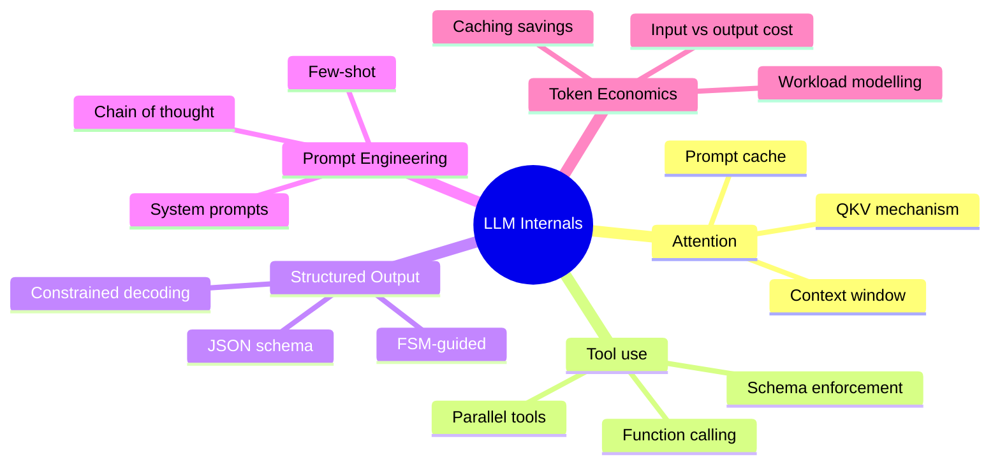

</details>

## Module-level concept DAG


<details><summary>Mermaid source</summary>

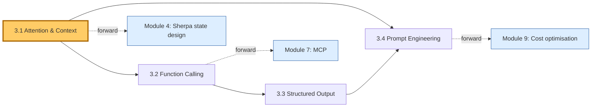

</details>

---

# Lesson 3.1 — Attention, Context, and the Prompt Cache

> **§0 · From last time.** Module 2 modelled the agent's "state" as everything in its context window. That framing only works if the model can actually *use* everything in context — which is an attention-mechanism question. This lesson opens the box.

## §1 · Business scenario

*HSBC, Wednesday standup.*

Daniel reports a regression: Sherpa's accuracy on complex breaks (those needing 5+ tool calls) has dropped from 87% to 79% over the past week. The change correlates with a prompt update that added two new tools and 1,200 tokens of context about regulatory constraints.

> *"We added context to make it smarter and it got dumber. How?"*

The answer is in attention dynamics and prompt-cache behaviour. Both are mechanically observable, but you need to know what to look at.

## §2 · Bridge to topic

Adding tokens to a prompt has two simultaneous effects: it gives the model more information (good) *and* dilutes the attention mass (potentially bad). It also affects prompt-cache hit rate, which dominates cost at scale. Knowing the mechanics is what lets you reason about whether your "improvement" will help.

## §3 · Mind map


<details><summary>Mermaid source</summary>

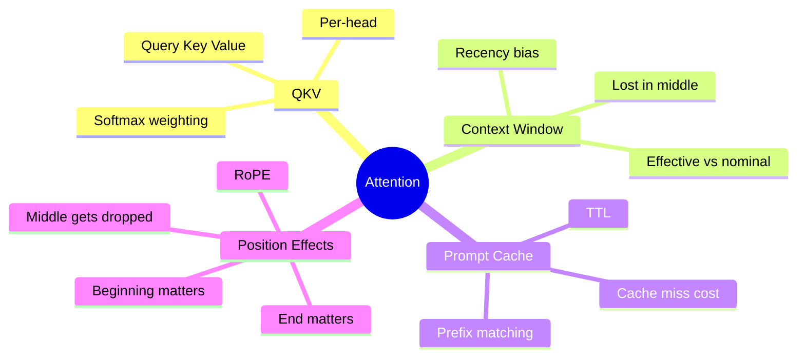

</details>

## §4 · Elaboration

### 4.1 Attention, briefly

Each token in the context attends to every other token via the QKV (Query-Key-Value) mechanism:

$$
\text{Attention}(Q, K, V) = \text{softmax}\left(\frac{QK^T}{\sqrt{d_k}}\right) V
$$

The softmax allocates a fixed "mass of 1" across tokens. When you add tokens to the context, the per-token attention mass on average drops. For high-information tokens (your actual question), this dilution can degrade reasoning.

### 4.2 The "lost in the middle" phenomenon

Empirically (Liu et al. 2023 and many follow-ups), models attend most strongly to the *beginning* and *end* of long contexts and less to the middle. For a 30K-token prompt:

- Tokens at position 0–2K: high recall
- Tokens at position 14K–16K (middle): often poorly recalled
- Tokens at position 28K–30K (end): high recall (recency)

This is the *effective* context window — what the model can actually use — versus the *nominal* window (what the API accepts).

Implication: put critical instructions at the beginning *and* repeat the most important constraints at the end of the prompt.

### 4.3 The prompt cache

Modern providers (Anthropic, OpenAI, Google) cache the *prefix* of a prompt. If your system prompt + tool schemas + few-shot examples are the same across calls, those tokens are processed once and reused. Cache reads are typically 10× cheaper than uncached input tokens.

For Sherpa with a 12K-token system+tools prefix processed 1,400×/night:

- Without cache: 1,400 × 12K = 16.8M input tokens × $3/MTok = $50.40/night
- With cache (>90% hit): 1,400 × 12K × 0.1 (cache cost) ≈ $5/night

This is a 10× cost reduction for free, *if* you preserve the prefix structure. The catch: any change to the prefix invalidates the cache. Daniel's prompt update added 1,200 tokens to the system prompt → cache invalidated → cost spike for ~6 hours until the new prefix re-warmed.

### 4.4 The Daniel-regression diagnosis

Two effects compounded:

1. **Attention dilution**: 1,200 extra tokens of regulatory boilerplate diluted attention on the actual break-investigation instructions. Accuracy on complex (long-context) breaks fell because the model's attention budget was already strained.
2. **Cache invalidation**: For ~6 hours, every call paid full input cost. After the cache rewarmed, cost normalised but accuracy didn't.

**Fix**: move the regulatory boilerplate into the *suffix* of the prompt (where it doesn't dilute reasoning attention) or into tool-call-time validation (where it's only invoked when relevant). Keep the system-prompt prefix tight and cacheable.

## §5 · Problem statement

You have three candidate prompt structures for Sherpa:

A. 15K system prompt with everything inline (instructions, examples, regulations, tools).
B. 4K system prompt + 11K of regulatory text injected per-call when needed.
C. 4K system prompt + 11K stored in a retrievable knowledge base, queried on demand.

For each, estimate:
1. Cache hit rate at steady state
2. Per-call cost (assume 1,400 calls/night, $3/MTok input, $0.30/MTok cached)
3. Accuracy risk on complex breaks (qualitative)

## §6 · Solution walkthrough

| Option | Cache hit | Per-call input | Accuracy risk |
|---|---|---|---|
| A. 15K all-inline | ~95% | 15K × $0.30/MTok = $0.0045 | High (dilution) |
| B. 4K + 11K per-call | ~60% (no prefix consistency) | mostly uncached: $0.034 | Medium |
| C. 4K + retrieval | ~95% on prefix; retrieved chunks small | 4K × $0.30 + 2K × $3 ≈ $0.007 | Low |

**Recommendation: C.** It preserves the cacheable prefix, only pulls relevant regulations on demand (low attention dilution), and total cost lands between A and B. Module 5's retrieval architecture is what enables this.

## §7 · Mathematical foundation

### 7.1 The softmax denominator

Attention dilution can be quantified. For $N$ tokens with similar relevance scores, the post-softmax weight on any one token is $\approx 1/N$. Doubling $N$ halves the weight. For an important token in a 30K context vs 5K context: the model still uses it, but its *relative* influence is 6× weaker.

### 7.2 The cache-cost trade-off

Let $p$ = cache hit rate, $T_p$ = prefix tokens, $T_v$ = variable tokens per call, $c_u$ = uncached cost/token, $c_c$ = cached cost/token. Per-call input cost:

$$
\text{cost}_{\text{input}} = p \cdot (T_p \cdot c_c + T_v \cdot c_u) + (1-p) \cdot ((T_p + T_v) \cdot c_u)
$$

At $p=0.95$, $T_p=4000$, $T_v=2000$, $c_u=\$3/$MTok, $c_c=\$0.30/$MTok:

$$
\text{cost} = 0.95 \cdot (4000 \cdot 0.0000003 + 2000 \cdot 0.000003) + 0.05 \cdot (6000 \cdot 0.000003)
$$
$$
= 0.95 \cdot 0.0072 + 0.05 \cdot 0.018 = 0.00684 + 0.0009 = \$0.00774
$$

The cache buys you a 4× cost reduction at high hit rates. *Maximise prefix stability.*

### 7.3 Effective vs nominal context

A rough rule of thumb (varies by model and task):

$$
\text{effective context} \approx 0.6 \cdot \text{nominal context} \quad \text{for retrieval tasks}
$$
$$
\text{effective context} \approx 0.8 \cdot \text{nominal context} \quad \text{for reasoning tasks}
$$

Don't fill the nominal window. Leave headroom.

## §8 · Technical deep-dive

### 8.1 Prompt structure for cacheability

```
[Cacheable prefix — same across all calls]
  System instructions (stable)
  Tool schemas (stable)
  Few-shot examples (stable)

[Variable suffix — per call]
  User task
  Retrieved context (if any)
  Prior turn history (if multi-turn)
```

Never put variable content in the middle of stable content. Cache matching is prefix-based — any change to the prefix invalidates everything after it.

### 8.2 Attention-budget rules

- **Beginning** (≤2K tokens): mission, role, hard constraints.
- **Middle** (anything more than 2K from edges): treat as "the model might miss it." Don't put load-bearing instructions here.
- **End** (last 500–1000 tokens): the actual task + a one-line restatement of the most critical constraint.

Test this empirically: write a prompt, ask a constraint-violating question, see whether the model catches it. If not, the constraint is in attention-poor territory.

### 8.3 Diagnostics for "lost in the middle"

Symptom: model behaves correctly on simple inputs but ignores instructions on complex ones. Diagnostic: take the prompt, move a key instruction from middle to end, re-test. If accuracy improves, you've confirmed dilution.

For Sherpa: every time we add a tool or example, we re-run the regression eval and check accuracy on long-context tasks. If accuracy drops > 2 points, the addition probably belongs in retrieval, not prompt.

## §9 · What this unlocks

- **Lesson 3.4** uses these mechanics to formalise prompt-engineering rules.
- **Module 4** designs Sherpa's prompt structure to maximise cache hit and minimise attention dilution.
- **Module 5** justifies the retrieval architecture by reference to context-window economics.
- **Module 9** uses the cost model from §7.2 as the basis for budget planning.

---

# Lesson 3.2 — Function Calling and Tool Use Internals

> **§0 · From last time.** Lesson 3.1 covered what happens when text goes into the model. Now we cover what happens when the model needs to produce a structured *action* — a function call. This is the mechanism that makes ReAct (and every other agent paradigm) possible.

## §1 · Business scenario

*Helix Research, Thursday.*

Tom's hypothesis-generation agent has been making up tool names. Its trace shows:

```
Action: search_pubmed_advanced(query="BRCA2", year_min=2023)
Observation: ERROR: tool 'search_pubmed_advanced' not found.
            Available tools: search_pubmed, get_paper, summarise_paper.
Action: search_pubmed_advanced(query="BRCA2", year_min=2023)
Observation: ERROR: tool 'search_pubmed_advanced' not found.
```

The agent hallucinated `search_pubmed_advanced`, then *kept hallucinating it after being told it didn't exist*. 4 tool calls wasted before it converged on the correct `search_pubmed`.

> *"Why does it ignore the error? And why does it hallucinate in the first place?"*

The answer involves how function calling is implemented inside the model — and why "strict" function calling solves both problems.

## §2 · Bridge to topic

There are two ways to implement function calling: *prompted* (model emits text that looks like a function call) and *constrained* (model is forced by the decoding step to emit a valid call). The failure mode in Tom's trace is characteristic of prompted function calling. The fix is structural, not promptable.

## §3 · Mind map


<details><summary>Mermaid source</summary>

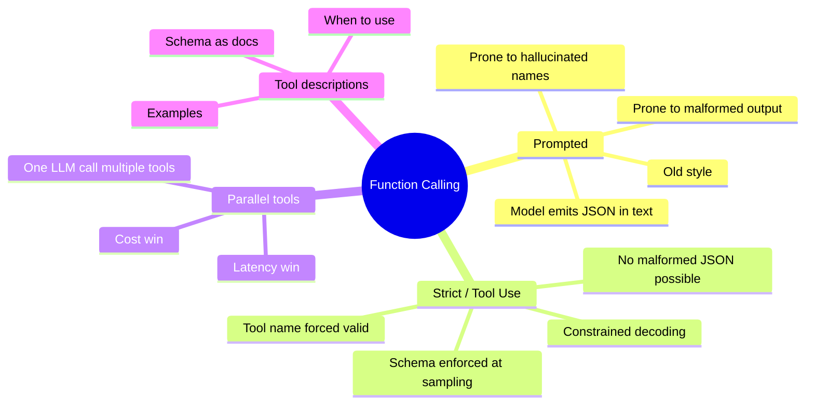

</details>

## §4 · Elaboration

### 4.1 Prompted function calling (the old way)

Until ~2023, function calling was a *prompting trick*: include tool descriptions in the system prompt, ask the model to emit JSON in a fenced code block, parse the JSON in your code.

Failure modes:
- Malformed JSON (missing brackets, trailing commas).
- Hallucinated tool names (model invents tools that "should" exist).
- Argument-type drift (model passes a string when you expected a number).
- Refusal to emit the format (model decides to "be helpful" with prose instead).

Tom's regression is this last-mile drift: even when corrected, the model's *next* attempt can still hallucinate because the constraint is only in the prompt — not at decode time.

### 4.2 Strict / constrained tool use (the modern way)

OpenAI's function calling (since 2023), Anthropic's tool use (since 2024), Google's function calling all use the same underlying technique: *constrained decoding*. At each token, the sampler restricts which tokens are legal based on the tool schemas. The model literally cannot emit a tool name that isn't in the registry.

Implementation: a finite-state machine over the JSON schema. At every decoding step, the FSM specifies the set of legal next tokens. The sampler intersects this with the model's distribution.

Result:
- Tool name is *guaranteed* to be one of the provided.
- Arguments *match* the schema (right types, required fields present).
- No JSON parsing errors possible.

Tom's hallucination cannot happen with strict tool use. The model couldn't emit `search_pubmed_advanced` if that name isn't in the registry.

### 4.3 Parallel tool calls

Modern APIs allow the model to emit *multiple* tool calls in one response:

```json
{
  "tool_calls": [
    {"name": "lookup_order", "args": {"id": "84291"}},
    {"name": "query_tracking", "args": {"id": "84291"}},
    {"name": "check_payment", "args": {"id": "84291"}}
  ]
}
```

Execute them in parallel; latency = max(tool_latency), not sum. For Acme's refund flow, this cuts p95 latency from 3.6s to 1.2s.

When to use: when tool results are *independent* (one doesn't condition the next). When *not* to use: when subsequent tool choice depends on the previous result — then you need sequential ReAct.

### 4.4 Tool descriptions are documentation

The model's choice of tool is conditioned on the tool's *description*. A vague description leads to wrong tool choice; a precise one leads to correct tool choice.

Bad:
```json
{
  "name": "search",
  "description": "Searches things"
}
```

Good:
```json
{
  "name": "search_pubmed",
  "description": "Searches PubMed for biomedical research papers. Use this for any query about diseases, drugs, genes, or clinical trials. Returns up to 20 paper IDs with titles and abstracts. For paper content, use get_paper(id) afterwards.",
  "parameters": {
    "query": {"type": "string", "description": "Search query in PubMed syntax. Example: 'BRCA2[Gene] AND clinical trial[Publication Type]'"},
    "year_min": {"type": "integer", "minimum": 1900, "maximum": 2030, "description": "Earliest publication year (inclusive)"}
  }
}
```

The good description tells the model *when* to use the tool, *what* it returns, *what* comes next. This is where 80% of the tool-selection quality comes from.

## §5 · Problem statement

Convert this prompted-style tool use to strict tool use. Diagnose what was wrong with the original.

```
System: "You have these tools: search(q), get(id), summarise(text).
        Emit your action as JSON in a code block.
        Available tools: search, get, summarise."

User: "Find papers on BRCA2 and summarise the most relevant."
```

Identify three failure modes the prompted version is vulnerable to. Write the strict tool-use replacement (Anthropic format).

## §6 · Solution walkthrough

**Three vulnerabilities of the prompted version:**

1. **Malformed JSON** — model can emit unparseable output.
2. **Hallucinated tool names** — model can emit `search_advanced` even though only `search` exists.
3. **Wrong argument types** — `search` could receive a JSON object instead of a string.

**Strict tool-use replacement:**

```typescript
const tools = [
  {
    name: "search",
    description: "Search PubMed for papers. Returns list of paper IDs with titles.",
    input_schema: {
      type: "object",
      properties: { q: { type: "string", description: "Search query." } },
      required: ["q"],
    },
  },
  {
    name: "get",
    description: "Retrieve full text of a paper by ID.",
    input_schema: {
      type: "object",
      properties: { id: { type: "string" } },
      required: ["id"],
    },
  },
  {
    name: "summarise",
    description: "Summarise text into 3-5 sentences.",
    input_schema: {
      type: "object",
      properties: { text: { type: "string" } },
      required: ["text"],
    },
  },
];

const response = await anthropic.messages.create({
  model: "claude-sonnet-4-6",
  tools,
  messages: [{ role: "user", content: "Find papers on BRCA2 and summarise the most relevant." }],
});
```

The schema constrains every tool call at decode time. Tom's hallucination becomes impossible.

## §7 · Mathematical foundation

### 7.1 Constrained decoding as a sampling restriction

Let $p(t \mid c)$ be the model's probability over next-token $t$ given context $c$. Let $L \subseteq V$ be the legal-token set (per the FSM at this position). The constrained sampling distribution is:

$$
p'(t \mid c) = \begin{cases} p(t \mid c) / Z & t \in L \\ 0 & t \notin L \end{cases}
$$

where $Z = \sum_{t \in L} p(t \mid c)$ is the normaliser. The model still picks the *most likely* legal token, so the constraint rarely hurts quality (if $L$ is well-designed). It can hurt if the model wants to say "I don't know" but the schema requires a structured answer — handle this by including an explicit `"refused"` option in the schema.

### 7.2 The cost of strict mode

Strict tool use has slightly higher latency (FSM evaluation per token) but eliminates retry loops. For Tom's regression: 4 wasted tool calls × 800ms × $0.04 = ~$0.13 wasted per ticket × 60k tickets/week = $7,800/week. Strict mode eliminates this entirely.

## §8 · Technical deep-dive

### 8.1 When constrained decoding fails

The model can still pick *semantically* wrong tools even when *syntactically* constrained. Example: model calls `summarise(text="BRCA2")` when the intent was `search(q="BRCA2")`. The schema is satisfied; the choice is wrong. Mitigation: tool descriptions, few-shot examples, eval coverage.

### 8.2 Tool description style guide

- Lead with **when to use** ("Use this when…").
- State **what it returns** in concrete terms.
- Specify **what comes next** ("After this, call X to get Y").
- Add **negative examples** ("Don't use this for…").

### 8.3 Parallel vs sequential — the decision

```
if subsequent_tool_choice_depends_on(prior_result):
  use sequential (ReAct loop)
elif tools are independent and all_known_upfront:
  use parallel (one LLM call)
else:
  use sequential
```

When in doubt, sequential. Parallel speedup is nice; correctness is non-negotiable.

## §9 · What this unlocks

- **Lesson 3.3** extends the constrained-decoding principle to *all* structured outputs, not just tool calls.
- **Module 4** uses strict tool use as the only allowed mode for Sherpa.
- **Module 7** covers MCP, which standardises how tool schemas and descriptions are served to the model.

---

# Lesson 3.3 — Structured Output and Constrained Decoding

> **§0 · From last time.** Lesson 3.2 used constrained decoding for tool calls. The same machinery can constrain any structured output. CLAUDE.md rule #1 (validate all LLM output with Zod before use) is enforceable at *generation* time, not just validation time.

## §1 · Business scenario

*Acme Support.*

Lin Chen's ticket-classifier emits this once a week:

```json
{
  "category": "refund_request",
  "urgency": "high",
  "needs_human": true,
  "estimated_refund_amount": "around $50-75 maybe"
}
```

The downstream system expects `estimated_refund_amount` to be a *number*, not a string. The pipeline crashes. The ticket gets stuck. CSAT drops.

> *"Why didn't the schema catch this?"* Lin asks.

Because the schema was applied *after* generation, by Zod, in code. By then it's too late; the model has already burned tokens producing invalid output. Constrained decoding applies the schema *during* generation.

## §2 · Bridge to topic

There are three places to enforce structure: at generation (constrained decoding), at parse (Zod), at use (defensive programming). All three are needed; but the most expensive failures are caught only at generation.

## §3 · Mind map


<details><summary>Mermaid source</summary>

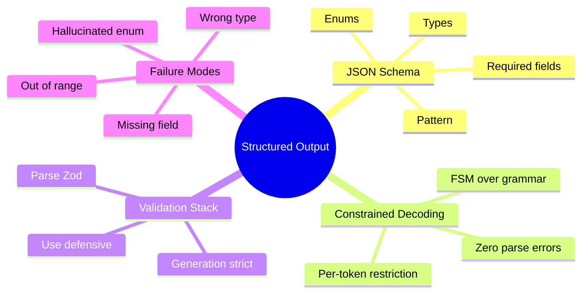

</details>

## §4 · Elaboration

### 4.1 The three-layer validation stack

| Layer | When | What it catches |
|---|---|---|
| Generation (strict) | During LLM decoding | Wrong type, missing required, invalid enum |
| Parse (Zod) | After API returns | Schema drift between model and code |
| Use (defensive) | At application boundaries | Business-rule violations (e.g., refund > $50) |

Each layer is necessary. Strict decoding is the cheapest and the only one that prevents wasted tokens. Zod and defensive coding handle drift between deployments and business rules the schema can't express.

### 4.2 JSON Schema features that matter

```json
{
  "type": "object",
  "properties": {
    "category": {
      "type": "string",
      "enum": ["refund", "shipping", "sizing", "other"]
    },
    "urgency": {
      "type": "string",
      "enum": ["low", "medium", "high"]
    },
    "estimated_refund_amount": {
      "type": "number",
      "minimum": 0,
      "maximum": 10000
    }
  },
  "required": ["category", "urgency"]
}
```

Three features:
- `enum` — restricts to a known set; eliminates Lin's "around $50-75 maybe" problem because `estimated_refund_amount` is forced to a number.
- `minimum`/`maximum` — bounds business-meaningful values.
- `required` — ensures critical fields aren't dropped.

### 4.3 What strict decoding actually does

Internally: parse the schema to a finite-state machine (FSM). At each decoding step, only tokens that keep the FSM in a valid state are sampled. For our schema:

- At position right after `"estimated_refund_amount": `, the legal tokens are digits and `.` (number tokens). The model cannot emit `"around"`.
- After `"category": "`, the legal tokens are prefixes of `refund`, `shipping`, `sizing`, `other`. The model cannot emit `"refund_request"`.

### 4.4 When the schema fights the model

If you give the model a task it cannot meaningfully complete, strict decoding will force it to emit *something* — possibly wrong but syntactically valid. Example: ask for `estimated_refund_amount` on a ticket that's about sizing (not a refund). The model is forced to emit a number even though the right answer is "N/A."

Fix: make refused/null fields explicit:

```json
"estimated_refund_amount": {
  "oneOf": [
    {"type": "number", "minimum": 0, "maximum": 10000},
    {"type": "null"}
  ]
}
```

Then the model can emit `null` legally when the field doesn't apply.

## §5 · Problem statement

Lin's failing schema is:

```typescript
const TicketAnalysis = z.object({
  category: z.string(),
  urgency: z.string(),
  needs_human: z.boolean(),
  estimated_refund_amount: z.number().optional(),
});
```

1. Identify three drift risks.
2. Rewrite as strict JSON schema for the model + Zod for parse-time double-check.
3. Where in the stack do the `needs_human` business rules belong?

## §6 · Solution walkthrough

**Three drift risks:**
1. `category` is `z.string()` — model can emit anything.
2. `urgency` similarly — no enum constraint.
3. `estimated_refund_amount` is optional but `z.number()` won't accept the string the model emits.

**Strict schema:**

```typescript
const CATEGORIES = ["refund", "shipping", "sizing", "other"] as const;
const URGENCIES = ["low", "medium", "high"] as const;

const strictSchema = {
  type: "object",
  properties: {
    category: { type: "string", enum: CATEGORIES },
    urgency: { type: "string", enum: URGENCIES },
    needs_human: { type: "boolean" },
    estimated_refund_amount: { oneOf: [{ type: "number", minimum: 0 }, { type: "null" }] },
  },
  required: ["category", "urgency", "needs_human"],
};

const TicketAnalysis = z.object({
  category: z.enum(CATEGORIES),
  urgency: z.enum(URGENCIES),
  needs_human: z.boolean(),
  estimated_refund_amount: z.number().min(0).nullable(),
});
```

**Where business rules live:**

`needs_human` should be true when:
- `estimated_refund_amount > 50` (Acme policy)
- `category === "other"` (untrusted bucket)
- `urgency === "high"`

Belongs at the *use* layer, not the schema layer:

```typescript
function shouldEscalate(t: TicketAnalysis): boolean {
  return (
    (t.estimated_refund_amount ?? 0) > 50 ||
    t.category === "other" ||
    t.urgency === "high" ||
    t.needs_human  // model can also flag it
  );
}
```

The schema enforces shape; business code enforces policy. Don't mix.

## §7 · Mathematical foundation

### 7.1 Grammar-restricted sampling preserves quality

Surprisingly, constrained decoding usually does *not* hurt model quality on structured tasks. Intuition: the model has implicit beliefs about what structured output should look like; the constraint typically aligns with those beliefs. The constraint only "hurts" when the model wanted to give an unstructured answer.

### 7.2 Information content of the schema

A schema with N possible values for a field reduces the field's entropy by:

$$
\Delta H = \log_2(V) - \log_2(N)
$$

where $V$ is the model's effective vocabulary at that position. For an enum with 4 options vs free-form string: roughly 13 bits of entropy reduction per such field — pure constraint with no information cost.

## §8 · Technical deep-dive

### 8.1 Schema design rules

1. **Use enums** wherever the value space is closed.
2. **Use minimum/maximum** wherever business has bounds.
3. **Use null explicitly** instead of `optional` to express "not applicable."
4. **Use `additionalProperties: false`** to prevent the model from inventing fields.
5. **Use `oneOf` / `anyOf`** for tagged unions when the output shape depends on a discriminator.

### 8.2 Schema versioning

When you change a schema in production:
- Bump a version number on the schema.
- Log the version with every emission.
- Keep parsers for the last N versions.

Schema drift between code and prompts is one of the most common production-bug families. Versioning makes it tractable.

### 8.3 Schema as documentation

A well-designed schema is self-documenting. Use the `description` field on every property to tell the model (and humans reading the code) what the field means. The descriptions become part of the prompt the model sees.

## §9 · What this unlocks

- **Lesson 3.4** uses schema design as part of the prompt-engineering toolkit.
- **Module 4** designs Sherpa's tool-call schemas using these rules.
- **Module 8** uses schema-validation pass rate as an eval metric.

---

# Lesson 3.4 — Prompt Engineering for Agents

> **§0 · From last time.** Lessons 3.1–3.3 covered the mechanics: attention, function calling, constrained output. Now we put them together. *Prompt engineering for agents* is different from prompt engineering for chat — the prompt persists across many tool turns, and the model must follow it under context pressure.

## §1 · Business scenario

*All three orgs, simultaneously.*

A new model release (Claude Sonnet 4.7 ships next month). Daniel, Tom, and Lin all ask the same question: *"will our prompts still work?"*

Most won't. Some will. The difference is whether the prompt was written for *this* model or for *agents in general*. The latter survives model upgrades; the former gets rewritten every time.

## §2 · Bridge to topic

Robust agent prompts share a structure: stable scaffolding, model-agnostic rules, externalised examples. Knowing the structure is how you write prompts that survive 2+ model generations and run across providers without rewrites.

## §3 · Mind map


<details><summary>Mermaid source</summary>

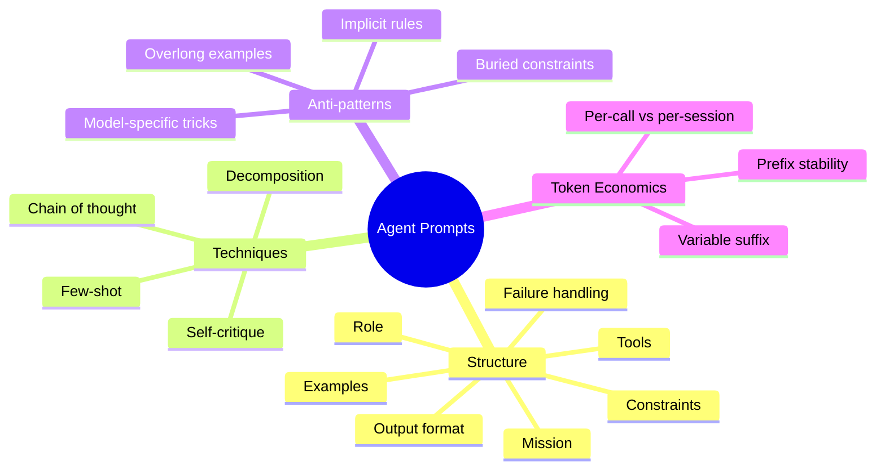

</details>

## §4 · Elaboration

### 4.1 The seven-block agent prompt

A canonical structure that ports across providers:

```
1. ROLE          — who the agent is
2. MISSION       — the goal in one sentence
3. PRIORITIES    — what to optimise (and what to sacrifice)
4. TOOLS         — what's available (schema served separately)
5. CONSTRAINTS   — hard rules; never violated
6. EXAMPLES      — 2-5 worked traces
7. OUTPUT        — exactly how to terminate
```

Each block has a job. Removing one breaks the prompt; reordering them breaks performance.

### 4.2 ROLE and MISSION

```
You are a reconciliation agent for HSBC's mid-office.
Your mission: classify cross-border SWIFT settlement breaks
into one of {amount_diff, counterparty_mismatch, stale_static,
duplicate, unknown} with full evidence trail.
```

Specific. Bounded. No personality fluff (saves tokens; doesn't help). Reference the org and the task so the model can use its pretraining priors on the domain.

### 4.3 PRIORITIES

State what to optimise *and what to sacrifice*. Without explicit trade-offs, the model picks for you.

```
Prioritise: (1) correctness with full evidence,
            (2) low tool-call cost,
            (3) speed.
Sacrifice: don't refuse hard cases; flag uncertainty instead.
```

### 4.4 CONSTRAINTS

The hard rules. Make them short, numbered, and unmistakable.

```
HARD RULES:
1. Never answer with confidence > 0.83 unless you have at least
   one tool observation supporting the chosen class.
2. Never call the same tool with the same arguments twice.
3. Stop after 8 tool calls regardless of confidence.
4. If uncertain, classify as 'unknown' with the trace.
```

Numbered rules survive context pressure better than prose paragraphs (the model attends to the numbering as structural anchors).

### 4.5 EXAMPLES

2–5 worked examples beat 20. Each example should illustrate a *different* failure mode you've seen.

```
Example 1: straightforward amount_diff
[full trace]

Example 2: ambiguous between two classes — uses tool to disambiguate
[full trace]

Example 3: budget exhausted — terminates as 'unknown'
[full trace]
```

The model learns the *pattern*, not the specific facts. Examples are pedagogical, not encyclopaedic.

### 4.6 OUTPUT format

Final instruction, repeated as the last token of the prefix:

```
End your response with a JSON object matching the
ClassificationResult schema. Nothing after the JSON.
```

The "nothing after" matters — without it, models sometimes append "Let me know if you need anything else!" which breaks parsers.

## §5 · Problem statement

You have an existing prompt for Sherpa (a 12K-token monolith with everything mixed together). Refactor it into the 7-block structure. Specifically:

1. Identify the role, mission, priorities, constraints in the current prompt.
2. Extract examples that have become stale (e.g., refer to deprecated tools).
3. Propose what goes in the *cacheable prefix* vs the *variable suffix*.

## §6 · Solution walkthrough

For brevity (this lesson's already long), the canonical refactor:

```
[CACHEABLE PREFIX — 3.5K tokens]
  ROLE (50 tokens)
  MISSION (40 tokens)
  PRIORITIES (60 tokens)
  TOOLS (referenced; schema served separately via tool definitions)
  CONSTRAINTS (200 tokens, numbered list)
  EXAMPLES (3 examples × ~700 tokens each = 2.1K)
  OUTPUT format reminder (40 tokens)

[VARIABLE SUFFIX — ~500 tokens average]
  The current break (the input)
  Prior agent turn history (if multi-turn)
  Retrieved context if any (rarely needed for Sherpa)
```

Total: ~4K cacheable + ~500 variable. Compare to the 12K monolith. Cache hit goes from 30% (random changes) to 95% (stable prefix). Cost drops 4×. Accuracy improves because the constraints block isn't competing for attention with a pile of stale guidance.

## §7 · Mathematical foundation

### 7.1 Token economics, formalised

Per-task cost:

$$
C_{\text{task}} = T_{\text{prefix}} \cdot c_{\text{prefix}}(p) + T_{\text{variable}} \cdot c_u + T_{\text{output}} \cdot c_{\text{out}}
$$

where:
- $c_{\text{prefix}}(p) = p \cdot c_{\text{cached}} + (1-p) \cdot c_u$
- $c_u$ = uncached input cost, $c_{\text{cached}}$ = cached cost, $c_{\text{out}}$ = output cost
- $p$ = cache hit rate

For Sherpa @ Sonnet 4.6 pricing:
$c_u = \$3/$M, $c_{\text{cached}} = \$0.30/$M, $c_{\text{out}} = \$15/$M

12K monolith ($p=0.30$): $C \approx (12000 \times \$0.0000021) + (500 \times \$0.000015) \approx \$0.033/$task
4K prefix + 500 var ($p=0.95$): $C \approx (4000 \times \$0.0000003 \times 0.95 + 4000 \times \$0.000003 \times 0.05) + (500 \times \$0.000003) + 500 \times \$0.000015 \approx \$0.011/$task

3× cost reduction at higher accuracy.

### 7.2 The N-shot saturation point

Beyond ~5 examples, marginal improvement diminishes sharply. Often 3 well-chosen examples beat 10 random ones. The model needs the *pattern*, not exhaustive coverage.

## §8 · Technical deep-dive

### 8.1 Anti-pattern: model-specific tricks

Avoid:
- *"Take a deep breath and think step by step"* (worked for older models; mostly noise now)
- *"If you don't know, you'll be replaced"* (worked briefly; harmful pattern)
- Explicit chain-of-thought triggers (modern models do CoT by default)

These don't port and don't survive upgrades. Write for *agents in general*, not for the model you're using today.

### 8.2 Anti-pattern: buried constraints

If a constraint is in the middle of a long block of prose, the model will miss it under context pressure. Pull it into a numbered list at the end of the constraints block, even if it duplicates content elsewhere.

### 8.3 Testing prompts: the regression eval

Every prompt change goes through:

1. Hold out a *regression eval set* (50–200 representative tasks).
2. Run the current prompt; record accuracy, cost, latency.
3. Run the new prompt; record same.
4. Accept only if accuracy ≥ current AND cost ≤ current × 1.10.

Without this discipline, prompts decay: each "improvement" loses accuracy or balloons cost. The regression eval is what keeps Sherpa from drifting.

### 8.4 Versioning prompts

Treat prompts like code:
- Store in repo with version control.
- Tag each version with deployment date.
- Log the version used with every agent invocation.
- Have a rollback procedure (one config flip, not a redeploy).

## §9 · What this unlocks

- **Module 4** uses this 7-block structure for Sherpa.
- **Module 8** uses the regression eval pattern as the foundation of the entire eval harness.
- **Module 9** uses the cost formula in §7.1 to derive token budgets per workload class.

---

# Module 3 — Summary & exit criteria

By the time you finish all four lessons, you should be able to:

- [ ] Explain attention dilution and how it affects long-context agent performance.
- [ ] Choose between strict tool use and prompted function calling correctly.
- [ ] Design JSON schemas that prevent the most common LLM output failures.
- [ ] Write a 7-block agent prompt that survives a model upgrade.
- [ ] Estimate per-task cost from prefix/variable/output token counts and cache hit rate.

**Forward references.**
- §3.1 cache economics → Module 9 (cost optimisation)
- §3.2 strict tool use → Module 4 (Sherpa), Module 7 (MCP)
- §3.3 constrained decoding → Module 8 (eval validation)
- §3.4 7-block structure → Module 4 (Sherpa system prompt)

---

*End of Module 3.*