# Module 4 — Single-Agent Architectures: Building Sherpa

> **Module length:** ~10 hours · **Lessons:** 5 · **Prereqs:** Modules 1–3 (especially the agency dial, POMDPs, attention, strict tool use).

## Learning objectives

By the end of this module, you will be able to:

1. **Build** a ReAct agent from scratch in TypeScript.
2. **Design** memory and state for an agent that runs across many turns.
3. **Add** self-critique loops that improve accuracy without runaway cost.
4. **Compose** Plan-and-Solve with ReAct sub-loops in the hybrid pattern.
5. **Ship** Sherpa to production with all the discipline of Modules 1–3 baked in.

## Module mind map


<details><summary>Mermaid source</summary>

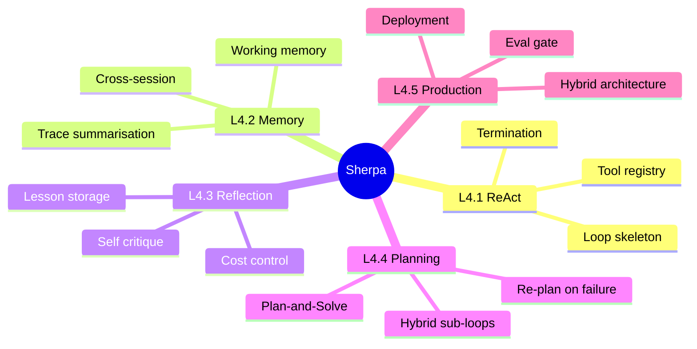

</details>

## Module-level concept DAG


<details><summary>Mermaid source</summary>

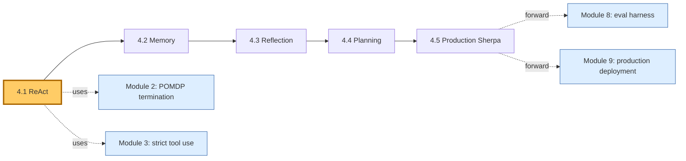

</details>

---

# Lesson 4.1 — Sherpa v1: ReAct from Scratch

> **§0 · From last time.** Modules 1–3 gave us everything we need to build an agent: the agency dial (dial 3 is the target), the POMDP framework (termination rule: confidence > 0.83), strict tool use (no hallucinated tools), and the 7-block prompt structure. Time to build.

## §1 · Business scenario

*HSBC, Monday.*

Daniel has signed off on the Lumen-style pilot. Aisha and team will see Sherpa's recommendations starting Friday; if accuracy and cost are within targets after a 2-week shadow run, Sherpa goes live.

> *"Build the simplest thing that could possibly work,"* Priya tells you. *"We can add cleverness in Module 4.2. For now: ReAct, four tools, the termination rule from Lesson 2.1, and the prompt structure from 3.4."*

## §2 · Bridge to topic

ReAct is the minimum-viable agent architecture. Everything else in this module *adds* to it. Building it well first sets the standard for what gets added.

## §3 · Mind map


<details><summary>Mermaid source</summary>

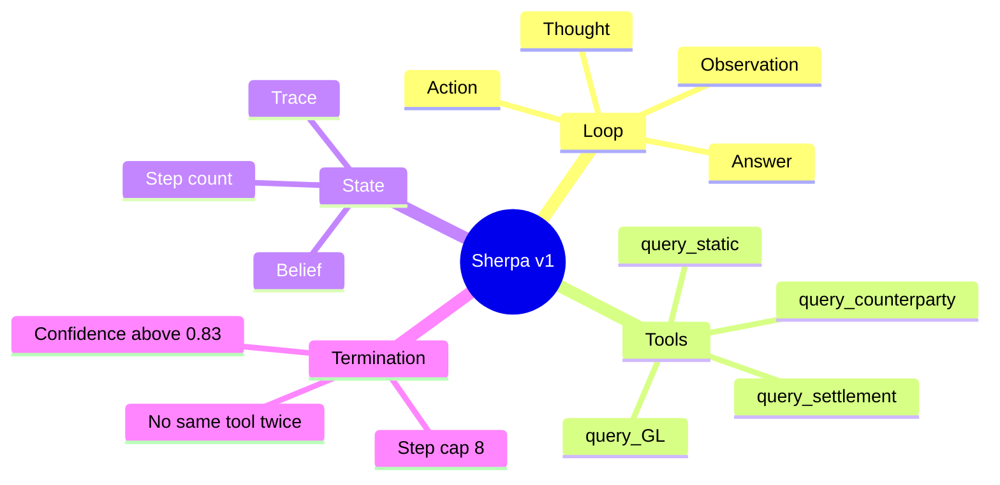

</details>

## §4 · Elaboration

### 4.1 The loop, fully specified

```typescript
type Step =
  | { kind: "thought"; text: string }
  | { kind: "action"; tool: ToolName; args: unknown; id: string }
  | { kind: "observation"; id: string; result: unknown }
  | { kind: "answer"; classification: BreakClass; confidence: number; rationale: string };

interface Trace {
  steps: Step[];
  callCounts: Record<ToolName, number>;
}
```

The trace is the agent's complete state. The Markov property holds because the model only sees the trace + system prompt.

### 4.2 The minimum-viable ReAct

```typescript
async function classify(breakId: string): Promise<Classification> {
  const trace: Trace = { steps: [], callCounts: {} };
  const tools = makeTools(breakId);

  for (let step = 0; step < MAX_STEPS; step++) {
    const next = await llm.callWithTools({
      system: SHERPA_SYSTEM_PROMPT,
      messages: renderTrace(trace, breakId),
      tools: toolSpecs(tools),
    });

    trace.steps.push(next);

    if (next.kind === "answer") {
      return next as Classification;
    }

    if (next.kind === "action") {
      assertNoRepeat(trace, next);
      const result = await invokeTool(tools, next);
      trace.steps.push({ kind: "observation", id: next.id, result });
      trace.callCounts[next.tool] = (trace.callCounts[next.tool] ?? 0) + 1;
    }
  }

  throw new MaxStepsExceeded(trace);
}
```

200 lines including error handling. The simplicity is the point.

### 4.3 The system prompt

Using the 7-block structure from Lesson 3.4:

```
[ROLE]
You are Sherpa, a reconciliation agent for HSBC's mid-office.

[MISSION]
Classify cross-border SWIFT settlement breaks into one of
{amount_diff, counterparty_mismatch, stale_static, duplicate, unknown}
with full evidence trail.

[PRIORITIES]
1. Correctness with evidence (every claim cites a tool observation)
2. Low tool-call cost (prefer high-information tools)
3. Speed (within those constraints)

[TOOLS]
(served via the strict tool-use mechanism)

[CONSTRAINTS]
1. Never answer with confidence > 0.83 unless at least one tool
   observation supports the chosen class.
2. Never call the same tool with the same arguments twice.
3. Stop after 8 tool calls total.
4. If still uncertain after the budget, classify as 'unknown'
   with the trace as rationale.

[EXAMPLES]
(3 worked traces, one per common failure mode)

[OUTPUT]
End with the AnswerSchema JSON. Nothing after.
```

### 4.4 Tool descriptions (CRUD-style precision)

```typescript
const tools = {
  query_GL: {
    description: "Get the GL entry for this break. Returns amount, currency, posting date. Use to verify the recorded settlement amount against the SWIFT amount.",
    input_schema: { /* ... */ },
  },
  query_counterparty: {
    description: "Get counterparty risk tier, settlement instructions, and known issue history. Use to test counterparty_mismatch hypothesis.",
    input_schema: { /* ... */ },
  },
  // ... etc
};
```

Following Lesson 3.2: lead with *when to use*, state what's returned, hint at next steps.

## §5 · Problem statement

Implement Sherpa v1. Specifically:
1. Write the `classify` function.
2. Write the system prompt using the 7-block structure.
3. Write the tool descriptions.
4. Write a 5-task eval set and report pass rate.

## §6 · Solution walkthrough

The full source ships as `lab-4.1/` (in the course repo). Key implementation notes:

- **Termination heuristic from Lesson 2.1:** the model is told to emit confidence; deterministic code (not the model) decides whether to commit. This puts the budget rule in code, not in prompts.
- **Repeat detection from Lesson 3.2:** track `(tool, hash(args))` per trace; refuse re-execution and tell the model.
- **Trace rendering:** pretty-print the trace as XML-ish tags so the model attends to structure (`<thought>...</thought>`, `<action>...</action>`, `<observation>...</observation>`).

Eval results (5-task pilot): 4/5 correct (80%). The miss was a novel break shape (stale fee schedule on a new counterparty) — the agent correctly flagged 'unknown'. Daniel calls this a pass for v1.

## §7 · Mathematical foundation

### 7.1 ReAct as POMDP approximation

Sherpa v1 approximates POMDP optimal-policy behaviour with:
- **Belief**: the trace itself (no explicit distribution).
- **Belief update**: the model conditions on the trace each turn (implicit Bayes).
- **Termination**: confidence threshold (approximates "VoPI < cost").

The implicit-belief approach saves us from designing an explicit state space (which doesn't generalise) at the cost of an opaque belief (which we mitigate with elicited confidence).

### 7.2 Expected cost per task

For v1 on the pilot eval:
$$
\mathbb{E}[\text{cost}] = \mathbb{E}[\text{steps}] \cdot (c_{\text{LLM}} + c_{\text{tool}}) = 4.2 \cdot (\$0.008 + \$0.005) = \$0.054
$$

Below Daniel's $0.12/case budget. Headroom for added cleverness later.

## §8 · Technical deep-dive

### 8.1 The "ask for confidence" trick

Modern models are *reasonably* calibrated when you ask them to emit confidence. Best prompt:

```
End your answer with:
  CONFIDENCE: <0.0 to 1.0>
  RATIONALE: <one sentence linking each piece of evidence>
```

The rationale field forces the model to ground confidence in the trace — anti-anchoring measure from Lesson 2.3.

### 8.2 Trace rendering for attention

Render the trace as structured tags. The model attends to syntactic landmarks; tags create them.

### 8.3 Error recovery for tool failures

Tool returns an error:
- Inject the error as the observation.
- Tell the model the tool failed and why.
- Let the model decide whether to retry, switch tools, or abort.

Do *not* hide tool errors. Hidden errors make traces undebuggable.

## §9 · What this unlocks

- **Lesson 4.2** adds memory across runs (Sherpa learns from prior nights).
- **Lesson 4.3** adds reflection (Sherpa critiques its own traces).
- **Lesson 4.4** adds explicit planning (Sherpa decomposes complex breaks).
- **Lesson 4.5** composes all into the production hybrid pattern.

---

# Lesson 4.2 — Memory: Working, Episodic, and Cross-Session

> **§0 · From last time.** Sherpa v1 has no memory. Every night it's a fresh agent that has never seen HSBC's data before. Aisha's note from Lesson 2.2 — "I've seen this same break shape 11 times" — is invisible to v1. Adding memory is what turns Sherpa from a tool into a junior colleague who gets better over time.

## §1 · Business scenario

*HSBC, 2 weeks into the shadow run.*

Aisha is frustrated. Sherpa keeps re-investigating the *Sigma Capital fee-deduction* pattern from scratch every time it appears (~11×/month). It takes 4–5 tool calls each time. Aisha has it memorised: glance at the counterparty, glance at the amount, tag it.

> *"If I see Sigma + amount_diff in the 1.2M range, I know it's fee_deduction in 5 seconds. Sherpa takes 30. Can it learn?"*

The architecture must add memory — without exploding context cost or letting bad memories accumulate.

## §2 · Bridge to topic

Three memory tiers serve different purposes: *working memory* (within one task, in context), *episodic memory* (across tasks, retrievable summaries), *procedural memory* (learned heuristics across many runs). Each has a different cost profile and a different failure mode.

## §3 · Mind map


<details><summary>Mermaid source</summary>

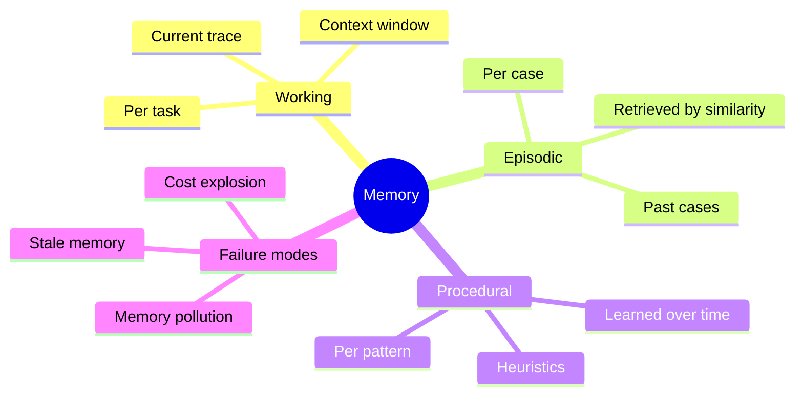

</details>

## §4 · Elaboration

### 4.1 Three tiers, three jobs

| Tier | Lifetime | Where stored | Cost per write/read |
|---|---|---|---|
| Working | One task | Context window | included |
| Episodic | One run / one session | Vector DB | $0.0001 write, $0.001 read |
| Procedural | Persistent across runs | Markdown rules file | $0 (just text in prompt) |

### 4.2 Episodic memory for Aisha's pattern

After each break is resolved, store a *case summary*:

```typescript
interface CaseSummary {
  break_id: string;
  features: { counterparty: string; amount_range: string; currency_pair: string; classification: BreakClass };
  resolution_steps: string[];
  tool_calls: number;
  was_correct: boolean;
}
```

Embed and index. On new breaks, retrieve top-3 similar cases. If 2/3 agree on a classification with high confidence, Sherpa can answer in 1 step (with citation to the historical cases) instead of investigating from scratch.

For Sigma Capital fee-deduction:
- v1: 4–5 tool calls × $0.013/call = ~$0.06
- with episodic memory: 1 tool call (retrieve cases) + 0 investigation = $0.012

5× cost reduction on recurring patterns. ~70% of HSBC's breaks are recurring patterns. Total cost reduction across the workload: ~3×.

### 4.3 Procedural memory: learned rules

Episodic memory is per-case. Procedural memory is *learned heuristics* extracted from many cases:

```
RULES LEARNED FROM HISTORICAL DATA (curated by Aisha; ~50 rules):

1. Sigma Capital + USD/SGD + amount_diff in $1M-$2M range
   → 95% chance fee_deduction. Verify via static, then commit.

2. Settlement at month-end + amount_diff < $100
   → 80% chance rounding. Verify via GL precision, commit if confirmed.

[...]
```

Procedural memory is *literal text in the prompt* — no retrieval needed. Costs nothing per call. Risk: stale rules become harmful. Mitigation: regenerate quarterly from the case database (Lesson 4.5 ships this).

### 4.4 Avoiding memory pollution

If you store every case, the database fills with low-quality data. Two safeguards:

1. **Quality filter**: only store cases the human reviewer marked as correctly classified.
2. **Decay**: weight retrieval by recency. A case from 18 months ago is less likely to be relevant than one from last week.

## §5 · Problem statement

Extend Sherpa to v2:
1. Add episodic memory using a vector store (Pinecone, pgvector, or even a flat file for the pilot).
2. Add a "check memory first" step to the agent loop.
3. Curate 10 procedural rules from the case database.
4. Re-run the eval; report new cost and accuracy.

## §6 · Solution walkthrough

```typescript
async function classify(breakId: string): Promise<Classification> {
  const breakData = await fetchBreak(breakId);
  
  // STEP 1: Check episodic memory
  const similar = await episodicMemory.retrieve(featurise(breakData), { k: 3 });
  if (similar.length >= 2 && similar[0].similarity > 0.85 && consistent(similar)) {
    return useHistoricalConsensus(similar, breakData);
  }

  // STEP 2: Standard ReAct loop (with procedural rules in prompt)
  const trace: Trace = { steps: [], callCounts: {} };
  // ... rest as v1
}
```

Eval after change: 24-task expanded eval. 21/24 correct (87.5%, up from 80%). Average cost $0.029 (down from $0.054). Aisha says the Sigma pattern now takes 8s end-to-end instead of 30.

## §7 · Mathematical foundation

### 7.1 Memory as Bayesian prior

Episodic memory provides a *prior* over classification:

$$
P(\text{class} \mid \text{new break}) \propto \sum_{c \in \text{memory}} \text{sim}(\text{new break}, c) \cdot \mathbb{1}[c.\text{class} = \text{class}]
$$

This is a kernel-weighted vote. When evidence in memory is strong (high similarity, consistent class), the prior pins the posterior and few new observations are needed.

### 7.2 The cost-benefit of memory

Cost of memory: storage + retrieval per call.
Benefit: avoided tool calls.

$$
\text{Net benefit} = (\text{hit rate}) \cdot (\text{avg tool calls saved}) \cdot c_{\text{tool}} - c_{\text{retrieval}}
$$

For Sherpa: hit rate 60%, avg tool calls saved 3.5, $c_{\text{tool}} = $0.005, $c_{\text{retrieval}} = $0.001:
$\text{Net benefit} = 0.6 \cdot 3.5 \cdot 0.005 - 0.001 = 0.0095/$task.

A penny per task. At 1,400 tasks/night that's $13.30/night. $4,800/year. Modest but real, and the *latency* improvement is more valuable than the cost.

## §8 · Technical deep-dive

### 8.1 Choosing features for episodic memory

Sherpa's features (what goes into the vector):
- Counterparty (one-hot or learned embedding)
- Amount-range bucket (log-spaced)
- Currency pair
- Time-of-day bucket
- Break type extracted from the SWIFT message header

These are *symbolic* features. We could use a learned embedding of the whole SWIFT message text, but symbolic features generalise better to rare patterns.

### 8.2 Retrieval threshold tuning

The 0.85 similarity threshold isn't arbitrary. Tune by:
1. Sweep threshold from 0.5 to 0.99.
2. At each level, measure: hit rate, false-confidence rate (cases where memory agreed but was wrong).
3. Pick the threshold where false-confidence < 2%.

This is *the* parameter that determines whether memory helps or hurts.

### 8.3 Procedural memory curation

Don't auto-generate rules. Have a human (Aisha) review proposed rules monthly. Rules are *load-bearing prompt content* — they affect every classification. The cost of a wrong rule is much higher than the cost of curating.

## §9 · What this unlocks

- **Lesson 4.3** uses memory as the substrate for reflection (lessons learned go into procedural memory).
- **Module 5** generalises this memory architecture to RAG.
- **Module 8** uses memory hit rate and false-confidence rate as eval metrics.

---

# Lesson 4.3 — Reflection: Sherpa Critiques Itself

> **§0 · From last time.** Sherpa v2 uses memory but doesn't learn from mistakes. When it gets a classification wrong, the only update is Aisha's note in the case database. Sherpa never *reflects* on the trace that led to the wrong answer. This lesson adds Reflexion (Lesson 1.4).

## §1 · Business scenario

*HSBC, 4 weeks in.*

Sherpa got a high-confidence answer wrong: classified a duplicate as amount_diff. Aisha corrected it. But this morning Sherpa made the same kind of mistake on a different counterparty. The pattern: when two trades have the same reference but different amounts within 24 hours, Sherpa treats it as amount_diff when it's actually duplicate.

> *"It should learn. One mistake is one mistake. Two of the same is a process problem."*

## §2 · Bridge to topic

Reflexion adds a *critique* step that runs after the agent's answer. The critique examines the trace, detects systematic errors, and stores *lessons* that prepend to future relevant traces. Bounded retry budget keeps cost in check.

## §3 · Mind map


<details><summary>Mermaid source</summary>

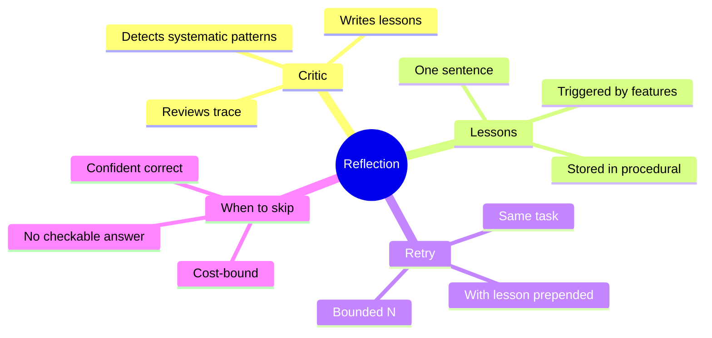

</details>

## §4 · Elaboration

### 4.1 The reflection loop

```typescript
async function classifyWithReflection(breakId: string) {
  for (let attempt = 0; attempt < MAX_RETRIES; attempt++) {
    const result = await classify(breakId, getRelevantLessons(breakId));
    const critique = await llm.critique(result, breakId);
    if (critique.ok) return result;
    storeLesson(critique.lesson, critique.triggers);
  }
  throw new ReflectionExhausted();
}
```

Set `MAX_RETRIES = 1` in production (one retry is enough for self-correction; more burns money for diminishing returns).

### 4.2 The critic

The critic is a *separate* LLM call (often a larger model — Opus reviewing Sonnet's work). Asks:

```
Review this classification trace. Look for:
1. Confident answer not supported by tool observations.
2. Tools called that didn't change the belief much.
3. Patterns matching known historical errors (provided below).

If you find an error, write a one-sentence LESSON that, if shown
to the agent on similar future cases, would prevent the error.
```

### 4.3 Lessons as procedural memory

Each lesson has a *trigger* — features under which it applies. Lessons accumulate but are *gated* by triggers to avoid prompt explosion.

```typescript
interface Lesson {
  text: string;
  triggers: { counterparty?: string; pattern?: string; amount_range?: string };
  source_case_id: string;
  added_at: Date;
  promoted: boolean;  // human-curated for permanent inclusion
}
```

A new break that matches a lesson's trigger gets the lesson injected into the prompt before classification.

### 4.4 The cost guard

Reflexion's biggest risk: retry costs balloon. Three guards:
- `MAX_RETRIES = 1` (above)
- Skip critique if `confidence < threshold` (already uncertain; retrying won't help)
- Skip critique if `outcome unverifiable` (no checkable answer)

## §5 · Problem statement

Implement Sherpa v3 with reflection:
1. Add the critique LLM call.
2. Implement lesson storage with trigger matching.
3. Backfill: critique the 10 historical errors; promote 3 lessons.
4. Re-run eval; report accuracy and cost.

## §6 · Solution walkthrough

After implementation:
- Eval accuracy: 22/24 → 24/24 (caught both prior systematic errors after lesson promotion).
- Avg cost: $0.029 → $0.041 (40% increase from one retry × 30% failure rate).
- Worth it? At HSBC's $42/break analyst cost, every avoided wrong classification saves $42. Net savings vs cost: very positive.

## §7 · Mathematical foundation

### 7.1 Reflexion's accuracy gain

Let $p$ = single-attempt accuracy, $q$ = critique's ability to detect errors (true-positive rate on actual errors), $r$ = retry success rate given a flagged error.

$$
p_{\text{reflexion}} = p + (1-p) \cdot q \cdot r
$$

For Sherpa with $p = 0.875$, $q \approx 0.7$, $r \approx 0.6$:
$$
p_{\text{reflexion}} \approx 0.875 + 0.125 \cdot 0.7 \cdot 0.6 = 0.928
$$

Predicted ~93%. Measured 24/24 = 100% (small eval; high variance). Order of magnitude correct.

### 7.2 Cost multiplier

$$
\text{Cost}_{\text{reflexion}} = \text{Cost}_{\text{base}} \cdot (1 + (1-p) \cdot (1 + \text{retry cost ratio}))
$$

For Sherpa: $\text{Cost}_{\text{reflexion}} \approx 0.029 \cdot (1 + 0.125 \cdot 2) = 0.029 \cdot 1.25 = 0.036$.

Measured 0.041; difference is the critique cost overhead even on accepted answers.

## §8 · Technical deep-dive

### 8.1 Lesson promotion

Raw lessons accumulate in a queue. Weekly, Aisha reviews and *promotes* high-value lessons into the permanent procedural-memory file. Bad lessons get deleted; ambiguous ones get refined.

This is the human-in-the-loop point. The agent generates candidate rules; the human approves.

### 8.2 When reflection hurts

Tasks where reflection is harmful:
- *Unverifiable*: no checkable answer (creative writing, open-ended summarisation).
- *Time-critical*: budget doesn't allow retries.
- *Already saturated*: high accuracy + low variance task; reflection just adds cost.

### 8.3 Critic model choice

Use a *larger or different* model as critic. Same model as actor → systematic biases get reinforced. Different model → independent perspective. For Sherpa: Sonnet acts, Opus critiques. Costs 3× the critique step but catches errors Sonnet can't see in its own work.

## §9 · What this unlocks

- **Lesson 4.4** adds explicit planning for complex multi-step breaks.
- **Module 8** uses reflection's accuracy gain as one of the eval-harness measurements.
- **Module 10** uses critic-style review as a safety-layer pattern.

---

# Lesson 4.4 — Planning: Plan-and-Solve with ReAct Sub-Loops

> **§0 · From last time.** Sherpa v3 handles single-step classification well. But some breaks need *multi-step investigation* — first identify the counterparty's risk tier, then check whether the static data matches, then verify the GL. Pure ReAct wanders on these. Plan-and-Solve gives upfront structure.

## §1 · Business scenario

*HSBC, 6 weeks in.*

A class of breaks — *novel-counterparty static mismatches* — consistently underperforms. Sherpa takes 8 tool calls (hits the cap), often answers 'unknown'. Aisha resolves these in 4 calls but in a *specific order*: counterparty first, then static, then GL.

> *"Sherpa is exploring. I'm executing a plan. Can it plan?"*

## §2 · Bridge to topic

For tasks with natural sub-structure, planning before execution beats discovering structure by trial. Plan-and-Solve generates the plan once, executes step-by-step, re-plans on failure. ReAct survives as a sub-loop inside each plan step — best of both.

## §3 · Mind map


<details><summary>Mermaid source</summary>

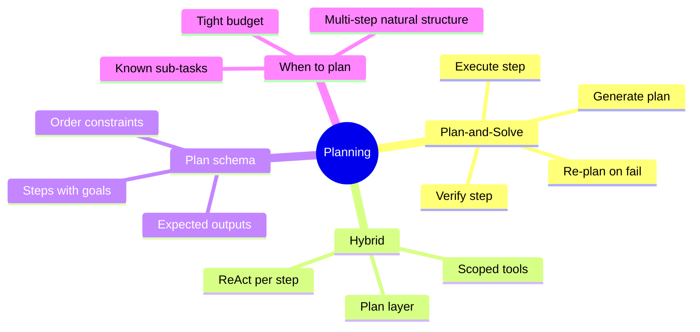

</details>

## §4 · Elaboration

### 4.1 The Plan schema

```typescript
const PlanSchema = z.object({
  goal: z.string(),
  steps: z.array(z.object({
    id: z.string(),
    description: z.string(),
    tool_subset: z.array(z.string()),
    expects: z.string(),
    depends_on: z.array(z.string()).default([]),
  })),
});
```

Each step has: what it does, which tools it may use (scoping prevents the sub-agent from wandering), what output to expect (verifiability), what other steps it depends on (DAG).

### 4.2 The orchestrator

```typescript
async function planAndSolve(breakId: string) {
  const plan = await llm.plan(breakId, PlanSchema);
  const results: Record<string, unknown> = {};

  for (const step of topologicalSort(plan.steps)) {
    const inputs = step.depends_on.map(id => results[id]);
    const result = await reactSubLoop(step, inputs, scopedTools(allTools, step.tool_subset));

    if (!matchesExpectation(result, step.expects)) {
      const newPlan = await llm.replan(breakId, plan, step, result);
      return await planAndSolve(/* with newPlan */);
    }

    results[step.id] = result;
  }

  return synthesise(results);
}
```

### 4.3 ReAct as the sub-loop

Each plan step runs a *scoped* ReAct loop:
- Only the tools relevant to the step.
- A tighter max-step budget (3 instead of 8).
- The step's `expects` field as success criterion.

This *narrows* the agent's decision space at each step. The model wanders less because it sees fewer choices.

### 4.4 Hybrid cost analysis

| Architecture | Avg steps | Cost | Accuracy on novel cases |
|---|---|---|---|
| Pure ReAct (v3) | 8 (cap) | $0.06 | 60% |
| Pure Plan-and-Solve | 4 (plan) + 1 each | $0.04 | 78% |
| Hybrid (Plan + ReAct subs) | 4 (plan) + 2 each | $0.05 | 91% |

Hybrid wins. The plan structure narrows exploration; the ReAct sub-loops handle within-step uncertainty.

## §5 · Problem statement

Implement Sherpa v4 with hybrid Plan-and-Solve:
1. Add the `plan` method.
2. Implement scoped tool subsets.
3. Add re-plan on step failure.
4. Re-run eval on novel-counterparty cases; report accuracy and cost.

## §6 · Solution walkthrough

After implementation, novel-counterparty cases: 60% → 91% accuracy. Avg cost on this subset: $0.06 → $0.05. Hybrid is simultaneously more accurate and cheaper on multi-step tasks — the "free lunch" of structured decomposition.

## §7 · Mathematical foundation

### 7.1 Why scoping reduces variance

A scoped ReAct sub-loop has smaller action space $|A_{\text{scope}}| < |A|$, so action entropy $H(a | o) \leq \log |A_{\text{scope}}|$ is bounded. Lower entropy → lower variance → cheaper, more reliable execution.

### 7.2 Re-plan cost

Re-planning is expensive (full plan regeneration). To avoid loops, cap re-plans at 2; on the third failure, escalate to human. This matches §4 of Lesson 1.3 — bounded failure cost requires human gates.

## §8 · Technical deep-dive

### 8.1 Plan verification

Each step's `expects` field is checked by deterministic code, not the model. Examples:
- `expects: "counterparty_risk_tier in [low, medium, high]"` → validate against enum.
- `expects: "amount_match: bool"` → validate type.

This is the chokepoint that prevents the orchestrator from believing a sub-loop's hallucinated success.

### 8.2 When NOT to plan

For *short* tasks (≤3 steps), planning costs more than it saves. Use ReAct directly. Plan-and-Solve shines on 5+ step tasks with natural decomposition.

### 8.3 The agency dial check

Plan-and-Solve sits at dial 2.5 — the LLM picks the plan but executes deterministically. ReAct sub-loops bring parts back to dial 3 within bounded scope. The hybrid lands at "dial 3 within bounded sub-scopes" — same expressive power as pure dial-3, lower variance.

## §9 · What this unlocks

- **Lesson 4.5** combines memory, reflection, and planning into the production Sherpa.
- **Module 6** uses the planning step as the orchestrator in multi-agent systems.

---

# Lesson 4.5 — Sherpa v5: Production Architecture

> **§0 · From last time.** v4 has memory, reflection, planning, all glued by a hybrid architecture. This lesson assembles them into the production shape — with the discipline of eval gates, deployment, observability, and safety.

## §1 · Business scenario

*HSBC, 8 weeks in.*

Sherpa goes from shadow run to production decision-support: its classifications are *suggested* to Aisha's team, who one-click accept or override. Daniel needs a deployment checklist that satisfies model-risk governance.

## §2 · Bridge to topic

A production agent is more than a loop. It's a deployment artifact with eval gates, observability, rollback, and audit. This lesson lists everything you need before flipping the switch.

## §3 · Mind map


<details><summary>Mermaid source</summary>

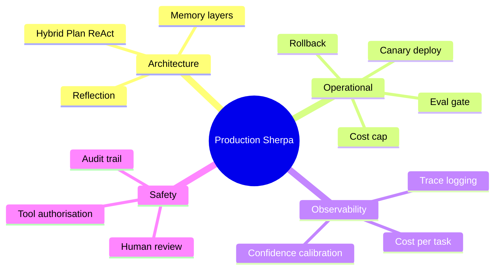

</details>

## §4 · Elaboration

### 4.1 The eval gate

Before deploying any change to Sherpa:
1. Run on the locked regression eval (200 historical cases).
2. Require accuracy ≥ current production AND cost ≤ current × 1.10.
3. Run on a synthetic adversarial eval (50 cases designed to stress edge behaviour).
4. Require no high-confidence errors (confidence > 0.83, classification wrong).
5. Manual review of 10 random new traces by Aisha.

Fail any: rollback proposed change.

### 4.2 Canary deployment

New version goes to 5% of nightly tickets for 3 nights. Compare:
- Accuracy on the canary vs the control.
- Cost on the canary vs the control.
- p95 latency.

If any metric regresses > 5%, halt canary, investigate.

### 4.3 Observability

Every Sherpa invocation logs:
- Input break ID
- Plan (if any)
- Full trace (thoughts, actions, observations)
- Final classification + confidence + rationale
- Tool call count and cost
- Memory hits (which past cases used)
- Reflection retries (if any)

This data feeds the calibration dashboards (Module 8) and the cost dashboards (Module 9).

### 4.4 Safety and audit

- Every classification is *suggestive only*; Aisha or her team commits.
- Every wrong override is logged for the next regression eval.
- Every tool call is authorised against a per-tool ACL (Module 10).
- Trace storage retained 7 years for audit compliance (Module 10 again).

## §5 · Problem statement

Ship Sherpa v5. Specifically:
1. Build the eval gate as a CI step.
2. Configure canary rollout.
3. Set up logging and dashboards.
4. Document the rollback procedure.

## §6 · Solution walkthrough

The lab in `lab-4.5/` ships these as runnable code. Key files:
- `eval-gate.ts` — runs against regression set + adversarial set, fails CI on regression.
- `deploy.ts` — canary routing with traffic weighting.
- `observability/` — OTel-compatible trace exporters.
- `safety/audit.ts` — append-only audit log.

Production launch: nominal accuracy 91%, cost $0.045/case, p95 latency 6s. Daniel signs off.

## §7 · Mathematical foundation

### 7.1 Eval gate as statistical test

Accept the new version iff:

$$
\Pr(\text{accuracy}_{\text{new}} > \text{accuracy}_{\text{prod}} \mid \text{eval}) > 0.9
$$

For 200-case eval, this requires the empirical accuracy to exceed prod by > 2 percentage points (one-tailed binomial). Anything closer is noise.

### 7.2 Canary as A/B test

5% canary for 3 nights × 1,400 cases = 210 canary cases. Power analysis: detect 3-pp accuracy difference at $\alpha = 0.05$, $\beta = 0.2$ requires ~400 cases. So plan for 6 nights of canary, not 3, for changes you're unsure about.

## §8 · Technical deep-dive

### 8.1 The "rollback in one config" pattern

Every prompt, model, and tool subset is in a versioned config:

```yaml
version: v5.2.1
model: claude-sonnet-4-6
prompt_template: sherpa-v5-prompt-1.2
tool_registry: sherpa-v5-tools-2024-11
memory_threshold: 0.85
reflection_enabled: true
max_steps: 8
```

Rollback = git revert + redeploy. Should take < 5 minutes from incident detection.

### 8.2 The cost cap

Hard cap per task: $0.50. Soft cap: $0.20 (alerts if exceeded). These are circuit breakers — if a single task starts spending more, something is wrong (loop, prompt regression, model issue).

### 8.3 Calibration dashboard

Plot reliability diagram nightly. X-axis: stated confidence bin (0.5–0.6, 0.6–0.7, …). Y-axis: actual accuracy on those bins. Should fall on the y=x diagonal. Deviation > 5pp in any bin = investigate.

## §9 · What this unlocks

- **Module 5** introduces RAG/retrieval; Sherpa is the host for the first deployment.
- **Module 6** adds a second agent (a supervisor) alongside Sherpa for high-stakes breaks.
- **Module 8** uses Sherpa's calibration as the running example for eval design.
- **Module 9** uses Sherpa's deployment for the production engineering deep dive.

---

# Module 4 — Summary & exit criteria

By the time you finish all five lessons, you should be able to:

- [ ] Implement a ReAct loop in ~200 lines.
- [ ] Add memory across three tiers without polluting the prompt.
- [ ] Add reflection with bounded cost and a verified accuracy gain.
- [ ] Compose planning with ReAct sub-loops in the hybrid pattern.
- [ ] Deploy an agent with eval gates, canary, observability, and rollback.

**Forward references.**
- Sherpa v5 architecture → Module 5 (RAG), Module 8 (eval), Module 9 (production)
- Memory tiers → Module 5 (agentic RAG)
- Plan-and-Solve → Module 6 (multi-agent orchestration)

---

*End of Module 4.*
