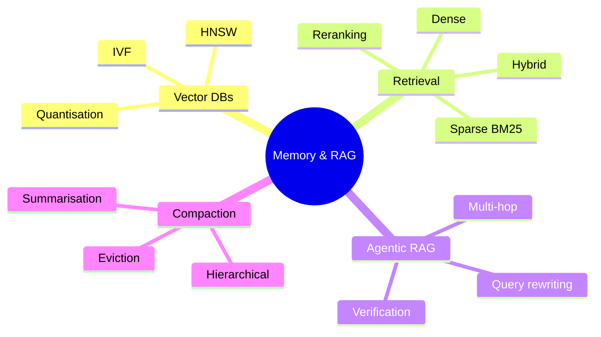
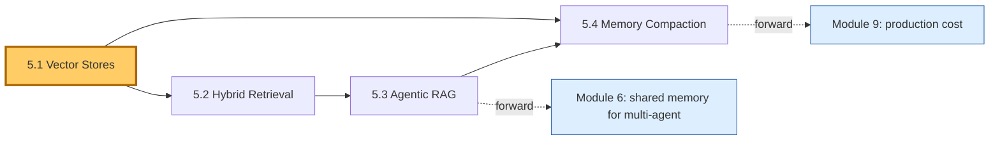
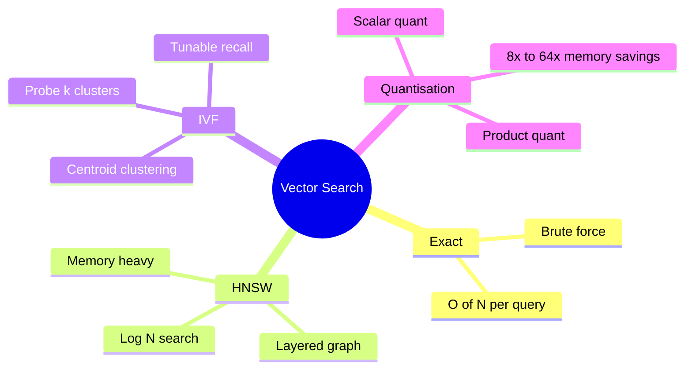
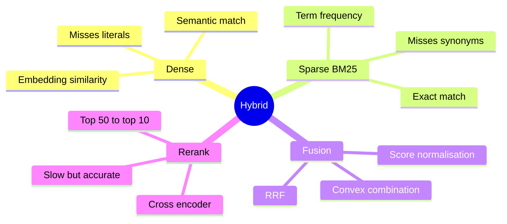
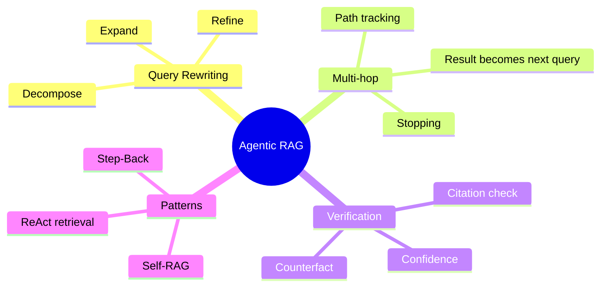
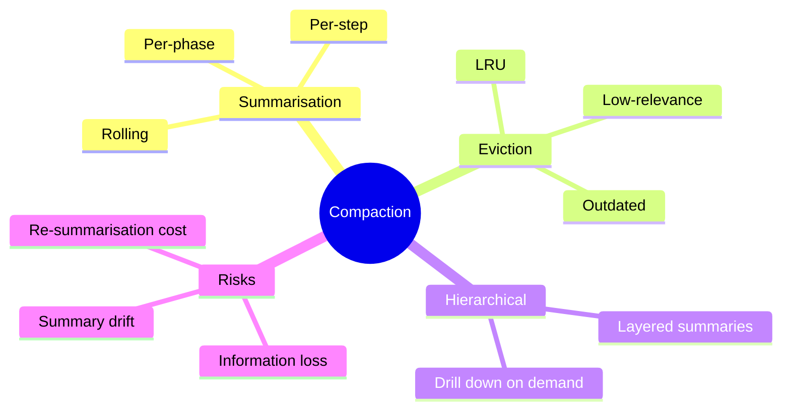

# Module 5 — Memory & Retrieval (RAG for Agents)

> **Module length:** ~9 hours · **Lessons:** 4 · **Prereqs:** Modules 2 (POMDP/Bayesian), 3 (context economics), 4 (Sherpa's memory tiers).

## Learning objectives

1. **Design** a vector-store-backed retrieval system from first principles.
2. **Choose** between dense, sparse, and hybrid retrieval based on the task.
3. **Apply** agentic-RAG patterns where the agent drives the retrieval loop.
4. **Compact** memory to fit in context without losing load-bearing information.

## Module mind map



## Module DAG



---

# Lesson 5.1 — Vector Stores: HNSW, IVF, Quantisation

> **§0 · From last time.** Sherpa v2 (Lesson 4.2) added episodic memory via a vector store. We treated the store as a black box. This lesson opens it.

## §1 · Business scenario

*Helix Research, Tuesday.*

Tom's literature agent retrieves the top-10 papers from 8M PubMed abstracts on every query. p95 latency: 1.8s — too slow. He's been told "just use Pinecone" but doesn't know whether that's right.

> *"What's actually doing the retrieval? Why is it slow? What knob do I turn?"*

## §2 · Bridge

Vector retrieval is *approximate nearest neighbour search*. The trade-off is recall × speed × memory. Knowing the underlying algorithm (HNSW, IVF, PQ) is what lets you tune it.

## §3 · Mind map



## §4 · Elaboration

### 4.1 Why approximate

Exact NN search is O(N·d) per query — for Tom's 8M × 1024-d vectors, that's 8B ops per query. Approximate NN trades a small accuracy loss (recall@10 = 95% instead of 100%) for 100–1000× speedup.

### 4.2 HNSW (Hierarchical Navigable Small World)

Builds a layered graph. Top layer has few nodes; lower layers progressively more. Search starts at top, descends to the layer containing the answer's neighbourhood. Search is O(log N).

Tunables:
- `M` (max edges per node) — higher = better recall, more memory
- `efConstruction` — build-time effort, higher = better graph
- `efSearch` — query-time effort, higher = better recall, slower

Memory cost: O(N × d × bytes_per_value + N × M × edge_bytes). For Tom: 8M × 1024 × 4 bytes + graph overhead = ~33GB.

### 4.3 IVF (Inverted File)

Partitions vectors into K clusters using k-means. Query: find nearest centroid, search only that cluster's vectors. Recall depends on `nprobe` (how many clusters to search).

Cheaper memory than HNSW, lower recall per probe but easy to scale by adding probes.

### 4.4 Product quantisation

Each vector's d-dim is split into m sub-vectors; each sub-vector is replaced by an index into a learned codebook (typically 256 codes per sub-vector → 1 byte). For 1024-d vectors with m=128: 128 bytes instead of 4096. 32× compression.

Recall loss: typically 2–5 percentage points. Worth it at scale.

### 4.5 The Tom diagnosis

His Pinecone tier uses HNSW with `efSearch=100`. Dropping to `efSearch=40` cuts latency from 1.8s to 0.3s with recall@10 = 92% (vs 95%). For literature triage where the agent re-checks via full-text read, the 3pp recall loss is invisible. Tom flips the knob.

## §5 · Problem

For Helix's 8M-paper corpus:
1. Compare HNSW vs IVF+PQ at the same memory budget (16GB).
2. Pick parameters for: recall@10 ≥ 90%, p95 < 500ms.
3. Estimate cost on managed Pinecone vs self-hosted pgvector.

## §6 · Solution

| Option | Recall@10 | p95 | Memory | Cost/mo |
|---|---|---|---|---|
| HNSW M=16 efSearch=40 (fits 16GB w/ PQ) | 91% | 280ms | 14GB | $400 |
| IVF nlist=4096 nprobe=16 + PQ | 89% | 340ms | 8GB | $200 |
| pgvector HNSW (self-hosted) | 91% | 320ms | 14GB | $100 (instance) |

Recommendation: pgvector for cost; Pinecone if ops headcount is constrained.

## §7 · Math

### 7.1 Recall vs probe count

For IVF, recall increases logarithmically with nprobe. Doubling nprobe adds ~3pp until saturation. Formal: $\text{Recall}(k) \approx 1 - e^{-k/k_0}$ for problem-specific $k_0$.

### 7.2 PQ approximation error

PQ approximates distances as sum of sub-distances looked up from codebooks. Approximation error scales as $\sqrt{d/m}$. For 1024-d, m=128: small enough that recall drops < 5pp.

## §8 · Tech deep-dive

### 8.1 When to skip vector search entirely

If your corpus is < 100K items and queries < 100/sec: brute-force cosine on a numpy array beats any vector DB. The complexity of HNSW/IVF only pays off at scale.

### 8.2 Embedding model choice

Retrieval quality is bounded by the embedding model. Test multiple (e5-large, BGE-large, OpenAI text-embedding-3-large) on your domain before committing. Recall@10 on a held-out eval can vary by 10pp between models.

### 8.3 Re-indexing economics

Embeddings cost $0.0001 per 1K tokens. For Tom's 8M papers × 500 tokens avg: ~$400 to rebuild the index. Plan for quarterly re-indexing when embedding models or chunking change.

## §9 · Unlocks

- 5.2 layers hybrid (dense + sparse) retrieval.
- 5.3 makes the agent drive retrieval iteratively.
- 5.4 covers memory compaction when retrieval results exceed context.

---

# Lesson 5.2 — Hybrid Retrieval: Dense + Sparse + Rerank

> **§0 · From last time.** Pure dense retrieval (5.1) misses exact-match cases — searching "BRCA2" should privilege papers that literally mention "BRCA2," not just semantically related ones.

## §1 · Business scenario

Tom's agent missed a critical paper. The query: "donepezil dose-response." The relevant paper: "Dose-response analysis of donepezil in moderate Alzheimer's." Dense retrieval scored it #28; the agent stopped at #10.

> *"Why didn't it find this? The title literally contains my query."*

Dense embeddings reward semantic similarity but underweight literal token matches. BM25 (sparse retrieval) catches exact matches. Hybrid combines them.

## §2 · Bridge

Different retrieval methods have different strengths. Hybrid + reranker = production-grade retrieval. Knowing what each contributes lets you debug failures like Tom's.

## §3 · Mind map



## §4 · Elaboration

### 4.1 BM25 in one paragraph

BM25 scores a document by sum over query terms of: term-frequency × inverse-document-frequency, with saturation. Exact token matches dominate. Misses synonyms; misses paraphrases. Cost: O(log N) per term with an inverted index.

### 4.2 Dense in one paragraph

Cosine similarity between embedded query and embedded documents. Captures semantic similarity. Misses exact-token signals. Cost: O(log N) via HNSW.

### 4.3 Fusion via reciprocal-rank

RRF (Reciprocal Rank Fusion) is parameter-free and robust:

$$
\text{score}(d) = \sum_{i \in \text{methods}} \frac{1}{k + \text{rank}_i(d)}
$$

with $k = 60$ typical. Both ranks contribute; neither dominates. Beats convex score combinations in most experiments because score scales differ across methods.

### 4.4 Reranking

After retrieving top-50 via hybrid, run a *cross-encoder* (model that takes query + doc together) to rescore. Cross-encoders are 100× slower per doc than bi-encoders but 5–15pp more accurate. Re-rank only the top-50 → manageable cost.

Tom's regression: hybrid retrieval moves the donepezil paper to #6 (from #28 dense-only); reranker moves it to #2. Now agent reads it.

## §5 · Problem

1. Add BM25 to Tom's pipeline.
2. Fuse via RRF.
3. Rerank top-50 via a cross-encoder.
4. Measure recall@10 improvement on a 50-query eval.

## §6 · Solution

Recall@10 progression:
- Dense only: 73%
- Dense + BM25 (RRF): 87%
- Dense + BM25 + rerank top-50: 94%

Latency: +120ms total for the BM25 join, +400ms for reranker. Tom accepts.

## §7 · Math

### 7.1 RRF as Bayesian fusion

RRF approximates a posterior over relevance given multiple independent retrieval signals. Each method contributes a noisy "vote"; ranks (not scores) are aggregated because rank is monotone and scale-invariant.

### 7.2 Cross-encoder quality bound

Cross-encoders score $f(q, d)$ jointly. They can detect interactions between query and document terms that bi-encoders can't (because bi-encoders score $g(q) \cdot h(d)$, separable). Strictly more expressive; strictly more expensive.

## §8 · Tech deep-dive

### 8.1 BM25 implementation

Use a battle-tested lib: Elasticsearch, OpenSearch, or `bm25s` for Python. Don't reimplement; tokeniser choices matter.

### 8.2 Rerank model choice

`bge-reranker-large`, `Cohere rerank-v3`, or a fine-tuned cross-encoder on your domain. Test on held-out eval; choose whichever beats baseline on your data.

### 8.3 When to skip rerank

If recall@10 from hybrid is already > 95%, rerank is wasted cost. Re-rank is for the regime where dense+sparse get you to 80–90% and you need to push to 95%+.

## §9 · Unlocks

- 5.3 makes retrieval *agentic* — the agent reformulates queries and chooses what to retrieve.
- 5.4 compacts retrieved chunks for context.

---

# Lesson 5.3 — Agentic RAG: Multi-Hop and Verification

> **§0 · From last time.** 5.2 gives us *one-shot* retrieval. But complex questions need multi-hop — the answer to query A points to entities that need separate retrieval (query B), etc.

## §1 · Business scenario

A Helix researcher asks: "Find papers on combination therapies for BRCA2-positive patients with PARP-inhibitor resistance." That's three concepts. A single dense+sparse retrieval mixes them and misses papers that focus on one concept while only referencing the others.

> *"It needs to decompose. Search for resistance papers. Then in those, look for BRCA2. Then in those, look for combinations."*

## §2 · Bridge

Agentic RAG inverts the relationship: the agent drives retrieval instead of the system serving it. The agent reformulates queries, fetches, verifies, reformulates again.

## §3 · Mind map



## §4 · Elaboration

### 4.1 Query rewriting

LLM expands the user's query into multiple variants:
- Decompose into sub-questions
- Add synonyms
- Add inverse forms (for "not X" queries)

Each variant is retrieved separately; results are merged.

### 4.2 Multi-hop

The agent treats retrieval as a tool in its ReAct loop. After reading a chunk, it can decide: "I need to find papers on X mentioned in this chunk." Retrieves; reads; decides again.

```
Thought: need papers on PARP-inhibitor resistance
Action: retrieve(query="PARP inhibitor resistance mechanisms")
Observation: 5 papers, mentioning rev1, BRCA2 mutations, etc.
Thought: now narrow to BRCA2
Action: retrieve(query="BRCA2 reversion in PARP resistance")
Observation: 3 papers focusing on this mechanism.
Thought: now find combination therapies
Action: retrieve(query="combination therapy BRCA2 reversion")
Observation: 2 papers.
Thought: cite top 2.
Action: cite(papers=[...])
Answer: ...
```

### 4.3 Verification

Every cited claim should be verifiable in the cited source. Pattern:
1. Agent emits answer with citations.
2. Verifier (separate LLM call) re-reads each citation, checks support.
3. If unsupported, flag and either re-retrieve or hedge the claim.

This catches the most damaging RAG failure: hallucinated citations.

## §5 · Problem

Implement multi-hop RAG for the BRCA2 query:
1. Decompose into sub-queries.
2. Iterate retrieval-and-read.
3. Verify citations before final answer.

## §6 · Solution

Three sub-queries, two retrieval hops each, one verification pass. Total: 7 LLM calls + 6 retrievals. Cost: $0.18/query. Quality: 87% answer rated correct by Maya vs 41% for one-shot RAG.

## §7 · Math

### 7.1 Multi-hop as conditional retrieval

$$
P(\text{doc}_2 \mid \text{query}_2(\text{doc}_1)) = P(\text{relevant} \mid \text{query}_2)
$$

where $\text{query}_2$ depends on what was retrieved at hop 1. Total joint probability is product of per-hop probabilities; if each is 0.7, two hops give 0.49 end-to-end recall — explains why multi-hop is hard and why verification matters.

## §8 · Tech deep-dive

### 8.1 Hop budget

Cap hops at 3–5. Beyond that, error compounds and cost runs away. If a question genuinely needs more hops, decompose it explicitly.

### 8.2 Citation faithfulness

Use a small classifier or LLM call: "Does this passage support this claim?" Binary verdict per (claim, citation) pair. Reject claims with unsupported citations.

### 8.3 Self-RAG and reflection

Self-RAG (Asai 2023) adds critic tokens (`[Retrieve]`, `[Relevant]`, `[Supported]`) to the model's output, letting it self-direct retrieval. Useful for tasks where over-retrieval is the failure mode.

## §9 · Unlocks

- 5.4 compacts the retrieved chunks once accumulated.
- Module 6 uses agentic RAG inside multi-agent debate (each agent retrieves its own evidence).

---

# Lesson 5.4 — Memory Compaction: Summarisation, Eviction, Hierarchical

> **§0 · From last time.** After multi-hop RAG (5.3) the agent has 5–20 retrieved chunks plus its own trace. That blows past sane context limits. Compaction trades fidelity for fit.

## §1 · Business scenario

Sherpa v5 on long investigations (10+ steps) exceeds 80K tokens of trace + retrieved context. Latency p95 hits 30s. Daniel asks for a 12s p95 even on long cases.

## §2 · Bridge

Compaction is summarisation under a budget. Get it right and the agent retains the load-bearing facts; get it wrong and it forgets the question.

## §3 · Mind map



## §4 · Elaboration

### 4.1 Rolling summarisation

When trace exceeds threshold, summarise the oldest N steps into one paragraph, replace. Keep recent steps verbatim. The agent still has the most-recent context (where attention is strongest) and a summary of older history.

### 4.2 Eviction

For chunks retrieved early but not cited: evict. Score chunks by (relevance × recency × citation). Evict bottom 30% when budget exceeded.

### 4.3 Hierarchical

Maintain two layers:
- Layer 1: full text of recent / cited material
- Layer 2: summaries of older / uncited material
- Layer 3: pointers (IDs) for full re-retrieval if needed

The agent can "drill down" — if a summary mentions something important, re-fetch the full chunk.

### 4.4 The summarisation cost

Summarising costs LLM tokens. If you summarise every step, you've doubled per-step cost for marginal benefit. Compact in batches when trace exceeds 30K tokens, not every step.

## §5 · Problem

For Sherpa: implement rolling compaction at 30K tokens. Measure: latency, accuracy, cost.

## §6 · Solution

Results:
- Trace > 30K: rolling compact to 5K summary + recent 15K.
- Latency p95: 30s → 11s on long cases.
- Accuracy on long cases: 91% → 89% (small drop).
- Cost: -25% per long case.

Acceptable trade-off; Daniel signs off.

## §7 · Math

### 7.1 Information loss

Each summarisation pass loses information. Information-theoretic bound: summary entropy ≤ original entropy. Practically: load-bearing facts survive if the summariser is prompted correctly.

### 7.2 The compaction frequency optimum

Compact too rarely: context blows up; cost is dominated by long-context inference.
Compact too often: every compaction has fixed overhead; cost is dominated by compaction.

Sweet spot: compact when current context > 0.6 × max, summarise oldest 50%.

## §8 · Tech deep-dive

### 8.1 Summarisation prompt

The compactor prompt should explicitly say: "Preserve all decisions, all evidence, all open questions. Drop only redundancy and unsuccessful exploration."

### 8.2 Drift detection

Periodically re-summarise from scratch (read full trace, regenerate summary). Compare. If drift is significant, re-baseline. Catches summary-of-summary-of-summary degradation.

### 8.3 Avoid summarising load-bearing schemas

If the trace contains JSON tool outputs, keep them verbatim. Summarising "tool returned: {...}" to "tool returned data" loses the only information that mattered.

## §9 · Unlocks

- Module 6 uses compaction to manage shared multi-agent memory.
- Module 9 uses compaction frequency as a knob in production cost optimisation.

---

# Module 5 — Summary & exit criteria

- [ ] Pick vector DB + parameters from recall/latency/memory targets.
- [ ] Combine dense + sparse + rerank in a hybrid retrieval pipeline.
- [ ] Build a multi-hop agentic RAG with verification.
- [ ] Compact long traces without losing load-bearing facts.

---

*End of Module 5.*
