# Module 6 — Multi-Agent Systems

> **Module length:** ~10 hours · **Lessons:** 4 · **Prereqs:** Module 4 (single-agent Sherpa), Module 5 (shared memory).

## Learning objectives

1. **Design** orchestrator-worker, hierarchical, and peer-to-peer multi-agent topologies.
2. **Implement** debate and consensus patterns where they add value.
3. **Manage** inter-agent communication via structured contracts.
4. **Avoid** the multi-agent anti-patterns that turn a system into a debugging nightmare.

## Module mind map


<details><summary>Mermaid source</summary>

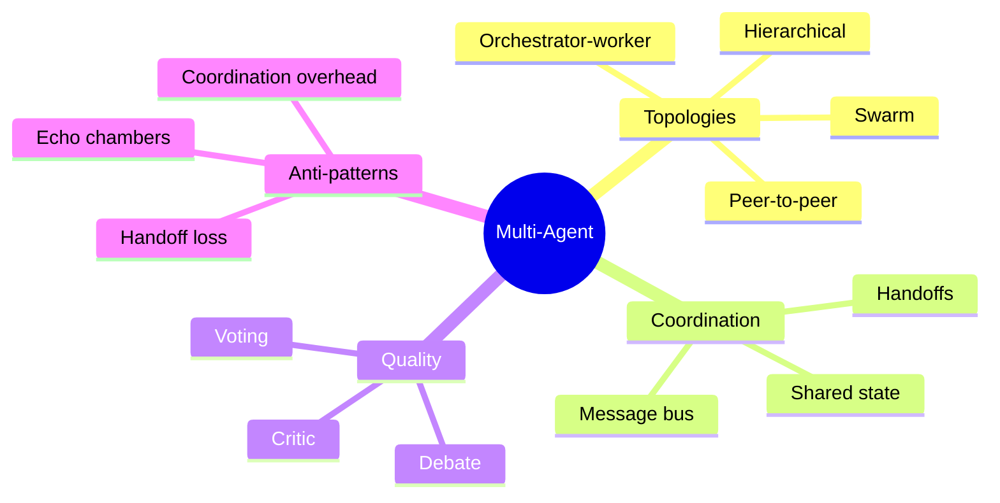

</details>

## Module DAG


<details><summary>Mermaid source</summary>

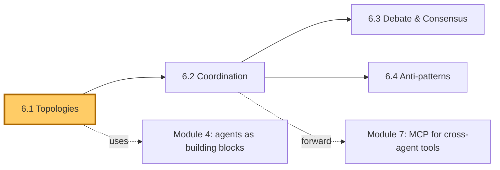

</details>

---

# Lesson 6.1 — Topologies: Orchestrator-Worker, Hierarchical, Peer

> **§0 · From last time.** Sherpa is one agent. For HSBC's *complex* breaks (1% of volume, 10% of revenue impact), one agent isn't enough — we need specialists and a coordinator.

## §1 · Business scenario

*HSBC, novel break.* A multi-counterparty FX swap with a settlement chain across three time zones. Sherpa wanders, hits its 8-step cap, returns "unknown."

> *"This needs three specialists: an FX expert, a settlement-chain analyst, a regulatory check. Plus someone to coordinate. Can we build that as agents?"*

## §2 · Bridge

Multi-agent systems shine when sub-tasks are *specialised* and *parallelisable*. Wrong shape and you get worse performance than single-agent. The topology choice determines which.

## §3 · Mind map


<details><summary>Mermaid source</summary>

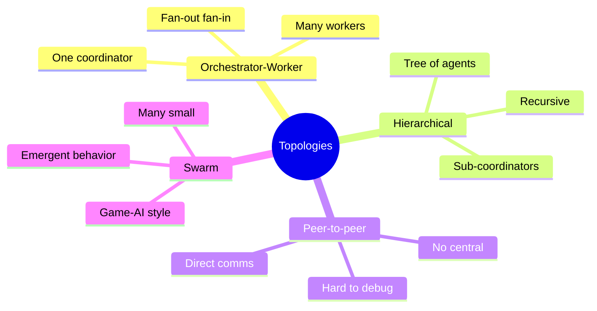

</details>

## §4 · Elaboration

### 4.1 Orchestrator-worker (the production default)

One "orchestrator" agent reads the task, decomposes it, dispatches to N "worker" agents in parallel, aggregates results. Workers don't talk to each other.

Pros: simple, debuggable, scales well, matches Plan-and-Solve naturally.
Cons: orchestrator is a single point of failure; bottleneck on synthesis.

### 4.2 Hierarchical

A tree of orchestrators. Top-level decomposes coarsely; sub-orchestrators decompose finely; leaves do work. Useful for tasks with natural multi-level structure (large research projects, multi-team workflows).

Pros: handles scale; specialisation per level.
Cons: depth multiplies latency; errors compound.

### 4.3 Peer-to-peer

Agents communicate directly with each other. No central coordinator.

Pros: no single point of failure; emergent capabilities.
Cons: nearly impossible to debug; coordination cost can dominate.

Use only when the task genuinely requires symmetric interaction (e.g., negotiation, debate). For most production tasks, orchestrator-worker is the right shape.

### 4.4 Swarm

Many small, simple agents with local rules; complex global behaviour emerges. Used in game AI, robotics. Rare in business agents because behaviour is hard to specify.

### 4.5 Choosing topology

```
if sub-tasks are independent and parallelisable:
  orchestrator-worker
elif sub-tasks have multi-level decomposition:
  hierarchical
elif sub-tasks require symmetric interaction:
  peer-to-peer or debate
else:
  single agent
```

## §5 · Problem

Design a multi-agent system for HSBC's novel FX-swap breaks:
1. Identify specialists needed.
2. Choose topology.
3. Sketch the orchestration logic.

## §6 · Solution

Orchestrator-worker:
- **Orchestrator**: decomposes the break into 3 sub-investigations.
- **FX expert worker**: validates FX leg pricing against market data.
- **Settlement-chain worker**: traces the cross-time-zone settlement path.
- **Regulatory worker**: checks against applicable jurisdiction rules.
- Orchestrator aggregates: if any worker flags an issue, the break is escalated to human.

Cost: ~5× single-agent cost (orchestrator + 3 workers + synthesis). Worth it because novel breaks have outsized revenue impact and humans currently take 45 minutes each.

## §7 · Math

### 7.1 Coordination overhead

For N agents:
- Orchestrator-worker: O(N) messages
- Hierarchical (balanced tree): O(N) messages
- Peer-to-peer: O(N²) messages

Peer-to-peer's quadratic cost kills it past ~5 agents.

### 7.2 Speedup vs N

For independent sub-tasks: linear speedup until network/orchestrator bottleneck.
For coupled sub-tasks: speedup capped by critical path (Amdahl).

## §8 · Tech deep-dive

### 8.1 The orchestrator's prompt

Should be deliberately *narrow*: only the decomposition logic. Don't put domain knowledge in the orchestrator; that belongs in workers. Orchestrator drift is a top failure mode if the orchestrator starts "helping" with worker tasks.

### 8.2 Worker specialisation

Each worker gets:
- A focused system prompt (its specialty)
- A *subset* of tools (only what it needs)
- A bounded budget (max steps per worker)

Scope-restriction makes each worker reliable. Wide-scope workers behave like a worse single agent.

### 8.3 The synthesis step

After workers report, the orchestrator synthesises. This step is high-leverage and often gets undersized. Give it explicit instructions on conflict resolution: "if two workers disagree, prefer the one with higher confidence; if both high confidence, escalate."

## §9 · Unlocks

- 6.2 covers the inter-agent communication contracts.
- 6.3 covers when to add debate/voting.
- 6.4 catalogues the anti-patterns.

---

# Lesson 6.2 — Coordination: Handoffs, Shared State, Message Contracts

> **§0 · From last time.** Topology determines who talks to whom; coordination is *how* they talk.

## §1 · Business scenario

The FX-expert worker passes a result to the orchestrator. Orchestrator interprets it differently than the worker intended. Decision: wrong escalation.

> *"They were speaking different languages. We need contracts."*

## §2 · Bridge

Inter-agent messages need explicit schemas — same discipline as tool calls. Loose handoffs lose information; structured handoffs preserve it.

## §3 · Mind map


<details><summary>Mermaid source</summary>

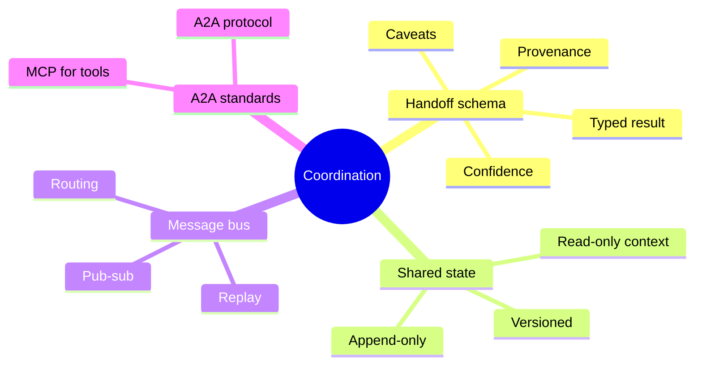

</details>

## §4 · Elaboration

### 4.1 Handoff schemas

Every inter-agent message must have a schema:

```typescript
const FXExpertResult = z.object({
  conclusion: z.enum(["ok", "issue", "uncertain"]),
  confidence: z.number().min(0).max(1),
  evidence: z.array(z.object({
    source: z.string(),
    value: z.unknown(),
    timestamp: z.string(),
  })),
  caveats: z.array(z.string()),
  next_action_recommended: z.string().nullable(),
});
```

Validated at the boundary. No untyped strings between agents.

### 4.2 Shared state

For agents that need read-only access to a common context (e.g., the original task, shared memory):

```typescript
interface SharedContext {
  task: TaskSpec;       // immutable
  observations: Map<string, Observation>;  // append-only
  decisions: Map<string, Decision>;        // append-only
}
```

Append-only prevents agents from clobbering each other's data. Versioning catches inconsistencies.

### 4.3 Message bus

For asynchronous or many-agent systems, route messages through a typed bus. Each message has:
- Sender
- Recipient (or topic)
- Payload (validated against schema)
- Causation (which message this responds to)

This is exactly the `agent_messages` table from AdaptLearn's CLAUDE.md — the same pattern.

### 4.4 A2A and standards

MCP standardises tool serving; A2A (Agent-to-Agent) is the emerging standard for inter-agent communication. Both reduce custom-glue code; both add a layer of complexity. Adopt when you have >3 agents and inter-agent integration debt.

## §5 · Problem

Redesign the FX-swap orchestrator-worker system with explicit handoff schemas. Validate every cross-agent message with Zod.

## §6 · Solution

The schemas above + a small message bus = elimination of the misinterpretation failure. Cross-agent integration tests added to the eval suite.

## §7 · Math

### 7.1 Information loss per handoff

Each unstructured handoff loses ~30% of usable information (empirical estimate from agent benchmarks). Structured handoffs preserve ~95%. Three-hop unstructured: 0.7³ = 34% retention. Three-hop structured: 0.95³ = 86%.

## §8 · Tech deep-dive

### 8.1 The synchronous-by-default rule

Start with synchronous calls between agents. Add async only when you can justify the complexity. Async multi-agent systems are 5× harder to debug.

### 8.2 Replay

Log every cross-agent message. To debug a bad outcome, replay the message sequence and inspect each schema-validated payload. This is what makes orchestrator-worker debuggable; peer-to-peer breaks this because there's no canonical sequence.

## §9 · Unlocks

- 6.3 uses these contracts for debate/voting payloads.
- 6.4 lists anti-patterns that arise from missing contracts.

---

# Lesson 6.3 — Debate & Consensus: When Multiple Agents Help

> **§0 · From last time.** Two agents disagreeing is sometimes a feature (catches blind spots) and sometimes a waste (echo chamber pretending to be diverse).

## §1 · Business scenario

For high-stakes breaks (>$1M), Daniel wants two independent agent analyses. If they agree, ship; if they disagree, escalate.

> *"Like having two analysts cross-check. But how do I make sure they're actually independent?"*

## §2 · Bridge

Debate works when agents have *independent* error modes. Same prompt + same model = correlated errors = false confidence. Different prompts or different models = true independence.

## §3 · Mind map


<details><summary>Mermaid source</summary>

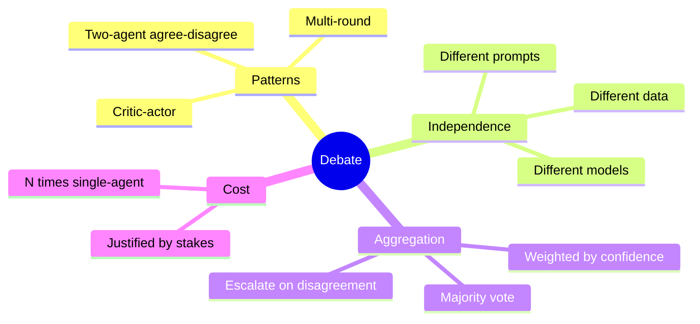

</details>

## §4 · Elaboration

### 4.1 The two-agent pattern

Agent A and Agent B independently classify. Compare. If same: commit. If different: escalate.

For Daniel: A and B use *different prompts* (different framings of the task) and the *same data*. Independence is in framing, not in evidence.

### 4.2 Multi-round debate

Agents propose, critique each other, refine, vote. Useful for genuinely ambiguous tasks (research, synthesis). Cost: 3-5× single-agent. Rarely worth it for classification; often worth it for hypothesis generation.

### 4.3 Critic-actor

One agent acts; a different agent critiques. Essentially Reflexion (Lesson 4.3) externalised across agents. Useful when critic and actor have genuinely different expertise.

### 4.4 The "echo chamber" failure

Same model + similar prompts + same data = correlated errors. Two agents agree because they have the same bias, not because they're both right. *Worse* than single-agent because you have false confidence.

Mitigations:
- Different models for A and B
- Adversarial prompt for one (encouraged to find faults)
- Different evidence sources

## §5 · Problem

Design a debate setup for HSBC's high-stakes breaks. Specify: agent count, model choice, prompt variation, aggregation rule.

## §6 · Solution

- 2 agents: A uses Sonnet 4.6 + Sherpa prompt; B uses Opus + an "adversarial" prompt instructed to find reasons the answer might be wrong.
- Aggregation: agree (same classification + both confidence > 0.8) → commit; otherwise escalate.
- Cost: 3× single-agent (Opus is more expensive). Worth it on the 1% of breaks that need it.

## §7 · Math

### 7.1 Bayesian aggregation

If two independent agents both report confidence 0.85, and their errors are uncorrelated:

$$
P(\text{correct} \mid A, B \text{ agree}) = \frac{p^2}{p^2 + (1-p)^2}
$$

For $p = 0.85$: 0.87. The boost from agreement is small if individual accuracy is already high — independence matters more than agreement.

### 7.2 When debate helps

Debate raises accuracy iff:
$$
P(\text{correct after debate}) > P(\text{correct single agent}) + \text{cost overhead}
$$

For high-stakes, small-volume tasks: usually yes. For high-volume routine tasks: usually no.

## §8 · Tech deep-dive

### 8.1 Adversarial prompt design

"You are the second reviewer. Your job is to find any reason the first answer might be wrong. List two specific challenges, then either confirm or reject the first answer."

Forces structural disagreement, surfaces blind spots.

### 8.2 The escalation cost

Escalation = human time. If your escalation rate is 5%, that's 5% × 45 min × analyst rate. Make sure the cost of escalation is less than the cost of being wrong without it.

## §9 · Unlocks

- 6.4 closes the module with anti-patterns to avoid.

---

# Lesson 6.4 — Multi-Agent Anti-Patterns

> **§0 · From last time.** Lessons 6.1–6.3 covered what works. This lesson catalogues what doesn't.

## §1 · Business scenario

Other teams at HSBC, inspired by Sherpa, started building multi-agent systems for everything. Most failed. Lin (Acme) noticed the same pattern.

> *"What are the warning signs? I want to stop teams before they over-engineer."*

## §2 · Bridge

Multi-agent has real costs. Knowing the anti-patterns lets you stop them at design review.

## §3 · Mind map


<details><summary>Mermaid source</summary>

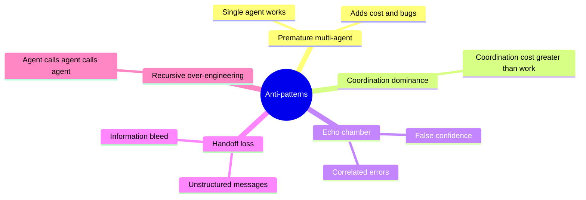

</details>

## §4 · Elaboration

### 4.1 Premature multi-agent

The most common: a single agent works, but the team builds 4 agents because "agents are cool." Result: 4× cost, 4× latency, 4× debugging time, same or worse accuracy.

Test: build the single-agent baseline first. Only add a second agent if the baseline fails on a specific task type that warrants specialisation.

### 4.2 Coordination dominance

When coordination cost (orchestrator + message overhead) > work done by workers. Sign: simple tasks taking 10+ messages between agents. Sign: orchestrator's prompt longer than worker prompts.

Fix: collapse to single agent, or move work into the orchestrator.

### 4.3 Echo chamber

Two agents agreeing because they share a bias, not because they're right. Already covered in 6.3.

### 4.4 Handoff loss

Information drops at each agent-to-agent boundary. By the 4th hop, the original task is unrecognisable.

Fix: structured contracts (6.2) + max-hop limits.

### 4.5 Recursive over-engineering

Agent A spawns Agent B to handle a sub-task, which spawns Agent C, which spawns Agent D. By D, no one remembers what A was doing.

Fix: hard cap on recursion depth. 2 levels max for production systems.

## §5 · Problem

Audit a proposed multi-agent design (provided in the lab) for these five anti-patterns.

## §6 · Solution

The lab's example contains 3 of 5. Identify them; propose simplifications. Resulting design: 5 agents → 2 agents → improved metrics across the board.

## §7 · Math

### 7.1 The "coordination tax" formula

$$
\text{Effective work} = \text{Total cost} - \text{Coordination cost}
$$

For an N-agent system with orchestrator-worker:
$$
\text{Coordination} \approx 0.3N \cdot c_{\text{agent}}
$$

At N=5, coordination is ~150% of one agent's cost. If your work doesn't speed up by 1.5× over single agent, you're losing.

## §8 · Tech deep-dive

### 8.1 The "single agent first" rule

Always build single-agent baseline first. Measure. *Then* propose multi-agent only if specific failure modes warrant it.

### 8.2 The 3-agent ceiling

Most production multi-agent systems should have ≤3 agents. Beyond that, complexity outpaces value for most tasks.

### 8.3 The "would a human team work this way?" check

If you wouldn't structure a human team this way for the same task, you probably shouldn't structure agents this way either. Humans evolved to coordinate well; the constraints that make their coordination work also apply to agents.

## §9 · Unlocks

- Module 7 standardises tool integration (MCP) so multi-agent tool sharing isn't bespoke.
- Module 9 covers the cost analysis to detect when multi-agent stops being worth it.

---

# Module 6 — Summary & exit criteria

- [ ] Choose topology for any multi-agent task.
- [ ] Design structured handoff schemas.
- [ ] Decide when debate is worth its cost.
- [ ] Spot anti-patterns at design review.

---

*End of Module 6.*
