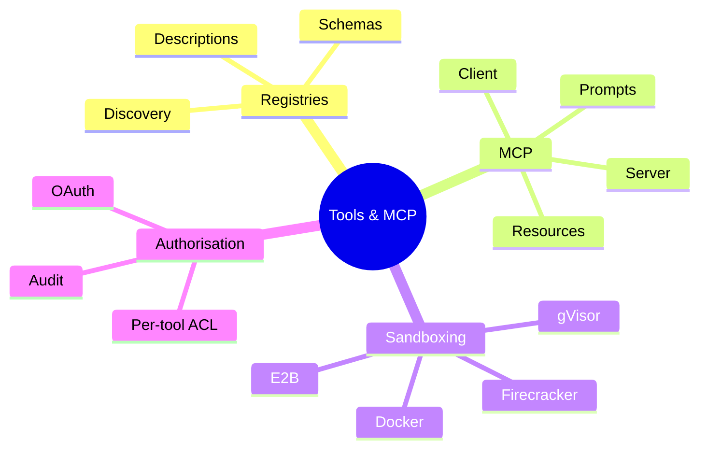
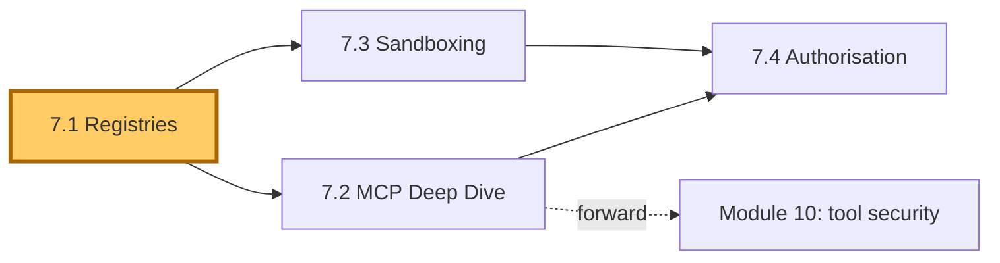
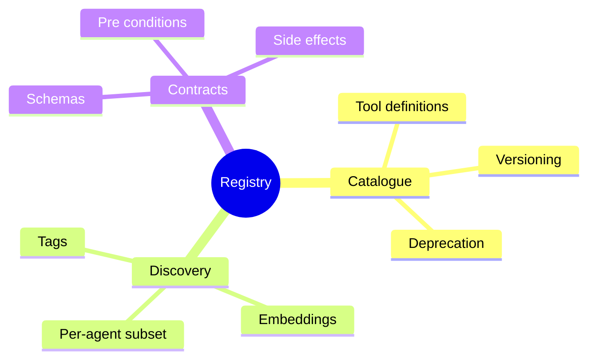
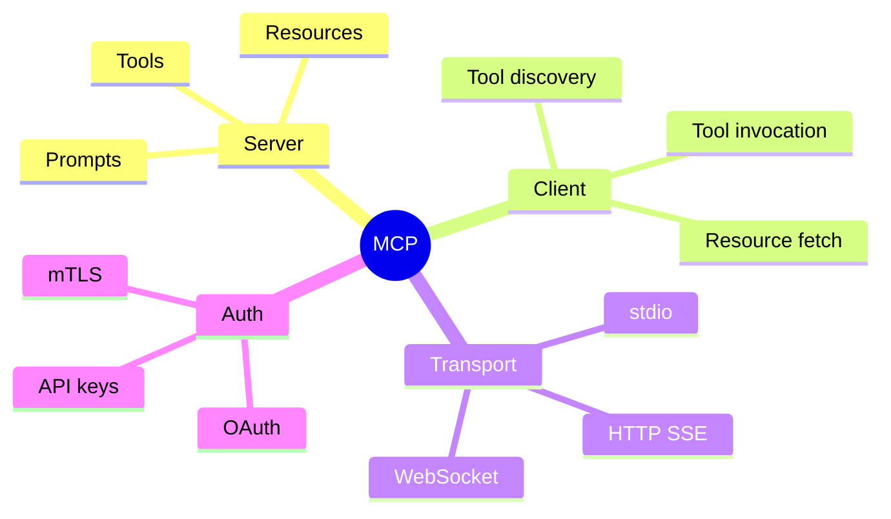
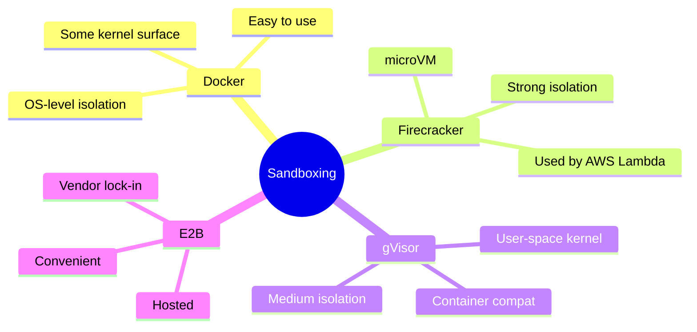
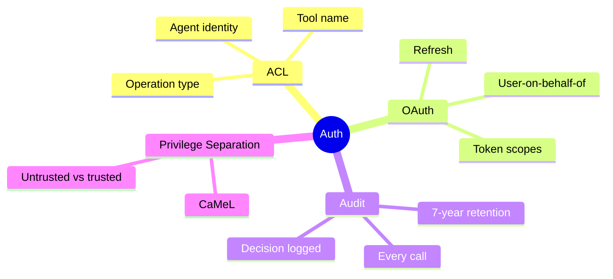

# Module 7 — Tool Integration & MCP

> **Module length:** ~9 hours · **Lessons:** 4 · **Prereqs:** Module 3 (function calling), Module 4 (Sherpa's tool layer), Module 6 (multi-agent context).

## Learning objectives

1. **Build** production tool registries with proper schemas and descriptions.
2. **Use** the Model Context Protocol (MCP) to serve tools across agents.
3. **Sandbox** tools that execute code, browse, or touch sensitive data.
4. **Authorise** tool calls with per-tool ACLs and audit trails.

## Module mind map


<details><summary>Mermaid source</summary>



</details>

## Module DAG


<details><summary>Mermaid source</summary>



</details>

---

# Lesson 7.1 — Tool Registries: Schemas, Descriptions, Discovery

> **§0 · From last time.** Modules 3 and 4 used tools as a list passed into each LLM call. As tool count grows beyond ~20, that approach breaks down: prompt bloats, discovery suffers, agents pick the wrong tool.

## §1 · Business scenario

Sherpa now has 14 tools. Tom's literature agent has 22. Lin's support agent has 31. Each team maintains a custom registry. New tools added by one team aren't visible to others.

> *"Can we have one place for all our tools?"*

## §2 · Bridge

A tool registry is a *catalogue* (what tools exist), a *discovery mechanism* (which tools are relevant for this task), and a *contract layer* (schemas the runtime can validate against). MCP gives all three.

## §3 · Mind map


<details><summary>Mermaid source</summary>



</details>

## §4 · Elaboration

### 4.1 The catalogue

Every tool has a unique name, schema, description, version, owner, deprecation status. Stored in a central place (file, git repo, MCP server).

```yaml
- name: query_GL
  version: 2.1.0
  owner: hsbc-mid-office
  description: "..."
  input_schema: {...}
  output_schema: {...}
  side_effects: read-only
  rate_limit: 100/min
  cost_per_call: 0.005
```

### 4.2 Discovery

With 50+ tools, you can't put all schemas in every prompt. Two approaches:

1. **Tags**: each tool tagged by domain; agent's system prompt restricts to relevant tags.
2. **Embeddings**: embed tool descriptions; retrieve top-K matching the agent's task description at run time.

### 4.3 Per-agent subset

The agent only sees the tools it can use. Reduces:
- Prompt size (lower cost)
- Wrong-tool selection (smaller choice space)
- Security surface (tool ACL aligns with prompt visibility)

### 4.4 Versioning

Tool schemas evolve. Without versioning, a tool change can silently break every agent depending on it.

Rule: bump version on any breaking schema change. Keep old versions available for N months. Agents pin to a version.

## §5 · Problem

Build a tool registry for HSBC + Helix + Acme combined (~70 tools). Decide:
1. Discovery mechanism.
2. Versioning policy.
3. Migration path from current per-team registries.

## §6 · Solution

- Central YAML registry, one tool per file.
- Tag-based discovery for simple cases; embedding-based for cross-org reuse.
- Quarterly deprecation window for old versions.
- Migration: wrap each team's existing tools as MCP servers (Lesson 7.2 handles this).

## §7 · Math

### 7.1 Tool-selection error rate vs choice size

Empirically, tool-selection accuracy is roughly $0.95 / \log_2(N)$ where N is the choice size. Going from 5 to 50 tools doubles error rate. Per-agent subsetting is the most effective mitigation.

## §8 · Tech deep-dive

### 8.1 The "minimal tool surface" principle

Each tool does one thing. Composition belongs in the agent. Avoid the temptation to merge tools "for convenience" — they become harder to reason about.

### 8.2 Side-effect typing

Tag each tool: `read-only`, `creates`, `modifies`, `deletes`. Auth and audit layers can enforce different policies per category.

### 8.3 Documentation as prompt

Tool descriptions ARE the model's documentation. Treat them with the same care as user-facing docs.

## §9 · Unlocks

- 7.2 MCP standardises the catalogue + discovery + contracts.
- 7.4 ACLs use the side-effect tags to gate calls.

---

# Lesson 7.2 — MCP (Model Context Protocol) Deep Dive

> **§0 · From last time.** Registries solve catalogue + discovery; MCP turns them into a standard *protocol* so any compliant client can use any compliant server.

## §1 · Business scenario

HSBC's risk team wants Sherpa to use one of their internal compliance APIs. Building a custom integration would take weeks.

> *"If they expose it as an MCP server, can Sherpa just pick it up?"*

Yes. That's the point.

## §2 · Bridge

MCP is a lightweight protocol over stdio or HTTP. A server exposes tools, resources, and prompts; a client (the agent runtime) consumes them. Standardisation eliminates integration glue.

## §3 · Mind map


<details><summary>Mermaid source</summary>



</details>

## §4 · Elaboration

### 4.1 What MCP standardises

- **Tools**: callable functions with schemas
- **Resources**: read-only data the agent can fetch (files, DB rows)
- **Prompts**: parameterised prompt templates the server provides

### 4.2 Server lifecycle

1. Server starts, advertises its tools/resources/prompts via the MCP handshake.
2. Client connects, discovers what's available.
3. Client invokes tools as needed.
4. Server can push notifications (e.g., new data available).

### 4.3 Building an MCP server

Pseudocode for HSBC's compliance API:

```typescript
import { MCPServer } from "@modelcontextprotocol/sdk";

const server = new MCPServer({ name: "hsbc-compliance", version: "1.0.0" });

server.tool({
  name: "check_jurisdiction",
  description: "Check if a counterparty is in a sanctioned jurisdiction. Returns: { sanctioned: bool, list_name?: string }",
  input_schema: { /* ... */ },
  handler: async ({ counterparty_id }) => {
    return await complianceAPI.checkJurisdiction(counterparty_id);
  },
});

server.run();
```

The handler is plain code; MCP wraps it for any client.

### 4.4 The composition story

With MCP, you can stack:
- HSBC compliance MCP server
- HSBC GL MCP server
- Public PubMed MCP server (open source)
- A shared "common ops" MCP server

Sherpa's agent runtime composes them; new tools are 1-config-line additions.

## §5 · Problem

Wrap one of HSBC's existing internal APIs as an MCP server. Connect Sherpa to it.

## §6 · Solution

`lab-7.2/` ships a working MCP server wrapping a mock compliance API. Sherpa connects in 4 lines of config. Tool is discovered, invoked, returns valid output. Total integration time: 90 minutes vs the multi-week custom integration baseline.

## §7 · Math

### 7.1 Integration cost curve

Without standards: O(N×M) — N agents, M tools, each pair needs custom glue.
With MCP: O(N+M) — each agent and each tool integrates once.

At N=5 agents and M=50 tools: 250 vs 55 integrations. 4.5× engineering reduction.

## §8 · Tech deep-dive

### 8.1 stdio vs HTTP transport

stdio is simpler (no network); use for local tools. HTTP+SSE for remote tools, especially across orgs.

### 8.2 Authentication patterns

MCP supports OAuth flows for delegated access. For internal HSBC tools: mTLS. For public tools (PubMed): API key. Spec is opinionated about flow shape; vendor-flexible on implementation.

### 8.3 Resources vs tools

If the data is *read-only* and doesn't have parameters, expose it as a resource (cheaper, cacheable). If it requires parameters or has side effects, expose as a tool.

### 8.4 Prompt templates

MCP can serve *prompts* — parameterised templates the server provides. Useful for tools where the right prompt depends on server-side state (e.g., "summarise this trade according to the most recent risk policy").

## §9 · Unlocks

- 7.3 sandboxes tools that execute code or interact with sensitive systems.
- 7.4 authorises MCP tool calls with per-tool ACLs.

---

# Lesson 7.3 — Sandboxing: Docker, Firecracker, gVisor, E2B

> **§0 · From last time.** Most tools are safe (read-only queries). Tools that *execute* (code interpreter, browser, shell) are not. Sandboxing isolates them.

## §1 · Business scenario

Helix's CodeAct agent (Lesson 1.4) runs Python emitted by the LLM. Without a sandbox, this is a remote code execution vulnerability with extra steps.

> *"What sandbox do we use? What does each give us?"*

## §2 · Bridge

Different sandbox technologies trade isolation × performance × ergonomics. Pick by threat model.

## §3 · Mind map


<details><summary>Mermaid source</summary>



</details>

## §4 · Elaboration

### 4.1 Threat model

For LLM-generated code:
- *Network exfiltration*: code calls out to attacker.
- *Resource exhaustion*: infinite loops, fork bombs.
- *Privilege escalation*: code escapes container to host.
- *Persistence*: code writes to host disk.

Sandbox must block all four.

### 4.2 Docker

OS-level isolation. Easy to set up. Default config does NOT block network — must disable explicitly. Vulnerable to kernel exploits (shared kernel).

Sufficient for: trusted-but-buggy code, internal tools.
Insufficient for: untrusted code from LLMs at full security stake.

### 4.3 Firecracker

microVMs. Each sandbox is a tiny VM, ~125ms boot. Strong isolation (hardware-level). Used in AWS Lambda.

Sufficient for: untrusted code, high-security tasks.
Cost: more complex to operate than Docker.

### 4.4 gVisor

User-space kernel that intercepts syscalls. Container-compatible API, much stronger isolation than vanilla containers, slightly slower than Docker.

Sufficient for: most production untrusted-code use cases.

### 4.5 E2B

Hosted sandbox service. Connect via API, get a ready-to-use VM. Cost: per-second usage fee + vendor lock-in.

Sufficient for: teams without ops capacity to run sandboxes themselves.

## §5 · Problem

Helix's CodeAct agent runs Python on PubMed data. Pick a sandbox + justify.

## §6 · Solution

E2B for fast time-to-value; migrate to self-hosted Firecracker (via Kata Containers) when volume justifies. Latency budget: <500ms per sandbox spin-up; both meet this.

## §7 · Math

### 7.1 Sandbox tax

Per-invocation overhead:
- Docker: ~80ms
- gVisor: ~120ms
- Firecracker: ~150ms
- E2B (hosted): ~200ms + network

For a CodeAct agent doing 100 sandbox calls/task: tax is 8–20s/task. Significant; budget for it.

## §8 · Tech deep-dive

### 8.1 Network blocking

Default-deny network in sandbox. Whitelist only known-safe endpoints (e.g., your retrieval API). Block all outbound traffic at the network namespace.

### 8.2 Resource limits

Set memory, CPU, wall-time caps per sandbox. Kill on breach. Without limits, a fork bomb takes down your host.

### 8.3 Filesystem isolation

Read-only root filesystem; writable tmpfs in /tmp; nothing persists across calls. Prevents LLM-emitted code from establishing footholds.

### 8.4 Sandbox warmup pools

Keep N sandboxes pre-spun. New invocation grabs from pool, eliminating spin-up latency. Trade: idle resource cost.

## §9 · Unlocks

- 7.4 layers auth on top of sandboxing.
- Module 10 deep-dives on the security posture.

---

# Lesson 7.4 — Tool Authorisation: ACLs, OAuth, Audit

> **§0 · From last time.** Sandboxing isolates *execution*. Authorisation gates *which tools can be called*.

## §1 · Business scenario

Sherpa can call any tool in its registry. Daniel: *"Sherpa should be able to read the GL but not write it. The current registry has no concept of permissions."*

## §2 · Bridge

Tool authorisation = ACLs per (agent, tool, operation) + audit. Same shape as any RBAC system; the agent is just a new principal type.

## §3 · Mind map


<details><summary>Mermaid source</summary>



</details>

## §4 · Elaboration

### 4.1 Agent identity

Each agent (and each agent invocation) has an identity. The identity has roles; roles grant permissions; permissions allow specific tools.

```yaml
agent: sherpa
roles: [classifier, read-only-investigator]
permitted_tools:
  - query_GL (read)
  - query_counterparty (read)
  - query_settlement (read)
denied_tools:
  - write_GL
  - issue_payment
```

### 4.2 OAuth for user-context

When a tool acts on behalf of a *user*, use OAuth. Tool gets a token scoped to the user's permissions. Sherpa querying customer data uses the agent's *own* OAuth token, not the user's — bypasses confused deputy.

### 4.3 Audit

Every tool call logged with:
- Agent identity
- Tool name + args
- Authorisation decision (allowed/denied + rule)
- Outcome (success/failure)
- Timestamp

For HSBC: 7-year retention. Audit log is append-only, immutable, signed.

### 4.4 Privilege separation (CaMeL pattern)

Untrusted input flows through a *quarantined* sub-pipeline. The agent that processes untrusted input has minimal permissions; only the trusted "supervisor" can authorise high-privilege actions.

Example: incoming customer email → untrusted agent extracts intent → trusted agent (with refund permissions) decides.

## §5 · Problem

Design the ACL system for Sherpa + the supervisor pattern for Acme support.

## §6 · Solution

YAML-defined ACLs + middleware that checks before every tool invocation. CaMeL split for Acme: extractor + decider, with strict messaging between them.

## §7 · Math

### 7.1 Attack surface reduction

Each tool an agent shouldn't have = one bug it can't introduce. Conservative defaults (least privilege) reduce the bug surface by an order of magnitude in practice.

## §8 · Tech deep-dive

### 8.1 The "deny by default" rule

If a tool isn't explicitly permitted, deny. Failing closed is the only sane default for security-critical systems.

### 8.2 Audit log integrity

Audit logs themselves must be tamper-evident. Append-only storage + cryptographic chaining (each log entry hashes the previous). Detects tampering even if attacker has logs access.

### 8.3 Rotation

API tokens, OAuth credentials: rotate quarterly. Automate rotation; manual rotation is missed rotation.

## §9 · Unlocks

- Module 10 deep-dives on prompt injection and adversarial robustness.

---

# Module 7 — Summary & exit criteria

- [ ] Build a tool registry with discovery, versioning, deprecation.
- [ ] Stand up an MCP server and connect an agent to it.
- [ ] Pick + configure a sandbox for code-executing tools.
- [ ] Design ACLs + audit + OAuth flows for tool authorisation.

---

*End of Module 7.*
