# Module 8 — Evaluation & Observability

> **Module length:** ~8 hours · **Lessons:** 4 · **Prereqs:** Modules 2 (calibration), 4 (Sherpa eval gate), 5 (RAG faithfulness).

## Learning objectives

1. **Design** an eval harness tailored to an agent's task (not borrowed from a generic benchmark).
2. **Use** LLM-as-judge correctly, including bias correction.
3. **Instrument** traces for diagnostic observability.
4. **Run** regression evals on every prompt/model change.

## Module mind map


<details><summary>Mermaid source</summary>

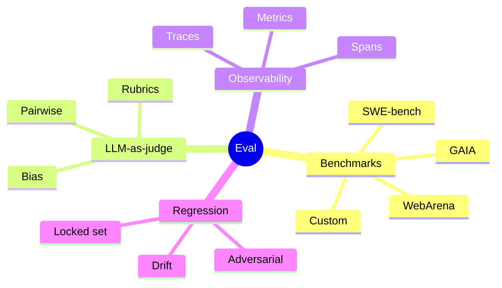

</details>

## Module DAG


<details><summary>Mermaid source</summary>

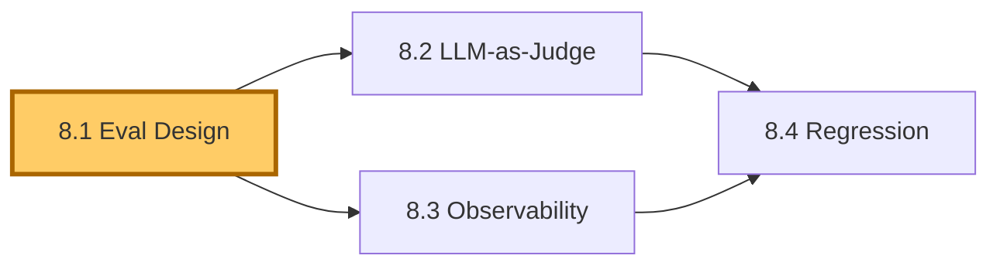

</details>

---

# Lesson 8.1 — Designing an Eval Harness

> **§0 · From last time.** Sherpa v5 has an eval gate (Lesson 4.5). That gate needs an eval *set* designed for HSBC's actual task — not borrowed from a paper.

## §1 · Business scenario

Daniel: *"I want to know Sherpa's accuracy. What number do I quote? The number my eval shows depends entirely on which cases I picked."*

## §2 · Bridge

Eval design is the act of choosing the cases that will define "good." Get it wrong and your numbers are misleading; get it right and the numbers drive decisions.

## §3 · Mind map


<details><summary>Mermaid source</summary>

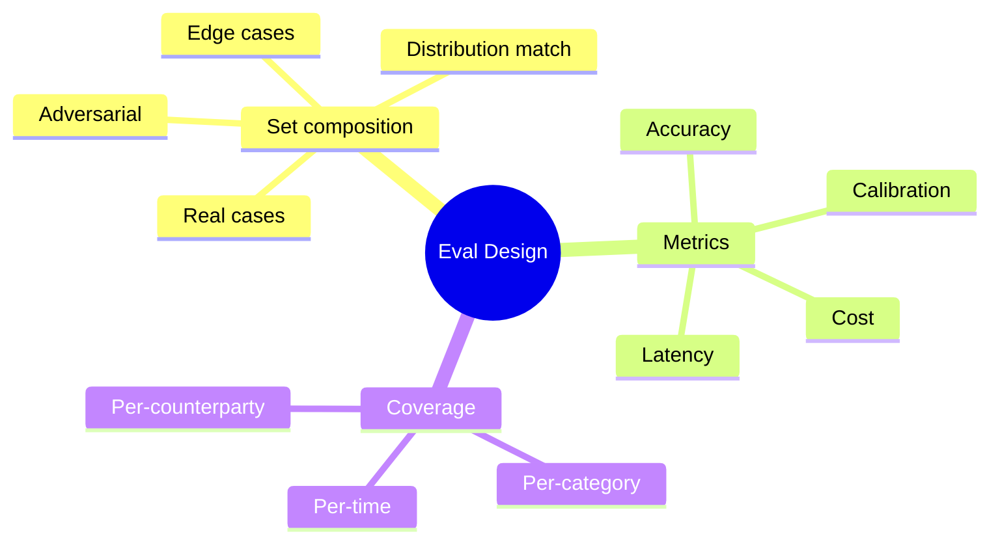

</details>

## §4 · Elaboration

### 4.1 Set composition

Three sub-sets:
1. **Regression set** (100–500 cases): historical, ground-truth labelled, frozen. Catches *regressions* on known-good behaviour.
2. **Adversarial set** (50–200 cases): edge cases designed to stress the system. Synthetically generated or carefully selected.
3. **Live shadow** (rolling): production traffic with delayed ground truth (from human review). Catches distribution drift.

### 4.2 Metrics

Beyond accuracy:
- **Calibration** — when the agent says 80% confident, is it right 80% of the time?
- **Cost per task** — dollars per invocation, averaged across the set.
- **Latency p50/p95/p99** — agent latency distribution.
- **Tool-call efficiency** — bits of information per dollar (Lesson 2.4).
- **Citation faithfulness** — for RAG, fraction of cited claims actually supported.

### 4.3 Coverage

Stratify the regression set by relevant dimensions:
- Break category (5 buckets)
- Counterparty (top-20 + long tail)
- Amount range (3 buckets)
- Time of day

Report accuracy per-stratum to catch hidden weaknesses.

### 4.4 The size question

How many cases? Roughly:
- 50 cases: detect 10pp accuracy differences
- 200 cases: detect 5pp differences
- 1000 cases: detect 2pp differences

Pick the smallest set that gives you enough signal for the decisions you'll make. More cases = more eval cost.

## §5 · Problem

Design Sherpa's regression eval. Specify: size, composition, stratification, metrics.

## §6 · Solution

200 cases stratified across category × counterparty × amount range. Reported metrics: accuracy, calibration, cost, p95 latency, citation faithfulness. Refreshed quarterly (add new cases, retire old, keep distribution match with production).

## §7 · Math

### 7.1 Binomial confidence intervals

For accuracy $\hat{p}$ on $N$ trials:
$$
\text{CI}_{95} \approx \hat{p} \pm 1.96 \sqrt{\hat{p}(1-\hat{p})/N}
$$

For 200 trials, 90% accuracy: CI is ±4pp. Anything within that is noise.

### 7.2 Calibration measurement

Bin predictions by stated confidence (deciles). For each bin, compute actual accuracy. Plot. Should fall on $y = x$. Deviations measure miscalibration (ECE — Expected Calibration Error).

## §8 · Tech deep-dive

### 8.1 Ground truth maintenance

Ground truth labels drift (human errors, policy changes). Re-validate 10% of the regression set annually; replace stale labels.

### 8.2 The "frozen set" discipline

The regression set is *frozen*. Don't add cases that are particularly hard for the current version — that's gaming. Add cases that reflect production distribution.

### 8.3 Adversarial generation

For edge cases: have a separate LLM *generate* adversarial cases (different from the agent's model, with prompts like "generate a SWIFT break that would be ambiguous"). Human review for plausibility.

### 8.4 The "task vs system" eval distinction

A common confusion: are you evaluating the *agent* or the *system*?

| Eval target | What it measures | When to use |
|---|---|---|
| **Task accuracy** | Does the agent's final output match ground truth? | Always |
| **Tool-selection accuracy** | Did the agent pick the right tool at each step? | When wrong-tool errors dominate failures |
| **Reasoning faithfulness** | Does the trace's stated reasoning match the actual evidence? | For high-stakes decisions where the *why* matters |
| **System-level (end-to-end)** | Does the user achieve their goal? | For agents embedded in user workflows |
| **Operational** | p95 latency, cost, escalation rate | Always — adjacent to quality |

Most teams measure only task accuracy. Adding tool-selection and reasoning-faithfulness evals catches a different class of failure (the agent gets right answers via wrong reasoning, which fails on the next adjacent task).

### 8.5 The hidden cost of evals: prompt leakage

If your regression set is in the repo and the agent's prompts are also in the repo, you've implicitly trained on the test set (humans tune prompts on the test set). Mitigations:

- **Separate eval repo** with restricted access.
- **Holdout set** that's never seen by prompt authors.
- **Periodic refresh** of the eval set (rotate 20% / quarter).
- **Sample-size accounting**: report which slice of the eval set was used for tuning vs measurement.

Without these, eval numbers drift upward without real quality improvement. Honest evaluation requires discipline.

### 8.6 Eval set size: the binomial CI calculator

To detect a true accuracy difference of $\delta$ percentage points at 95% confidence (two-sided):

$$
N \geq \frac{2 \cdot 1.96^2 \cdot p \cdot (1-p)}{\delta^2}
$$

For $p \approx 0.85$ (Sherpa's accuracy):
- Detect 5pp difference: N ≥ 196
- Detect 3pp difference: N ≥ 544
- Detect 1pp difference: N ≥ 4,900

In practice: 200-case eval reliably catches large regressions; 500 for sensitive tuning; 5K+ only when you have a serious quality dispute to resolve.

### 8.7 Stratified accuracy: report per-slice always

Aggregate accuracy hides serious regressions. Always report per-slice:

```
| Slice | Cases | Accuracy | Δ from baseline |
|-------|-------|----------|-----------------|
| Overall | 200 | 87.5% | -0.5pp |
| Category: amount_diff | 80 | 92.5% | +1.0pp |
| Category: counterparty_mismatch | 50 | 88.0% | 0.0pp |
| Category: stale_static | 40 | 82.5% | -5.0pp ⚠ |
| Category: duplicate | 20 | 90.0% | +0.0pp |
| Category: unknown | 10 | 70.0% | 0.0pp |
| Counterparty tier: top-20 | 100 | 91.0% | +0.5pp |
| Counterparty tier: long-tail | 100 | 84.0% | -1.5pp |
```

The aggregate "-0.5pp" looks fine. The stale_static "-5.0pp" is a serious regression. Without stratification, you'd ship and discover the bug in production.

### 8.8 The "shadow eval" as the gold standard

Most reliable signal for production behaviour: shadow the production traffic with the new version, compare outputs. Disadvantages: requires production traffic; delayed signal (need ground truth, which comes from human review hours-to-days later).

For HSBC Sherpa: every prompt change runs in shadow for 5 nights before being canary'd. Catches issues the regression set can't (production-specific distributions, new counterparty patterns, etc.).

Trade-off: shadow eval is slow (5 days). Regression set is fast (5 min). Use both: regression in CI, shadow before canary.

## §9 · Unlocks

- 8.2 covers how to judge open-ended outputs.
- 8.3 covers the trace instrumentation needed to debug failures.
- 8.4 covers running these evals on every change.

---

# Lesson 8.2 — LLM-as-Judge: Pairwise, Rubrics, Bias

> **§0 · From last time.** For classification tasks (Sherpa), ground truth is unambiguous. For open-ended tasks (Helix hypothesis generation), there's no ground truth — only judgment. LLM-as-judge automates that judgment.

## §1 · Business scenario

Maya asks: *"How do we know our hypothesis-generation agent is producing good hypotheses? Reviewing every one takes a week."*

## §2 · Bridge

LLM-as-judge is reliable *if* you control its known biases. Pairwise comparison + rubric + bias correction = production-grade eval for open-ended tasks.

## §3 · Mind map


<details><summary>Mermaid source</summary>

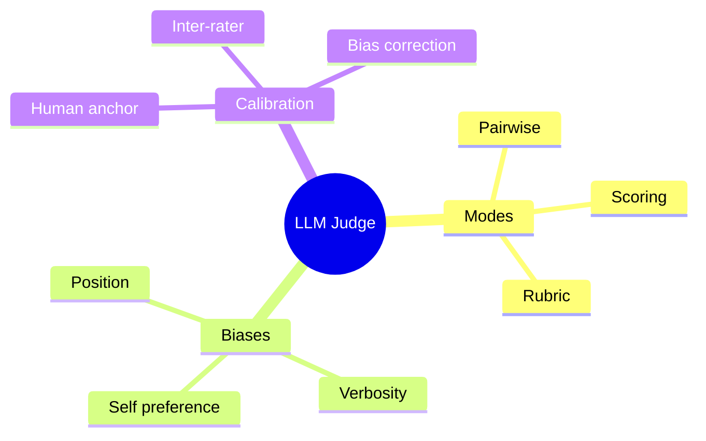

</details>

## §4 · Elaboration

### 4.1 Pairwise beats absolute scoring

Asking the judge "rate this 1-10" produces noisy scores. Asking "which is better, A or B?" is more reliable. Compute win-rates over a tournament.

### 4.2 Rubrics

Even pairwise needs a rubric — explicit criteria the judge uses. For hypotheses:
- Novelty
- Plausibility (consistent with known biology)
- Testability (feasible experiment)
- Specificity (mechanism named)

Judge scores each criterion separately, then combines. More reliable than asking "which is better" with no rubric.

### 4.3 Biases and mitigations

- **Position bias**: judge prefers whichever option comes first. *Mitigation*: randomise position; run twice with positions swapped, average.
- **Verbosity bias**: judge prefers longer outputs. *Mitigation*: explicit rubric criterion penalising verbosity; or normalise by length.
- **Self-preference**: judge prefers outputs from its own model family. *Mitigation*: use a *different* model as judge than the system being evaluated.

### 4.4 Calibrating against human

Periodically: run a 100-case eval where humans also judge. Compute agreement (Cohen's κ or similar). If judge-human agreement < 0.6, recalibrate the rubric.

## §5 · Problem

Build an LLM-as-judge eval for Helix's hypothesis-generation agent.

## §6 · Solution

Opus judges Sonnet-generated hypotheses pairwise on a 4-dimension rubric. Position randomised. Calibration against Maya's manual reviews: κ = 0.74. Quarterly recalibration.

## §7 · Math

### 7.1 Bradley-Terry for win-rate aggregation

From pairwise outcomes, fit a Bradley-Terry model to estimate latent skill of each system. More reliable than naive win-rate when matchups are unequal.

### 7.2 Position bias correction

If judge picks "A" 55% when A is first and 45% when A is second: true preference is the average (50%). Correct any non-symmetric judge with explicit position swapping.

## §8 · Tech deep-dive

### 8.1 The "different model" rule

Judge model ≠ tested model. Anthropic judging Anthropic biases toward Anthropic. OpenAI judging Anthropic is more neutral.

### 8.2 Cost of LLM-as-judge

Each pair comparison = one LLM call. For 100 hypotheses × 4 rubric items × 2 position swaps = 800 calls. At $0.05/call: $40 per full eval. Worth it for the time saved.

### 8.3 When to skip LLM-as-judge

If you have programmatically-checkable correctness (math, code), use that. LLM-as-judge is for the cases where you genuinely need judgment.

### 8.4 Rubric design: the load-bearing component

A poor rubric makes any LLM-as-judge unreliable. Components of a strong rubric:

```
Each candidate is evaluated on 4 dimensions, each scored 1-5:

1. NOVELTY (1=trivial restating; 5=genuinely new hypothesis)
   - Score 1: just restates existing literature
   - Score 3: connects two known ideas in a new way
   - Score 5: proposes a mechanism not in the input papers

2. PLAUSIBILITY (1=contradicts known biology; 5=fully consistent)
   - Score 1: violates established facts
   - Score 3: consistent with most known facts; one unexplained tension
   - Score 5: explains the literature better than current consensus

3. TESTABILITY (1=untestable; 5=specific experiment proposed)
   - Score 1: no testable prediction
   - Score 3: testable in principle; no specific experiment named
   - Score 5: specific protocol, dose, readout proposed

4. SPECIFICITY (1=vague; 5=mechanism + parameters named)
   - Score 1: "drug works on pathway"
   - Score 3: "drug inhibits enzyme E in pathway"
   - Score 5: "drug inhibits enzyme E via residue R, blocking
             phosphorylation of substrate S, expected effect Δ"

The total score is sum of dimensions (4 to 20).
Pairwise: prefer the higher total; break ties by NOVELTY.
```

Key rubric principles:
- **Anchored scales** (specific examples per level) reduce judge variance.
- **Independent dimensions** prevent halo effects.
- **Tie-breakers** make outputs comparable.
- **Total** is the actionable metric.

### 8.5 Inter-rater reliability and judge calibration

To trust LLM-as-judge, periodically calibrate against human judgment:

1. Pick 50 candidates spanning expected quality range.
2. Have 2-3 human experts judge each independently.
3. Have the LLM judge each.
4. Compute Cohen's κ (or Spearman ρ on scores) between LLM and human.
5. If κ < 0.6 or ρ < 0.7: revise the rubric, retry.

Acceptable thresholds depend on the task. For Helix hypothesis scoring (which has fuzzy ground truth even between humans): κ = 0.65 is good. For a clearer task (well-defined eval), κ = 0.8 is the target.

### 8.6 The "ensemble judge" pattern

Single-judge LLM-as-judge has variance. Mitigation: ensemble.

```typescript
async function ensembleJudge(
  candidates: Pair,
  judges: Model[] = ["claude-opus-4-7", "gpt-4o", "gemini-pro"]
): Promise<Verdict> {
  const verdicts = await Promise.all(
    judges.map(model => judgePair(candidates, model))
  );
  return {
    winner: majority(verdicts.map(v => v.winner)),
    confidence: agreement(verdicts) / judges.length,
    individual: verdicts,
  };
}
```

When all three judges agree: high confidence. When they split: low confidence — flag for human. This catches model-specific quirks.

Cost: 3× single judge. Justified for high-stakes evals (e.g., release-gate decisions); overkill for routine A/B prompt tuning.

### 8.7 Common LLM-as-judge biases (and detection methods)

| Bias | Symptom | Detection | Mitigation |
|---|---|---|---|
| Position | Judge prefers position 1 | Swap; rerun; >55% pos-1 preference = bias | Always run both positions; average |
| Verbosity | Judge prefers longer answers | Correlate score with length; r > 0.3 = bias | Penalty term in rubric; normalize by length |
| Self-preference | Judge prefers same-model outputs | Compare cross-model judges; >5pp gap = bias | Use a *different* model as judge |
| Sycophancy | Judge sides with the "client" position | Compare assistant-mode vs adversarial-prompt judges | Use neutral framing |
| Anchoring | Judge over-weights first dimension | Randomise dimension order | Independent per-dimension scoring |

Build these checks into your eval CI. If any trip, investigate before trusting numbers.

### 8.8 When to *avoid* LLM-as-judge entirely

- **Programmatically checkable**: math, code, structured output. Don't burn LLM tokens to check what `assert` could check.
- **Adversarial cases**: judging whether a prompt-injection succeeded — the judge can be injected too.
- **Domains the judge model is bad at**: judging cardiology hypotheses with a non-medical model gives confident wrong answers.

When in doubt: combine programmatic checks (where possible) + human spot-check (always) + LLM-as-judge (for scale).

## §9 · Unlocks

- 8.3 covers the trace data needed for both metrics and debugging.

---

# Lesson 8.3 — Observability: Traces, Spans, Metrics

> **§0 · From last time.** Evals give aggregate quality. Observability gives per-task introspection — why *this* invocation failed.

## §1 · Business scenario

Sherpa misclassified case BR-208441. Daniel asks: *"What did it do? Show me everything."*

## §2 · Bridge

Without trace instrumentation, you'll spend hours guessing. With it, you replay the agent's mind in 30 seconds.

## §3 · Mind map


<details><summary>Mermaid source</summary>

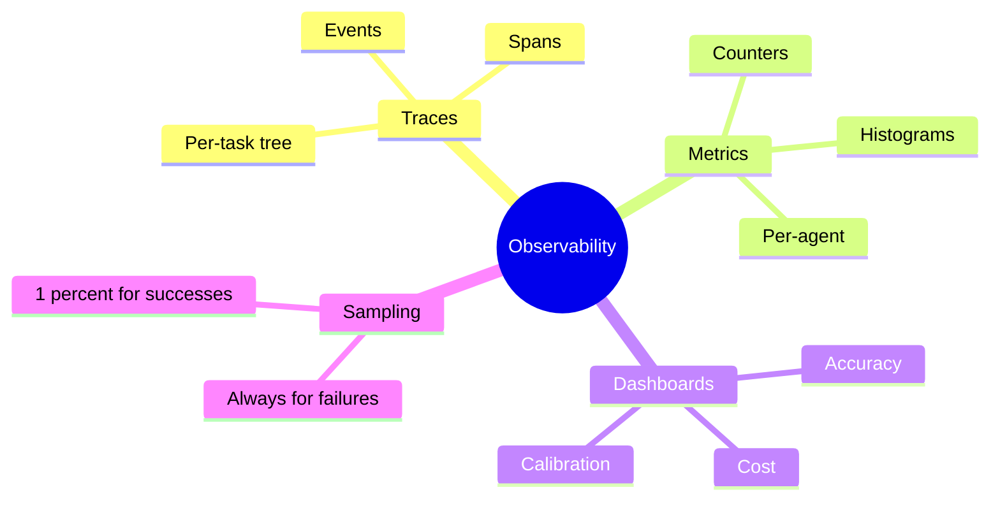

</details>

## §4 · Elaboration

### 4.1 Trace structure

Each task = one trace. Trace = tree of spans. Each span = one operation (LLM call, tool invocation, memory read, etc.).

```
trace_id: BR-208441
spans:
  - agent.classify (8.3s)
    - llm.call (1.2s) — model picks first tool
    - tool.query_GL (0.4s)
    - llm.call (1.1s) — model interprets result
    - tool.query_counterparty (0.6s)
    - llm.call (1.0s) — model commits
```

OpenTelemetry-compatible. Stored in Honeycomb, Datadog, or self-hosted.

### 4.2 Metrics

Per agent, per tool, per task type:
- Counters: invocations, successes, failures, per error type
- Histograms: latency, cost, tool-call count, confidence

Dashboard primary metrics:
- Accuracy (rolling 7-day on shadow set)
- Cost per task (rolling daily)
- p95 latency (rolling hourly)
- Calibration (rolling weekly)

### 4.3 Sampling

Trace storage costs money. Sample:
- Always: failures, escalations, high-confidence wrong answers.
- 100%: rare task types (low volume, high importance).
- 1%: routine successful tasks (statistical sample).

### 4.4 Debugging workflow

1. Alert fires (accuracy drop, cost spike).
2. Filter traces to the relevant window.
3. Look at failure traces. Find the failing span.
4. Replay locally with same inputs.
5. Fix, deploy via the eval gate.

This is what makes agents debuggable. Without it, you're guessing.

## §5 · Problem

Instrument Sherpa with OTel. Build the 4 dashboard widgets above. Define alert thresholds.

## §6 · Solution

`lab-8.3/` ships instrumented Sherpa + Grafana dashboards + alert config. Default thresholds: accuracy < 88% (7d), cost > $0.08/task (24h), p95 > 15s (1h), calibration ECE > 0.05 (7d).

## §7 · Math

### 7.1 Alert threshold setting

Use historical data: pick thresholds such that false-positive alert rate < 1/month. Otherwise the team starts ignoring alerts.

### 7.2 Sampling math

For 1% sample of routine traces: at 1,400/night, that's 14 stored/night. After 30 days: ~420 traces. Sufficient for distribution analysis.

## §8 · Tech deep-dive

### 8.1 What to log

Everything in the LLM message exchange (prompts, completions). Everything in tool calls (args, returns). Latency per span. Cost per LLM call. Memory hits.

### 8.2 What NOT to log

PII unless authorised. Encrypt traces containing customer data. Apply 7-year retention for audit; shorter for the rest.

### 8.3 Replay infrastructure

Build a "replay" mode: take a stored trace, re-run with the same inputs but new prompt/model. Compare outputs. This is how you A/B prompt changes without re-running on real traffic.

### 8.4 Span design: granularity that matters

A trace that's "one span = one LLM call" tells you nothing. Useful spans:

```
agent.classify                      [outer span — whole task]
├── memory.retrieve                 [tier 1: which past cases were fetched?]
│   └── vectordb.search             [how long did retrieval take?]
├── prompt.render                   [what was the prompt's token count?]
├── llm.call (step 1)               [model name, latency, tokens, cost]
│   └── tool.query_GL               [tool latency, returned size]
├── llm.call (step 2)
│   └── tool.query_counterparty
├── reflection.critique             [optional; was the answer challenged?]
└── output.validate                 [did the answer pass schema?]
```

Each span carries attributes:
- `latency_ms`, `cost_usd`, `tokens_in`, `tokens_out`
- `agent.version`, `model.name`, `prompt.version`
- Custom: confidence, tool name, error type if any

This level of granularity is what makes regression diagnosis fast. Aggregate metrics from spans = your dashboards.

### 8.5 The "alert fatigue" prevention rule

If you have more than ~3 alerts/week firing without action, the alerts will be ignored. Either:
- The thresholds are too tight (false positives), or
- The system is genuinely unstable (real issue).

For Sherpa: alert ratesretargeted at <2/month after initial tuning. Each alert triggers a runbook action. Anything more frequent = revise threshold.

### 8.6 The metrics that actually matter

Most teams over-instrument and then can't find the signal. Focus on these 5 per agent:

1. **Accuracy** (rolling 7-day, on shadow set) — quality
2. **Cost per task** (rolling daily) — efficiency
3. **p95 latency** (rolling hourly) — user experience
4. **Escalation rate** (rolling daily) — agent's "I don't know" rate
5. **Calibration ECE** (rolling weekly) — confidence quality

Five metrics, four dashboards. If any of these regresses > 10%, you investigate. Everything else is derived or diagnostic.

### 8.7 Trace sampling at scale

100% trace storage is expensive at high volume. Sampling strategy:

```typescript
function shouldSampleTrace(trace: PartialTrace): boolean {
  // ALWAYS sample:
  if (trace.outcome === "failure") return true;
  if (trace.outcome === "escalation") return true;
  if (trace.confidence > 0.9 && trace.wasOverridden) return true;
  if (trace.cost > P95_COST * 2) return true;  // anomalous cost

  // PER-TASK-TYPE rates:
  const taskType = trace.taskType;
  const baseRate = SAMPLING_RATES[taskType] ?? 0.01;

  // RARE task types: always sample
  if (taskTypeVolume[taskType] < 100/day) return true;

  return Math.random() < baseRate;
}
```

This keeps storage cost bounded while ensuring high-signal traces are always preserved.

### 8.8 The on-call investigation playbook

When an alert fires:

1. **Confirm**: is this real or alert flake? Check the metric in the dashboard directly.
2. **Scope**: how many tasks affected? Which slices?
3. **Recent changes**: any deploy in the last 24h? Any upstream change?
4. **Sample traces**: pull 5-10 traces from the affected window. Look at the diff with healthy traces.
5. **Hypothesis**: what's the most likely cause? Test by replay on canary.
6. **Rollback or fix**: rollback is fastest; fix is permanent. Pick by severity.
7. **Document**: post-incident note for runbook.

A team with this playbook resolves incidents in 30-90 min. Without it: 3-6 hours and growing blast radius.

## §9 · Unlocks

- 8.4 ties evals + observability into continuous regression.

---

# Lesson 8.4 — Regression Evals on Every Change

> **§0 · From last time.** We have evals (8.1), judgment (8.2), and observability (8.3). Now we need to *run* the eval on every change automatically.

## §1 · Business scenario

A model release candidate (Sonnet 4.7 ships next month). Daniel: *"Will Sherpa still work? Or will accuracy silently regress?"*

## §2 · Bridge

A regression eval, run in CI, blocks changes that hurt metrics. Same discipline as unit tests.

## §3 · Mind map


<details><summary>Mermaid source</summary>

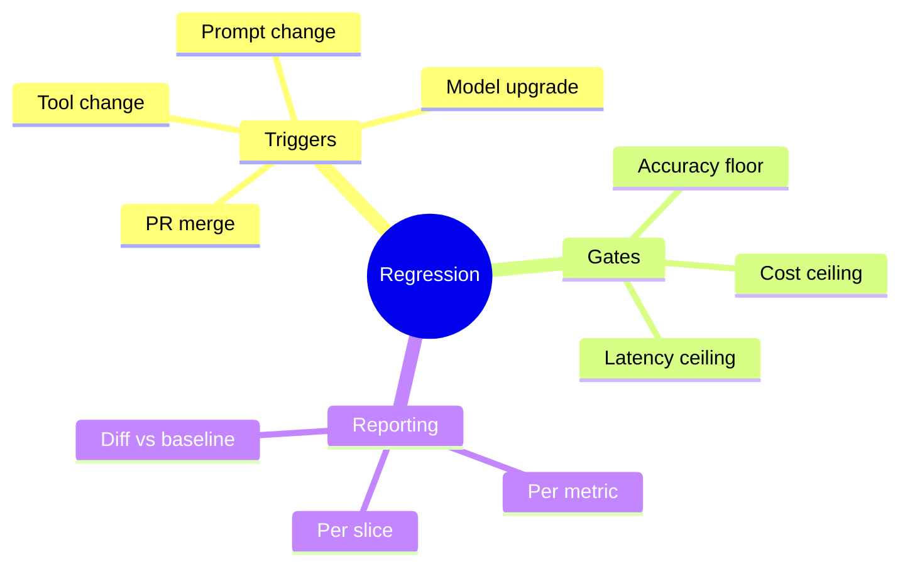

</details>

## §4 · Elaboration

### 4.1 What triggers a regression run

- Any change to prompts (file change)
- Any change to model version (config change)
- Any change to tool registry (schema change)
- Weekly cron (catch upstream model drift)

### 4.2 The gate

```
Accept iff:
  accuracy_new >= accuracy_baseline - 1pp
  AND cost_new <= cost_baseline * 1.10
  AND p95_latency_new <= p95_latency_baseline * 1.15
  AND no high-confidence wrong answers introduced
```

Strict enough to block real regressions, loose enough to allow legitimate trade-offs.

### 4.3 Per-slice reporting

Report not just aggregate metrics but per-slice:
- Per break category
- Per counterparty tier
- Per time of day

A change might raise aggregate accuracy while *dropping* one slice. Per-slice catches it.

### 4.4 The diff format

For each metric: baseline value, new value, delta, per-slice deltas, sample size. Reviewers see at a glance whether the change is safe.

## §5 · Problem

Build the regression CI pipeline. Includes: trigger, eval run, gate logic, report format, alerting on failure.

## §6 · Solution

GitHub Actions workflow runs eval on every PR. Posts comment with the diff. Fails CI on gate breach. Slack alert on cron failures. `lab-8.4/` ships the working pipeline.

## §7 · Math

### 7.1 The eval-as-test analogy

Software unit tests catch *behavioural* regressions. Agent evals catch *statistical* regressions. Same role; different math.

### 7.2 Eval set staleness

If you run the same eval daily for a year, agents may overfit (via prompt iteration). Refresh 20% of the set quarterly to keep honest signal.

## §8 · Tech deep-dive

### 8.1 Caching eval results

LLM calls are deterministic with seeded sampling (where supported). Cache by (model, prompt, input) hash. Eval CI runs in minutes instead of hours.

### 8.2 The "shadow eval"

Run new versions against production traffic in shadow mode (not user-visible). Compare to live version. Catches issues the regression set misses.

### 8.3 Cost of evals

For Sherpa: 200-case eval × $0.05/case = $10/run. Runs ~50× per quarter = $500/quarter. Cheap.

### 8.4 The "eval as CI" implementation

A working setup:

```yaml
# .github/workflows/eval.yml
name: Regression Eval
on:
  pull_request:
    paths:
      - 'agents/**'
      - 'prompts/**'
      - 'tools/**'
  schedule:
    - cron: '0 6 * * *'  # daily, 6am UTC

jobs:
  eval:
    runs-on: ubuntu-latest
    steps:
      - uses: actions/checkout@v4
      - uses: pnpm/action-setup@v3
      - run: pnpm install
      - run: pnpm eval:regression --report eval-report.json
      - uses: actions/upload-artifact@v4
        with:
          name: eval-report
          path: eval-report.json
      - run: pnpm eval:gate eval-report.json
        # exits non-zero if any metric regresses past threshold
      - if: failure()
        uses: actions/github-script@v7
        with:
          script: |
            const report = require('./eval-report.json');
            const comment = formatRegressionReport(report);
            github.rest.issues.createComment({
              ...context.repo,
              issue_number: context.issue.number,
              body: comment,
            });
```

The comment back to the PR shows the diff. Reviewers see at a glance.

### 8.5 Eval-set rotation policy

After 12 months, even "frozen" eval sets become stale (distribution shifts, models trained on similar data, prompt iteration leaks). Rotation policy:

- **Quarterly**: replace 20% of the eval set with new cases from production. Retire oldest 20%.
- **Annually**: full audit. Are there entire failure modes the set doesn't cover?
- **On distribution shift**: if production traffic shape changes >10%, refresh affected slices immediately.

Without rotation: eval numbers converge to inflated values that don't reflect production.

### 8.6 The "release notes" generated from evals

Every release should ship with a one-page summary auto-generated from the eval run:

```
=== Sherpa v5.3.0 Release Notes ===

Quality (vs v5.2.1):
  Accuracy:      87.5% (-0.5pp)  ⚠
  Calibration:   ECE 0.04 (-0.01) ✓
  Cost/task:     $0.043 (-$0.002) ✓
  p95 latency:   8.2s (+0.4s)    ✓

Slice changes:
  stale_static: 82.5% → 77.0% (-5.5pp) — INVESTIGATE
  All other slices: within ±1pp

Adversarial tests: 30/30 pass (no regressions)
Citation faithfulness (RAG): 94.5% (+0.5pp) ✓

Changes shipped:
  - New tool: query_settlement_v2 (improved cross-currency support)
  - Prompt refresh: clearer instructions for novel counterparties
  - Bug fix: trace renderer preserved newlines in tool outputs

Rollback procedure: revert to v5.2.1 by editing config.yaml line 12,
deploy. ETA: 4 min.
```

This document lives next to the deploy. Anyone debugging an incident has it in hand.

### 8.7 The "evals as documentation" insight

A well-maintained eval set IS your specification of correct behaviour. Better than written specs because:

- Specs go stale; eval failures break CI.
- Specs are ambiguous; eval cases are concrete.
- Specs hide assumptions; eval inputs surface them.

Treat the eval set as canonical. When the spec disagrees with the eval, the eval wins. When you find a behaviour you want, add it as an eval case.

### 8.8 Investment scaling: when to add eval infrastructure

| Stage | Eval investment |
|---|---|
| First agent prototype | Manual review of 10 traces; no infrastructure |
| Pre-production | 50-case regression set; CI gate; manual review |
| Production launch | 200-case regression + adversarial + LLM-as-judge for open-ended |
| Multi-team production | Shadow eval; per-team regression sets; calibration ensemble |
| Regulatory (banking, medical) | + Per-deployment audit log; explainability checks; quarterly red-team |

Don't over-invest before the agent is real. Don't under-invest after launch.

## §9 · Unlocks

- Module 9 deep-dives on production engineering, including eval as part of deployment.

---

# Module 8 — Summary & exit criteria

- [ ] Design a stratified, frozen regression set for your task.
- [ ] Use LLM-as-judge with position randomisation and rubrics.
- [ ] Instrument traces with OTel and build alert dashboards.
- [ ] Run regression evals on every change in CI.

---

*End of Module 8.*
