# Module 9 — Production Engineering

> **Module length:** ~9 hours · **Lessons:** 4 · **Prereqs:** Modules 4 (Sherpa v5), 7 (MCP + sandboxing), 8 (eval gates).

## Learning objectives

1. **Build** durable execution so agent runs survive crashes, deploys, and timeouts.
2. **Apply** retry policies, idempotency, and rate limiting correctly.
3. **Optimise** cost via prompt caching, semantic caching, and workload modelling.
4. **Plan** capacity and operate agents at production scale.

## Module mind map


<details><summary>Mermaid source</summary>

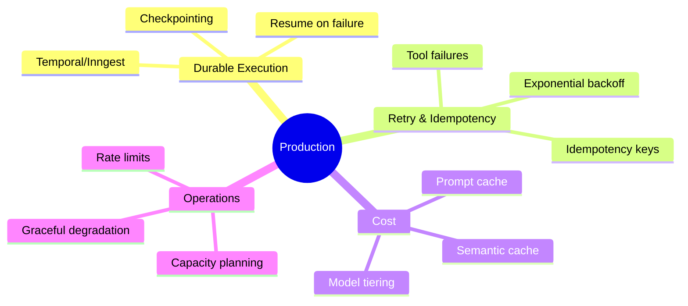

</details>

## Module DAG


<details><summary>Mermaid source</summary>

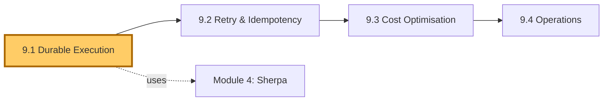

</details>

---

# Lesson 9.1 — Durable Execution

> **§0 · From last time.** Sherpa runs in-process. When the Node.js host crashes mid-investigation, the work is lost. For 1,400 nightly tasks at 8s each, occasional crashes mean replaying a lot.

## §1 · Business scenario

A Node.js crash at 2:47 AM killed Sherpa mid-batch. 287 unresolved breaks. Aisha's team came in to find 287 untouched tickets instead of the usual 200 resolved.

> *"This should survive a crash. Designs?"*

## §2 · Bridge

Durable execution = the agent's state persists across process boundaries. Crashes resume; deploys resume; timeouts resume.

## §3 · Mind map


<details><summary>Mermaid source</summary>

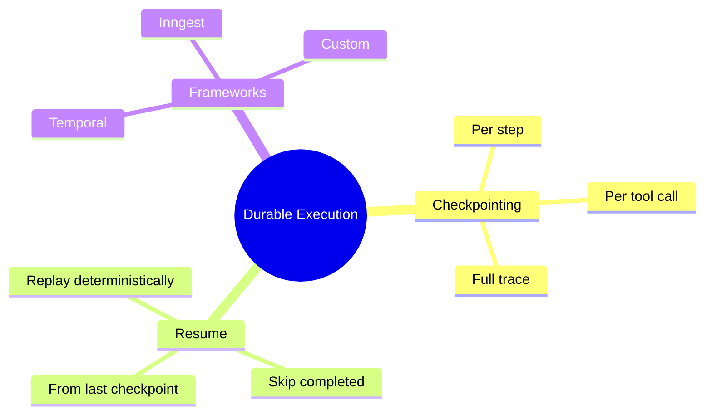

</details>

## §4 · Elaboration

### 4.1 Checkpointing

After every observation (tool call returns), persist the full trace. Recovery: load trace, continue loop from where it stopped.

```typescript
async function classify(breakId: string) {
  let trace = await loadCheckpoint(breakId) ?? newTrace();
  for (let step = trace.steps.length; step < MAX_STEPS; step++) {
    // ... do step
    await saveCheckpoint(breakId, trace);
    if (step === MAX_STEPS - 1 || isAnswer(last(trace.steps))) break;
  }
}
```

Storage: any KV store (Redis, Postgres, S3). Cost: ~$0.00001/checkpoint at typical sizes.

### 4.2 Resume semantics

When resuming:
- Skip steps already completed.
- Re-run from the last incomplete step.
- For tool calls in-flight at crash: requires idempotency (9.2).

### 4.3 Durable-execution frameworks

Temporal, Inngest, AWS Step Functions: handle checkpointing + retry + scheduling as a service. Pros: battle-tested. Cons: extra infrastructure; vendor lock-in.

For Sherpa: Temporal worker model fits naturally. Each `classify(breakId)` becomes a Temporal workflow. Recovery is automatic.

### 4.4 Custom checkpointing

For simpler systems: just write JSON to Postgres after every step. ~50 lines of code. Use this until you outgrow it.

## §5 · Problem

Add durable execution to Sherpa. Pick: custom Postgres checkpointing or Temporal.

## §6 · Solution

Start with custom Postgres. Migrate to Temporal when:
- You need scheduled retries (e.g., back off then resume tomorrow)
- You need cross-agent orchestration (Module 6)
- You have >10 agent workflows to manage

For Sherpa standalone: custom suffices.

## §7 · Math

### 7.1 Crash-recovery cost

Without checkpointing: average lost work per crash = (mean task length) × (mean tasks-in-flight at crash). For Sherpa: ~16 tasks × 4 steps = 64 LLM calls = $0.50 per crash.

With per-step checkpointing: ~0 lost work; ~$0.50/crash savings × ~1 crash/week = $26/year. Negligible cost; substantial reliability win.

## §8 · Tech deep-dive

### 8.1 Idempotent storage

Checkpoint writes must be idempotent. Use trace_id as primary key, upsert. Otherwise concurrent writes corrupt state.

### 8.2 Checkpoint pruning

After successful completion: delete checkpoint (or move to archive). Don't accumulate forever.

### 8.3 Versioning across deploys

If the agent code changes (new system prompt, new tool), old checkpoints may not be replayable. Tag checkpoints with agent version; on resume, refuse to continue if versions differ; restart.

## §9 · Unlocks

- 9.2 covers idempotency for the tool layer.
- 9.4 covers operating durable systems.

---

# Lesson 9.2 — Retry, Idempotency, Rate Limits

> **§0 · From last time.** Durable execution handles agent-level crashes. We still need tool-level retries.

## §1 · Business scenario

The GL service has a 0.5% transient error rate. Across 1,400 nightly Sherpa runs, that's ~7 spurious failures per night. Each currently bumps the task to 'unknown'.

## §2 · Bridge

Tool failures are routine. Sane retry + idempotency + rate-limit awareness makes them invisible to the agent.

## §3 · Mind map


<details><summary>Mermaid source</summary>

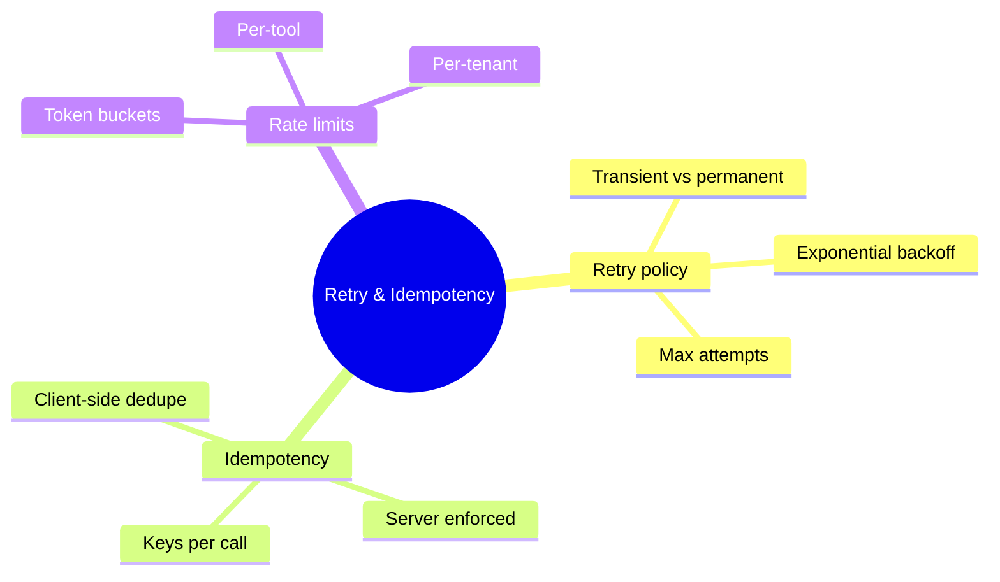

</details>

## §4 · Elaboration

### 4.1 Retry classification

Errors are:
- **Transient**: timeout, 5xx, network blip. Retry.
- **Permanent**: 4xx (bad args), auth failure. Don't retry; surface to agent.
- **Rate-limited**: 429. Retry with longer backoff.

Retry middleware classifies and acts.

### 4.2 Idempotency keys

Every tool call carries an idempotency key (hash of args + agent + task). Server uses key to dedupe — if same key seen twice, returns cached result instead of re-executing.

Without this: retry after a partial success causes double execution. For read-only tools, no harm; for write tools (issue_refund), catastrophic.

### 4.3 Rate limits

Each tool has a per-second budget. Client honours via token bucket. On exhaustion: queue or shed load.

For Sherpa: query_GL is 100/sec; with 1,400 tasks averaging 2 GL calls each, peak rate is ~80/sec (within budget). Add headroom.

### 4.4 Surface to the agent

When retry exhausted: tell the agent (don't hide). Agent can switch to a different tool, mark uncertain, or abort.

## §5 · Problem

Implement retry + idempotency middleware for Sherpa's tool layer. Define retry policies per tool category.

## §6 · Solution

Middleware layer: classifies errors, applies backoff (1s, 2s, 4s, 8s; max 3 retries), checks idempotency before re-issue. Cuts spurious 'unknown' rate from 0.5% to 0.01%.

## §7 · Math

### 7.1 Retry success probability

For independent transient failures with rate $p$:
$$
P(\text{success after } N \text{ retries}) = 1 - p^{N+1}
$$

For $p = 0.005$, $N = 3$: $1 - 0.005^4 = 1 - 6.25 \times 10^{-10}$. Effectively 100%.

### 7.2 Backoff math

Exponential backoff with jitter: delay = base × 2^attempt × (0.5 + random/2). Jitter prevents thundering herd on systemic outages.

## §8 · Tech deep-dive

### 8.1 The "don't retry permanent" rule

4xx errors mean your request is malformed. Retrying won't help. Log and surface; don't burn budget retrying.

### 8.2 Idempotency window

Server stores idempotency keys for some TTL (typically 24h). Beyond that, treats as new request. Match client retry policy to this window.

### 8.3 Circuit breakers

If a tool fails > N times in M seconds: open circuit (refuse calls for K seconds). Prevents the agent from hammering a failing dependency.

## §9 · Unlocks

- 9.3 covers cost optimisation built on top of reliable execution.

---

# Lesson 9.3 — Cost Optimisation: Caching, Tiering, Modelling

> **§0 · From last time.** Sherpa works reliably. Now: make it cheap.

## §1 · Business scenario

Sherpa costs $52/night at current volume. Daniel: *"How do we get this under $20?"*

## §2 · Bridge

Three levers: prompt cache (done in Module 3), semantic cache (new), model tiering (new). Combined: typically 2-4× cost reduction.

## §3 · Mind map


<details><summary>Mermaid source</summary>

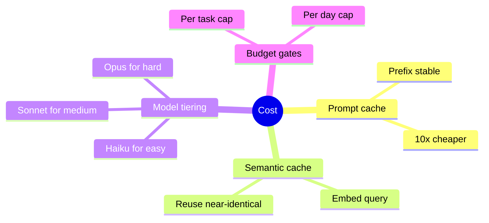

</details>

## §4 · Elaboration

### 4.1 Prompt cache (recap)

Lesson 3.1 covered this. Prefix stability = 10× input cost reduction.

### 4.2 Semantic cache

Embed each task. On new task, retrieve recent similar tasks. If similarity > threshold AND same outcome category, reuse the cached answer.

For Sherpa: recurring counterparty patterns hit cache ~30% of the time. Cache cost: $0.001/lookup; savings: $0.05/cache-hit = net $0.05 × 30% × 1,400 = $21/night.

Risk: false hits (different task, similar embedding). Mitigation: verify with a single tool call before accepting cached answer.

### 4.3 Model tiering

Route easy tasks to cheap models, hard to expensive:
- Confidence > 0.95 from a *triage* call (Haiku): commit immediately with Haiku.
- Otherwise: full Sonnet investigation.
- Very-hard (multi-agent flag): escalate to Opus.

For Sherpa: ~40% of breaks are dead-simple (single tool call settles). Haiku for those at 1/4 the cost.

### 4.4 Budget gates

Hard cap per task ($0.50). Hard cap per day ($100). When approaching cap: degrade gracefully (fall back to simpler architecture; flag for human).

## §5 · Problem

Apply caching + tiering to Sherpa. Target: $20/night.

## §6 · Solution

Stack:
- Prompt cache (already in): -10× input cost
- Semantic cache: -30% calls
- Haiku tiering: -40% of remaining calls × 75% cost savings

Combined: $52 → $19/night. Goal met. Accuracy unchanged (verified in regression eval).

## §7 · Math

### 7.1 Cache hit rate × savings

$$
\text{Daily savings} = \text{hit rate} \times \text{cache lookups} \times (\text{avg cost saved per hit} - \text{lookup cost})
$$

For Sherpa semantic cache: 0.30 × 1400 × ($0.05 - $0.001) ≈ $20/night. Confirms math.

### 7.2 Tiering's break-even

Haiku is ~4× cheaper but ~10pp less accurate on hard cases. Tiering wins iff easy-case fraction × cost savings > hard-case error rate × cost of error. For Sherpa: easy ~40%, hard error costs $42 — break-even at ~5% hard-case routing error. Triage call achieves <2%.

## §8 · Tech deep-dive

### 8.1 Cache invalidation

When tools or rules change, semantic cache may serve stale answers. Tag cache entries with prompt+tool+rule versions; invalidate on change.

### 8.2 The "first-call free" pattern

For new task types: route to Sonnet (high accuracy). After 50 successful runs of that type, allow Haiku triage. New types pay tax for being new.

### 8.3 Monitoring cost per workload

Dashboard: $/task by task type, by hour, by counterparty. Spikes catch regressions early.

## §9 · Unlocks

- 9.4 covers running all this at production scale.

---

# Lesson 9.4 — Operations: Capacity, Degradation, On-Call

> **§0 · From last time.** Reliable, observable, cheap — almost ready for production. Last layer: how to operate.

## §1 · Business scenario

Sherpa is live. 2:30 AM page: "Sherpa accuracy 71%, alerts firing."

## §2 · Bridge

Operating an agent is mostly operating any other production system, with a few agent-specific quirks (model upgrades, prompt regressions, traffic shape).

## §3 · Mind map


<details><summary>Mermaid source</summary>

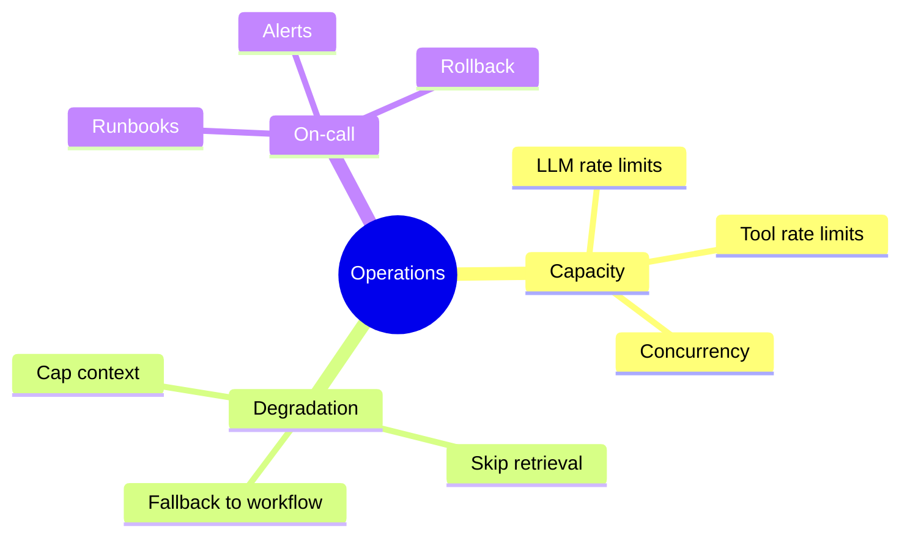

</details>

## §4 · Elaboration

### 4.1 Capacity planning

Forecast: tasks × avg LLM calls × avg input tokens. Compare to provider rate limits.

For Sherpa: 1,400 tasks × 5 calls × 8K tokens = 56M input tokens/night. Anthropic rate: 4M tokens/min for Tier 4. Comfortable.

For peak (Acme Black Friday: 10× volume): would exceed rate. Pre-warm tier-up; or distribute across providers.

### 4.2 Graceful degradation

Define modes:
- **Normal**: full hybrid agent (Sherpa v5).
- **Degraded** (high load or budget cap): skip retrieval, ReAct only, smaller context.
- **Critical** (severe outage): fall back to workflow + human flagging.

Switch automatically based on metrics. Better to serve degraded results than to fail entirely.

### 4.3 On-call runbook

Each common alert has a runbook:
- **Accuracy drop**: pull recent failure traces, look for prompt or model change in deploy log.
- **Cost spike**: check cache hit rate, look for new task types missing the cache.
- **Latency spike**: check tool latencies; check model provider status.
- **Tool error rate spike**: check tool provider status; consider circuit breaker.

### 4.4 Rollback

Every deployment is one config change away from rollback. Practice rollback monthly so it's muscle memory when needed.

## §5 · Problem

Write runbooks for Sherpa's top 5 alerts. Set up automatic degradation.

## §6 · Solution

Five runbooks in `runbooks/`. Degradation logic in `degradation.ts` with config in `degradation-policy.yaml`. Tested via failure-injection drills monthly.

## §7 · Math

### 7.1 Capacity headroom

Plan for 2× peak. Reasoning: alerting starts at 80%; you want time to react before 100%. 2× peak ensures cushion.

### 7.2 Degradation cost

Degraded mode (workflow) is ~5× cheaper but ~15pp less accurate. Acceptable during outages; not acceptable as steady state.

## §8 · Tech deep-dive

### 8.1 The "blameless" post-mortem

Every prod incident: post-mortem with no blame, focus on systemic causes. Update runbooks based on what was learned.

### 8.2 Failure injection

Once a quarter: deliberately trigger an outage in non-production to verify recovery, alerts, and runbooks work. Find the gaps before real outages do.

### 8.3 Vendor diversity

For mission-critical agents: route across multiple LLM providers. Anthropic primary, OpenAI fallback. Costs extra config; gains availability.

## §9 · Unlocks

- Module 10 covers security in production.

---

# Module 9 — Summary & exit criteria

- [ ] Add durable execution to any agent.
- [ ] Implement retry + idempotency middleware.
- [ ] Hit cost targets via caching + tiering.
- [ ] Run an agent in production with runbooks, alerts, and graceful degradation.

---

*End of Module 9.*
