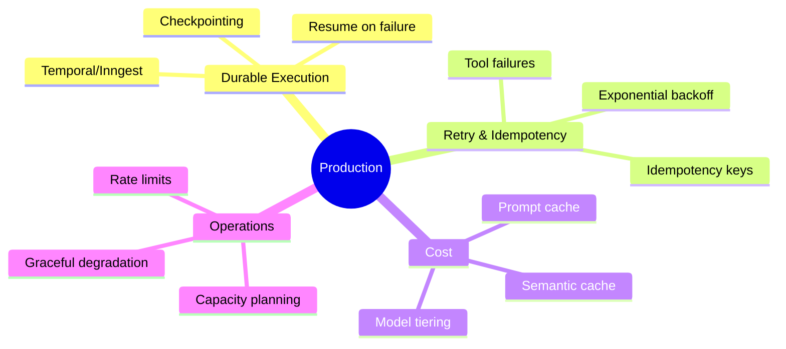
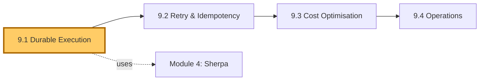
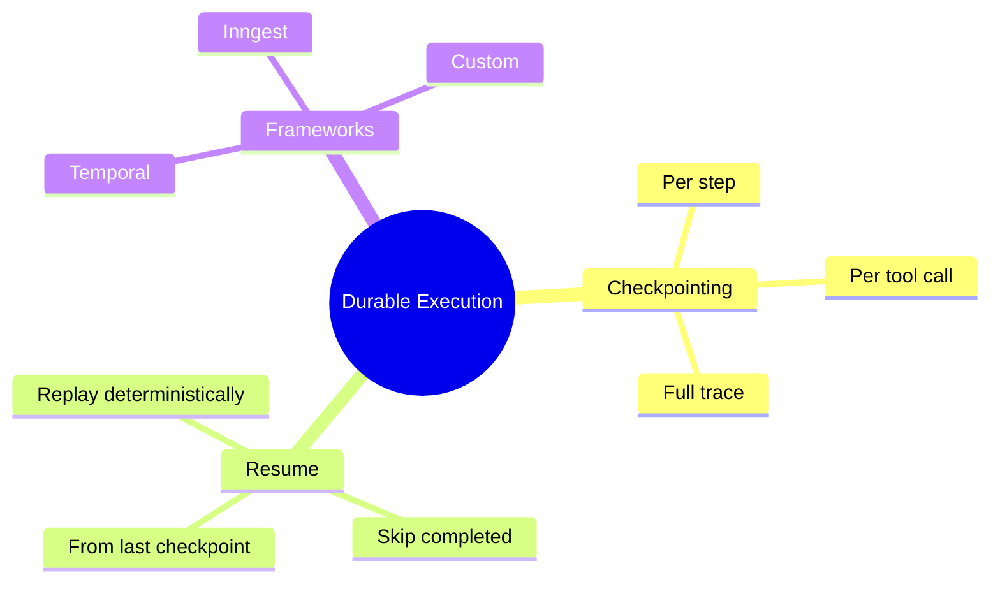
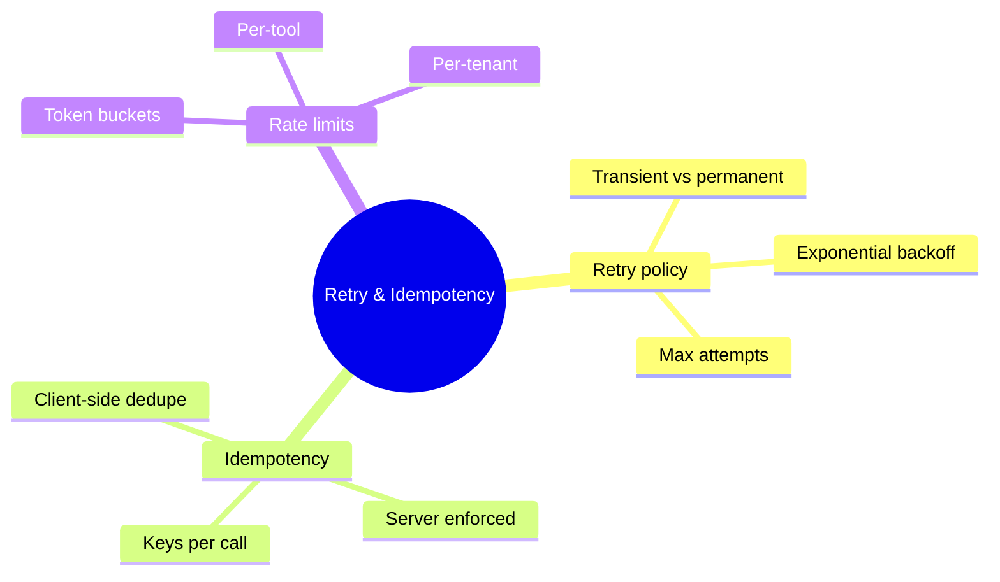
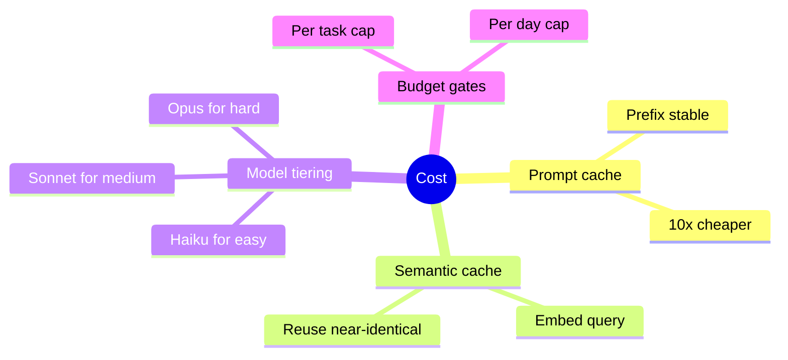
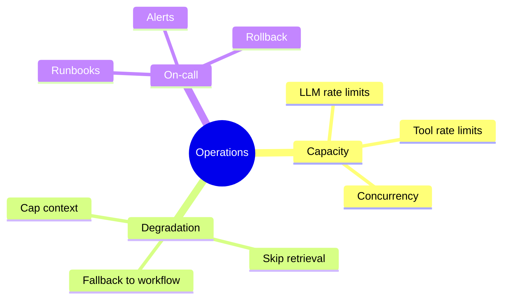

# Module 9 — Production Engineering

> **Module length:** ~9 hours · **Lessons:** 4 · **Prereqs:** Modules 4 (Sherpa v5), 7 (MCP + sandboxing), 8 (eval gates).

## Learning objectives

1. **Build** durable execution so agent runs survive crashes, deploys, and timeouts.
2. **Apply** retry policies, idempotency, and rate limiting correctly.
3. **Optimise** cost via prompt caching, semantic caching, and workload modelling.
4. **Plan** capacity and operate agents at production scale.

## Module mind map


<details><summary>Mermaid source</summary>



</details>

## Module DAG


<details><summary>Mermaid source</summary>



</details>

---

# Lesson 9.1 — Durable Execution

> **§0 · From last time.** Sherpa runs in-process. When the Node.js host crashes mid-investigation, the work is lost. For 1,400 nightly tasks at 8s each, occasional crashes mean replaying a lot.

## §1 · Business scenario

A Node.js crash at 2:47 AM killed Sherpa mid-batch. 287 unresolved breaks. Aisha's team came in to find 287 untouched tickets instead of the usual 200 resolved.

> *"This should survive a crash. Designs?"*

## §2 · Bridge

Durable execution = the agent's state persists across process boundaries. Crashes resume; deploys resume; timeouts resume.

## §3 · Mind map


<details><summary>Mermaid source</summary>



</details>

## §4 · Elaboration

### 4.1 Checkpointing

After every observation (tool call returns), persist the full trace. Recovery: load trace, continue loop from where it stopped.

```typescript
async function classify(breakId: string) {
  let trace = await loadCheckpoint(breakId) ?? newTrace();
  for (let step = trace.steps.length; step < MAX_STEPS; step++) {
    // ... do step
    await saveCheckpoint(breakId, trace);
    if (step === MAX_STEPS - 1 || isAnswer(last(trace.steps))) break;
  }
}
```

Storage: any KV store (Redis, Postgres, S3). Cost: ~$0.00001/checkpoint at typical sizes.

### 4.2 Resume semantics

When resuming:
- Skip steps already completed.
- Re-run from the last incomplete step.
- For tool calls in-flight at crash: requires idempotency (9.2).

### 4.3 Durable-execution frameworks

Temporal, Inngest, AWS Step Functions: handle checkpointing + retry + scheduling as a service. Pros: battle-tested. Cons: extra infrastructure; vendor lock-in.

For Sherpa: Temporal worker model fits naturally. Each `classify(breakId)` becomes a Temporal workflow. Recovery is automatic.

### 4.4 Custom checkpointing

For simpler systems: just write JSON to Postgres after every step. ~50 lines of code. Use this until you outgrow it.

## §5 · Problem

Add durable execution to Sherpa. Pick: custom Postgres checkpointing or Temporal.

## §6 · Solution

Start with custom Postgres. Migrate to Temporal when:
- You need scheduled retries (e.g., back off then resume tomorrow)
- You need cross-agent orchestration (Module 6)
- You have >10 agent workflows to manage

For Sherpa standalone: custom suffices.

## §7 · Math

### 7.1 Crash-recovery cost

Without checkpointing: average lost work per crash = (mean task length) × (mean tasks-in-flight at crash). For Sherpa: ~16 tasks × 4 steps = 64 LLM calls = $0.50 per crash.

With per-step checkpointing: ~0 lost work; ~$0.50/crash savings × ~1 crash/week = $26/year. Negligible cost; substantial reliability win.

## §8 · Tech deep-dive

### 8.1 Idempotent storage

Checkpoint writes must be idempotent. Use trace_id as primary key, upsert. Otherwise concurrent writes corrupt state.

### 8.2 Checkpoint pruning

After successful completion: delete checkpoint (or move to archive). Don't accumulate forever.

### 8.3 Versioning across deploys

If the agent code changes (new system prompt, new tool), old checkpoints may not be replayable. Tag checkpoints with agent version; on resume, refuse to continue if versions differ; restart.

### 8.4 Choosing between custom and framework checkpointing

| Aspect | Custom (Postgres) | Temporal |
|---|---|---|
| Setup time | ~1 day | ~1 week (workflow modelling + deployment) |
| Lines of code (init) | ~50 | ~200 (workflows + activities + workers) |
| Cron-style retries | DIY | Built-in |
| Cross-workflow signals | DIY | Built-in |
| Scheduled future continuations | DIY (need a queue) | Built-in |
| Cost | Postgres cost | Temporal cluster cost OR cloud pricing |
| Vendor lock-in | None | Moderate (Workflow API) |
| When to switch (custom → Temporal) | When you have >5 workflow types, or need scheduled-resume semantics | — |

For Sherpa standalone: custom Postgres for 12+ months. When Acme support also needs durable execution, then standardise on Temporal.

### 8.5 Concrete checkpoint schema (Postgres)

```sql
CREATE TABLE agent_checkpoints (
  trace_id        TEXT PRIMARY KEY,
  agent_id        TEXT NOT NULL,
  agent_version   TEXT NOT NULL,
  task_input      JSONB NOT NULL,
  trace_state     JSONB NOT NULL,  -- the full Trace object
  step_count      INTEGER NOT NULL,
  last_updated_at TIMESTAMPTZ NOT NULL DEFAULT now(),
  status          TEXT NOT NULL CHECK (status IN ('running', 'completed', 'failed')),
  result          JSONB,
  error           TEXT
);

CREATE INDEX idx_checkpoints_status ON agent_checkpoints(status) WHERE status = 'running';
CREATE INDEX idx_checkpoints_agent_version ON agent_checkpoints(agent_id, agent_version);
```

On host startup, scan for `status = 'running'` checkpoints and resume each. Stale running checkpoints (last_updated_at > 1 hour ago) get auto-retried.

### 8.6 The "save before tool call, save after observation" pattern

When in the loop:

```typescript
for (let step = trace.steps.length; step < MAX_STEPS; step++) {
  const next = await llm.callWithTools(...);
  trace.steps.push(next);

  await saveCheckpoint(trace);  // ← save before potentially-long tool call

  if (next.kind === "answer") {
    await markCompleted(trace.id, next);
    return next;
  }

  if (next.kind === "action") {
    const result = await invokeTool(next);
    trace.steps.push({ kind: "observation", id: next.id, result });
    await saveCheckpoint(trace);  // ← save after observation
  }
}
```

Saving twice per step (before tool call AND after observation) is the right granularity. Saving once (only after observation) loses work if the tool call hangs. Saving more often is wasteful.

### 8.7 The host-restart procedure

When the agent host (Node.js process, Lambda, k8s pod) restarts:

```
1. Acquire a host-id lease (so multiple hosts don't both resume the same checkpoint).
2. Scan checkpoints with status='running' AND (last_updated_at < now() - 5 min OR host_id IS NULL).
3. For each: claim by setting host_id = my_id, last_updated_at = now().
4. For each claimed: spawn a resume task.
5. Heartbeat last_updated_at every 30 seconds for each in-flight resume.
6. On graceful shutdown: release leases.
```

The lease + heartbeat pattern prevents two hosts from both processing the same checkpoint after a network partition.

### 8.8 Cost of durable execution

For Sherpa at 1,400 tasks/night × ~6 checkpoints/task:
- Postgres writes: 8,400/night
- Average payload: ~5KB (full trace)
- Storage: ~42 MB/night ≈ 1.3 GB/month
- Postgres write cost: negligible on a $50/month instance
- Pruning: delete completed traces > 30 days old (keep failures for analysis)

Total cost: well under $50/month. Cheap insurance against multi-hour outages.

## §9 · Unlocks

- 9.2 covers idempotency for the tool layer.
- 9.4 covers operating durable systems.

---

# Lesson 9.2 — Retry, Idempotency, Rate Limits

> **§0 · From last time.** Durable execution handles agent-level crashes. We still need tool-level retries.

## §1 · Business scenario

The GL service has a 0.5% transient error rate. Across 1,400 nightly Sherpa runs, that's ~7 spurious failures per night. Each currently bumps the task to 'unknown'.

## §2 · Bridge

Tool failures are routine. Sane retry + idempotency + rate-limit awareness makes them invisible to the agent.

## §3 · Mind map


<details><summary>Mermaid source</summary>



</details>

## §4 · Elaboration

### 4.1 Retry classification

Errors are:
- **Transient**: timeout, 5xx, network blip. Retry.
- **Permanent**: 4xx (bad args), auth failure. Don't retry; surface to agent.
- **Rate-limited**: 429. Retry with longer backoff.

Retry middleware classifies and acts.

### 4.2 Idempotency keys

Every tool call carries an idempotency key (hash of args + agent + task). Server uses key to dedupe — if same key seen twice, returns cached result instead of re-executing.

Without this: retry after a partial success causes double execution. For read-only tools, no harm; for write tools (issue_refund), catastrophic.

### 4.3 Rate limits

Each tool has a per-second budget. Client honours via token bucket. On exhaustion: queue or shed load.

For Sherpa: query_GL is 100/sec; with 1,400 tasks averaging 2 GL calls each, peak rate is ~80/sec (within budget). Add headroom.

### 4.4 Surface to the agent

When retry exhausted: tell the agent (don't hide). Agent can switch to a different tool, mark uncertain, or abort.

## §5 · Problem

Implement retry + idempotency middleware for Sherpa's tool layer. Define retry policies per tool category.

## §6 · Solution

Middleware layer: classifies errors, applies backoff (1s, 2s, 4s, 8s; max 3 retries), checks idempotency before re-issue. Cuts spurious 'unknown' rate from 0.5% to 0.01%.

## §7 · Math

### 7.1 Retry success probability

For independent transient failures with rate $p$:
$$
P(\text{success after } N \text{ retries}) = 1 - p^{N+1}
$$

For $p = 0.005$, $N = 3$: $1 - 0.005^4 = 1 - 6.25 \times 10^{-10}$. Effectively 100%.

### 7.2 Backoff math

Exponential backoff with jitter: delay = base × 2^attempt × (0.5 + random/2). Jitter prevents thundering herd on systemic outages.

## §8 · Tech deep-dive

### 8.1 The "don't retry permanent" rule

4xx errors mean your request is malformed. Retrying won't help. Log and surface; don't burn budget retrying.

### 8.2 Idempotency window

Server stores idempotency keys for some TTL (typically 24h). Beyond that, treats as new request. Match client retry policy to this window.

### 8.3 Circuit breakers

If a tool fails > N times in M seconds: open circuit (refuse calls for K seconds). Prevents the agent from hammering a failing dependency.

### 8.4 The full retry middleware (production-grade)

```typescript
interface RetryConfig {
  maxAttempts: number;
  baseDelayMs: number;
  maxDelayMs: number;
  jitterRatio: number;        // 0.5 = ±50% jitter
  retryableErrors: (e: Error) => boolean;
}

async function withRetry<T>(
  fn: () => Promise<T>,
  config: RetryConfig,
  idempotencyKey: string,
): Promise<T> {
  let lastError: Error;
  for (let attempt = 0; attempt < config.maxAttempts; attempt++) {
    try {
      // Idempotency check: did this call already succeed?
      const cached = await idempotencyCache.get(idempotencyKey);
      if (cached) return cached;

      const result = await fn();
      await idempotencyCache.set(idempotencyKey, result, { ttlSec: 86400 });
      return result;
    } catch (err) {
      lastError = err as Error;
      if (!config.retryableErrors(lastError)) {
        throw lastError;  // Permanent error: don't retry
      }
      if (attempt === config.maxAttempts - 1) {
        throw lastError;  // Out of retries
      }
      const baseDelay = Math.min(
        config.baseDelayMs * Math.pow(2, attempt),
        config.maxDelayMs
      );
      const jitter = baseDelay * config.jitterRatio * (Math.random() - 0.5) * 2;
      await sleep(baseDelay + jitter);
    }
  }
  throw lastError!;
}
```

Use:
```typescript
const result = await withRetry(
  () => queryGL(breakId),
  {
    maxAttempts: 4,
    baseDelayMs: 1000,
    maxDelayMs: 30000,
    jitterRatio: 0.5,
    retryableErrors: (e) => e instanceof NetworkError || e.message.includes("503"),
  },
  `query_GL:${breakId}`
);
```

### 8.5 Circuit breaker implementation

```typescript
class CircuitBreaker {
  private state: "closed" | "open" | "half-open" = "closed";
  private failureCount = 0;
  private nextAttempt = 0;

  constructor(
    private threshold: number,
    private timeoutMs: number,
    private halfOpenProbability: number = 0.1,
  ) {}

  async call<T>(fn: () => Promise<T>): Promise<T> {
    if (this.state === "open") {
      if (Date.now() < this.nextAttempt) {
        throw new CircuitOpenError();
      }
      // Try half-open
      this.state = "half-open";
    }

    try {
      const result = await fn();
      if (this.state === "half-open") {
        this.state = "closed";
        this.failureCount = 0;
      }
      return result;
    } catch (err) {
      this.failureCount++;
      if (this.failureCount >= this.threshold) {
        this.state = "open";
        this.nextAttempt = Date.now() + this.timeoutMs;
      }
      throw err;
    }
  }
}
```

Per-tool circuit breaker. Threshold: 5 failures. Timeout: 30s.

### 8.6 Surfacing tool failures to the agent (don't silently retry forever)

When retries exhaust:

```typescript
// Bad — agent doesn't know the tool failed
const result = await withRetry(() => callTool(), config, key);
return result;  // throws on exhaustion; loop crashes

// Good — agent sees the failure and adapts
let result: ToolResult;
try {
  result = await withRetry(() => callTool(), config, key);
} catch (err) {
  result = {
    success: false,
    error: err.message,
    retries_attempted: config.maxAttempts,
  };
}
// Inject into trace as the observation
trace.steps.push({ kind: "observation", id: actionId, result });
```

The agent's next thought now factors in the tool failure. It can: switch to a different tool, mark uncertain, abort, or alert. *Hidden* failures cause silently-wrong outputs.

### 8.7 Rate-limit awareness in the agent

If the agent knows rate limits, it can pace itself:

```typescript
class RateLimiter {
  private tokens: number;
  private lastRefill: number;
  constructor(private rate: number, private capacity: number) {
    this.tokens = capacity;
    this.lastRefill = Date.now();
  }
  async consume(): Promise<void> {
    this.refill();
    if (this.tokens < 1) {
      const wait = Math.ceil(1000 / this.rate);
      await sleep(wait);
      return this.consume();
    }
    this.tokens -= 1;
  }
  private refill() {
    const now = Date.now();
    const elapsed = (now - this.lastRefill) / 1000;
    this.tokens = Math.min(this.capacity, this.tokens + elapsed * this.rate);
    this.lastRefill = now;
  }
}
```

Per-tool rate limiter. Agent's tool call waits if limit reached. Smoother throughput than fail-and-retry.

### 8.8 The interaction between retry, idempotency, and observability

These three layers compose:

```
[Agent loop]
       ↓ (calls tool)
[Rate limiter] — paces calls to upstream
       ↓
[Circuit breaker] — opens on persistent failures
       ↓
[Retry middleware] — handles transient
       ↓
[Idempotency check] — dedupes
       ↓
[Tool invocation] — actual work
       ↓
[Observability span] — logs every layer's decision
```

Each layer should *log its own behaviour*: "rate-limited; waited 250ms", "circuit half-open; trial", "retry attempt 2/4", "idempotent return from cache". Without this, debugging "why is this tool call slow?" is impossible.

## §9 · Unlocks

- 9.3 covers cost optimisation built on top of reliable execution.

---

# Lesson 9.3 — Cost Optimisation: Caching, Tiering, Modelling

> **§0 · From last time.** Sherpa works reliably. Now: make it cheap.

## §1 · Business scenario

Sherpa costs $52/night at current volume. Daniel: *"How do we get this under $20?"*

## §2 · Bridge

Three levers: prompt cache (done in Module 3), semantic cache (new), model tiering (new). Combined: typically 2-4× cost reduction.

## §3 · Mind map


<details><summary>Mermaid source</summary>



</details>

## §4 · Elaboration

### 4.1 Prompt cache (recap)

Lesson 3.1 covered this. Prefix stability = 10× input cost reduction.

### 4.2 Semantic cache

Embed each task. On new task, retrieve recent similar tasks. If similarity > threshold AND same outcome category, reuse the cached answer.

For Sherpa: recurring counterparty patterns hit cache ~30% of the time. Cache cost: $0.001/lookup; savings: $0.05/cache-hit = net $0.05 × 30% × 1,400 = $21/night.

Risk: false hits (different task, similar embedding). Mitigation: verify with a single tool call before accepting cached answer.

### 4.3 Model tiering

Route easy tasks to cheap models, hard to expensive:
- Confidence > 0.95 from a *triage* call (Haiku): commit immediately with Haiku.
- Otherwise: full Sonnet investigation.
- Very-hard (multi-agent flag): escalate to Opus.

For Sherpa: ~40% of breaks are dead-simple (single tool call settles). Haiku for those at 1/4 the cost.

### 4.4 Budget gates

Hard cap per task ($0.50). Hard cap per day ($100). When approaching cap: degrade gracefully (fall back to simpler architecture; flag for human).

## §5 · Problem

Apply caching + tiering to Sherpa. Target: $20/night.

## §6 · Solution

Stack:
- Prompt cache (already in): -10× input cost
- Semantic cache: -30% calls
- Haiku tiering: -40% of remaining calls × 75% cost savings

Combined: $52 → $19/night. Goal met. Accuracy unchanged (verified in regression eval).

## §7 · Math

### 7.1 Cache hit rate × savings

$$
\text{Daily savings} = \text{hit rate} \times \text{cache lookups} \times (\text{avg cost saved per hit} - \text{lookup cost})
$$

For Sherpa semantic cache: 0.30 × 1400 × ($0.05 - $0.001) ≈ $20/night. Confirms math.

### 7.2 Tiering's break-even

Haiku is ~4× cheaper but ~10pp less accurate on hard cases. Tiering wins iff easy-case fraction × cost savings > hard-case error rate × cost of error. For Sherpa: easy ~40%, hard error costs $42 — break-even at ~5% hard-case routing error. Triage call achieves <2%.

## §8 · Tech deep-dive

### 8.1 Cache invalidation

When tools or rules change, semantic cache may serve stale answers. Tag cache entries with prompt+tool+rule versions; invalidate on change.

### 8.2 The "first-call free" pattern

For new task types: route to Sonnet (high accuracy). After 50 successful runs of that type, allow Haiku triage. New types pay tax for being new.

### 8.3 Monitoring cost per workload

Dashboard: $/task by task type, by hour, by counterparty. Spikes catch regressions early.

### 8.4 The cost-attribution model (where the dollars actually go)

For Sherpa at production scale (~1,400 tasks/night):

```
Cost breakdown by component, per task average:
  LLM input (uncached):    $0.0012  (5% — bulk of input is cached)
  LLM input (cached):      $0.0036  (16%)
  LLM output:              $0.0150  (66% — output tokens dominate)
  Tool calls:              $0.0020  (9% — mostly internal services, near-free)
  Memory retrieval:        $0.0005  (2%)
  Observability:           $0.0002  (1%)
  Storage (checkpoints):   $0.0001  (<1%)
  Total:                   $0.0226  (≈ $0.023)
```

**Output tokens dominate cost.** Lessons:
1. Output-token reduction has the biggest cost impact. Use structured outputs (Lesson 3.3) to keep responses short.
2. Cache hit rate matters but is second-order (saves ~$0.005/task at high hit rate).
3. Tools are usually free or near-free; don't over-engineer tool selection for cost.
4. Storage and observability costs are negligible at this scale.

### 8.5 Semantic cache: when it helps and when it hurts

Semantic cache works for *recurring* tasks (Sherpa's Sigma Capital pattern). It hurts when:
- Tasks are *almost* similar but with critical differences (false hits).
- Underlying state changes between cache write and read (stale answer).
- Cache lookup latency > value of cached answer.

Guards:
- **Verification step**: before returning cached answer, do one cheap tool call to confirm state hasn't changed.
- **Conservative similarity threshold**: 0.90+ for high-stakes; 0.85 for low-stakes.
- **TTL on cache entries**: 24 hours for slow-changing state, 1 hour for fast-changing.

Sherpa's cache after tuning: 30% hit rate, <0.1% false-hit rate. Worth the engineering.

### 8.6 Model tiering: the routing decision

Three-tier routing for Sherpa:

```typescript
async function routeTask(task: Task): Promise<Model> {
  // Triage: cheap Haiku call to assess complexity
  const triage = await haiku.call({
    prompt: TRIAGE_PROMPT,
    input: task,
  });

  if (triage.complexity === "trivial" && triage.confidence > 0.95) {
    return "haiku";  // Triage IS the answer
  }
  if (triage.complexity === "standard") {
    return "sonnet";
  }
  if (triage.complexity === "novel" || triage.complexity === "high-stakes") {
    return "opus";  // Or escalate to multi-agent
  }
  return "sonnet";  // Default
}
```

For Sherpa: 40% routed to Haiku, 50% Sonnet, 10% Opus. Avg cost dropped 40%. Quality: matched within 0.5pp accuracy.

The triage call costs ~$0.002. Justified when it saves more than that in 50% of cases.

### 8.7 Budget gates in the agent loop

Hard budget caps at multiple levels:

```typescript
class BudgetGate {
  private spent: number = 0;
  constructor(
    private hardCap: number,
    private softCap: number,
    private onSoftBreach: () => void,
  ) {}
  charge(cost: number): void {
    this.spent += cost;
    if (this.spent > this.softCap && this.spent - cost <= this.softCap) {
      this.onSoftBreach();
    }
    if (this.spent > this.hardCap) {
      throw new BudgetExceededError(this.spent, this.hardCap);
    }
  }
}
```

Per task: $0.50 hard, $0.20 soft (warn). Per day: $100 hard, $80 soft. Per minute (rate spike protection): $1.

When hard cap hits: graceful failure. Return "unknown" + flag for human + log.

### 8.8 Cost-per-task degradation over time

Cost typically rises slowly without intervention:
- New tools added → more selection space
- Prompts evolved → larger system prompt
- Cache hit rate decays as new patterns appear
- Models upgraded to more expensive variants

Mitigation: monthly cost review. If cost-per-task has risen >5% in a month with no quality improvement: dedicated optimisation sprint.

For Sherpa: $0.023/task in Q1 → $0.026 in Q2 (drift). Q3 optimisation sprint brought it back to $0.022. Without the discipline, would have hit $0.040+ within a year.

## §9 · Unlocks

- 9.4 covers running all this at production scale.

---

# Lesson 9.4 — Operations: Capacity, Degradation, On-Call

> **§0 · From last time.** Reliable, observable, cheap — almost ready for production. Last layer: how to operate.

## §1 · Business scenario

Sherpa is live. 2:30 AM page: "Sherpa accuracy 71%, alerts firing."

## §2 · Bridge

Operating an agent is mostly operating any other production system, with a few agent-specific quirks (model upgrades, prompt regressions, traffic shape).

## §3 · Mind map


<details><summary>Mermaid source</summary>



</details>

## §4 · Elaboration

### 4.1 Capacity planning

Forecast: tasks × avg LLM calls × avg input tokens. Compare to provider rate limits.

For Sherpa: 1,400 tasks × 5 calls × 8K tokens = 56M input tokens/night. Anthropic rate: 4M tokens/min for Tier 4. Comfortable.

For peak (Acme Black Friday: 10× volume): would exceed rate. Pre-warm tier-up; or distribute across providers.

### 4.2 Graceful degradation

Define modes:
- **Normal**: full hybrid agent (Sherpa v5).
- **Degraded** (high load or budget cap): skip retrieval, ReAct only, smaller context.
- **Critical** (severe outage): fall back to workflow + human flagging.

Switch automatically based on metrics. Better to serve degraded results than to fail entirely.

### 4.3 On-call runbook

Each common alert has a runbook:
- **Accuracy drop**: pull recent failure traces, look for prompt or model change in deploy log.
- **Cost spike**: check cache hit rate, look for new task types missing the cache.
- **Latency spike**: check tool latencies; check model provider status.
- **Tool error rate spike**: check tool provider status; consider circuit breaker.

### 4.4 Rollback

Every deployment is one config change away from rollback. Practice rollback monthly so it's muscle memory when needed.

## §5 · Problem

Write runbooks for Sherpa's top 5 alerts. Set up automatic degradation.

## §6 · Solution

Five runbooks in `runbooks/`. Degradation logic in `degradation.ts` with config in `degradation-policy.yaml`. Tested via failure-injection drills monthly.

## §7 · Math

### 7.1 Capacity headroom

Plan for 2× peak. Reasoning: alerting starts at 80%; you want time to react before 100%. 2× peak ensures cushion.

### 7.2 Degradation cost

Degraded mode (workflow) is ~5× cheaper but ~15pp less accurate. Acceptable during outages; not acceptable as steady state.

## §8 · Tech deep-dive

### 8.1 The "blameless" post-mortem

Every prod incident: post-mortem with no blame, focus on systemic causes. Update runbooks based on what was learned.

### 8.2 Failure injection

Once a quarter: deliberately trigger an outage in non-production to verify recovery, alerts, and runbooks work. Find the gaps before real outages do.

### 8.3 Vendor diversity

For mission-critical agents: route across multiple LLM providers. Anthropic primary, OpenAI fallback. Costs extra config; gains availability.

### 8.4 Sample runbooks (the 5 alerts Sherpa actually has)

**Alert: Sherpa accuracy below 88% (7-day rolling)**

```
1. Check the per-slice dashboard. Is one category responsible?
2. If yes: pull 10 failure traces from that category.
3. Look at recent deploys (last 48h). Any prompt or tool change?
4. If a change correlates: rollback (config flip + redeploy, ~5 min).
5. If no change correlates: check upstream model version. Did Anthropic
   release a new minor? Sometimes silent regressions on niche tasks.
6. If still unclear: file ticket, page secondary on-call. Don't roll back
   until cause is identified — random rollbacks make things worse.
```

**Alert: Cost per task > $0.08 (24h rolling)**

```
1. Check cost breakdown dashboard. Which component spiked?
2. If LLM cost: check cache hit rate. Has it dropped? (Indicates prompt
   churn or a new task type missing the cache.)
3. If tool cost: which tool? Has its provider raised prices, or are agents
   using it more?
4. Common cause: new prompt deploy invalidated cache. Wait 4h for re-warm
   before further action.
5. If persistent (>12h after deploy): investigate prompt structure for
   cacheability regression (Lesson 3.1).
```

**Alert: p95 latency > 15s (1h rolling)**

```
1. Check trace dashboard. Which span is slow?
2. If LLM call slow: check model provider status page.
3. If tool call slow: check tool provider; possibly circuit-break this tool.
4. If overall trace has many steps: agent is wandering. Check for recent
   prompt changes that loosened constraints.
5. Action: if widespread, enable degraded mode (Lesson 9.4 §4.2). If single
   tool: circuit-break it.
```

**Alert: Tool error rate > 1% on any tool**

```
1. Check tool's provider status.
2. Check our caller-side: any recent change to how we invoke it?
3. Look at error distribution: is it concentrated in time (provider) or
   random (us)?
4. Action: if provider-side, circuit-break and enable fallback. If our side,
   investigate the recent change.
```

**Alert: Calibration ECE > 0.05 (7-day rolling)**

```
1. Look at confidence histogram. Is the agent over-confident on hard cases,
   or under-confident on easy cases?
2. Pull 10 cases where confidence > 0.85 but answer was wrong (over-confidence).
3. Look for a pattern. Often: a class of inputs that "look easy" but isn't.
4. Mitigation: add adversarial examples to regression set; possibly add
   prompt rule warning the model about this pattern.
```

### 8.5 The "ladder of degradation" — actual config

For Sherpa, three operating modes:

```yaml
# operating-modes.yaml
normal:
  enabled_features: all
  cost_cap_per_task: 0.50
  step_cap: 8
  max_concurrent_tasks: 50

degraded:
  enabled_features: [hybrid_agent, basic_memory]
  disabled_features: [reflection, multi_agent_handoff]
  cost_cap_per_task: 0.20
  step_cap: 5
  max_concurrent_tasks: 100  # higher throughput, lower quality

critical:
  mode: fallback_to_workflow
  message: "Agent disabled; routing to manual queue"
  notify: ['ops-oncall', 'aisha@hsbc']
```

Auto-switch triggers:
- Normal → Degraded: latency p95 > 20s OR cost spike > 2× baseline.
- Degraded → Critical: accuracy < 80% OR provider sustained outage.
- Critical → Degraded → Normal: manual approval required (one-step rollback prevents flapping).

### 8.6 Capacity-planning math (concrete)

For Sherpa, projecting Q4 traffic:

```
Current Q3: 1,400 tasks/night × 6 LLM calls × 8K input tokens = 67.2M input tokens/night
Q4 forecast (seasonal +30%): 87.4M input tokens/night
Anthropic Tier 4 limit: 4M tokens/minute = 240M tokens/hour

Peak hour during nightly batch (~3 hours):
  87.4M / 3 = 29.1M tokens/hour
  = 12% of rate limit → comfortable headroom
```

Black-Friday-shape projection (10× normal):
```
292M tokens/hour during peak → 122% of rate limit → would exceed
Mitigations:
  - Pre-arrange Tier 5 with Anthropic for Nov 1-Dec 31
  - Provision OpenAI as backup for overflow routing
  - Implement queueing with prioritised draining
```

Do this exercise quarterly. Surprises during peak are avoidable.

### 8.7 The "blameless post-mortem" template

After any production incident:

```
=== Incident Post-Mortem: 2026-05-19 ===

What happened
  Sherpa accuracy dropped from 91% to 71% between 02:30 and 04:15 UTC.
  287 tasks classified as 'unknown' that should have been classified.

Timeline
  02:14 — Routine prompt update deployed (added 1,200 tokens of
          regulatory boilerplate).
  02:30 — Accuracy alert fires.
  02:38 — On-call (me) acknowledges. Initial hypothesis: model issue.
  02:45 — Trace inspection shows agent failing to identify amount_diff
          cases — was previously >95% on those.
  03:02 — Correlation with prompt deploy noticed.
  03:05 — Rolled back. (Config change + redeploy.)
  03:18 — Accuracy normalising.
  04:15 — All accuracy metrics back to baseline.

Root cause
  Attention dilution from larger system prompt. Specifically, the
  per-amount-class instructions got "lost in the middle" of the new
  regulatory content.

Why it wasn't caught
  Regression eval focused on novel cases; didn't have stratification
  by category, so the 5-pp drop on amount_diff was masked in aggregate.

Action items
  1. Add per-category accuracy to the regression eval gate. (owner: me, due: 2026-05-26)
  2. Move regulatory content from system prompt to retrieval (Lesson 5.3).
     (owner: me, due: 2026-06-02)
  3. Update runbook: prompt-deploy alerts should specifically flag
     cache-invalidation events.
     (owner: ops, due: 2026-05-30)

What we did right
  - Caught within 16 min via alerting.
  - Rollback procedure worked first try.
  - No customer-facing impact (Sherpa is decision-support, not autonomous).

What we did wrong
  - Prompt change went through normal review without specific attention
    to attention-budget impact.
  - Regression eval missed this category of failure.

No blame. The system enabled the mistake; the system needs better guards.
```

This template, used consistently, builds institutional memory of how to avoid past failures.

### 8.8 Final operations checklist

Before declaring an agent "in production":

- [ ] Eval gate in CI; passes on every PR.
- [ ] Regression set + adversarial set, both stratified.
- [ ] Trace logging at OTel-compatible granularity.
- [ ] Dashboards: 5 core metrics + per-component cost.
- [ ] Alerts with documented thresholds and runbooks.
- [ ] Rollback procedure documented and tested.
- [ ] Degraded mode defined and tested.
- [ ] Capacity plan for 2× peak.
- [ ] Post-mortem template ready.
- [ ] Vendor fallback (secondary LLM provider) configured.

If any checkbox is unchecked, you're not in production — you're in "production-ish" and you will be paged about it.

## §9 · Unlocks

- Module 10 covers security in production.

---

# Module 9 — Summary & exit criteria

- [ ] Add durable execution to any agent.
- [ ] Implement retry + idempotency middleware.
- [ ] Hit cost targets via caching + tiering.
- [ ] Run an agent in production with runbooks, alerts, and graceful degradation.

---

*End of Module 9.*
