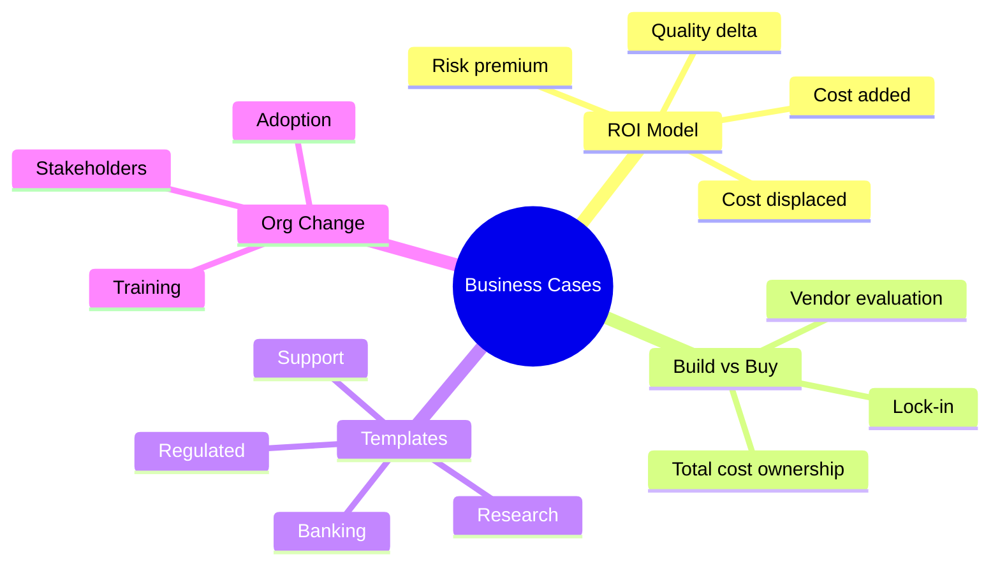
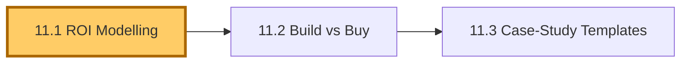
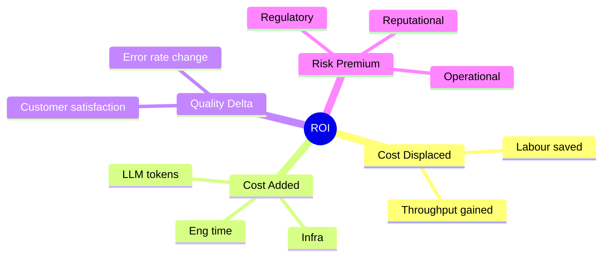
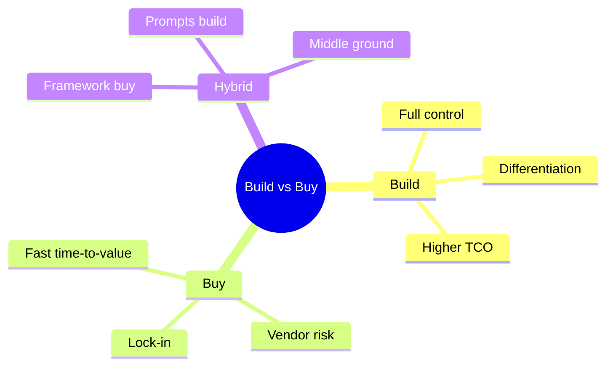
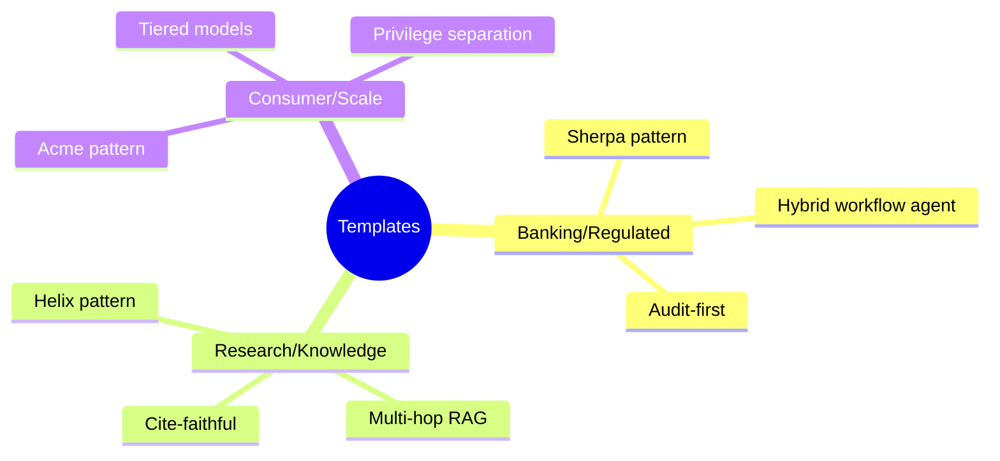

# Module 11 — Business Cases & Solution Design

> **Module length:** ~5 hours · **Lessons:** 3 · **Depth:** outline (key concepts and templates; full case-study deep-dives in capstone 1).

## Learning objectives

1. **Model ROI** for an agent deployment using cost / quality / volume / risk dimensions.
2. **Choose** between build, buy, and hybrid.
3. **Apply** templates derived from HSBC, Helix, Acme case studies to your own domain.

## Module mind map

Mermaid source

## Module DAG

Mermaid source

---

# Lesson 11.1 — ROI Modelling for Agent Deployments

> **§0 · From last time.** Modules 1–10 build the agent. Module 11 justifies it to the people writing the cheque.

## §1 · Business scenario

Priya needs to present the Sherpa business case to HSBC's executive committee. They want a single number: NPV over 3 years, with sensitivity analysis.

## §2 · Bridge

Agent ROI has four dimensions: cost displaced, cost added, quality delta, risk premium. Each gets a model. Combined → NPV.

## §3 · Mind map

Mermaid source

## §4 · Elaboration

### 4.1 Cost displaced

Hours of human time displaced × loaded cost per hour. Be honest: a 30% reduction is not 30% of headcount because of management overhead.

For Sherpa: 8 analysts × 6h/night × 365 × $80/hr = $1.4M/yr current. 30% displacement = $420K/yr.

### 4.2 Cost added

LLM + infra + ongoing eng:
- LLM cost: 1,400/night × 365 × $0.05 = $25,550/yr
- Infra (sandbox, retrieval, monitoring): ~$15K/yr
- Eng maintenance: 0.5 FTE × $200K = $100K/yr
- Total: ~$140K/yr

### 4.3 Quality delta

Sherpa is 87% accurate; humans are 95%. Net quality is *worse* unless paired with human review (which Sherpa is — it's a suggestion engine, not autonomous).

Quality dollar value: if Sherpa catches 30% more breaks per hour, downstream errors decrease. ~$50K/yr.

### 4.4 Risk premium

Probability × impact of outage, error, security breach. For regulated banking: 0.05 prob × $5M impact = $250K/yr risk premium added.

### 4.5 NPV

3-year NPV @ 8% discount:
- Year 1: −$140K + $420K + $50K − $250K = $80K
- Years 2-3: similar
- Total: ~$240K NPV

Positive. Sensitivity analysis: NPV stays positive if labour displacement > 18%. Below that, deal collapses.

## §5 · Problem

Build the ROI model for one of the three case-study orgs (or your own).

## §6 · Solution

The template: `roi-model.xlsx` ships in `module-11/`. Fill in the dimensions; calculate NPV; run sensitivity.

## §7 · Math

### 7.1 NPV formula

$$
\text{NPV} = \sum_{t=1}^{T} \frac{C_t}{(1+r)^t}
$$

where $C_t$ is net cash flow in year $t$ and $r$ is discount rate.

### 7.2 Sensitivity analysis

Vary each input ±20%. Identify the dimension where small changes flip the sign. That dimension is the "deal breaker."

## §8 · Tech deep-dive

### 8.1 The "labour displacement is not headcount" rule

A 30% reduction in work doesn't translate to 30% fewer FTE. Often 0 FTE change initially (re-deployed to higher-value work). Build the model on hours, not headcount.

### 8.2 The "regulatory uplift" line

For regulated industries: agents often have a regulatory uplift cost (compliance reviews, audit prep, model risk validation). Add to "cost added."

### 8.3 The "second-order" benefits

Sherpa might enable Aisha to spend her time on the truly novel breaks (instead of repetitive ones). That quality uplift to her work is real but hard to quantify. Estimate; flag uncertainty.

## §9 · Unlocks

- 11.2 covers build-vs-buy in light of the cost model.

---

# Lesson 11.2 — Build vs Buy

> **§0 · From last time.** Cost model in hand. Now: build it yourself or buy a vendor product?

## §1 · Business scenario

Priya has three options: build Sherpa in-house, buy Lumen Agents (vendor from Lesson 1.1), or hybrid (buy framework, customise prompts).

## §2 · Bridge

Build vs buy = total cost of ownership × lock-in × differentiation. Pick by long-term posture.

## §3 · Mind map

Mermaid source

## §4 · Elaboration

### 4.1 The buy case

Vendor handles: infra, eval framework, model upgrades, integration. You handle: prompts, tools, business rules.

Time-to-value: weeks vs months. Cost: license + ops. Lock-in: high (switching costs are real).

### 4.2 The build case

You own everything. Differentiation: the IP is yours. Cost: 2-5× the buy cost in eng time. Lock-in: zero.

Build when: agent is core to your business; you have capacity; differentiation matters.

### 4.3 Hybrid (most common)

Buy framework (Anthropic, OpenAI, hosted MCP); build prompts and tools. Gets you 80% of buy's speed and 80% of build's differentiation.

For Sherpa: hybrid. Use Claude Agent SDK + Anthropic API; build Sherpa-specific prompts, tools, and eval in-house.

### 4.4 Vendor evaluation checklist

- SLA + uptime history
- Pricing transparency (no surprise scaling)
- Data residency
- Audit / compliance certifications
- Migration path *out* (if you need to leave)
- Roadmap alignment (will they still serve your use case in 3 years?)

## §5 · Problem

Apply the checklist to a vendor option you're evaluating.

## §6 · Solution

The scoring matrix template in `module-11/vendor-eval.xlsx`.

## §7 · Math

### 7.1 TCO over 3 years

$$
\text{TCO} = \sum_t (\text{License}_t + \text{Ops}_t + \text{Eng}_t + \text{Migration Risk}_t)
$$

Migration risk is non-zero even when you're not migrating — discount future flexibility.

## §8 · Tech deep-dive

### 8.1 The "second-source" rule

For mission-critical agents: ensure you can route to a second provider. Multi-provider abstraction layer costs ~10% extra eng but eliminates single-vendor outage risk.

### 8.2 Open-source models

For privacy-critical or cost-critical workloads: self-hosted open-source models (Llama, Mixtral). Quality 80-90% of frontier. Cost 1/10. Ops complexity 5×.

## §9 · Unlocks

- 11.3 templates from the three case-study orgs.

---

# Lesson 11.3 — Case-Study Templates

> **§0 · From last time.** Build vs buy decided. Now: templates from the three orgs you can adapt.

## §1 · Business scenario

Your org isn't HSBC, Helix, or Acme. But the patterns transfer.

## §2 · Bridge

Each case study illustrated a class. Find your class; adapt the template.

## §3 · Mind map

Mermaid source

## §4 · Elaboration

### 4.1 Banking / Regulated template

(Sherpa pattern.) Hybrid workflow + agent. Workflow for known cases (cheap, auditable); agent for the tail (adaptive, expensive). Mandatory human review. Full audit trail. ~70% of breaks workflow, ~30% agent.

Translate to: insurance claims, KYC, fraud review, tax classification.

### 4.2 Research / Knowledge template

(Helix pattern.) Multi-hop agentic RAG with cite-faithfulness mandatory. Plan-and-Solve for hypothesis generation. CodeAct for data manipulation. Human sign-off on conclusions.

Translate to: pharma literature, legal research, scientific literature review, investigative journalism.

### 4.3 Consumer / Scale template

(Acme pattern.) Privilege-separated (CaMeL). Aggressive caching (semantic + prompt). Model tiering (Haiku for triage, Sonnet for resolution). Graceful degradation under load.

Translate to: customer support, e-commerce assistant, billing inquiries, scheduling.

### 4.4 Hybrids

Most orgs are hybrids: a banking-style core process + a consumer-style edge. Build each part with the appropriate template.

## §5 · Problem

Pick the template that fits your org's primary use case. Document differences. Estimate adaptation effort.

## §6 · Solution

For your situation, the template gives a starting design. Capstone 1 walks through end-to-end design for one custom case.

## §7 · Math

(No additional math; reuses Module 11.1 ROI model with template-specific defaults.)

## §8 · Tech deep-dive

### 8.1 What transfers

Architecture (orchestrator-worker, hybrid pattern, memory tiers).
Discipline (eval gates, audit, observability).
Mental models (agency dial, Bayesian priors, EVoI).

### 8.2 What doesn't transfer

Specific tools, specific prompts, specific business rules. Those are 100% yours.

### 8.3 Common stumbles when adapting

- Underestimating the auditing / governance work for regulated industries
- Overestimating the LLM cost compared to labour cost
- Underestimating the change-management work to get humans to trust the agent

## §9 · Unlocks

- Capstone 1: build a complete agent for your domain using these templates.
- Module 12 advanced designs.

---

# Module 11 — Summary & exit criteria

- [ ] Build a defensible ROI model for any agent deployment.
- [ ] Make build/buy/hybrid decisions explicitly.
- [ ] Adapt a case-study template to your domain.

---

*End of Module 11.*
