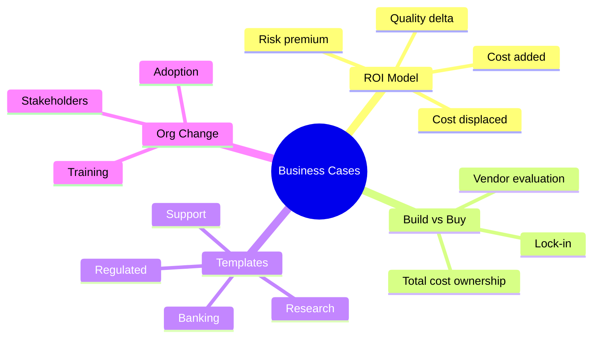
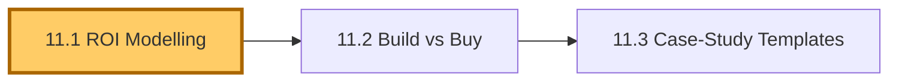
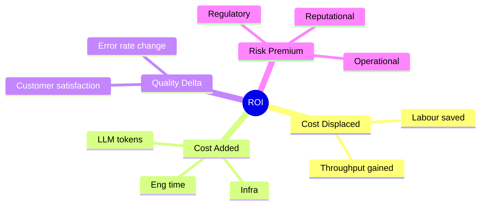
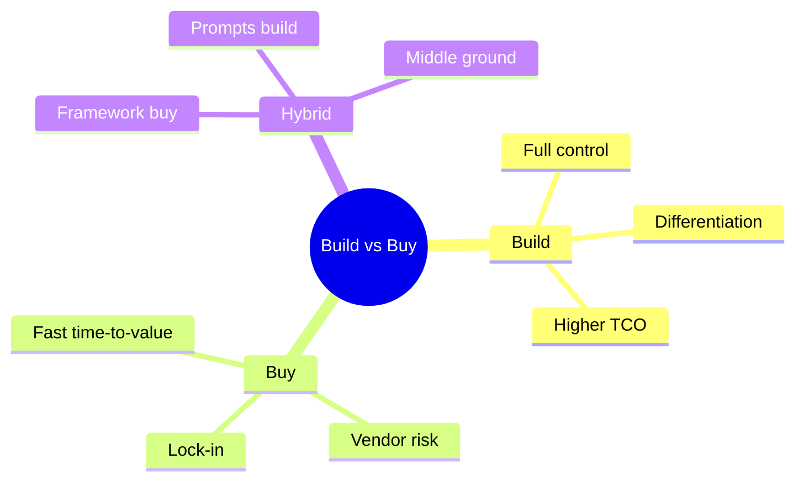
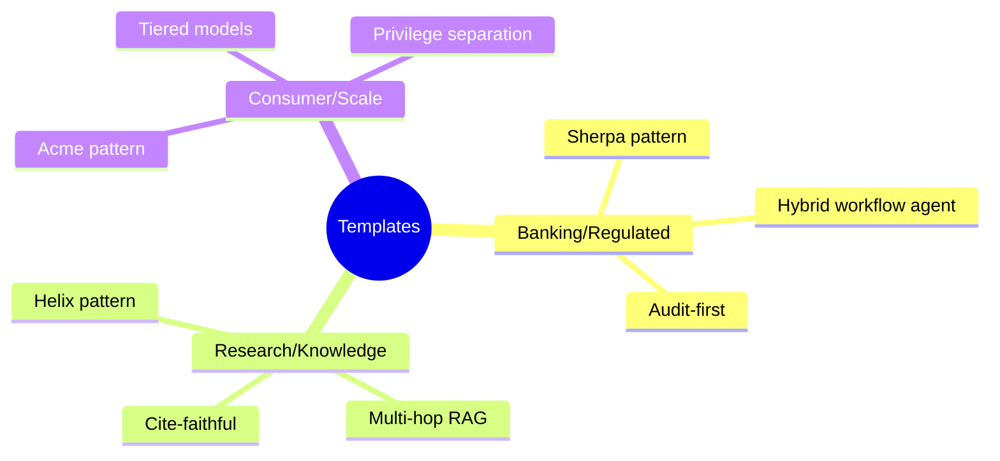

# Module 11 — Business Cases & Solution Design

> **Module length:** ~5 hours · **Lessons:** 3 · **Depth:** outline (key concepts and templates; full case-study deep-dives in capstone 1).

## Learning objectives

1. **Model ROI** for an agent deployment using cost / quality / volume / risk dimensions.
2. **Choose** between build, buy, and hybrid.
3. **Apply** templates derived from HSBC, Helix, Acme case studies to your own domain.

## Module mind map



<details><summary>Mermaid source</summary>



</details>

## Module DAG


<details><summary>Mermaid source</summary>



</details>

---

# Lesson 11.1 — ROI Modelling for Agent Deployments

> **§0 · From last time.** Modules 1–10 build the agent. Module 11 justifies it to the people writing the cheque.

## §1 · Business scenario

Priya needs to present the Sherpa business case to HSBC's executive committee. They want a single number: NPV over 3 years, with sensitivity analysis.

## §2 · Bridge

Agent ROI has four dimensions: cost displaced, cost added, quality delta, risk premium. Each gets a model. Combined → NPV.

## §3 · Mind map



<details><summary>Mermaid source</summary>



</details>

## §4 · Elaboration

### 4.1 Cost displaced

Hours of human time displaced × loaded cost per hour. Be honest: a 30% reduction is not 30% of headcount because of management overhead.

For Sherpa: 8 analysts × 6h/night × 365 × $80/hr = $1.4M/yr current. 30% displacement = $420K/yr.

### 4.2 Cost added

LLM + infra + ongoing eng:
- LLM cost: 1,400/night × 365 × $0.05 = $25,550/yr
- Infra (sandbox, retrieval, monitoring): ~$15K/yr
- Eng maintenance: 0.5 FTE × $200K = $100K/yr
- Total: ~$140K/yr

### 4.3 Quality delta

Sherpa is 87% accurate; humans are 95%. Net quality is *worse* unless paired with human review (which Sherpa is — it's a suggestion engine, not autonomous).

Quality dollar value: if Sherpa catches 30% more breaks per hour, downstream errors decrease. ~$50K/yr.

### 4.4 Risk premium

Probability × impact of outage, error, security breach. For regulated banking: 0.05 prob × $5M impact = $250K/yr risk premium added.

### 4.5 NPV

3-year NPV @ 8% discount:
- Year 1: −$140K + $420K + $50K − $250K = $80K
- Years 2-3: similar
- Total: ~$240K NPV

Positive. Sensitivity analysis: NPV stays positive if labour displacement > 18%. Below that, deal collapses.

## §5 · Problem

Build the ROI model for one of the three case-study orgs (or your own).

## §6 · Solution

The template: `roi-model.xlsx` ships in `module-11/`. Fill in the dimensions; calculate NPV; run sensitivity.

## §7 · Math

### 7.1 NPV formula

$$
\text{NPV} = \sum_{t=1}^{T} \frac{C_t}{(1+r)^t}
$$

where $C_t$ is net cash flow in year $t$ and $r$ is discount rate.

### 7.2 Sensitivity analysis

Vary each input ±20%. Identify the dimension where small changes flip the sign. That dimension is the "deal breaker."

## §8 · Tech deep-dive

### 8.1 The "labour displacement is not headcount" rule

A 30% reduction in work doesn't translate to 30% fewer FTE. Often 0 FTE change initially (re-deployed to higher-value work). Build the model on hours, not headcount.

### 8.2 The "regulatory uplift" line

For regulated industries: agents often have a regulatory uplift cost (compliance reviews, audit prep, model risk validation). Add to "cost added."

### 8.3 The "second-order" benefits

Sherpa might enable Aisha to spend her time on the truly novel breaks (instead of repetitive ones). That quality uplift to her work is real but hard to quantify. Estimate; flag uncertainty.

### 8.4 The full Sherpa ROI worked example

Five-year NPV calculation:

```
ASSUMPTIONS:
- Current labour: 8 analysts × $80/hr loaded × 6h/night × 250 nights/yr
                = $960K/yr (we'll round to $1.0M)
- Sherpa runs cover 70% of breaks at 30% of analyst time
  → Labour displacement: 30% × 70% = 21% of total labour
  → = $210K/yr

COSTS (Year 1):
  Engineering (build): $400K (one engineer + DevOps for 4 months)
  Engineering (maintain): $150K/yr (0.75 FTE)
  Infrastructure: $25K/yr (LLM, Postgres, observability)
  LLM tokens: 1,400 tasks/night × 250 nights × $0.05 = $17.5K/yr
  Model risk validation: $50K/yr (annual external audit + internal review)
  
  Year 1 total cost: $642.5K
  Year 2+ total cost: $242.5K/yr (no build cost)

BENEFITS (annual):
  Labour displacement: $210K
  Error reduction (estimated): 30% fewer downstream rework = $80K
  Quality uplift on novel breaks (Aisha effect): $50K [low confidence]
  
  Total annual benefit: $340K [point estimate]
                       $290-$390K [80% confidence interval]

NPV CALCULATION (8% discount rate, 5 years):
  Year 0: -$400K   (build)
  Year 1: +$340K - $242.5K = $97.5K (net)
  Year 2: $97.5K / 1.08 = $90.3K
  Year 3: $97.5K / 1.08² = $83.6K
  Year 4: $97.5K / 1.08³ = $77.4K
  Year 5: $97.5K / 1.08⁴ = $71.7K
  
  5-year NPV = -$400K + 5 × ~$84K avg = $20.5K
  
  IRR: ~10% (just above hurdle rate)
```

**Verdict**: borderline positive, sensitive to error-reduction assumption. Justifies the pilot; not a slam dunk.

**Sensitivity analysis** (varying key inputs ±20%):

| Variable | -20% | Base | +20% | Sign-change point |
|---|---|---|---|---|
| Labour displacement % | -$60K NPV | +$20.5K | +$110K | 17% displacement |
| Build cost | +$80K | +$20.5K | -$60K | $480K build |
| Maintenance cost | +$110K | +$20.5K | -$60K | $230K/yr maintenance |
| LLM cost | +$20K | +$20.5K | +$20K | (minor sensitivity) |

The labour displacement assumption is the deal-maker. If you can't credibly defend ≥17% displacement, don't build.

### 8.5 Common pitfalls in agent business cases

| Pitfall | What it looks like | Fix |
|---|---|---|
| Optimistic displacement | "We'll save 50% of headcount" | Build on hours, not headcount; show ramp-up curve |
| Hidden engineering cost | "Our team can build it in their spare time" | Allocate real FTE; track time honestly |
| Ignored ops cost | "It's just an API call" | Include observability, on-call, retraining cycles |
| Missing quality risk | "We'll reach human-level accuracy" | Model the cost of being below human-level + escalation |
| Single-vendor assumption | "Anthropic costs $X" | Model 50% price increase; if NPV flips, you have vendor risk |
| Ignored compliance work | "Same as our other ML" | Add SR 11-7 / EU AI Act uplift; ~10-20% of base cost in regulated industries |

### 8.6 The "show me the displacement" challenge

When labour displacement is the dominant benefit, leadership will ask: *"Where is the displaced time actually going?"*

Honest answers:
1. **Re-deployed to higher-value work** (most common) — net headcount unchanged, productivity rises.
2. **Slower hiring** — you would have hired 2 more analysts; now you don't need to.
3. **Genuine reduction** — rare, ethically fraught, usually slower than projections.

Pre-write your answer. Without it, the business case dies in committee.

### 8.7 The "year zero" framing

For agents replacing repetitive work, often the right framing isn't NPV but:

> *"In year zero, our analysts spend X% of their time on tasks the agent can do better. After deployment, they spend that time on tasks no one's doing today — investigating systemic patterns, training junior staff, working with the model-risk team on new product launches."*

This frames the agent as *capacity expansion*, not cost reduction. Often more palatable to stakeholders; often more honest about what actually happens.

### 8.8 Quarterly business-case refresh

ROI models go stale. Refresh quarterly:
- Update actual labour saved (vs projected)
- Update actual LLM costs (model prices change)
- Update accuracy metrics (regression eval results)
- Update displacement reality (where did the saved time go?)

After 1 year of Sherpa: actual NPV was $35K (slightly above projected $20K). Labour displacement came in at 23% (vs 21% modeled) because Aisha's team became more efficient at the residual work too.

## §9 · Unlocks

- 11.2 covers build-vs-buy in light of the cost model.

---

# Lesson 11.2 — Build vs Buy

> **§0 · From last time.** Cost model in hand. Now: build it yourself or buy a vendor product?

## §1 · Business scenario

Priya has three options: build Sherpa in-house, buy Lumen Agents (vendor from Lesson 1.1), or hybrid (buy framework, customise prompts).

## §2 · Bridge

Build vs buy = total cost of ownership × lock-in × differentiation. Pick by long-term posture.

## §3 · Mind map



<details><summary>Mermaid source</summary>



</details>

## §4 · Elaboration

### 4.1 The buy case

Vendor handles: infra, eval framework, model upgrades, integration. You handle: prompts, tools, business rules.

Time-to-value: weeks vs months. Cost: license + ops. Lock-in: high (switching costs are real).

### 4.2 The build case

You own everything. Differentiation: the IP is yours. Cost: 2-5× the buy cost in eng time. Lock-in: zero.

Build when: agent is core to your business; you have capacity; differentiation matters.

### 4.3 Hybrid (most common)

Buy framework (Anthropic, OpenAI, hosted MCP); build prompts and tools. Gets you 80% of buy's speed and 80% of build's differentiation.

For Sherpa: hybrid. Use Claude Agent SDK + Anthropic API; build Sherpa-specific prompts, tools, and eval in-house.

### 4.4 Vendor evaluation checklist

- SLA + uptime history
- Pricing transparency (no surprise scaling)
- Data residency
- Audit / compliance certifications
- Migration path *out* (if you need to leave)
- Roadmap alignment (will they still serve your use case in 3 years?)

## §5 · Problem

Apply the checklist to a vendor option you're evaluating.

## §6 · Solution

The scoring matrix template in `module-11/vendor-eval.xlsx`.

## §7 · Math

### 7.1 TCO over 3 years

$$
\text{TCO} = \sum_t (\text{License}_t + \text{Ops}_t + \text{Eng}_t + \text{Migration Risk}_t)
$$

Migration risk is non-zero even when you're not migrating — discount future flexibility.

## §8 · Tech deep-dive

### 8.1 The "second-source" rule

For mission-critical agents: ensure you can route to a second provider. Multi-provider abstraction layer costs ~10% extra eng but eliminates single-vendor outage risk.

### 8.2 Open-source models

For privacy-critical or cost-critical workloads: self-hosted open-source models (Llama, Mixtral). Quality 80-90% of frontier. Cost 1/10. Ops complexity 5×.

### 8.3 The vendor lock-in calculation

Quantify the cost of switching vendors:

```
Switch cost = engineering time + parallel testing + cutover risk + retraining

For an agent currently on Anthropic, switching to OpenAI:
  Engineering: 4 weeks × 2 engineers = 16 person-weeks (~$60K)
  Parallel testing: 2 weeks × 1 engineer = $7.5K
  Cutover risk: 5% chance of 1-month accuracy regression × $50K cost = $2.5K
  Prompt re-tuning: 2 weeks = $7.5K
  Total: ~$78K

Annual savings needed to justify (5-year payback): $16K/yr
```

If the vendor charges you $16K/yr above market: not worth switching. If they charge you $80K/yr above market: switch.

Build an abstraction layer (~10% extra eng cost upfront) to make this calculation always tilted toward "switching is cheap, vendors will compete for our business."

### 8.4 The framework choice (LangChain, LangGraph, CrewAI, raw)

Common choices:

| Framework | Strengths | Weaknesses | When to use |
|---|---|---|---|
| **LangChain** | Largest ecosystem, many integrations | High abstraction tax; hard to debug | Prototyping; many off-the-shelf integrations needed |
| **LangGraph** | Explicit state machines | Steeper learning curve | Multi-agent workflows with branching |
| **CrewAI** | Easy multi-agent | Limited control over individual agents | Quick multi-agent prototypes |
| **OpenAI Agents SDK** | Native to OpenAI | Vendor lock-in | OpenAI-only deployments |
| **Claude Agent SDK** | Native to Anthropic, minimalist | Vendor lock-in (less so than OpenAI) | Anthropic-only deployments |
| **Raw / minimal** | Full control, easy debug | All glue is yours | Production systems where you need to own the failure modes |

For Sherpa: raw, on Claude Agent SDK. Total custom code: ~2,000 lines. Easy to debug, full control over every decision, minimal vendor lock-in to swap to OpenAI.

### 8.5 The "build the boring stuff" rule

Frameworks often abstract the boring (and load-bearing) stuff: retry logic, observability, schema validation. When the framework's choices don't match yours, you fight it.

Rule: if you can't easily customise retry / cache / observability in 30 minutes with the framework, your framework is too opinionated. Either bend it or move on.

For Sherpa: started with a popular framework. Spent 3 weeks fighting it. Switched to raw + Claude Agent SDK. Total dev velocity doubled.

### 8.6 Vendor evaluation: the practical scorecard

Each vendor scored on 10 dimensions (1-5 scale):

```
1. Capability fit          (does it solve our problem?)
2. Pricing                 (per-token cost + predictability)
3. Latency p95             (matches our SLA?)
4. SLA / uptime            (financially backed?)
5. Data residency          (matches our compliance?)
6. Security certifications (SOC 2, ISO 27001, etc.)
7. Roadmap alignment       (active model improvements?)
8. Migration cost          (easy to leave?)
9. Support quality         (responsive on incidents?)
10. Ecosystem              (libraries, tooling, community?)

Total weighted score = sum(weight_i × score_i)
```

Different orgs weight differently. For HSBC: data residency and security weighted 2×. For a startup: pricing and capability fit weighted 2×.

### 8.7 The hidden costs of "buy"

Vendor pitches highlight "fast time-to-value" but understate:
- **Integration cost**: even with great APIs, weeks of work to fit into your systems.
- **Data egress fees**: pulling data back from vendor to your warehouse can be $$.
- **Vendor-defined eval**: their eval set isn't yours; you'll still need your own.
- **Lock-in expansion**: vendors add features that work only with their platform; you adopt; switching gets harder.
- **Price escalation post-adoption**: standard B2B pricing pattern.

Budget 30-50% above quoted vendor price for first-year reality.

### 8.8 The framework migration story (Sherpa-shaped)

A small case study (composite): a team built on Framework A v1, which deprecated v1 in favour of v2 with breaking changes. Migration cost: 6 weeks for one engineer. During migration: agent's behaviour subtly changed, requiring re-tuning of prompts. Total cost of upgrade: ~$45K plus 2 weeks of degraded accuracy.

If you'd built on raw + provider SDK: no equivalent migration. You upgrade the SDK; everything keeps working.

Frameworks are a deal: speed-to-market for ongoing maintenance burden. Choose with eyes open.

## §9 · Unlocks

- 11.3 templates from the three case-study orgs.

---

# Lesson 11.3 — Case-Study Templates

> **§0 · From last time.** Build vs buy decided. Now: templates from the three orgs you can adapt.

## §1 · Business scenario

Your org isn't HSBC, Helix, or Acme. But the patterns transfer.

## §2 · Bridge

Each case study illustrated a class. Find your class; adapt the template.

## §3 · Mind map



<details><summary>Mermaid source</summary>



</details>

## §4 · Elaboration

### 4.1 Banking / Regulated template

(Sherpa pattern.) Hybrid workflow + agent. Workflow for known cases (cheap, auditable); agent for the tail (adaptive, expensive). Mandatory human review. Full audit trail. ~70% of breaks workflow, ~30% agent.

Translate to: insurance claims, KYC, fraud review, tax classification.

### 4.2 Research / Knowledge template

(Helix pattern.) Multi-hop agentic RAG with cite-faithfulness mandatory. Plan-and-Solve for hypothesis generation. CodeAct for data manipulation. Human sign-off on conclusions.

Translate to: pharma literature, legal research, scientific literature review, investigative journalism.

### 4.3 Consumer / Scale template

(Acme pattern.) Privilege-separated (CaMeL). Aggressive caching (semantic + prompt). Model tiering (Haiku for triage, Sonnet for resolution). Graceful degradation under load.

Translate to: customer support, e-commerce assistant, billing inquiries, scheduling.

### 4.4 Hybrids

Most orgs are hybrids: a banking-style core process + a consumer-style edge. Build each part with the appropriate template.

## §5 · Problem

Pick the template that fits your org's primary use case. Document differences. Estimate adaptation effort.

## §6 · Solution

For your situation, the template gives a starting design. Capstone 1 walks through end-to-end design for one custom case.

## §7 · Math

(No additional math; reuses Module 11.1 ROI model with template-specific defaults.)

## §8 · Tech deep-dive

### 8.1 What transfers

Architecture (orchestrator-worker, hybrid pattern, memory tiers).
Discipline (eval gates, audit, observability).
Mental models (agency dial, Bayesian priors, EVoI).

### 8.2 What doesn't transfer

Specific tools, specific prompts, specific business rules. Those are 100% yours.

### 8.3 Common stumbles when adapting

- Underestimating the auditing / governance work for regulated industries
- Overestimating the LLM cost compared to labour cost
- Underestimating the change-management work to get humans to trust the agent

### 8.4 The change-management playbook

Building the agent is 40% of the work. The other 60% is getting humans to trust and use it.

**Phase 1: Shadow mode (weeks 1-4)**
- Agent runs but outputs aren't shown to users.
- Outputs logged and compared to human decisions.
- Goal: build the team's confidence; surface integration issues.

**Phase 2: Suggestion mode (weeks 5-12)**
- Agent's outputs shown to users as *suggestions*.
- Humans accept, modify, or reject. Always commit themselves.
- Track: accept rate, modify rate, reject rate.
- Goal: humans learn what the agent is good at; agent learns from corrections.

**Phase 3: Auto-mode with veto (months 4-12)**
- For high-confidence cases (>0.95): agent commits; human notified.
- For mid-confidence (0.7-0.95): agent suggests; human commits.
- For low-confidence (<0.7): escalation; human handles from scratch.
- Track: veto rate; if veto rate > 5%, regress to phase 2.

**Phase 4: Trusted autonomy (year 2+)**
- Auto for ≥0.85; human review for sample audit only.
- Periodic re-grounding sessions where humans review traces and provide corrections.

Going too fast through phases destroys trust. Going too slow loses ROI. Phase advancement requires *quantitative gates*, not vibes.

### 8.5 Stakeholder mapping for agent deployments

Every agent deployment has 5-10 stakeholders. Map them upfront:

```yaml
stakeholders:
  - role: Domain users (Aisha & team)
    concern: Will this make my job easier or threaten it?
    win: Re-deployment to higher-value work; agent assists, doesn't replace.
    
  - role: Domain leadership (Priya)
    concern: P&L impact; risk of being wrong.
    win: Defensible ROI; explicit risk modeling.
    
  - role: Model risk (Daniel)
    concern: Regulatory compliance; explainability.
    win: Full audit trail; documented validation.
    
  - role: Engineering leadership
    concern: Maintenance burden; system reliability.
    win: Production-grade discipline; runbooks; observability.
    
  - role: Security/compliance
    concern: Data leakage; injection vulnerabilities.
    win: CaMeL pattern; red-team campaigns; audit logs.
    
  - role: Finance
    concern: Cost predictability.
    win: Budget gates; cost dashboards; vendor diversification.
```

Win for each stakeholder. Lose any of them and the deployment stalls.

### 8.6 The "kill criteria" — when to shut it down

Define upfront what would cause you to kill the project:

- Accuracy can't reach 80% after 3 prompt-iteration cycles.
- Cost-per-task can't be brought under 30% of the labour cost.
- Three or more regulatory blockers identified during validation.
- User-trust metrics (CSAT-equivalent) stay below baseline after 6 months.

Without kill criteria, sunk-cost fallacy keeps zombie projects alive. With them, you make rational shut-down decisions.

### 8.7 The "what could go wrong" template

For each agent deployment, write a 1-page risk register:

```
Top risks for Sherpa deployment:

1. Hallucinated counterparty classifications during novel patterns
   - Probability: medium
   - Impact: financial + audit
   - Mitigation: human-in-loop for low-confidence; full trace logged
   - Owner: Daniel
   
2. Prompt-injection via SWIFT messages
   - Probability: low
   - Impact: financial + reputational
   - Mitigation: input quoting; injection detector
   - Owner: Security team
   
3. Vendor outage during nightly batch
   - Probability: low
   - Impact: operational delay
   - Mitigation: graceful degradation to manual queue
   - Owner: On-call
   
4. Regulatory finding during annual audit
   - Probability: medium
   - Impact: regulatory + reputational
   - Mitigation: SR 11-7 dry-run quarterly
   - Owner: Daniel
   
5. Quality regression after model upgrade (Claude Sonnet 4.7)
   - Probability: high
   - Impact: accuracy + cost
   - Mitigation: regression eval blocks upgrade
   - Owner: Eng team
```

Review monthly. Update probabilities and mitigations as the system matures.

### 8.8 The success-metric scorecard

After 6 months, score the deployment:

```yaml
metrics:
  business:
    npv_actual_vs_projected: 100%   # met projection
    labour_displacement_actual: 23% # vs 21% projected
    user_csat: 4.3                  # vs 4.2 baseline
    cost_per_task: $0.025           # vs $0.030 projected
    
  technical:
    accuracy_7d: 89%                # vs 87% target
    calibration_ece: 0.035          # vs <0.05 target
    p95_latency: 7.8s               # vs <10s target
    incidents_in_period: 2          # 1 cost spike, 1 false alarm
    
  organisational:
    user_trust_survey: 4.1          # vs 3.0 at launch
    audits_passed: 1 / 1
    headcount_change: +0            # no layoffs; capacity reallocated
    new_use_cases_enabled: 3        # Aisha's team identified expansions

overall: SUCCESS
recommendation: expand to settlement reconciliation (similar pattern)
```

This scorecard is what justifies the *next* agent deployment.

## §9 · Unlocks

- Capstone 1: build a complete agent for your domain using these templates.
- Module 12 advanced designs.

---

# Module 11 — Summary & exit criteria

- [ ] Build a defensible ROI model for any agent deployment.
- [ ] Make build/buy/hybrid decisions explicitly.
- [ ] Adapt a case-study template to your domain.

---

*End of Module 11.*
