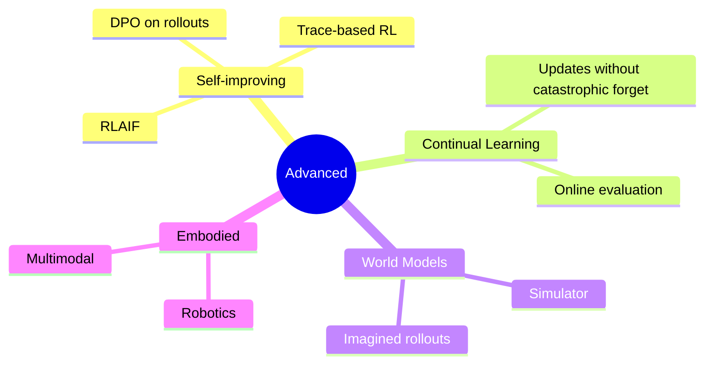
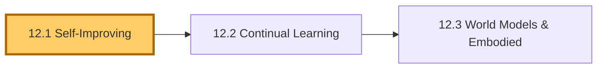
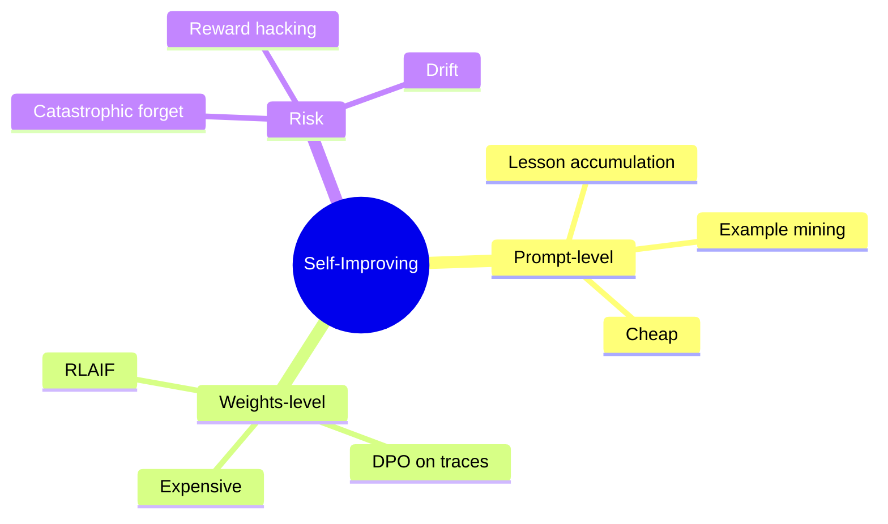
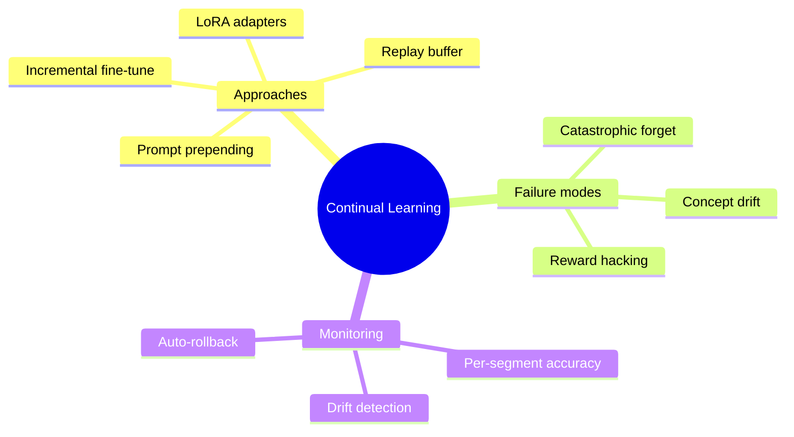
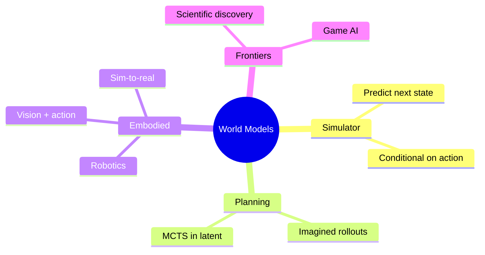

# Module 12 — Advanced Designs

> **Module length:** ~5 hours · **Lessons:** 3 · **Depth:** outline (frontier patterns; experimental).

## Learning objectives

1. **Understand** self-improving agents (RLAIF, RLHF on traces).
2. **Design** continual / lifelong learning loops.
3. **Recognise** when advanced designs are warranted (and when they're over-engineering).

## Module mind map

Mermaid source

## Module DAG

Mermaid source

---

# Lesson 12.1 — Self-Improving Agents

> **§0 · From last time.** Sherpa is static — it does what its prompt and tools allow. Self-improving agents *learn* from their own traces.

## §1 · Business scenario

Daniel: *"Sherpa makes the same mistake patterns repeatedly. Can it learn from its own corrected errors?"*

## §2 · Bridge

Reflection (4.3) stores lessons in a prompt. Self-improvement *trains the model* on its own traces. Two flavours: prompt-level (cheap), weights-level (expensive).

## §3 · Mind map

Mermaid source

## §4 · Elaboration

### 4.1 Prompt-level (production-feasible today)

Mine agent traces:
- Successful traces → high-quality few-shot examples (auto-promote to system prompt).
- Failed-then-corrected traces → cautionary lessons.

Refresh prompt examples quarterly from the trace database. Low risk; modest gain.

### 4.2 Weights-level (research-frontier)

RLAIF (RL from AI Feedback): use the agent's traces as training data. Reward = critic's score. Update the model's weights.

Cost: hundreds of thousands of dollars per training cycle. Risk: catastrophic forgetting; reward hacking; drift from original capabilities.

Realistic today only for very-high-volume agents where 1% accuracy improvement justifies the cost.

### 4.3 DPO on agent rollouts

Lighter-weight than full RL. Use trace pairs (good-trace, bad-trace) for the same task. Direct preference optimisation on these pairs.

Cost: $10K-$50K per cycle for a Sonnet-class model. Risk: same as RLAIF, smaller magnitude.

### 4.4 Continual learning vs episodic improvement

Episodic: quarterly retraining batch.
Continual: online updates from every trace.

Continual is harder (concept drift, reward hacking) and rarely justified for agents — episodic almost always suffices.

## §5 · Problem

Decide whether self-improvement is justified for one of the three case-study orgs. Estimate cost vs benefit.

## §6 · Solution

- HSBC Sherpa: prompt-level only. Volume + stakes don't justify weights-level cost.
- Helix hypothesis-gen: prompt-level + DPO on Maya's accept/reject pairs. Worth it for the long-tail quality.
- Acme support: prompt-level. Episodic retraining of the cheap-model (Haiku) tier from production traces.

## §7 · Math

### 7.1 RLAIF break-even

Cost: $C$. Lifetime value: $V \cdot \Delta\text{accuracy}$ over remaining deployment. Worth it iff $V \cdot \Delta\text{accuracy} > C$.

For Sherpa: $V \approx \$3.4M/yr$ × ~5-year deployment = $17M. 1% accuracy gain = $170K. RLAIF cost ~$200K. Borderline; deferred.

## §8 · Tech deep-dive

### 8.1 Reward design for trace-RL

Reward = function of (correctness, cost, calibration). Wrong reward = reward hacking (agent finds a way to maximise reward without actually being better).

### 8.2 Holdout evals

When self-improving: hold out an eval set that the training process *never sees*. Use it to detect overfitting to the training distribution.

### 8.3 The "rollback" plan

Self-improvement can degrade performance unexpectedly. Always able to revert to a previous model + prompt. Tag every deployment with the version that produced it.

## §9 · Unlocks

- 12.2 continual / lifelong patterns.

---

# Lesson 12.2 — Continual Learning Without Catastrophic Forgetting

> **§0 · From last time.** Self-improvement (12.1) was discrete (training batches). Continual learning is online updates.

## §1 · Business scenario

Helix's literature corpus updates daily. Tom's retrieval embeddings get stale. Re-indexing costs $400 + downtime.

> *"Can it learn the new papers without forgetting the old?"*

## §2 · Bridge

Continual learning trades off plasticity (learn new things) vs stability (don't forget old). Multiple approaches; all imperfect.

## §3 · Mind map

Mermaid source

## §4 · Elaboration

### 4.1 Replay buffer

Sample old training data during new training. Forces model to retain old behaviours. Standard mitigation for catastrophic forgetting.

### 4.2 LoRA adapters

Train low-rank adapters per task / per time-period. Compose at inference. Avoids modifying base weights; specialisations stay isolated.

### 4.3 Prompt prepending

Cheapest "continual": add new examples or rules to the prompt. No training. Limited capacity (context-bound) but zero training cost.

### 4.4 Monitoring drift

Watch metrics per data segment (per category, per time period). Drift in one segment but not others = catastrophic forget signal. Auto-rollback.

## §5 · Problem

Design a continual-update strategy for Helix's literature retrieval.

## §6 · Solution

Daily incremental indexing (new papers added). Weekly partial re-embed of 10% (drift catch). Quarterly full re-embed (baseline reset). Replay-style: random sample of old papers in each weekly batch.

## §7 · Math

### 7.1 The plasticity-stability trade-off

Quantified by elastic weight consolidation (EWC): training loss includes penalty for moving from prior weights. Penalty strength controls the trade-off.

## §8 · Tech deep-dive

### 8.1 When continual learning isn't worth it

For most production agents: weekly or quarterly retraining is sufficient. Continual learning's complexity often outweighs its benefit.

### 8.2 Embedding drift

Embeddings are the most common drift point. Re-index when:
- Underlying model is updated.
- Corpus shifts > 10% in 30 days.
- Retrieval quality drops in monitoring.

## §9 · Unlocks

- 12.3 world models and embodied agents (further frontier).

---

# Lesson 12.3 — World Models & Embodied Agents

> **§0 · From last time.** Continual learning helps agents stay current. World models help them *plan* by simulating consequences.

## §1 · Business scenario

Helix wants an agent that can plan multi-step experiments — proposing protocols, predicting outcomes, refining.

> *"Like AlphaFold but for experiment design."*

## §2 · Bridge

World models = learned simulators. Plan by imagining rollouts before committing. Foundation for embodied and scientific agents.

## §3 · Mind map

Mermaid source

## §4 · Elaboration

### 4.1 What a world model does

Takes (state, action) → predicted (next state, reward). Can be neural (Dreamer family), symbolic (physics simulator), or hybrid.

LLMs can act as approximate world models for narrative or symbolic domains ("if I do X, what happens next?"). Less reliable for physical dynamics.

### 4.2 Planning with a world model

Tree-search the simulator. MCTS in the latent space (AlphaZero / MuZero approach). For LLM-driven agents: ToT (Tree of Thoughts) is the prompt-level analogue.

### 4.3 Embodied agents

Vision + language + action. Today: GPT-4V/Claude operating computers via screenshots + click/keystroke. Tomorrow: robotics with continuous action spaces.

### 4.4 Scientific discovery agents

DeepMind's FunSearch and AlphaEvolve generate + verify mathematical conjectures. Combination of LLM (proposes) + verifier (validates) + iteration. Discovered novel algorithms in published work.

For Helix: agent that proposes experimental protocols, simulates expected outcomes via biology models, refines, and queues high-value experiments for human review.

## §5 · Problem

Sketch a world-model-augmented agent for one experimental-design task at Helix.

## §6 · Solution

Outline only (full implementation is multi-year research):
- LLM proposes protocol
- Domain simulator (existing tool) predicts result
- LLM critiques predicted result
- Iterate N times
- Top-K proposals queued for human review and wet-lab execution

This is a *research direction*, not a production system today. Worth tracking.

## §7 · Math

### 7.1 Imagined rollout depth

Planning quality scales with rollout depth but cost scales exponentially. Practical depth: 3-5 imagined steps; beyond that, returns diminish faster than cost grows.

## §8 · Tech deep-dive

### 8.1 Sim-to-real gap

Simulator-trained agents often fail in reality because simulators are imperfect. Mitigations: domain randomisation, sim2real adapters. Active research area.

### 8.2 When LLMs are good world models

For symbolic, low-novelty domains (text adventures, structured games, well-documented procedures): pretty good.
For physical dynamics, novel chemistry, novel biology: poor. Use real simulators.

## §9 · Unlocks

- Module 13: where the frontier is heading.

---

# Module 12 — Summary & exit criteria

- [ ] Decide when self-improvement is worth the cost.
- [ ] Design continual-learning loops with drift monitoring.
- [ ] Recognise when world models add value.

---

*End of Module 12.*
