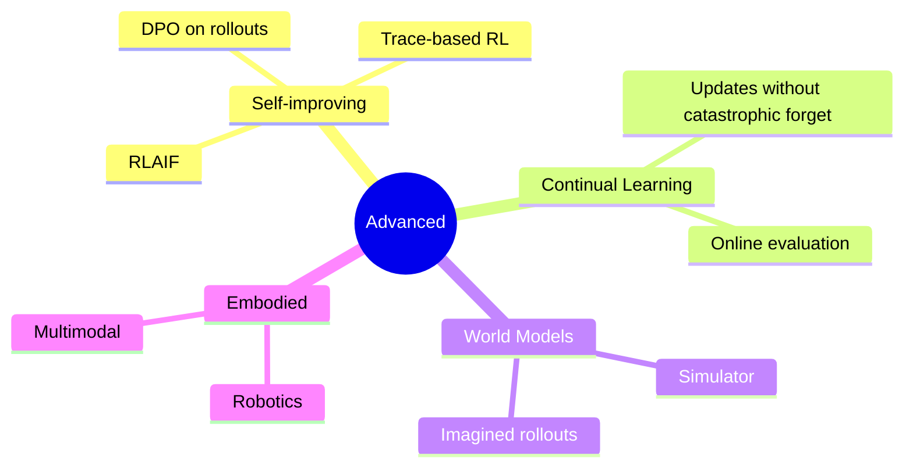
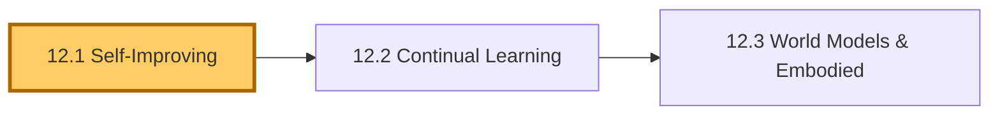
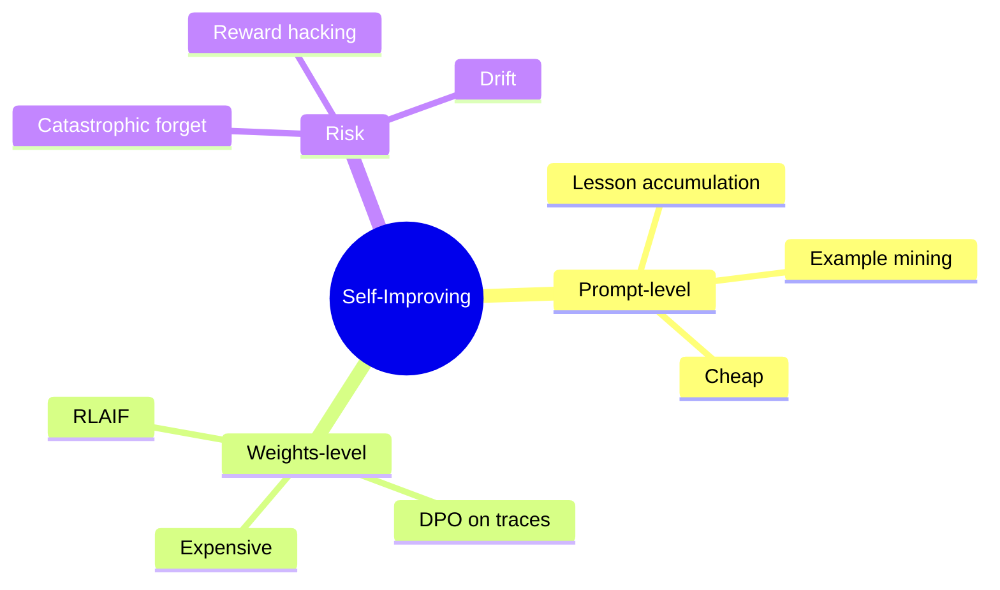
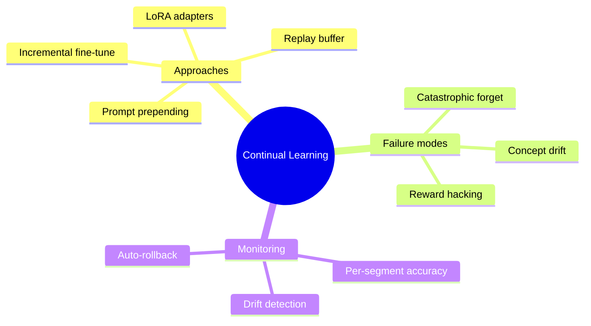
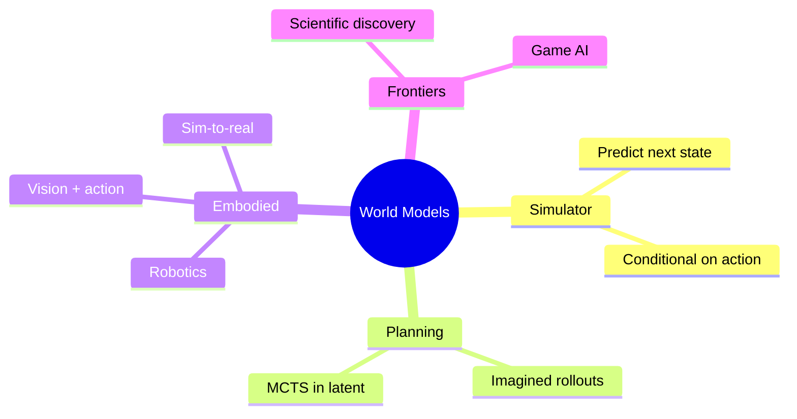

# Module 12 — Advanced Designs

> **Module length:** ~5 hours · **Lessons:** 3 · **Depth:** outline (frontier patterns; experimental).

## Learning objectives

1. **Understand** self-improving agents (RLAIF, RLHF on traces).
2. **Design** continual / lifelong learning loops.
3. **Recognise** when advanced designs are warranted (and when they're over-engineering).

## Module mind map


<details><summary>Mermaid source</summary>



</details>

## Module DAG


<details><summary>Mermaid source</summary>



</details>

---

# Lesson 12.1 — Self-Improving Agents

> **§0 · From last time.** Sherpa is static — it does what its prompt and tools allow. Self-improving agents *learn* from their own traces.

## §1 · Business scenario

Daniel: *"Sherpa makes the same mistake patterns repeatedly. Can it learn from its own corrected errors?"*

## §2 · Bridge

Reflection (4.3) stores lessons in a prompt. Self-improvement *trains the model* on its own traces. Two flavours: prompt-level (cheap), weights-level (expensive).

## §3 · Mind map


<details><summary>Mermaid source</summary>



</details>

## §4 · Elaboration

### 4.1 Prompt-level (production-feasible today)

Mine agent traces:
- Successful traces → high-quality few-shot examples (auto-promote to system prompt).
- Failed-then-corrected traces → cautionary lessons.

Refresh prompt examples quarterly from the trace database. Low risk; modest gain.

### 4.2 Weights-level (research-frontier)

RLAIF (RL from AI Feedback): use the agent's traces as training data. Reward = critic's score. Update the model's weights.

Cost: hundreds of thousands of dollars per training cycle. Risk: catastrophic forgetting; reward hacking; drift from original capabilities.

Realistic today only for very-high-volume agents where 1% accuracy improvement justifies the cost.

### 4.3 DPO on agent rollouts

Lighter-weight than full RL. Use trace pairs (good-trace, bad-trace) for the same task. Direct preference optimisation on these pairs.

Cost: $10K-$50K per cycle for a Sonnet-class model. Risk: same as RLAIF, smaller magnitude.

### 4.4 Continual learning vs episodic improvement

Episodic: quarterly retraining batch.
Continual: online updates from every trace.

Continual is harder (concept drift, reward hacking) and rarely justified for agents — episodic almost always suffices.

## §5 · Problem

Decide whether self-improvement is justified for one of the three case-study orgs. Estimate cost vs benefit.

## §6 · Solution

- HSBC Sherpa: prompt-level only. Volume + stakes don't justify weights-level cost.
- Helix hypothesis-gen: prompt-level + DPO on Maya's accept/reject pairs. Worth it for the long-tail quality.
- Acme support: prompt-level. Episodic retraining of the cheap-model (Haiku) tier from production traces.

## §7 · Math

### 7.1 RLAIF break-even

Cost: $C$. Lifetime value: $V \cdot \Delta\text{accuracy}$ over remaining deployment. Worth it iff $V \cdot \Delta\text{accuracy} > C$.

For Sherpa: $V \approx \$3.4M/yr$ × ~5-year deployment = $17M. 1% accuracy gain = $170K. RLAIF cost ~$200K. Borderline; deferred.

## §8 · Tech deep-dive

### 8.1 Reward design for trace-RL

Reward = function of (correctness, cost, calibration). Wrong reward = reward hacking (agent finds a way to maximise reward without actually being better).

### 8.2 Holdout evals

When self-improving: hold out an eval set that the training process *never sees*. Use it to detect overfitting to the training distribution.

### 8.3 The "rollback" plan

Self-improvement can degrade performance unexpectedly. Always able to revert to a previous model + prompt. Tag every deployment with the version that produced it.

### 8.4 The full prompt-level improvement pipeline

Production-feasible today, low risk:

```typescript
async function refreshPromptFromTraces() {
  // Step 1: pull recent traces (last 30 days)
  const traces = await traceStore.recent({ days: 30 });
  
  // Step 2: classify each: success / failure / borderline
  const labelled = await Promise.all(traces.map(async (t) => ({
    trace: t,
    label: await classifyOutcome(t),  // ground truth from human review
  })));
  
  // Step 3: mine cautionary lessons from failures
  const failureLessons: Lesson[] = [];
  for (const t of labelled.filter(x => x.label === "failure")) {
    const lesson = await llm.extractLesson({
      trace: t.trace,
      prompt: "What single rule, if shown to the agent on similar future cases, would prevent this error?",
    });
    failureLessons.push({
      text: lesson.text,
      triggers: extractTriggers(t.trace),
      source_case_id: t.trace.id,
    });
  }
  
  // Step 4: mine examples from successes
  const examples = await Promise.all(
    labelled
      .filter(x => x.label === "success")
      .slice(0, 50)
      .map(async (t) => ({
        trace: t.trace,
        score: await scoreExample(t.trace, { dimensions: ["clarity", "diversity"] }),
      }))
  );
  // Top 5 by score, diverse coverage
  const bestExamples = diversify(examples.sort((a, b) => b.score - a.score), 5);
  
  // Step 5: propose new prompt
  const proposedPrompt = buildPrompt({
    base: BASE_PROMPT,
    examples: bestExamples,
    lessons: failureLessons.filter(l => l.source_case_id),
  });
  
  // Step 6: A/B test the proposed prompt
  const abTest = await runABTest({
    control: currentPrompt,
    treatment: proposedPrompt,
    eval_set: regressionEvalSet,
    cases_per_arm: 100,
  });
  
  // Step 7: promote only if treatment wins on accuracy without
  // significant cost or latency regression
  if (abTest.accuracy_delta > 0 && abTest.cost_delta < 1.10) {
    await promotePrompt(proposedPrompt);
    return { success: true, accuracyGain: abTest.accuracy_delta };
  }
  return { success: false, reason: "no_improvement" };
}
```

Run quarterly. Catches systematic regressions; surfaces lessons; refreshes the prompt without manual labour.

### 8.5 DPO on agent rollouts: when it's worth it

DPO (Direct Preference Optimization) trades pretraining-quality preference data for inference-time preference data.

Cost-benefit (Sherpa case):
- Trace pairs to collect: ~5,000 (one good, one corrected, per case)
- Annotation cost: free (we already have human corrections from Aisha's team)
- Training cost: ~$15K (Sonnet-class fine-tune via Anthropic's training API or self-hosted)
- Expected accuracy gain: 2-4pp (literature estimate)
- Annual value of 3pp accuracy gain: ~$30K (avoided wrong classifications)

**Verdict**: borderline. Worth piloting; not slam-dunk.

When DPO clearly wins:
- High volume (>10K tasks/day) with measurable accuracy gradient
- Substantial preference data (>10K pairs)
- Tasks where prompt engineering has saturated

When it doesn't:
- Low volume (gains don't amortise)
- No reliable preference signal (everything's already "correct")
- Tasks where capability gap matters more than calibration (use a bigger model instead)

### 8.6 The catastrophic-forgetting protection scheme

For any weights-level update:

```
Pre-training-step:
  1. Snapshot current weights (versioned).
  2. Snapshot regression-eval baseline performance per slice.

Post-training-step:
  3. Re-run regression eval per slice.
  4. For each slice: did accuracy drop >2pp? If yes, training over-fit a different slice; reject.
  5. Run "old test" — a holdout from the previous training round; ensures we haven't forgotten what we already knew.
  6. If all checks pass: promote new weights.
  7. If checks fail: rollback to snapshot.
```

This is the elasticity-vs-stability trade-off made operational. Most self-improvement work that fails in production fails at step 4 or 5.

### 8.7 The "synthetic data" temptation (and why to resist initially)

Generating training data with an LLM is tempting but high-risk:

- Synthetic data inherits the generator's biases.
- Hard to verify quality at scale.
- Can introduce subtle distributional shift.
- Sometimes the model trains on its own outputs and degrades.

Use synthetic data only:
- For *augmenting* real data (10% synthetic + 90% real, not the reverse).
- With explicit human review of a sample.
- For known-rare categories you can't naturally collect.

Production teams that get heavily into synthetic data within their first year usually regret it. Start with real data; consider synthetic after you've shipped a working system.

### 8.8 RLAIF break-even (updated with worked numbers)

For Sherpa specifically:
- Task volume: 1,400/night × 365 = ~511K/year
- Cost of being wrong: $42 (analyst rework + audit overhead)
- Current accuracy: 89%
- Projected accuracy with RLAIF: 91-92% (literature; high uncertainty)
- Expected value of 2pp gain: 511K × 0.02 × $42 = $429K/year
- RLAIF cost (one-time): ~$200K
- RLAIF cost (annual refresh): ~$100K

**Net**: +$329K Year 1, +$329K/year ongoing.

**But**: literature gains often don't transfer (the +2pp may not materialise in your domain). Pilot before committing.

**Recommended path**: prompt-level improvements first (cheap, low-risk, captures 50% of the value). DPO if prompt-level saturates. Full RLAIF only if DPO gain is convincing.

## §9 · Unlocks

- 12.2 continual / lifelong patterns.

---

# Lesson 12.2 — Continual Learning Without Catastrophic Forgetting

> **§0 · From last time.** Self-improvement (12.1) was discrete (training batches). Continual learning is online updates.

## §1 · Business scenario

Helix's literature corpus updates daily. Tom's retrieval embeddings get stale. Re-indexing costs $400 + downtime.

> *"Can it learn the new papers without forgetting the old?"*

## §2 · Bridge

Continual learning trades off plasticity (learn new things) vs stability (don't forget old). Multiple approaches; all imperfect.

## §3 · Mind map


<details><summary>Mermaid source</summary>



</details>

## §4 · Elaboration

### 4.1 Replay buffer

Sample old training data during new training. Forces model to retain old behaviours. Standard mitigation for catastrophic forgetting.

### 4.2 LoRA adapters

Train low-rank adapters per task / per time-period. Compose at inference. Avoids modifying base weights; specialisations stay isolated.

### 4.3 Prompt prepending

Cheapest "continual": add new examples or rules to the prompt. No training. Limited capacity (context-bound) but zero training cost.

### 4.4 Monitoring drift

Watch metrics per data segment (per category, per time period). Drift in one segment but not others = catastrophic forget signal. Auto-rollback.

## §5 · Problem

Design a continual-update strategy for Helix's literature retrieval.

## §6 · Solution

Daily incremental indexing (new papers added). Weekly partial re-embed of 10% (drift catch). Quarterly full re-embed (baseline reset). Replay-style: random sample of old papers in each weekly batch.

## §7 · Math

### 7.1 The plasticity-stability trade-off

Quantified by elastic weight consolidation (EWC): training loss includes penalty for moving from prior weights. Penalty strength controls the trade-off.

## §8 · Tech deep-dive

### 8.1 When continual learning isn't worth it

For most production agents: weekly or quarterly retraining is sufficient. Continual learning's complexity often outweighs its benefit.

### 8.2 Embedding drift

Embeddings are the most common drift point. Re-index when:
- Underlying model is updated.
- Corpus shifts > 10% in 30 days.
- Retrieval quality drops in monitoring.

### 8.3 Detection mechanisms for distribution shift

Three statistical tests for noticing the world has changed:

1. **Population stability index (PSI)** on input distributions:
   $$\text{PSI} = \sum_i (p_i^{\text{new}} - p_i^{\text{ref}}) \ln \frac{p_i^{\text{new}}}{p_i^{\text{ref}}}$$
   
   PSI > 0.1: notable shift. PSI > 0.25: significant shift. Re-eval.

2. **Per-slice accuracy drift**: compute per-slice accuracy weekly. Drop >3pp in any slice that previously held: distribution shift in that slice.

3. **Confidence calibration drift**: if elicited confidence is no longer matched by actual accuracy, the model's worldview has shifted relative to the world.

Each test catches a different shift type. Run all three.

### 8.4 The "shadow training" pattern

Train a candidate model in parallel with production; never serve it; just compare:

```typescript
async function shadowTrain() {
  const newWeights = await dpo(
    base: productionModel,
    training_data: recent_traces,
    hyperparameters: { ... },
  );
  
  // Never serve newWeights to production
  
  // Just evaluate on regression set
  const newPerf = await evaluate(newWeights, regressionSet);
  const productionPerf = await getProductionMetrics();
  
  // If new beats production by 2pp on accuracy, low cost regression:
  if (newPerf.accuracy > productionPerf.accuracy + 0.02
      && newPerf.cost <= productionPerf.cost * 1.1) {
    await proposePromotion(newWeights);  // file PR; human review
  } else {
    await archive(newWeights);  // keep for later analysis
  }
}
```

Shadow training lets you experiment freely without production risk. Most candidates get archived. Occasionally one gets promoted.

### 8.5 LoRA adapters: a lighter alternative to full fine-tuning

Instead of modifying base weights, train small low-rank adapters that compose with the base. Benefits:
- Cheap to train (~$1-5K per adapter vs $15K+ for DPO).
- Multiple adapters can be composed (one per domain).
- Easy to discard or swap.
- Base model unchanged → no catastrophic forgetting.

For Sherpa: a "novel counterparty" LoRA adapter activated only when input matches that pattern. Training data: 500 historical novel-counterparty cases with human-corrected answers. Trained in 2 hours. Promoted to production after passing eval. Improved novel-counterparty accuracy from 78% to 86%.

LoRA is the most practical continual-learning option for most teams today.

### 8.6 Concept-drift alerts in production

Beyond passive monitoring, set up explicit alerts:

```yaml
alerts:
  - name: distribution_shift_detected
    metric: input_psi_7d
    threshold: 0.15
    action: page secondary on-call; spawn investigation
    
  - name: per_slice_accuracy_drop
    metric: accuracy_per_category_7d
    condition: any slice dropped >3pp from baseline
    action: file high-priority ticket
    
  - name: calibration_decay
    metric: ece_28d
    threshold: 0.06
    action: ticket for next sprint
    
  - name: emerging_failure_pattern
    metric: failure_cluster_size
    condition: similar failures > 10 in 24h
    action: page; failure-mode review
```

Each alert points to a different "drift" type. Without these, you discover degradation only when users complain.

### 8.7 When NOT to invest in continual learning

If any of:
- Task distribution is stable (regulated workflows, well-defined processes).
- Volume is low enough that retraining doesn't amortise.
- The team can't afford the operational complexity (small teams, no MLOps).

…stick with episodic retraining. Quarterly batch updates work fine for >70% of agent deployments. Continual learning adds complexity that most teams don't need.

### 8.8 The maturity curve for "self-improving" agents

| Level | Description | Investment |
|---|---|---|
| 0 | Static prompts; updated manually | Minimal |
| 1 | Few-shot examples refreshed quarterly from production traces | Low |
| 2 | Procedural memory (Lesson 4.3 lessons) auto-promoted | Low |
| 3 | Periodic A/B-tested prompt regeneration from traces | Medium |
| 4 | DPO on agent rollouts; quarterly model refresh | High |
| 5 | Full RLAIF with online evaluation; continual updates | Very high |

Most production agents should be at level 1-2. Level 3 if you have eval infrastructure. Level 4+ requires substantial ML investment.

Sherpa today is at level 2. Plan to reach level 3 over the next year. Level 4+ deferred until value is clearly demonstrated.

## §9 · Unlocks

- 12.3 world models and embodied agents (further frontier).

---

# Lesson 12.3 — World Models & Embodied Agents

> **§0 · From last time.** Continual learning helps agents stay current. World models help them *plan* by simulating consequences.

## §1 · Business scenario

Helix wants an agent that can plan multi-step experiments — proposing protocols, predicting outcomes, refining.

> *"Like AlphaFold but for experiment design."*

## §2 · Bridge

World models = learned simulators. Plan by imagining rollouts before committing. Foundation for embodied and scientific agents.

## §3 · Mind map


<details><summary>Mermaid source</summary>



</details>

## §4 · Elaboration

### 4.1 What a world model does

Takes (state, action) → predicted (next state, reward). Can be neural (Dreamer family), symbolic (physics simulator), or hybrid.

LLMs can act as approximate world models for narrative or symbolic domains ("if I do X, what happens next?"). Less reliable for physical dynamics.

### 4.2 Planning with a world model

Tree-search the simulator. MCTS in the latent space (AlphaZero / MuZero approach). For LLM-driven agents: ToT (Tree of Thoughts) is the prompt-level analogue.

### 4.3 Embodied agents

Vision + language + action. Today: GPT-4V/Claude operating computers via screenshots + click/keystroke. Tomorrow: robotics with continuous action spaces.

### 4.4 Scientific discovery agents

DeepMind's FunSearch and AlphaEvolve generate + verify mathematical conjectures. Combination of LLM (proposes) + verifier (validates) + iteration. Discovered novel algorithms in published work.

For Helix: agent that proposes experimental protocols, simulates expected outcomes via biology models, refines, and queues high-value experiments for human review.

## §5 · Problem

Sketch a world-model-augmented agent for one experimental-design task at Helix.

## §6 · Solution

Outline only (full implementation is multi-year research):
- LLM proposes protocol
- Domain simulator (existing tool) predicts result
- LLM critiques predicted result
- Iterate N times
- Top-K proposals queued for human review and wet-lab execution

This is a *research direction*, not a production system today. Worth tracking.

## §7 · Math

### 7.1 Imagined rollout depth

Planning quality scales with rollout depth but cost scales exponentially. Practical depth: 3-5 imagined steps; beyond that, returns diminish faster than cost grows.

## §8 · Tech deep-dive

### 8.1 Sim-to-real gap

Simulator-trained agents often fail in reality because simulators are imperfect. Mitigations: domain randomisation, sim2real adapters. Active research area.

### 8.2 When LLMs are good world models

For symbolic, low-novelty domains (text adventures, structured games, well-documented procedures): pretty good.
For physical dynamics, novel chemistry, novel biology: poor. Use real simulators.

### 8.3 Imagined rollouts as a practical pattern

Even without a formal world model, you can do imagined rollouts in prompt-space:

```typescript
// Pseudo-rollout: ask the model to "imagine forward" before acting
async function imaginedRolloutDecide(
  state: AgentState,
  candidate_actions: Action[]
): Promise<Action> {
  const evaluations = await Promise.all(
    candidate_actions.map(async (action) => {
      const projection = await llm.call({
        prompt: `Given state ${JSON.stringify(state)}, if I take action ${action}, 
                 predict the next observation and the long-term outcome. 
                 Score 0-10 for goal achievement.`,
      });
      return { action, projection };
    })
  );
  
  // Pick action with best projected outcome
  return evaluations.sort((a, b) => b.projection.score - a.projection.score)[0].action;
}
```

This is Tree-of-Thoughts in spirit. Cost: linear in candidate actions × LLM call. Value: detects "obviously-bad" actions before committing.

For Helix hypothesis generation: imagined rollouts of "what would the experiment results be if this hypothesis is true?" filters out testable-but-uninteresting hypotheses.

### 8.4 The simulator-quality trade-off

A learned world model is only as useful as its accuracy. Three regimes:

| Simulator accuracy | Use case |
|---|---|
| <60% | Useless; predictions are noise |
| 60-80% | Useful for filtering; not for committing |
| 80-95% | Useful for planning; verify with real execution |
| >95% | Can drive decisions directly |

LLMs as world models for *narrative* domains: 70-85%.
LLMs as world models for *quantitative* physical domains: 30-50%. Insufficient.

Use formal simulators where they exist (physics engines, finance simulators, biology models). Use LLMs only for the narrative/symbolic glue.

### 8.5 Embodied agents: the sim-to-real gap

For agents acting in the physical world (robotics) or in the GUI world (computer use):

- **Sim-to-real gap**: simulator-trained agents underperform reality by 20-50%.
- **Vision quality**: even SOTA vision models have failure modes on edge cases that don't appear in simulation.
- **Action precision**: micro-misalignments in robotics; click-target errors in GUI.

Practical pattern for GUI computer-use agents (today's frontier):

```typescript
async function clickWithFallback(target: UIElement) {
  // Primary: visual click via screenshot
  const click_result = await visualClick(target);
  if (verifyClickSucceeded(click_result)) return;
  
  // Fallback 1: semantic accessibility-tree click
  const semantic_result = await accessibilityClick(target.aria_label);
  if (verifyClickSucceeded(semantic_result)) return;
  
  // Fallback 2: report failure; agent decides next step
  return { failed: true, reason: "click_target_not_found" };
}
```

Belt-and-suspenders. Each layer covers the previous layer's failure modes.

### 8.6 Scientific discovery agents: the FunSearch / AlphaEvolve pattern

The pattern that's actually producing publishable results:

```
1. LLM proposes candidate solutions (mathematical conjectures, algorithms, etc.)
2. Verifier (formal proof checker, simulator, programmatic test) accepts/rejects each
3. Successful candidates feed back as examples for the next round
4. Iterate; the population of accepted solutions improves over time
```

Why this works:
- Generation by LLM (creative but unreliable)
- Verification by formal system (deterministic, reliable)
- Population-based exploration finds non-obvious paths
- Verifier doesn't trust generator; only accepts what passes

This is the pattern most likely to drive agent-led scientific discovery in the next 3-5 years. Requires: cheap, reliable verifier in your domain.

For Helix: drug-target binding affinity predictors are good verifiers. Wet-lab experiments are the gold-standard verifier (slow, expensive). The agent can shortlist; humans decide what to actually run.

### 8.7 The "agentic discovery" workflow at Helix

A practical near-term workflow:

```
Week 1-4: Set up agent + verifier
  - Agent prompts: "Given target X, propose 10 novel candidate drugs with rationale"
  - Verifier: existing binding-affinity prediction model
  - Filter: reject candidates the verifier says are unlikely to bind

Week 5-8: Pilot run
  - Agent generates 500 candidates over 4 weeks
  - Verifier filters to top 50
  - Maya reviews top 50 with biological intuition
  - Top 10 enter wet-lab pipeline

Week 9-16: Evaluate results
  - Wet-lab confirms binding for 6/10 (60% — typical for first pass)
  - Of those, 2 advance to further validation
  - Compare to baseline (Maya alone, same time): 1 advancing typically

Result: agent-augmented workflow finds ~2× as many viable leads.
```

Today's reality, not 2030 promise.

### 8.8 Frontiers vs near-term practice

| Capability | Production-ready today | Research today | 5-year forecast |
|---|---|---|---|
| World-model planning | LLM rollouts (limited) | Trained simulators (RL) | Hybrid: trained sims + LLM glue |
| Continual learning | LoRA adapters | RLAIF | Standard practice for high-volume agents |
| Embodied (GUI) | Anthropic computer use, OpenAI Operator | Multi-modal action models | Routine for many business workflows |
| Embodied (robotics) | Narrow domains (warehouse, lab) | Foundation models for action | Expanding to general-purpose tasks |
| Scientific discovery | Pattern above; narrow domains | AlphaEvolve, FunSearch | Routine for math + simulation-heavy science |
| Multi-agent ensembles | 2-3 agent production deployments | 10+ agent research systems | 5-10 agent production routine |

Plan for what you can deploy today. Track what's likely in 2-3 years. Stay informed but don't bet the business on what's "5 years out" — you'd be planning for the road that doesn't exist yet.

## §9 · Unlocks

- Module 13: where the frontier is heading.

---

# Module 12 — Summary & exit criteria

- [ ] Decide when self-improvement is worth the cost.
- [ ] Design continual-learning loops with drift monitoring.
- [ ] Recognise when world models add value.

---

*End of Module 12.*
