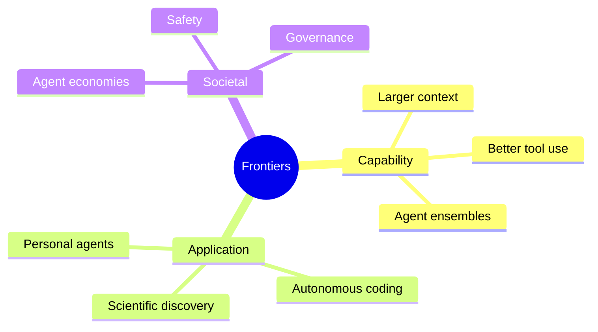
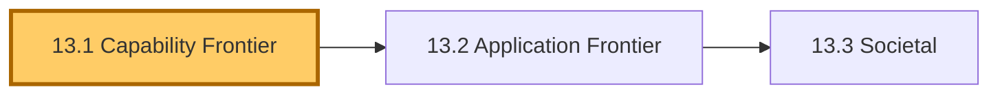
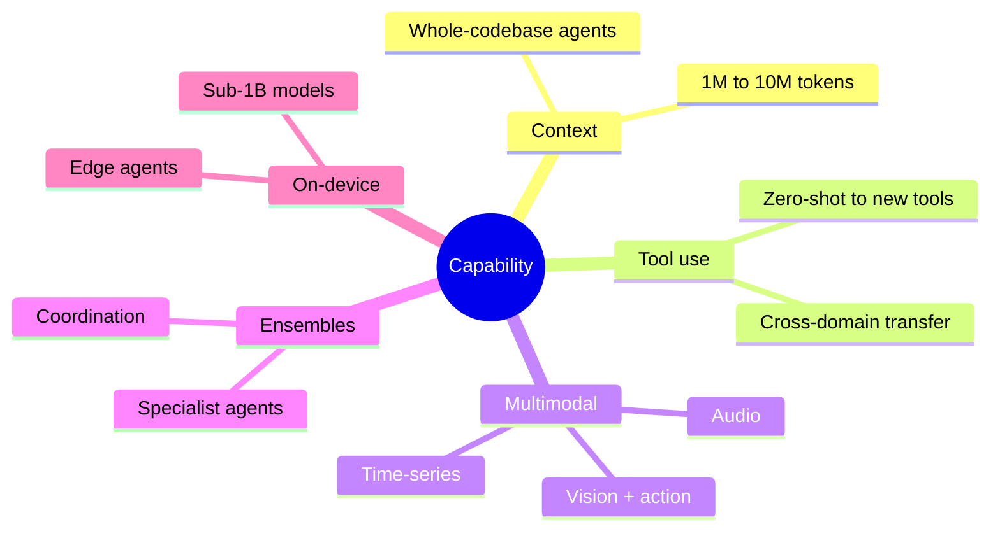
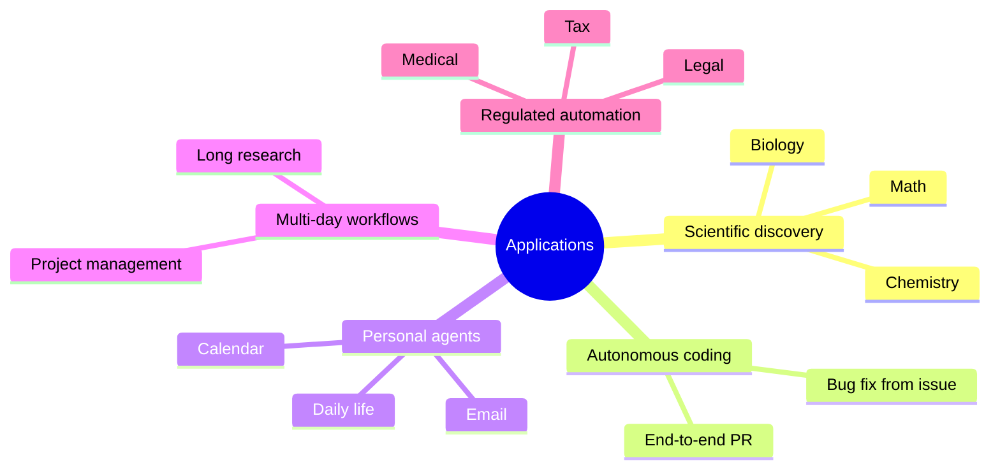
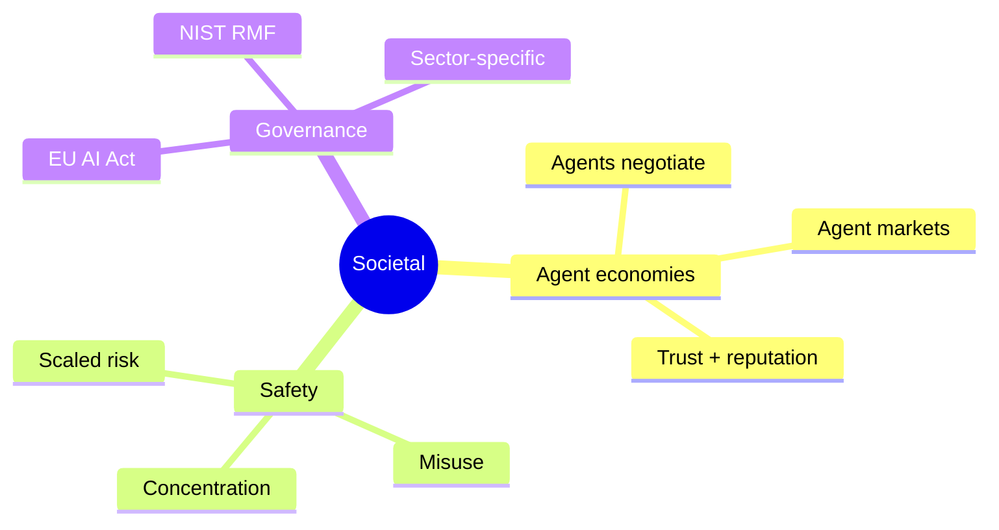

# Module 13 — Future Applications & Research Frontiers

> **Module length:** ~4 hours · **Lessons:** 3 · **Depth:** outline (forward-looking; meant to orient, not commit).

## Learning objectives

1. **Map** the current research frontier in agent design.
2. **Anticipate** which patterns will likely become production-feasible in 12-36 months.
3. **Distinguish** hype from genuine capability advance.

## Module mind map

Mermaid source

## Module DAG

Mermaid source

---

# Lesson 13.1 — Capability Frontier

> **§0 · From last time.** Module 12 covered advanced designs deployable in 12-24 months. This lesson looks further: 24-60 months.

## §1 · Business scenario

Priya asks: *"What does Sherpa look like in 2030? Do I plan for it now?"*

## §2 · Bridge

The capability frontier is moving in five directions: longer context, better tool-use generalisation, multi-modality, agent ensembles, on-device agents. Knowing which moves matter for your domain shapes 3-year planning.

## §3 · Mind map

Mermaid source

## §4 · Elaboration

### 4.1 Context window growth

10M-token windows are imminent. Enables: whole-codebase reasoning, whole-quarter trace analysis, long-horizon multi-agent state. Cost/attention dynamics may not keep pace; expect retrieval to remain important.

### 4.2 Better tool-use generalisation

Models will get better at using tools they haven't seen before. Reduces the per-tool prompt engineering. MCP standardisation accelerates this.

### 4.3 Multimodality

Vision + action (computer use) is already deployed. Audio + action for voice agents is next. Time-series + action for forecasting agents in 12-24 months.

### 4.4 Agent ensembles

Specialist agents with strong coordination protocols. Today: brittle. In 2-3 years: a default architecture for complex domains.

### 4.5 On-device

Sub-1B parameter models hitting useful capability. Privacy-sensitive (Helix biotech, HSBC PII) deployments may shift on-device for some agent layers.

## §5 · Problem

Pick two of the five frontier directions. Sketch how each would affect Sherpa, Tom's literature agent, or Lin's support agent in 36 months.

## §6 · Solution

Various — answers depend on your specific deployment. Use the cost / quality / risk dimensions from Module 11.

## §7 · Math

No additional math; reuses Module 8/11.

## §8 · Tech deep-dive

### 8.1 The "wait for the model" anti-pattern

Tempting: defer building because next-year's model will be better. Wrong: every year delay = one year of forgone benefit. Build now with abstractions that let you upgrade later.

### 8.2 The "build for today" rule

Build for today's models. Architect for tomorrow's. Specifically: keep model-specific tricks out of your codebase; keep model upgrades as one-line config changes.

## §9 · Unlocks

- 13.2 application frontier.

---

# Lesson 13.2 — Application Frontier

> **§0 · From last time.** Capability changes enable new applications. This lesson catalogues the ones to watch.

## §1 · Business scenario

Strategy question for any org: which problems become tractable in 24-36 months that aren't today?

## §2 · Bridge

Five application frontiers: scientific discovery, autonomous coding, personal agents, multi-day workflows, regulated-industry automation.

## §3 · Mind map

Mermaid source

## §4 · Elaboration

### 4.1 Scientific discovery

AlphaFold pattern: domain model + LLM proposer + verifier. Likely to produce real publications in mathematics, chemistry, materials science by 2027.

### 4.2 Autonomous coding

Today: agents land ~30% of unaided GitHub issues. By 2027: likely 70%+ for well-scoped tasks. Implications: software-eng cost structure shifts toward review + design vs implementation.

### 4.3 Personal agents

Email triage, calendar coordination, daily task management. Today: brittle. Privacy concerns dominant.

### 4.4 Multi-day workflows

Today: agents do single-task work. Multi-day = multi-task, multi-stakeholder, multi-step. Requires durable execution (Module 9), better memory (Module 5), explicit state management.

### 4.5 Regulated-industry automation

Tax, legal, medical decision-support. Today: blocked by liability and explainability. Future: layered approach (agent suggests, human commits) becomes regulatory-approved standard.

## §5 · Problem

For your org: which frontier application would have highest ROI if it became feasible in 24 months?

## §6 · Solution

Build the ROI model now (Module 11). Revisit quarterly as capability progresses.

## §7 · Math

No additional math.

## §8 · Tech deep-dive

### 8.1 The "leading vs lagging" decision

Lead: invest now, hope to deploy before competitors when capability matures.
Lag: wait for proven patterns, deploy with lower risk.

Most orgs should lag on bleeding-edge capability and lead on careful deployment of mature capability. Trying to lead on both is overcommitment.

## §9 · Unlocks

- 13.3 closes with societal questions.

---

# Lesson 13.3 — Societal: Agent Economies, Safety, Governance

> **§0 · From last time.** Capability + applications produce societal effects. Worth a lesson because they affect your design choices today.

## §1 · Business scenario

Daniel: *"If every bank deploys a Sherpa, what happens?"*

## §2 · Bridge

Three societal threads: agent-to-agent economic activity, large-scale safety, regulatory governance.

## §3 · Mind map

Mermaid source

## §4 · Elaboration

### 4.1 Agent economies

Once agents are widespread, they will negotiate with each other (your refund agent talks to your supplier's claims agent). Requires identity, reputation, trust protocols. A2A standards bootstrap this.

Risk: agents can negotiate against their principals' interest (the supplier's agent finds an exploit your agent agrees to).

### 4.2 Safety at scale

When 1M agents act simultaneously, small per-agent risks become large aggregate risks. Examples: 1M agents all caching wrong information; 1M agents all triggering DDoS-like patterns on shared infrastructure.

Mitigations: rate limits aggregated across agents; coordination via shared signals (Module 6 + governance).

### 4.3 Governance

EU AI Act, NIST AI RMF, sector-specific (SR 11-7 for banking, FDA for medical) all apply. Map your deployment to applicable frameworks; build for the strictest.

For Sherpa: SR 11-7 + EU AI Act + GDPR. Each adds requirements; sum = the discipline this course has tried to teach.

## §5 · Problem

For your domain: which governance frameworks apply? What's the gap between current Sherpa-class design and full compliance?

## §6 · Solution

Module 10's audit + observability covers most requirements. Specific frameworks may add more (e.g., explainability requirements in EU AI Act). Build in, don't bolt on.

## §7 · Math

No additional math.

## §8 · Tech deep-dive

### 8.1 The "build for the strictest" rule

Among the regimes you operate in, pick the strictest. Build to it. Easier than building to each separately; over-compliance is rarely a problem.

### 8.2 The agent-as-fiduciary question

Agents act on behalf of principals. Legal frameworks for fiduciary duties (financial advisors, lawyers) are being extended. Watch this space.

## §9 · Unlocks

- The capstones: apply everything learned to a real(ish) project.

---

# Module 13 — Summary & exit criteria

- [ ] Identify the capability changes affecting your 3-year plan.
- [ ] Map applications that become tractable as capability scales.
- [ ] Plan for the governance regimes your deployment will face.

---

*End of Module 13. End of theory; on to capstones.*
