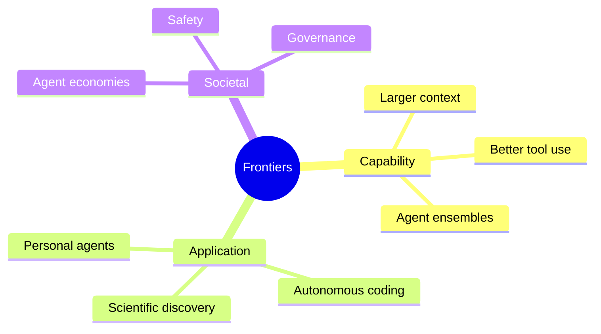
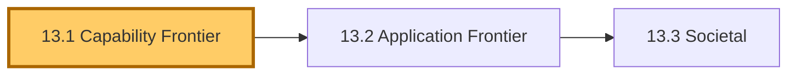
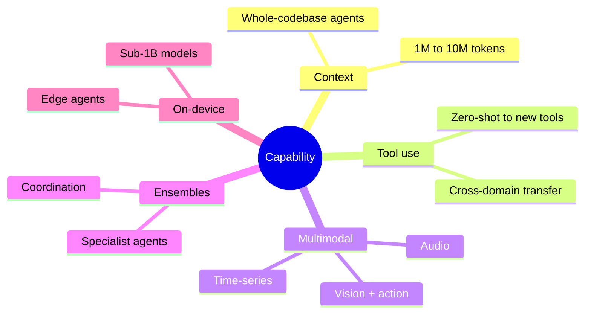
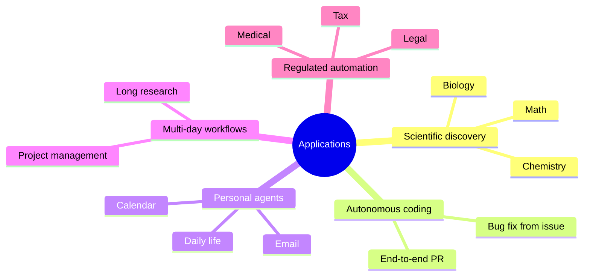
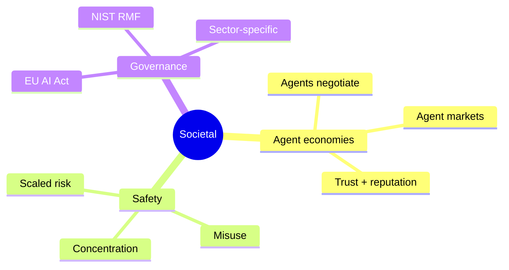

# Module 13 — Future Applications & Research Frontiers

> **Module length:** ~4 hours · **Lessons:** 3 · **Depth:** outline (forward-looking; meant to orient, not commit).

## Learning objectives

1. **Map** the current research frontier in agent design.
2. **Anticipate** which patterns will likely become production-feasible in 12-36 months.
3. **Distinguish** hype from genuine capability advance.

## Module mind map


<details><summary>Mermaid source</summary>



</details>

## Module DAG


<details><summary>Mermaid source</summary>



</details>

---

# Lesson 13.1 — Capability Frontier

> **§0 · From last time.** Module 12 covered advanced designs deployable in 12-24 months. This lesson looks further: 24-60 months.

## §1 · Business scenario

Priya asks: *"What does Sherpa look like in 2030? Do I plan for it now?"*

## §2 · Bridge

The capability frontier is moving in five directions: longer context, better tool-use generalisation, multi-modality, agent ensembles, on-device agents. Knowing which moves matter for your domain shapes 3-year planning.

## §3 · Mind map


<details><summary>Mermaid source</summary>



</details>

## §4 · Elaboration

### 4.1 Context window growth

10M-token windows are imminent. Enables: whole-codebase reasoning, whole-quarter trace analysis, long-horizon multi-agent state. Cost/attention dynamics may not keep pace; expect retrieval to remain important.

### 4.2 Better tool-use generalisation

Models will get better at using tools they haven't seen before. Reduces the per-tool prompt engineering. MCP standardisation accelerates this.

### 4.3 Multimodality

Vision + action (computer use) is already deployed. Audio + action for voice agents is next. Time-series + action for forecasting agents in 12-24 months.

### 4.4 Agent ensembles

Specialist agents with strong coordination protocols. Today: brittle. In 2-3 years: a default architecture for complex domains.

### 4.5 On-device

Sub-1B parameter models hitting useful capability. Privacy-sensitive (Helix biotech, HSBC PII) deployments may shift on-device for some agent layers.

## §5 · Problem

Pick two of the five frontier directions. Sketch how each would affect Sherpa, Tom's literature agent, or Lin's support agent in 36 months.

## §6 · Solution

Various — answers depend on your specific deployment. Use the cost / quality / risk dimensions from Module 11.

## §7 · Math

No additional math; reuses Module 8/11.

## §8 · Tech deep-dive

### 8.1 The "wait for the model" anti-pattern

Tempting: defer building because next-year's model will be better. Wrong: every year delay = one year of forgone benefit. Build now with abstractions that let you upgrade later.

### 8.2 The "build for today" rule

Build for today's models. Architect for tomorrow's. Specifically: keep model-specific tricks out of your codebase; keep model upgrades as one-line config changes.

### 8.3 Five capability directions in detail

**Context window**: 200K → 1M → 10M tokens
- *Today (200K-1M)*: enables whole-codebase reasoning, multi-day conversation memory.
- *2027 (10M+)*: whole-quarter trace analysis, entire research-paper-corpus in context.
- *Caveat*: attention quality degrades with length faster than capacity grows. Effective context lags nominal context by ~40%. Retrieval (Module 5) remains essential.

**Tool generalisation**: zero-shot tools
- *Today*: models use familiar tools well; struggle with novel tools (high false-call rate first 100 uses).
- *2027*: models read a tool description and use it correctly on first try, like a senior engineer reading API docs.
- *Implication for design*: invest less in prompt-tuning per tool; invest more in tool description quality.

**Multimodality**: vision + audio + video → action
- *Today*: Anthropic computer use, OpenAI Operator — vision + click/keystroke.
- *2027*: voice-native agents (real-time speech), time-series + action (forecasting agents acting on dashboards), video understanding for monitoring.
- *Implication*: input/output modes diversify; agent architecture stays the same (loop + state + tools).

**Agent ensembles**: from 2-3 to 5-10
- *Today*: 2-3 agent production is brittle but feasible.
- *2027*: 5-10 agent systems become routine for complex domains.
- *Caveat*: depends on coordination protocols (A2A, MCP) maturing. Not a model question.

**On-device**: sub-1B models with useful capability
- *Today*: small models (Phi-3, Llama 3 8B) good for narrow tasks; bad as general agents.
- *2027*: 3B-class models comparable to 2024 70B-class on agent benchmarks.
- *Implication*: privacy-critical workloads can move on-device; cost-critical workloads have new options.

### 8.4 Direction-specific design implications

For each frontier direction, ask: *what architecture decision today shapes whether I can adopt it later?*

| If you anticipate adopting... | ...today's decision is |
|---|---|
| Longer context | Keep retrieval optional; don't hardcode 200K as upper bound |
| Better tool generalisation | Invest in tool descriptions; keep tool registry standard (MCP) |
| New modalities | Abstract input modality from agent logic |
| Larger ensembles | Use A2A protocol from the start, not custom messaging |
| On-device | Keep model interface generic; support multiple backends |

The cost of these decisions today is ~10% extra engineering. The cost of *not* making them: rewriting in 18 months.

### 8.5 Indicators to track quarterly

How do you know when a frontier capability is production-ready?

- **Benchmark leadership stabilises**: when SOTA on a benchmark has been within 2pp for two quarters, the capability is mature.
- **Tooling appears**: when there are 2+ frameworks/libraries treating it as a first-class concern, the pattern is settling.
- **Production case studies emerge**: when 3+ companies publish "we deployed X in production" with numbers, it's beyond research.
- **Cost drops below threshold**: when per-task cost is <50% of your labour displacement, it's economic.

Track these quarterly. Move when all four hit.

### 8.6 The "moving model under you" problem

Frontier models update faster than your prompt tuning. Mitigations:

- **Version pinning**: lock to specific model snapshots (`claude-sonnet-4-6:2025-09-01`).
- **Upgrade gate**: regression eval (Module 8) blocks model upgrades until tested.
- **Provider opt-out**: opt out of automatic upgrades; manual approval for new model versions.

Cost of pinning: missing capability improvements for some weeks.
Cost of not pinning: silent regressions when provider updates.

For Sherpa: pin + monthly review. Two weeks max behind frontier. Acceptable trade-off.

### 8.7 The "evaluation framework for capability adoption" template

When a new capability appears:

```
Capability: [name]
Vendor maturity: [research / preview / GA / enterprise-ready]
Production case studies: [number, in what domains]
Cost vs current solution: [%]
Required architectural change: [low / medium / high]
Risk of adopting: [low / medium / high — and why]
Risk of NOT adopting: [low / medium / high — and why]

Decision: [adopt now / pilot Q[X] / monitor / decline]
Owner: [name]
Review date: [+90 days]
```

Standardise the format. Every quarterly architecture review covers the relevant capabilities. Decisions are tracked and revisited.

### 8.8 The "calibrated skepticism" stance

Most "next year's capability" headlines underdeliver. Most "5-year horizon" predictions either arrive in 18 months or never arrive.

Healthy stance:
- Take SOTA benchmarks at face value but discount real-world performance by 30%.
- Take published case studies at face value but discount the typical case by 40%.
- Take vendor roadmaps with substantial skepticism.
- Take open-source benchmarks more seriously than vendor benchmarks.
- Distrust any claim that requires "ignore the cost question."

Engineers who develop this skepticism build agents that work. Those who chase every announcement waste cycles on capabilities that don't materialise.

## §9 · Unlocks

- 13.2 application frontier.

---

# Lesson 13.2 — Application Frontier

> **§0 · From last time.** Capability changes enable new applications. This lesson catalogues the ones to watch.

## §1 · Business scenario

Strategy question for any org: which problems become tractable in 24-36 months that aren't today?

## §2 · Bridge

Five application frontiers: scientific discovery, autonomous coding, personal agents, multi-day workflows, regulated-industry automation.

## §3 · Mind map


<details><summary>Mermaid source</summary>



</details>

## §4 · Elaboration

### 4.1 Scientific discovery

AlphaFold pattern: domain model + LLM proposer + verifier. Likely to produce real publications in mathematics, chemistry, materials science by 2027.

### 4.2 Autonomous coding

Today: agents land ~30% of unaided GitHub issues. By 2027: likely 70%+ for well-scoped tasks. Implications: software-eng cost structure shifts toward review + design vs implementation.

### 4.3 Personal agents

Email triage, calendar coordination, daily task management. Today: brittle. Privacy concerns dominant.

### 4.4 Multi-day workflows

Today: agents do single-task work. Multi-day = multi-task, multi-stakeholder, multi-step. Requires durable execution (Module 9), better memory (Module 5), explicit state management.

### 4.5 Regulated-industry automation

Tax, legal, medical decision-support. Today: blocked by liability and explainability. Future: layered approach (agent suggests, human commits) becomes regulatory-approved standard.

## §5 · Problem

For your org: which frontier application would have highest ROI if it became feasible in 24 months?

## §6 · Solution

Build the ROI model now (Module 11). Revisit quarterly as capability progresses.

## §7 · Math

No additional math.

## §8 · Tech deep-dive

### 8.1 The "leading vs lagging" decision

Lead: invest now, hope to deploy before competitors when capability matures.
Lag: wait for proven patterns, deploy with lower risk.

Most orgs should lag on bleeding-edge capability and lead on careful deployment of mature capability. Trying to lead on both is overcommitment.

### 8.2 Application maturity timeline (concrete forecast)

Best estimates for production-readiness windows (high uncertainty):

| Application | Production-ready | Maturity gates | Risk |
|---|---|---|---|
| **Coding agents (well-scoped issues)** | Q4 2025 — already | SWE-bench >70%; integration patterns | Medium — already shipping |
| **Coding agents (multi-file refactors)** | Q3 2026 | Long-context reasoning maturity | High — capability gap |
| **Research synthesis (cite-faithful)** | Q2 2026 | Verification frameworks; trust thresholds | Medium |
| **Customer support (Tier 1)** | Q1 2026 — already shipping | Privilege separation; eval discipline | Low |
| **Customer support (Tier 2/Escalation)** | Q4 2027 | Reasoning depth; tool composition | High |
| **Personal email/calendar agents** | Q2 2027 | Privacy frameworks; verified actions | Very high — privacy unsolved |
| **Multi-day project agents** | Q3 2027 | Durable execution at scale; memory architectures | Medium |
| **Regulated decisions (medical, legal)** | 2028+ | Regulatory frameworks; explainability standards | High — regulatory not capability |
| **Scientific hypothesis generation** | Already (narrow domains); broadening Q4 2026 | Verifier infrastructure | Medium |
| **Robotics for non-warehouse environments** | 2029+ | Sim-to-real progress; sensor reliability | Very high |

Use this as a rough planning grid. Update annually.

### 8.3 The "wedge" strategy for each application

For any application you want to deploy at the frontier: don't try to do everything. Find the *wedge* — the narrowest, highest-value, lowest-risk slice.

For coding agents: don't try "ship features" first. Wedge: "fix bugs from issues that include reproduction steps."

For research synthesis: don't try "answer any question." Wedge: "summarise findings on a known target from a curated corpus."

For personal email: don't try full triage. Wedge: "draft replies for specific structured patterns (meeting requests, status updates)."

Wedge first. Expand later. Trying to do everything ships nothing.

### 8.4 The 12-month / 36-month planning split

Most orgs need two horizons:

- **12-month plan**: based on today's capability + known near-term improvements. Concrete deliverables, ROI commitments.
- **36-month aspiration**: based on plausible capability trajectory. Architecture decisions, capability investments, talent acquisition.

Don't conflate them. 12-month commitments based on 36-month aspirations are how teams over-promise.

### 8.5 The cross-application learning that actually transfers

When you've built one agent (Sherpa), what transfers to the next?

| Transfers | Doesn't transfer |
|---|---|
| Architecture (agency dial, hybrid pattern, memory tiers) | Domain-specific prompts |
| Discipline (eval gates, observability, audit) | Domain-specific tools |
| Mental models (POMDP, Bayesian, EVoI) | Domain-specific business rules |
| Infrastructure (MCP servers, sandbox, durable execution) | Domain-specific case studies |
| Operations (runbooks, on-call, post-mortems) | Domain-specific stakeholders |

Roughly 60% of the work transfers to the second agent. 70% to the third. After three agents, the org has the muscle memory; new agents take 30% of the time of the first.

This is the *compounding return* of agent investment — invest in the discipline once, ship many agents on top.

### 8.6 The "wrong sequencing" mistake

Common mistake: try to ship the highest-value application first.

Better: ship the lowest-risk application first (to build the discipline and team), then ratchet to higher-value, higher-risk applications.

For HSBC's hypothetical sequencing:
- Year 1: Sherpa (decision support, low risk, modest value)
- Year 2: Settlement reconciliation agent (similar pattern, builds on Sherpa's discipline)
- Year 3: P&L commentary agent (more open-ended, higher value)
- Year 4: Trader-research-assistant (high value, requires Years 1-3 discipline)

Each year builds on the previous. Trying to jump to Year 4 in Year 1 fails — not because of capability, but because of organisational readiness.

### 8.7 What changes vs what stays the same

As frontier capability advances over 5 years:

**What changes:**
- Models more capable; per-task quality rises.
- Cost-per-task drops.
- New applications become tractable.
- Multi-modal becomes default.

**What doesn't change:**
- Need for evaluation discipline.
- Need for safety / privilege separation.
- Need for observability and runbooks.
- Need for human-in-the-loop on high-stakes decisions.
- Need for change management with users.

Bet on the unchanging parts. The capability layer is somebody else's problem (the model labs). The discipline layer is yours.

### 8.8 The "team scaling" question

For each application you deploy, allocate ~0.5-0.75 FTE for ongoing maintenance (Modules 8-10 work). For 4 production agents: 2-3 FTE.

Beyond that, you need a *platform team* (1-3 engineers) that owns the shared infrastructure (MCP, eval framework, observability, safety primitives).

For a 4-agent org: 4 agents × 0.6 FTE + 2 platform = ~4.4 FTE allocated to "agent operations." That's the steady-state cost.

## §9 · Unlocks

- 13.3 closes with societal questions.

---

# Lesson 13.3 — Societal: Agent Economies, Safety, Governance

> **§0 · From last time.** Capability + applications produce societal effects. Worth a lesson because they affect your design choices today.

## §1 · Business scenario

Daniel: *"If every bank deploys a Sherpa, what happens?"*

## §2 · Bridge

Three societal threads: agent-to-agent economic activity, large-scale safety, regulatory governance.

## §3 · Mind map


<details><summary>Mermaid source</summary>



</details>

## §4 · Elaboration

### 4.1 Agent economies

Once agents are widespread, they will negotiate with each other (your refund agent talks to your supplier's claims agent). Requires identity, reputation, trust protocols. A2A standards bootstrap this.

Risk: agents can negotiate against their principals' interest (the supplier's agent finds an exploit your agent agrees to).

### 4.2 Safety at scale

When 1M agents act simultaneously, small per-agent risks become large aggregate risks. Examples: 1M agents all caching wrong information; 1M agents all triggering DDoS-like patterns on shared infrastructure.

Mitigations: rate limits aggregated across agents; coordination via shared signals (Module 6 + governance).

### 4.3 Governance

EU AI Act, NIST AI RMF, sector-specific (SR 11-7 for banking, FDA for medical) all apply. Map your deployment to applicable frameworks; build for the strictest.

For Sherpa: SR 11-7 + EU AI Act + GDPR. Each adds requirements; sum = the discipline this course has tried to teach.

## §5 · Problem

For your domain: which governance frameworks apply? What's the gap between current Sherpa-class design and full compliance?

## §6 · Solution

Module 10's audit + observability covers most requirements. Specific frameworks may add more (e.g., explainability requirements in EU AI Act). Build in, don't bolt on.

## §7 · Math

No additional math.

## §8 · Tech deep-dive

### 8.1 The "build for the strictest" rule

Among the regimes you operate in, pick the strictest. Build to it. Easier than building to each separately; over-compliance is rarely a problem.

### 8.2 The agent-as-fiduciary question

Agents act on behalf of principals. Legal frameworks for fiduciary duties (financial advisors, lawyers) are being extended. Watch this space.

### 8.3 Agent-to-agent economic activity: concrete scenarios

What "agents negotiating with agents" looks like in practice:

**Scenario A: B2B supplier negotiation**
- Your procurement agent talks to supplier's pricing agent.
- Both follow protocol-defined etiquette (request quote, counter, accept/decline).
- Each is bounded by hard limits set by humans (max price, min quantity).
- Audit log records every offer and acceptance.

*Risk*: supplier's agent finds an exploit (e.g., subtle ambiguity in your max-price logic). Your principal — you — is bound by what the agent agreed.

*Mitigation*: hard limits in code, not prompt. Human approval for any commitment above threshold. Standard contracts with explicit "no agent autonomy beyond X."

**Scenario B: Customer-agent ↔ vendor-agent**
- Customer's personal agent negotiates a refund with vendor's support agent.
- Both have policies they enforce.
- Outcome: customer gets resolution in seconds; vendor saves support cost.

*Risk*: race to the bottom — increasingly aggressive customer agents, increasingly defensive vendor agents. Both sides escalate.

*Mitigation*: industry standards for agent behaviour; arbitration protocols.

**Scenario C: Multi-party coordination**
- Three agents (buyer, seller, escrow) coordinate a transaction.
- Trustless protocols (smart-contract-like) enforce the rules.

*Risk*: protocol bugs become exploit vectors at scale.

*Mitigation*: formal verification of coordination protocols; bounded blast radius.

These scenarios are all 2-5 years out for non-trivial use cases. Worth tracking; not worth planning for in 12-month roadmaps.

### 8.4 Concentration risk: when 3 model providers run 90% of agents

If 3 providers (Anthropic, OpenAI, Google) run >90% of production agent inference, what risks does that create?

- **Coordinated outage**: provider hiccup affects most of the economy simultaneously.
- **Coordinated capability shift**: provider deprecates a model; thousands of agents need rework.
- **Coordinated pricing**: oligopoly pricing dynamics.
- **Coordinated value alignment**: providers' choices about what models will/won't do propagates to all downstream applications.

Mitigations at org level:
- Multi-provider routing (Lesson 9.4).
- Local model fallback for critical paths.
- Industry-collective bargaining for pricing/SLAs.

Mitigations at policy level: open-source model support; alternative providers; regulatory caps on concentration.

This is a real long-term consideration for the *industry*, not just any one org.

### 8.5 The misuse landscape (what to watch for)

Agent capability enables new misuse:

| Misuse | Scale change |
|---|---|
| Phishing | Personalised at scale; harder to detect |
| Disinformation | Generated at scale; campaign coordination |
| Targeted harassment | Persistent and tireless |
| Fraud (financial, romance) | Patient, personalised, multi-channel |
| Vulnerability research / exploitation | Lower attacker skill threshold |

Defensive responses (some already deployed):
- Content provenance (C2PA, watermarking)
- Multi-factor verification for high-stakes transactions
- Behavioural analysis (rate limits, pattern detection)
- Regulatory frameworks for AI-generated content

If you're building defensive systems: this is your roadmap. If you're building offensive capabilities: please don't, and read Module 10 again.

### 8.6 The governance landscape (what to comply with)

Active frameworks as of 2026:

- **EU AI Act** (in force): risk-based tiering; high-risk systems need conformity assessment, technical documentation, human oversight.
- **NIST AI Risk Management Framework** (US, voluntary but quasi-standard): risk-management lifecycle for AI systems.
- **SR 11-7** (US banking): model risk management; applies to agents in regulated banking.
- **UK AI Regulation** (sector-specific): defers to existing regulators; agents fall under banking/insurance/healthcare oversight.
- **Singapore AI Verify** (voluntary): testing framework; basis for certifications.
- **China interim measures** (in force): registration, content review, generative AI specifics.

Build to the strictest applicable. The discipline (Modules 8-10) covers most requirements.

### 8.7 Industry-specific obligations

| Industry | Top obligations | Where to invest |
|---|---|---|
| Banking | SR 11-7 model validation; CFPB consumer protection | Audit trail; explainability; calibration eval |
| Insurance | NAIC model regulation; state-specific rules | Eval per state; documentation per use case |
| Healthcare | FDA SaMD; HIPAA | Clinical validation; PHI controls |
| Legal | State bar opinions; client confidentiality | Audit; privilege separation |
| HR | EEOC; AI bias regulations | Bias audits; impact assessments |
| Education | FERPA; state-level rules | Privacy; consent |

Map your deployment to the union. Don't retrofit.

### 8.8 The professional-ethics layer

Beyond regulation: professional norms emerging for agent builders.

- **Honesty about capability**: don't overstate what your agent can do. Underestimate in product copy; let users be pleasantly surprised.
- **Honesty about limitations**: explicitly document what the agent can't do; surface uncertainty to users.
- **Affordance for override**: every consequential decision should be human-overridable.
- **Reversibility-first design**: prefer reversible actions; require explicit consent for irreversible ones.
- **Accountability**: when something goes wrong, the org owns it. Not "the AI did it."

These norms aren't enforced by law (yet). But they're the difference between an industry that earns trust and one that erodes it.

### 8.9 The closing thought

The "future" of agents will look a lot like the present — capability changes will compound, but the *discipline* of building good agents (Modules 1-10) will remain the bottleneck.

The teams that win in 2027 are the ones building robust foundations in 2026 — eval gates, observability, safety patterns, audit trails. The capability layer takes care of itself; the model labs are competing fiercely. The discipline layer is yours alone.

Build the boring, durable stuff. The future will reward you.

## §9 · Unlocks

- The capstones: apply everything learned to a real(ish) project.

---

# Module 13 — Summary & exit criteria

- [ ] Identify the capability changes affecting your 3-year plan.
- [ ] Map applications that become tractable as capability scales.
- [ ] Plan for the governance regimes your deployment will face.

---

*End of Module 13. End of theory; on to capstones.*
