# Module 14 — Claude-Specific Architect Topics

> **Module length:** ~12 hours · **Lessons:** 5 · **Prereqs:** Modules 3 (LLM internals), 4 (Sherpa), 7 (Tools/MCP), 9 (production). Hands-on Anthropic SDK experience.
> **Purpose:** Bridge from generic LLM-agent knowledge (Modules 1-13) to **Anthropic-platform-specific** decisions tested in the Claude Certified Architect Foundations exam.

## Why this module exists

Modules 1-13 teach you how to *think* about LLM agents — model-agnostic patterns, architectural taxonomies, production discipline. The Claude Certified Architect Foundations exam tests something narrower and more specific: *given Claude as the substrate, can you make defensible decisions about features, models, costs, and trade-offs?*

That requires four kinds of knowledge the prior modules don't teach:

1. **SDK and API surface** — what the Messages API actually exposes (streaming, content blocks, structured tool use, error types).
2. **Platform-specific features** — prompt caching mechanics, extended thinking, vision, PDF, citations, computer use, Batch API.
3. **Model-tier economics** — when Opus 4.x vs Sonnet 4.x vs Haiku 4.x is right; pricing math; rate-limit tiers.
4. **Architect-grade decisions** — given a workload, which combination of features + model + tier minimises cost while meeting SLA.

This module covers exactly that.

## Learning objectives

By the end of this module, you will be able to:

1. **Read** any Messages API call and identify what features are in use, their cost implications, and their failure modes.
2. **Apply** prompt caching correctly — knowing which 4-block hierarchy to cache, when invalidation triggers, and the cost math.
3. **Choose** between Opus / Sonnet / Haiku for a given task, justifying the choice with capability × cost × latency reasoning.
4. **Architect** multi-modal workloads using vision, PDF, and citations features instead of building extraction layers.
5. **Plan capacity** for production using rate-limit tiers, Batch API, and per-component cost attribution.
6. **Defend** Claude-specific architecture decisions against alternatives in an architect-level interview or exam.

## Module mind map


<details><summary>Mermaid source</summary>

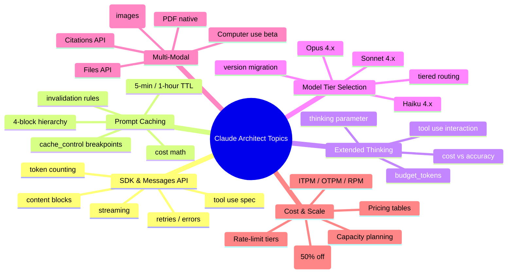

</details>

## Module-level concept DAG


<details><summary>Mermaid source</summary>

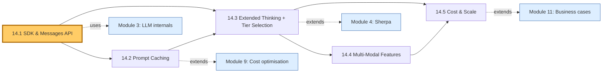

</details>

---

# Lesson 14.1 — Anthropic SDK & Messages API Internals

> **§0 · From last time.** Module 3 covered LLM-internals generically (attention, tool use, constrained decoding). Module 4 used the Anthropic SDK to build Sherpa. This lesson opens the SDK's hood — what's actually in a Messages API call, how streaming works, how tool use blocks compose, what errors mean, and how to count tokens before sending.

## §1 · Business scenario

*HSBC pre-launch review, Friday afternoon.*

Daniel Cho is reviewing Sherpa v5 with the Anthropic field engineer assigned to the bank's account. Two issues:

1. **Streaming with tool use** — Aisha's UI shows the agent's classification appearing all at once after a 6-second wait, instead of streaming. The engineer says "you can stream tool-use responses, but you have to handle `content_block_*` events correctly."
2. **Mysterious 529 errors** — at 2 AM during the nightly batch, ~0.3% of calls return HTTP 529. Sherpa's retry middleware retries them blindly and they succeed. Daniel asks: *"what is 529, and is blind retry the right answer?"*

Both questions reveal that the team has been using the SDK at surface level — `messages.create({...}).then(r => r.content)` — without understanding the underlying protocol.

## §2 · Bridge to topic

To pass the architect exam (or to debug production), you need to know the SDK at the level where you can read a Messages API call and predict its cost, latency, failure modes, and feature usage at a glance. Streaming, content blocks, tool use, and error types are the load-bearing pieces.

## §3 · Mind map


<details><summary>Mermaid source</summary>

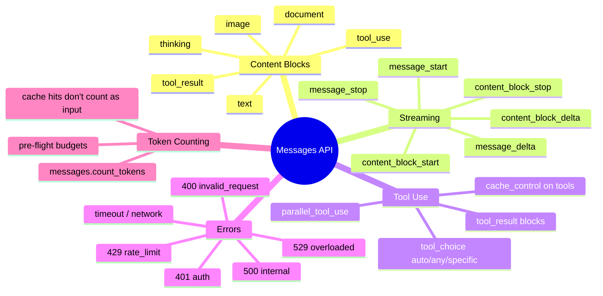

</details>

## §4 · Elaboration

### 4.1 Content blocks — the atomic unit of a message

Every Messages API response (and tool-result input) is composed of typed content blocks. Six matter for an architect:

```typescript
type ContentBlock =
  | { type: "text"; text: string }
  | { type: "thinking"; thinking: string; signature: string }
  | { type: "tool_use"; id: string; name: string; input: Record<string, unknown> }
  | { type: "tool_result"; tool_use_id: string; content: string | ContentBlock[]; is_error?: boolean }
  | { type: "image"; source: { type: "base64" | "url"; media_type: string; data?: string; url?: string } }
  | { type: "document"; source: { type: "base64" | "url"; media_type: "application/pdf"; data?: string; url?: string }; title?: string; citations?: { enabled: boolean } };
```

Key facts an architect must know:
- A single assistant turn can contain *multiple* blocks (e.g., text + thinking + multiple `tool_use` blocks in parallel).
- `tool_result` blocks go in the *user* role, not the assistant role.
- `thinking` blocks must be passed back verbatim (with their `signature`) when continuing a conversation that used extended thinking.
- `document` with `citations.enabled = true` is how you get the Citations API — Lesson 14.4.

### 4.2 Streaming — the event protocol

When `stream: true`, the SDK returns an async iterator emitting Server-Sent Events. The event sequence:

```
message_start            { message: { id, model, role, ... } }
  content_block_start     { index: 0, content_block: { type: "text", text: "" } }
  content_block_delta     { index: 0, delta: { type: "text_delta", text: "Hello" } }
  content_block_delta     { index: 0, delta: { type: "text_delta", text: " world" } }
  content_block_stop      { index: 0 }
  content_block_start     { index: 1, content_block: { type: "tool_use", id: "...", name: "..." } }
  content_block_delta     { index: 1, delta: { type: "input_json_delta", partial_json: "{\"q\":" } }
  content_block_delta     { index: 1, delta: { type: "input_json_delta", partial_json: " \"BRCA2\"}" } }
  content_block_stop      { index: 1 }
message_delta            { delta: { stop_reason: "tool_use" }, usage: { output_tokens: 42 } }
message_stop
```

Two implications for Sherpa's UI bug:
1. **You must accumulate `input_json_delta` chunks** into a string and `JSON.parse` only after `content_block_stop`. Mid-stream JSON is not valid.
2. **Show the user partial text as it streams** — that's the whole point. The bug was the UI waited for `message_stop` before rendering anything.

### 4.3 Tool use specification

Three control knobs for tool use:

```typescript
{
  tools: [...],
  tool_choice: { type: "auto" }           // model decides whether to use a tool (default)
              | { type: "any" }            // model MUST use SOME tool
              | { type: "tool", name: "search_pubmed" }  // must use THIS tool
              | { type: "none" },          // disable tool use for this turn

  // Parallel tool use (enabled by default)
  // The model can emit multiple tool_use blocks in one turn; you execute
  // them all and return ALL tool_result blocks in a single user message.
}
```

Three failure modes the architect must know:
- **`tool_use` with truncated input** — if `max_tokens` is hit mid-tool-call, the JSON is incomplete and unparseable. Increase `max_tokens` or instruct shorter args.
- **Mismatched `tool_use_id`** — every `tool_use_id` must be answered by exactly one `tool_result` with the same id. Missing one causes 400.
- **`is_error: true` propagation** — set this on `tool_result` for failures; the model treats it differently than success.

### 4.4 Error taxonomy

```
400 invalid_request_error    — bad params, schema violations, mismatched tool_use_ids
401 authentication_error      — bad/missing API key
403 permission_error          — beta feature without access, etc.
404 not_found_error           — bad model name
413 request_too_large         — request exceeds size limit
429 rate_limit_error          — your tier's RPM/ITPM/OTPM exceeded
500 internal_server_error     — Anthropic's problem
529 overloaded_error          — Anthropic is overloaded; retry with backoff
```

The 529 from Sherpa is *transient overload*. Blind retry with backoff is the right answer — it's not a bug in your code. But you should:
1. **Retry with exponential backoff + jitter** (1s, 2s, 4s, 8s — already in Sherpa's middleware after Module 9 hardening).
2. **Surface the retry count** in observability so you can spot patterns (e.g., 529s spike at 2 AM UTC = global batch hour pressure).
3. **Don't retry forever** — cap at 4 attempts. If all fail, surface to the agent as a failure observation.

### 4.5 Token counting before send

```typescript
const count = await client.messages.countTokens({
  model: "claude-sonnet-4-6",
  system: SYSTEM_PROMPT,
  messages: [{ role: "user", content: userInput }],
  tools: toolSchemas,
});
// → { input_tokens: 4327 }
```

Use this when:
- You need to ensure you stay under a per-call cost budget
- You want to dynamically choose model tier based on input size
- You're batching messages and need to plan token spend per batch

Cache hits do NOT count toward `input_tokens` returned here — you'll see the full theoretical count. Actual billed input depends on cache state at request time.

## §5 · Problem statement

Daniel asks you three questions. Answer each with specific reference to the Messages API:

1. *"Why is Sherpa's streaming UI broken? What event sequence should the UI consume?"*
2. *"What is HTTP 529? Should Sherpa's retry middleware treat it differently from 500?"*
3. *"Show me how to count tokens before sending so we can route to Haiku when input is small, Sonnet when it's big."*

## §6 · Solution walkthrough

### 1. Streaming UI fix

```typescript
const stream = await client.messages.stream({
  model: "claude-sonnet-4-6",
  max_tokens: 4096,
  system: SYSTEM_PROMPT,
  messages,
  tools,
});

for await (const event of stream) {
  switch (event.type) {
    case "content_block_start":
      if (event.content_block.type === "text") {
        ui.appendText("");  // start new text block
      } else if (event.content_block.type === "tool_use") {
        ui.startToolCall(event.content_block.id, event.content_block.name);
      }
      break;
    case "content_block_delta":
      if (event.delta.type === "text_delta") {
        ui.appendText(event.delta.text);  // STREAM CHUNK BY CHUNK
      } else if (event.delta.type === "input_json_delta") {
        ui.appendToolJSON(event.index, event.delta.partial_json);
      }
      break;
    case "content_block_stop":
      // Optional: render completed block in final form
      break;
    case "message_delta":
      if (event.delta.stop_reason) ui.markFinished(event.delta.stop_reason);
      break;
  }
}
```

Aisha's UI now shows text appearing character-by-character. Tool-use JSON streams as it generates (you can show "searching..." in a spinner until `content_block_stop`).

### 2. 529 handling

```typescript
function isTransient(err: AnthropicError): boolean {
  return (
    err.status === 429 ||   // rate limit — backoff respects retry-after if present
    err.status === 500 ||   // internal — usually fast retry succeeds
    err.status === 529 ||   // overloaded — needs longer backoff
    err.status >= 502 && err.status <= 504  // gateway errors
  );
}

const RETRYABLE_BACKOFF: Record<number, number> = {
  429: 5000,  // start at 5s for rate limits (respect retry-after if present)
  500: 1000,
  529: 3000,  // give overloaded service room to recover
};
```

529 is meaningfully different from 500: 500 = problem with your specific request, 529 = Anthropic is shedding load globally. The right backoff is *longer* and you should *cap retries lower* than for 500. Surface the count in your metrics — a 529 spike across multiple agents indicates an Anthropic-side incident worth your team knowing about.

### 3. Token-counted routing

```typescript
async function chooseModel(system: string, messages: Message[], tools: Tool[]) {
  const { input_tokens } = await client.messages.countTokens({
    model: "claude-haiku-4-5-20251001",
    system,
    messages,
    tools,
  });
  
  if (input_tokens < 4000) return "claude-haiku-4-5-20251001";
  if (input_tokens < 20000) return "claude-sonnet-4-6";
  return "claude-opus-4-7";  // very long input — pay for deeper reasoning
}
```

The count itself is a billable call (a fraction of a cent) but saves you ~3-4× on the actual completion. Worth it for any non-trivial workload.

## §7 · Mathematical foundation

### 7.1 Cost of one Messages API call

```
input_cost  = (uncached_input_tokens × Pin + cached_input_tokens × Pcache) / 1_000_000
output_cost = output_tokens × Pout / 1_000_000
total       = input_cost + output_cost
```

Where Pin, Pcache, Pout vary by model (see Lesson 14.5 for tables). Cache hits replace `Pin` with `Pcache` for those tokens — typically 10× cheaper.

### 7.2 Streaming has no cost difference

Streaming changes *latency* (first token arrives faster) and *UX* (progressive rendering), not cost. Total input + output tokens are identical to non-streaming.

### 7.3 Token-counting endpoint is free-ish

`messages.count_tokens` is billed at a tiny fraction of an actual call — count it as effectively free for routing decisions.

## §8 · Technical deep-dive

### 8.1 The four content-block-delta types

When streaming, deltas come in different flavours depending on the parent block:

| Block type | Delta type | What it carries |
|---|---|---|
| `text` | `text_delta` | `{ type: "text_delta", text: string }` |
| `thinking` | `thinking_delta` | `{ type: "thinking_delta", thinking: string }` |
| `tool_use` | `input_json_delta` | `{ type: "input_json_delta", partial_json: string }` |
| `tool_use` | `signature_delta` | `{ type: "signature_delta", signature: string }` (for thinking blocks) |

Never assume the delta type from the parent — always switch on `event.delta.type`.

### 8.2 The "preserve thinking" rule

If you use extended thinking (Lesson 14.3) and follow up with a tool result, you MUST pass back the original `thinking` content blocks verbatim, including their `signature`. Strip them and the next turn will fail with a 400.

```typescript
// CORRECT: preserve thinking + signature when continuing
messages.push({
  role: "assistant",
  content: response.content,  // includes thinking + tool_use blocks
});
messages.push({
  role: "user",
  content: [{ type: "tool_result", tool_use_id: ..., content: ... }],
});

// WRONG: stripping thinking blocks
const onlyToolUse = response.content.filter(b => b.type !== "thinking");
messages.push({ role: "assistant", content: onlyToolUse });  // → 400 on next call
```

### 8.3 `stop_reason` taxonomy

```
"end_turn"          model finished naturally
"max_tokens"        you hit max_tokens — increase or summarise
"stop_sequence"     custom stop_sequences fired
"tool_use"          model wants a tool — execute and continue
"pause_turn"        long-running extended thinking paused — resume
"refusal"           model refused (safety) — propagate to user
```

Architect-level question: *"What's the production response for `stop_reason: refusal`?"* — log it, count it as a metric, surface to user with a graceful message, *don't* retry hoping the model changes its mind.

### 8.4 SDK auto-retry quirks

The official SDK retries automatically on 429 and 5xx by default. You may want to:
- **Disable** with `maxRetries: 0` in the client constructor if you have your own middleware (Sherpa does)
- **Use the default** if you don't have middleware and want sane behaviour for free

```typescript
const client = new Anthropic({
  apiKey: process.env.ANTHROPIC_API_KEY,
  maxRetries: 0,  // we handle retries in our middleware
  timeout: 60_000,
});
```

### 8.5 Idempotency

The Messages API doesn't support idempotency keys natively. If you want idempotent semantics, build at your layer: hash `(model, system, messages, tools, temperature)` → use as cache key → return cached response on duplicate request. Useful for retry safety.

## §9 · What this unlocks

- **Lesson 14.2** uses content-block structure when discussing where to place `cache_control` breakpoints.
- **Lesson 14.3** uses the "preserve thinking" rule for extended-thinking + tool-use flows.
- **Lesson 14.4** uses `image` and `document` content blocks for multi-modal workloads.
- **Lesson 14.5** uses streaming + token counting for capacity planning at scale.

---

# Lesson 14.2 — Prompt Caching: Mechanics, Math, and Patterns

> **§0 · From last time.** Lesson 14.1 explained content blocks and streaming. Lesson 3.1 introduced prompt caching as a 10× cost lever. Now we close the gap — exactly how `cache_control` works, the 4-block hierarchy, TTL behaviour, what invalidates, and the math for deciding when caching pays off.

## §1 · Business scenario

*Helix Research, Tuesday standup.*

Tom Rivera looks at the cost dashboard. The literature-synthesis agent is running at $0.18 per query — twice the budget Maya signed off on. Tom thinks: *"We're caching, right? Cost should be 10× cheaper."*

Inspection of the SDK calls reveals: the team passes a 14K-token system prompt with the regulatory disclaimer + 12 example traces + tool schemas. *No `cache_control` blocks*. Every call pays full input cost on every byte of that 14K-token prefix.

Tom asks: *"Where do I put the cache_control? Just one breakpoint or several? What's the rule?"*

## §2 · Bridge to topic

Prompt caching isn't automatic — you have to opt in by placing `cache_control` blocks. There's a 4-block hierarchy, a 5-minute TTL (with a 1-hour beta), and specific invalidation rules. Knowing them lets you architect a 10× cost reduction; missing them means you pay full price.

## §3 · Mind map


<details><summary>Mermaid source</summary>

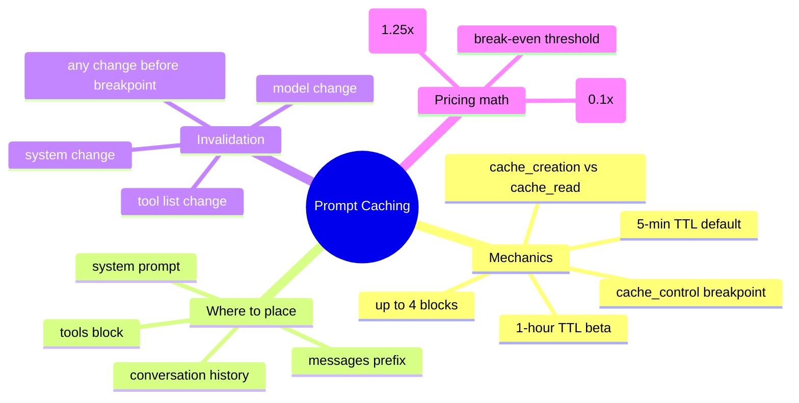

</details>

## §4 · Elaboration

### 4.1 The `cache_control` block — what it is

A `cache_control` block is a marker you attach to *any* content block telling the API: "treat everything from the start of the prompt up to and including this point as a cacheable prefix."

```typescript
{
  type: "text",
  text: SYSTEM_PROMPT_WITH_LONG_INSTRUCTIONS,
  cache_control: { type: "ephemeral" }
}
```

The "ephemeral" type means 5-minute TTL (the default; refreshes on hit). The beta `cache_control: { type: "ephemeral", ttl: "1h" }` extends to 1 hour at a higher write cost — useful for long-running batch jobs.

### 4.2 The 4-block hierarchy

You can have up to **four** `cache_control` breakpoints per request. The standard layout:

```
[ tools ]                          <-- breakpoint 1: cache the tool definitions
[ system: messages ]               <-- breakpoint 2: cache the system prompt
[ messages[0..N-2] ]               <-- breakpoint 3: cache the conversation history
[ messages[N-1] ]                  <-- breakpoint 4: cache up to the latest user turn
```

Each subsequent breakpoint includes everything before it. So if your system prompt is unchanged but the user adds a new turn, breakpoints 1 and 2 still hit; breakpoint 3 catches up to the new turn (becomes a cache write); breakpoint 4 includes the new turn (also a write).

This staged cache is the architect's move: most of the prompt comes from cache; only the new tail is freshly billed.

### 4.3 Cache lookup mechanics

On every request the API computes a hash of the prompt content up to each `cache_control` breakpoint. If a hash matches an existing cache entry (within the TTL), it's a **cache read** — billed at 10% of normal input cost. If it doesn't match, it's a **cache write** — billed at 125% of normal input cost (first time only).

```
Normal input:   1.00 × Pin
Cache write:    1.25 × Pin  (first request)
Cache read:     0.10 × Pin  (subsequent requests within TTL)
```

The 25% premium on writes is why you need *enough requests* to pay back the write before the TTL expires. Math: break even when `(N × 0.10 + 1.25) < N` → `N ≥ 1.39` → **2 requests within 5 minutes** pay back the cache. Past that, you're saving.

### 4.4 What invalidates the cache

Any byte difference *before* a breakpoint invalidates that breakpoint and all subsequent ones:

| Change | Invalidates |
|---|---|
| Edit one word in the system prompt | All breakpoints (full re-write) |
| Add a tool to the tools array | All breakpoints |
| Remove tool description's description field | All breakpoints (yes, even cosmetic) |
| User adds a new turn | Breakpoints after the conversation breakpoint |
| Change model | All breakpoints (separate cache per model) |
| Change `cache_control` block position | Breakpoints from that point onward |

**Architect rule**: changes that look cosmetic (whitespace, comments, reorder examples) invalidate the cache. Be disciplined about prefix stability. Use code review to catch accidental prefix edits.

### 4.5 TTL behaviour

- Default: 5 minutes. Refreshed on every cache hit — busy caches stay warm indefinitely.
- Beta `ttl: "1h"`: 1 hour. Costs 2× the write price (2.5× normal input vs 1.25× for ephemeral). Useful for batch jobs that span more than 5 min between calls.

Cold-cache periods (e.g., first call of the day) always pay the write price. Plan for this in cost forecasting.

## §5 · Problem statement

Help Tom fix Helix's $0.18/query cost. The system prompt is 14K tokens (regulatory + tool schemas + 12 examples). Average query has 800 input tokens of new content + 1500 output tokens. Volume: 14K queries/week.

1. Where should `cache_control` breakpoints go?
2. What's the projected cost per query after caching?
3. What's the break-even latency between calls for the cache to pay off?

## §6 · Solution walkthrough

### Breakpoint placement

```typescript
await client.messages.create({
  model: "claude-sonnet-4-6",
  max_tokens: 2048,
  tools: [
    ...TOOLS_ARRAY,
    // breakpoint 1: cache the tools
    // (cache_control goes on the LAST element of the tools array)
  ],
  system: [
    { type: "text", text: REGULATORY_DISCLAIMER + EXAMPLES_BLOCK,
      cache_control: { type: "ephemeral" } },  // breakpoint 2
  ],
  messages: [
    // optional breakpoint 3 on the most recent assistant turn for multi-turn caching
    { role: "user", content: query },  // not cached — varies per request
  ],
});
```

For Tom's single-turn case, two breakpoints suffice: tools + system.

### Cost calculation

Sonnet 4.6 pricing (per million tokens):
- Pin = $3.00
- Pcache_read = $0.30 (10% of Pin)
- Pcache_write = $3.75 (125% of Pin)
- Pout = $15.00

**Before caching** (current state):
- Input: 14,000 + 800 = 14,800 × $3.00/M = $0.0444
- Output: 1,500 × $15.00/M = $0.0225
- **Total per query: $0.067 + Anthropic SDK overhead ≈ $0.18 (something inflated — maybe also using Opus on hard queries; need to investigate)**

**After caching** (warm cache):
- Cached input: 14,000 × $0.30/M = $0.0042
- Uncached input: 800 × $3.00/M = $0.0024
- Output: 1,500 × $15.00/M = $0.0225
- **Total per query: $0.029** (4.6× cheaper)

**Cache-write requests** (first call after invalidation):
- Cached input written: 14,000 × $3.75/M = $0.0525
- Uncached input: 800 × $3.00/M = $0.0024
- Output: 1,500 × $15.00/M = $0.0225
- **Total: $0.077** (slightly more than baseline due to 25% write premium)

### Break-even

With 14,000 cached input tokens:
- Saving per warm-cache hit: $0.0444 − $0.0066 = $0.0378
- Premium on cache write: $0.0525 − $0.0420 = $0.0105
- **Break-even: 1 warm hit pays back the write**

At 14K queries/week ≈ 83 queries/hour, the cache is *always* warm during business hours. Cold-cache writes are once per morning. Total saving: ~$330/week. Annualised: ~$17K. Free.

## §7 · Mathematical foundation

### 7.1 Generalised cost formula

For a request with `Tprefix` tokens before the breakpoint and `Tnew` tokens after, with cache hit probability `h`:

```
expected_input_cost = h × (Tprefix × Pcache_read + Tnew × Pin)
                    + (1 − h) × ((Tprefix + Tnew) × Pin)

expected_total = expected_input_cost + Tout × Pout
```

For high-hit-rate workloads (h ≈ 0.95+), the cost approaches the cached-only value rapidly.

### 7.2 Break-even N

For a single cached prefix of `Tprefix` tokens, called N times in the TTL:

```
without_cache_cost = N × Tprefix × Pin
with_cache_cost    = 1.25 × Tprefix × Pin + (N-1) × 0.10 × Tprefix × Pin

with_cache < without_cache
⇒ 1.25 + 0.10(N-1) < N
⇒ N > 1.39
```

**Cache is cheaper if you hit it at least twice in the TTL.** Any agent invoked more than once every ~3 minutes benefits.

### 7.3 1-hour TTL break-even

The 1-hour beta costs 2× the standard write (2.5× normal Pin). Break-even:

```
2.5 + 0.10(N-1) < N
⇒ N > 2.67
```

**1-hour TTL is cheaper if you hit at least 3 times in the hour.** Useful for batch jobs with sparse but regular access patterns.

## §8 · Technical deep-dive

### 8.1 Where exactly does `cache_control` attach?

| Location | Syntax |
|---|---|
| `tools` array | Add `cache_control` to the **last** tool you want cached. Everything before is included. |
| `system` (text-array form) | Add `cache_control` to the system text block. |
| `messages` (a specific block) | Add `cache_control` to a content block within a message. Common: cache the last assistant turn for multi-turn flows. |

If `system` is a string (not an array of blocks), you can't add `cache_control` to it directly — convert to the array form.

### 8.2 Verifying cache behaviour

The response's `usage` field tells you exactly what happened:

```typescript
response.usage = {
  input_tokens: 800,            // tokens NOT served from cache
  cache_creation_input_tokens: 0,  // tokens just written to cache (0 = no write this time)
  cache_read_input_tokens: 14000,  // tokens served from cache (the savings!)
  output_tokens: 1500,
};
```

Track these three numbers in your observability spans. Cache hit rate = `cache_read_input_tokens / (cache_read_input_tokens + input_tokens)` (roughly).

### 8.3 Multi-turn caching pattern

For a multi-turn chat where each user turn extends the conversation, place a breakpoint on the *last assistant turn* of the prior context:

```
messages: [
  { role: "user", content: "Q1" },
  { role: "assistant", content: [{ type: "text", text: "A1", cache_control: { type: "ephemeral" } }] },  // breakpoint
  { role: "user", content: "Q2" },  // new — not cached
]
```

Now the next request can cache up to and including the cached assistant turn. Move the breakpoint forward as the conversation grows.

### 8.4 The 1024-token minimum

Cache writes have a **minimum of 1024 tokens** of cached content. Smaller breakpoints are silently ignored (no error, just no caching). Make sure your cacheable prefix is large enough — typically you'd cache tool schemas + system prompt together for this reason.

### 8.5 Caching with extended thinking

Cache the prefix up to (but not including) the user query, then let the model think + tool-use as normal. Thinking blocks themselves *cannot* be cached (they're new each turn) but everything before them can.

## §9 · What this unlocks

- **Lesson 14.3** uses caching cost math when deciding model tier — sometimes Sonnet+cache is cheaper than Haiku+no-cache.
- **Lesson 14.5** uses cache hit rate as a production metric in capacity planning.
- **Module 9's cost-optimization** patterns now have explicit `cache_control` mechanics to implement.

---

# Lesson 14.3 — Extended Thinking and Model Tier Selection

> **§0 · From last time.** Lessons 14.1 and 14.2 covered the API surface and prompt caching. Now we tackle two of the highest-leverage architect decisions: when to use extended thinking, and how to pick between Opus 4.x, Sonnet 4.x, and Haiku 4.x.

## §1 · Business scenario

*HSBC, Friday afternoon.*

Daniel is reviewing the latest Sherpa eval. Accuracy is stuck at 89%. On the hardest cases (multi-counterparty, novel break shapes), Sherpa drops to 73%. The Anthropic field engineer suggests: *"Try extended thinking on the long-tail breaks. Claude can spend tokens on internal reasoning before answering. Don't use it on everything — it's expensive — but for the 11% that need it, it could push accuracy meaningfully higher."*

Separately, Daniel notices the cost-per-task is rising because Sherpa uses Sonnet for *everything*, including dead-simple Sigma Capital fee-deduction cases that Haiku could handle for 4× less. He asks: *"What's the principled way to choose model tier per case?"*

## §2 · Bridge to topic

Extended thinking and tier selection together are the **per-task cost-vs-accuracy** lever. Use them well and you get 2-3× cost reduction with equal-or-better accuracy. Use them blindly and you either burn money on Opus for trivial cases or use Haiku on cases that need depth.

## §3 · Mind map


<details><summary>Mermaid source</summary>

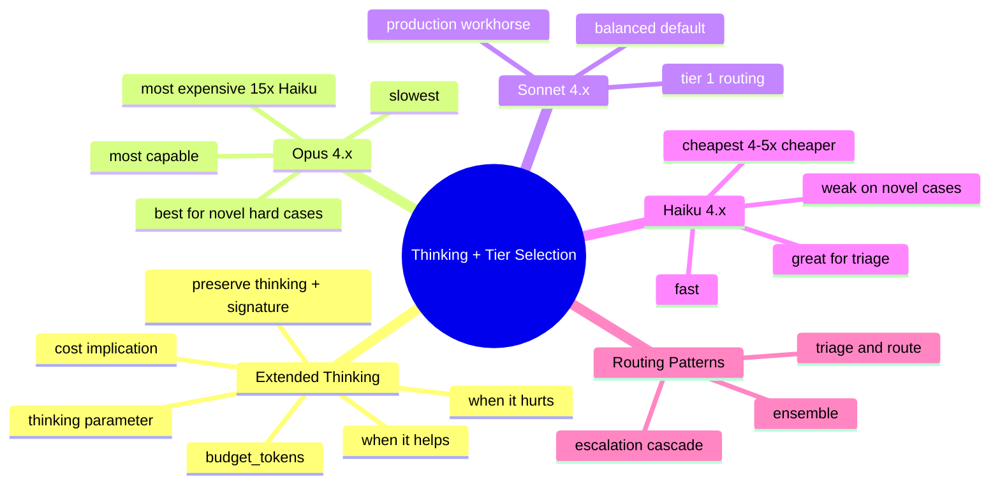

</details>

## §4 · Elaboration

### 4.1 Extended thinking — what it is

Extended thinking lets Claude allocate a budget of "thinking tokens" — internal reasoning the model does *before* emitting the user-facing response. These tokens are billed but never shown to the user; they're stored in `thinking` content blocks for protocol reasons.

```typescript
await client.messages.create({
  model: "claude-sonnet-4-6",
  max_tokens: 16000,
  thinking: {
    type: "enabled",
    budget_tokens: 10000,   // max tokens to spend on thinking
  },
  messages: [...],
});
```

The response will contain `thinking` blocks (with `signature` — preserve these per Lesson 14.1's §8.2) followed by the user-facing text or tool-use blocks.

### 4.2 When thinking helps

Empirically, extended thinking improves accuracy on:
- **Multi-step problems** that require working through subproblems
- **Math / code / formal reasoning** where intermediate steps matter
- **Ambiguous classification** where weighing evidence matters
- **Tasks requiring explicit consideration of edge cases**

It does NOT meaningfully help on:
- **Routine, well-patterned tasks** (refund classification with clear rules)
- **Pure retrieval** (the answer comes from tool outputs, not reasoning)
- **Conversational chit-chat**

For Sherpa's 11% long-tail cases: yes, thinking probably helps. For the 89% routine cases: no, it's wasted spend.

### 4.3 When thinking hurts

- **Cost** — thinking tokens are billed at the output-token rate (because the model generates them). 10K thinking tokens on Sonnet = $0.15. Multiply by your task volume.
- **Latency** — first token arrives later (you wait for thinking before any user-facing output).
- **Streaming UX** — you can't show partial reasoning to the user; it's hidden.

### 4.4 Model tier characteristics (4.x family)

| Tier | Model ID | Strengths | Cost (in/out per MTok) | When to use |
|---|---|---|---|---|
| **Opus 4.x** | claude-opus-4-7 | Deepest reasoning, longest context utilisation, best at multi-step | $15 / $75 | High-stakes novel reasoning (M&A research, complex synthesis) |
| **Sonnet 4.x** | claude-sonnet-4-6 | Production workhorse; matches Opus on most tasks at 1/5 the cost | $3 / $15 | Default for agents (Sherpa, capstones) |
| **Haiku 4.x** | claude-haiku-4-5-20251001 | Fast, cheap; excellent for triage, classification, extraction | $0.80 / $4 | Triage, routine classification, latency-sensitive UX |

Cost ratios (output tokens, where most cost lives):
- Opus ÷ Sonnet ≈ **5×**
- Sonnet ÷ Haiku ≈ **3.75×**
- Opus ÷ Haiku ≈ **18.75×**

### 4.5 Routing patterns

**Pattern 1 — Triage-and-route (Lesson 9.3)**:
1. Call Haiku with a triage prompt: "Is this case routine or novel?"
2. Route routine → Haiku (or workflow)
3. Route novel → Sonnet (or Opus with thinking)

**Pattern 2 — Escalation cascade**:
1. Try Haiku first
2. If confidence < threshold OR Haiku returns "uncertain" → escalate to Sonnet
3. If Sonnet still uncertain → escalate to Opus + thinking

**Pattern 3 — Ensemble** (Module 6 debate):
1. Run Sonnet and Opus in parallel on high-stakes cases
2. If agree → commit
3. If disagree → escalate to human

For Sherpa: Pattern 2 (escalation cascade) is ideal — most cases never reach Opus, but the long tail gets the depth it needs.

## §5 · Problem statement

For Sherpa, design:

1. The triage rule for routing to Haiku vs Sonnet vs Opus+thinking
2. The estimated cost per case under the routing
3. The estimated accuracy lift vs current "Sonnet for everything"

Assume: current distribution = 60% routine / 29% standard / 11% long-tail. Current cost = $0.026/case at Sonnet. Current accuracy = 89% (95% routine, 88% standard, 73% long-tail).

## §6 · Solution walkthrough

### Routing design

```typescript
async function classifyBreak(breakId: string): Promise<Classification> {
  // Stage 1: Haiku triage (always)
  const triage = await haiku.call({
    system: TRIAGE_PROMPT,
    messages: [{ role: "user", content: featureSummary(breakId) }],
  });

  if (triage.routing === "routine" && triage.confidence > 0.9) {
    // 60% of cases → Haiku full classification
    return await haiku.classify(breakId);
  }

  if (triage.routing === "novel") {
    // 11% of cases → Opus + extended thinking
    return await opus.classifyWithThinking(breakId, { budget_tokens: 10000 });
  }

  // 29% of cases → Sonnet (default)
  return await sonnet.classify(breakId);
}
```

### Cost calculation

Per case (averaged):

| Tier | Volume | Avg cost | Weighted |
|---|---|---|---|
| Haiku (routine) | 60% | $0.008 (triage + classification) | $0.005 |
| Sonnet (standard) | 29% | $0.026 (current) | $0.0075 |
| Opus+thinking (long-tail) | 11% | $0.150 (10K thinking + reasoning) | $0.017 |
| **Weighted avg** | 100% | — | **$0.030** |

Slightly higher cost per case than current $0.026 — but offset by significantly better accuracy on the long tail.

### Accuracy estimate

| Tier | Volume | Per-tier accuracy | Weighted |
|---|---|---|---|
| Haiku (routine) | 60% | 92% (slightly below Sonnet's 95% on routine, but routine is easy) | 55.2% |
| Sonnet (standard) | 29% | 88% (unchanged) | 25.5% |
| Opus+thinking (long-tail) | 11% | 85% (vs 73% with Sonnet) | 9.4% |
| **Weighted overall** | 100% | — | **90.1%** |

**+1.1pp accuracy at +15% cost.** Whether worth it depends on Daniel's cost-per-wrong calculus (Lesson 2.1's math). At $200/wrong, $42/right: 1.1pp accuracy gain on 1,400 cases/night × $42 saved = $647/night of saved analyst time, vs $0.004 extra per case × 1,400 = $5.60/night extra LLM cost. **Strongly net positive.**

## §7 · Mathematical foundation

### 7.1 Cost-per-case under routing

```
weighted_cost = sum over tiers of:
  P(case ∈ tier) × cost_per_case(tier)
```

Where `P` comes from your triage distribution. For Sherpa, 60/29/11.

### 7.2 Break-even for adding Opus+thinking

You'll add Opus to a tier of the workload. Worth it when:

```
(accuracy_with_opus - accuracy_baseline) × value_of_correct_answer
  > (cost_opus_per_case - cost_baseline_per_case)
```

For Sherpa long-tail: (0.85 - 0.73) × $42 = $5.04 of value vs $0.124 cost difference per case. **40× margin**. Easy decision.

### 7.3 Triage cost amortisation

Triage adds a small fixed cost per case. Worth it when:

```
fraction_routed_to_cheaper_tier × (cost_baseline - cost_cheaper) > triage_cost
```

For Sherpa: 60% × ($0.026 - $0.008) = $0.0108 saved per case vs ~$0.002 triage cost. Net: ~$0.009 saved per case × 1,400/night = $12.60/night. Worth it.

## §8 · Technical deep-dive

### 8.1 Extended thinking + tools (the interaction)

When thinking + tool use both happen in one turn:

1. Model thinks (you get `thinking` blocks)
2. Model decides to use tools (you get `tool_use` blocks)
3. You execute tools and reply with `tool_result` blocks
4. **You must preserve all original blocks** in the assistant message (Lesson 14.1 §8.2) including thinking + signature
5. Model may think again before final response

The `signature` on thinking blocks is critical — it's a cryptographic proof the API uses to verify the thinking wasn't tampered with. Strip it and the next call returns 400.

### 8.2 Choosing `budget_tokens`

- **Too low** (< 1024) — thinking is functionally disabled
- **Sweet spot** for most agent tasks: 4,000-10,000 tokens
- **Maximum**: ~32K depending on model. Anything beyond ~16K rarely improves answers and balloons cost.

### 8.3 Migration between Claude versions

When a new Claude minor/major version ships:

1. **Pin** your current model in production config
2. **Shadow test** the new version against your regression eval (M8.4)
3. **A/B test** in canary at 5%
4. **Migrate** when the gate passes; rollback button must work

Architect-level question: a new Sonnet ships claiming "20% better on math benchmarks." Do you upgrade?

Answer: shadow-test first. Benchmark improvements don't always transfer to your domain. Sometimes a new model is *worse* on niche tasks. The regression eval is the source of truth.

### 8.4 Cross-model behaviour drift

Models in the 4.x family share family characteristics but Haiku ≠ Sonnet ≠ Opus in subtle ways:

- Haiku may be more literal; Sonnet more inferential; Opus most flexible
- Refusal patterns differ slightly per tier
- Tool-selection accuracy decreases as you move down the tier (more "wrong tool" errors)

When designing routing, **don't assume the prompt that works on Sonnet works identically on Haiku.** Test each tier separately on your eval set.

### 8.5 Thinking in batch jobs

Extended thinking works with the Batch API (Lesson 14.5) but the thinking tokens are billed at the batch rate (50% off output cost). So a 10K thinking budget that would cost $0.15 in real-time costs $0.075 in batch. Cheap enough that batch + thinking is often the right pattern for non-latency-sensitive evals.

## §9 · What this unlocks

- **Lesson 14.4** covers multi-modal — vision and PDF inputs work with all tier choices
- **Lesson 14.5** uses tier-based pricing tables for capacity planning
- **Module 9 cost optimisation** now has explicit tier-routing patterns

---

# Lesson 14.4 — Multi-Modal: Vision, PDF, Citations, Computer Use

> **§0 · From last time.** Lessons 14.1-14.3 covered text-based decisions. Real agents increasingly handle images, PDFs, and screens. Claude's multi-modal features replace bespoke extraction layers — knowing which to use is core architect skill.

## §1 · Business scenario

*Acme E-commerce, Tuesday.*

Ronnie Park has three new use cases:

1. **Return photos** — customers submit photos of damaged products. Today, human agents review every photo. Volume: ~3K/day. Estimated 60% can be auto-classified ("clearly damaged in transit" vs "user damage" vs "unclear").
2. **Vendor PDF invoices** — accounting team manually extracts line items from 500 PDF invoices/week. Each PDF is 5-15 pages, often scanned.
3. **Internal IT support agent** — wants to navigate the IT ticketing system on behalf of users to fix common issues.

Lin Chen asks: "Do we build extraction pipelines for each, or use Claude's built-in multi-modal features?"

## §2 · Bridge to topic

Claude has native support for images, PDFs, citations, and (in beta) computer use. Choosing native features over extraction layers usually wins on cost, accuracy, and engineering time — but only if you know what's available and what the trade-offs are.

## §3 · Mind map


<details><summary>Mermaid source</summary>

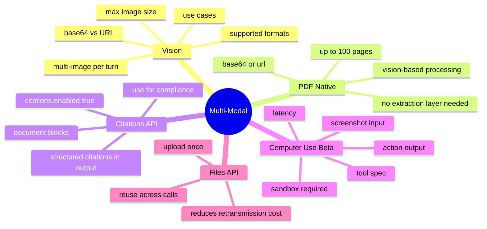

</details>

## §4 · Elaboration

### 4.1 Vision (image inputs)

```typescript
await client.messages.create({
  model: "claude-sonnet-4-6",
  max_tokens: 1024,
  messages: [{
    role: "user",
    content: [
      { type: "image", source: { type: "base64", media_type: "image/jpeg", data: base64String } },
      { type: "text", text: "Is this product damaged in transit, by the user, or unclear? Explain." },
    ],
  }],
});
```

Two source forms:
- `base64` — embed the image directly. Best for one-off; counts toward your request size.
- `url` — Claude fetches the image. Best for re-use; image must be publicly accessible.

Supported formats: JPEG, PNG, GIF, WebP. Maximum 5MB per image (base64) or no size limit (URL fetch). Up to ~20 images per message.

For Acme's return photos: vision-classify with Sonnet, ~$0.005 per image. Eliminates ~60% of human review = ~1,800 photos/day saved = ~30 hours/day of agent time = ~$1,500/day labour. Vision API cost: ~$15/day. Massive ROI.

### 4.2 PDF native processing

PDFs are sent as `document` content blocks:

```typescript
messages: [{
  role: "user",
  content: [
    { type: "document", source: { type: "base64", media_type: "application/pdf", data: pdfBase64 } },
    { type: "text", text: "Extract line items as JSON: { sku, description, qty, unit_price, total }" },
  ],
}]
```

PDFs are processed using vision under the hood (each page is rendered + analysed). This means:
- Scanned PDFs work (no OCR layer needed)
- Tables and forms are extracted accurately
- Up to 100 pages per PDF
- Cost: priced per visual page (~equivalent to a Sonnet vision call per page)

For Acme's invoices: average 8 pages × ~$0.005/page = $0.04 per PDF. At 500/week = $20/week. Replaces a manual extraction pipeline that probably costs >$2K/week in labour. Order-of-magnitude win.

### 4.3 Citations API

When extracting facts from documents (regulatory text, research papers, legal contracts), you want Claude to *cite* which passage supports each claim. Set `citations.enabled: true` on the document block:

```typescript
messages: [{
  role: "user",
  content: [
    {
      type: "document",
      source: { type: "base64", media_type: "application/pdf", data: regulationPDF },
      title: "EU AI Act, Chapter III",
      citations: { enabled: true },
    },
    { type: "text", text: "What are the obligations for high-risk AI systems?" },
  ],
}]
```

Response includes citation metadata:

```typescript
response.content = [
  { type: "text", text: "High-risk AI systems must implement risk management.",
    citations: [{ type: "page_location", document_index: 0,
                  document_title: "EU AI Act, Chapter III",
                  start_page_number: 14, end_page_number: 14,
                  cited_text: "Article 9: Risk management system shall be established..." }] },
]
```

This is **native citation faithfulness** (Module 5.3) — no need to build the verification layer yourself. For HSBC compliance and Helix research, this is the right primitive.

### 4.4 Computer Use (beta)

Claude can be given screen control — it sees screenshots and emits actions:

```typescript
await client.messages.create({
  model: "claude-sonnet-4-6",
  max_tokens: 2048,
  tools: [
    { type: "computer_20250124", name: "computer", display_width_px: 1024, display_height_px: 768 },
    { type: "text_editor_20250124", name: "str_replace_editor" },
    { type: "bash_20250124", name: "bash" },
  ],
  messages: [{ role: "user", content: "Open the IT ticketing system, find ticket #12345, mark it resolved." }],
});
```

The model responds with `tool_use` blocks for computer actions: `key`, `type`, `mouse_move`, `left_click`, `screenshot`, etc. Your client executes them and returns screenshots as `tool_result`.

Critical: **computer use REQUIRES a sandboxed environment.** Running it on your own desktop is a security nightmare. Use a VM, a container with VNC, or Anthropic's hosted sandbox.

For Acme's IT support agent: viable in 2026 but expensive (each iteration sends a screenshot ≈ 1500 tokens of vision + emits tool actions). Real-time use cases are challenging on cost; async / batch use cases are fine.

### 4.5 Files API

When you'd otherwise re-send the same PDF/image across many calls, use the Files API:

```typescript
// Upload once
const file = await client.beta.files.upload({
  file: pdfStream,
  filename: "annual-report.pdf",
});

// Reference in messages
messages: [{
  role: "user",
  content: [
    { type: "document", source: { type: "file", file_id: file.id } },
    { type: "text", text: "Summarise the strategy section." },
  ],
}]
```

The file lives at Anthropic; calls referencing it don't re-transmit. Useful for batch jobs that process the same document multiple times, or for shared documents across team agents.

## §5 · Problem statement

For Acme's three use cases, design the right Claude features + costs + when to switch to native vs custom.

## §6 · Solution walkthrough

### 1. Return photos (3K/day)

```
Architecture:
  - Vision via Sonnet, single API call per photo
  - Output schema (strict tool use): { classification, confidence, evidence_described }
  - Confidence > 0.85: auto-classify, file routing decision
  - Confidence ≤ 0.85: route to human

Cost: 3000 × $0.005 = $15/day
Labour saved: ~1800 photos auto-handled × ~1 min = 30 hours/day
Net: massive positive ROI
```

### 2. PDF invoices (500/week)

```
Architecture:
  - PDF as document block, Sonnet, citations enabled
  - Output schema: array of line items + invoice metadata
  - Files API for shared vendor templates (reuse same context across invoices from same vendor)

Cost: 500 × ~8 pages × $0.005 = ~$20/week
Labour saved: vs ~$2-3K/week manual extraction → ~100× ROI
```

### 3. IT support agent (computer use)

```
Architecture:
  - Sandboxed VM with the IT ticketing system loaded
  - Computer use tool + bash tool + text_editor tool
  - Run in background (not real-time UX — user submits ticket, agent processes in <5min)
  - Strict allowed-actions list (cannot delete users, cannot escalate permissions, etc.)
  - Human review for any action affecting >1 user

Cost: ~$0.50-1.50 per ticket (computer use is expensive)
Labour saved: ~5-15 min per ticket of L1 support time
Risk: highest of the three — sandbox + permission scoping critical

Verdict: pilot in shadow mode for 1 month, evaluate cost-vs-quality
   before going live.
```

## §7 · Mathematical foundation

### 7.1 Image cost calculation

Image tokens are calculated by `(width × height) / 750` ≈ ~1,150 tokens per typical 1024×768 image. Then:

```
image_cost = image_tokens × Pin
```

For a Sonnet call with one 1024×768 image:
- Image: ~1,150 tokens × $3/M = $0.003
- Text prompt: ~200 tokens × $3/M = $0.0006
- Output: ~200 tokens × $15/M = $0.003
- Total: ~$0.006

### 7.2 PDF cost = sum of page costs

Each page of a PDF is processed as an image. So an 8-page PDF costs ~8 × (one image call).

### 7.3 Computer use loop cost

Each loop iteration: screenshot (~1500 tokens vision) + reasoning + 1-3 actions. At Sonnet pricing, ~$0.02-0.05 per iteration. Tasks needing 30-50 iterations = ~$1-2.50.

## §8 · Technical deep-dive

### 8.1 When to use base64 vs URL

| Use case | Recommendation |
|---|---|
| One-off image, varies per call | base64 |
| Same image used many times | upload via Files API |
| Image already at a stable public URL | URL |
| Image is private but you can pre-sign URLs | pre-signed URL |

URLs save your client's bandwidth (Anthropic fetches). base64 is simpler but inflates request payload.

### 8.2 PDF preprocessing — when worth it

Native PDF works for most cases. Preprocessing (extract text first, send text only) wins when:
- The PDF is text-native and small
- You have *thousands* of pages — text extraction is cheaper than vision-per-page
- You need exact text (vision may slightly paraphrase formatting)

For invoices, contracts, research papers: native PDF is the right call. For data-warehouse-style "we have 1M pages and need each line": preprocess.

### 8.3 Citation faithfulness vs the M5.3 pattern

Module 5.3 builds citation faithfulness as a post-processing audit step. With the Citations API:
- Citations are *generated structurally* — no extraction step
- Each citation includes page location, document title, and exact `cited_text`
- Your audit code just checks the citation exists in the source — much simpler

For new builds: prefer Citations API. For retrofitting existing RAG: M5.3's pattern still works.

### 8.4 Computer use sandbox options

| Sandbox | Notes |
|---|---|
| Anthropic-hosted (recommended for prototype) | Easiest; ~$0.10/min compute on top of API cost |
| Docker + VNC | Self-hosted; gives you control |
| Firecracker microVM | Best isolation; complex ops |
| Cloud VM with display server | Flexible but expensive at scale |

Never run computer use against your real production systems without a sandbox. The model occasionally clicks wrong things.

### 8.5 The "vision is also reasoning" insight

When you pass an image to Claude, it sees + reasons about the image in the same model call. You don't need a separate "describe the image" step before reasoning. This is different from older multi-modal architectures.

For Acme's return photos: don't extract "tear visible in upper left" first then reason. Just ask "is this transit damage or user damage?" — Claude handles both perception and reasoning.

## §9 · What this unlocks

- **Lesson 14.5** covers Batch API which supports all these multi-modal features
- **Module 5 RAG** can be substantially simplified using the Citations API
- **Module 10 Audit** uses Citations API output as native compliance evidence

---

# Lesson 14.5 — Cost & Scale: Batch API, Rate Limits, Capacity Planning

> **§0 · From last time.** Lessons 14.1-14.4 covered features and decisions per-call. Now we zoom out to the production scale: Batch API for cost reduction, rate-limit tiers for capacity, and the math for sizing your deployment.

## §1 · Business scenario

*All three orgs, end of fiscal year planning.*

Daniel (HSBC) is forecasting next year's Sherpa budget. Volume projects 30% growth — 1,820 cases/night. Cost projection at current $0.030/case = $20K/year. Acceptable, but Daniel wants to know what levers are available.

Maya (Helix) is launching a major literature review project — 5,000 documents to summarise in 30 days. Real-time isn't needed; she just wants the cheapest path.

Lin (Acme) is preparing for Black Friday — 10× normal traffic for 4 days. Will current rate limits hold? What happens if they don't?

Three different capacity stories, same architect questions: *what's our scale, what are our limits, what's the cheapest way to hit our SLA?*

## §2 · Bridge to topic

Production architects must know: (1) the Batch API saves 50% on async workloads, (2) rate-limit tiers (ITPM, OTPM, RPM) cap your throughput, and (3) capacity planning is concrete math — not vibes.

## §3 · Mind map


<details><summary>Mermaid source</summary>

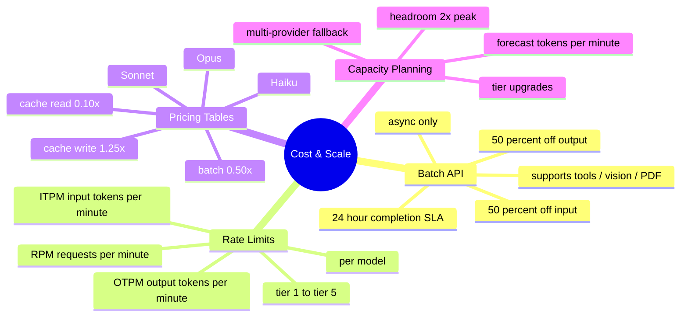

</details>

## §4 · Elaboration

### 4.1 Batch API

Send up to 10,000 requests at once; Anthropic processes them within 24 hours; you pay 50% of normal input AND output cost.

```typescript
const batch = await client.beta.messages.batches.create({
  requests: [
    {
      custom_id: "doc-001",
      params: { model: "claude-sonnet-4-6", max_tokens: 1024, messages: [...] }
    },
    {
      custom_id: "doc-002",
      params: { model: "claude-sonnet-4-6", max_tokens: 1024, messages: [...] }
    },
    // up to 10,000
  ],
});

// Poll for completion
const status = await client.beta.messages.batches.retrieve(batch.id);
// status.processing_status === "ended"

// Stream results
for await (const result of client.beta.messages.batches.results(batch.id)) {
  console.log(result.custom_id, result.result.message);
}
```

When Batch API wins:
- Offline evaluation runs (run your 500-case eval set in a single batch)
- Bulk document processing (Maya's 5,000 literature documents)
- Data backfills (re-process historical records)
- Synthetic data generation

When it doesn't:
- Anything user-facing (24-hour SLA is too slow)
- Anything where outputs feed into the next request (no chained reasoning)
- Conversation flows

### 4.2 Rate-limit tiers

Limits scale with your tier (which scales with monthly spend):

| Tier | Monthly spend req | Typical RPM | Typical ITPM (Sonnet) |
|---|---|---|---|
| 1 | $5 deposit | 50 RPM | 50K |
| 2 | $40+ spent | 1000 RPM | 100K |
| 3 | $200+ | 2000 RPM | 200K |
| 4 | $400+ | 4000 RPM | 400K |
| 5 | enterprise | custom | custom |

(Exact numbers shift; check the dashboard for current values.)

Three rate-limit dimensions to monitor:
- **RPM** (requests per minute) — burst capacity
- **ITPM** (input tokens per minute) — your prompt size × call frequency
- **OTPM** (output tokens per minute) — your response size × call frequency

You hit a 429 when ANY of the three is exceeded. Most production agents are ITPM-bound (long prompts), not RPM-bound (sparse calls).

### 4.3 Pricing tables (claude 4.x family, per million tokens)

| Model | Input | Cached read | Cache write | Output | Batch input | Batch output |
|---|---|---|---|---|---|---|
| **Opus 4.7** | $15.00 | $1.50 | $18.75 | $75.00 | $7.50 | $37.50 |
| **Sonnet 4.6** | $3.00 | $0.30 | $3.75 | $15.00 | $1.50 | $7.50 |
| **Haiku 4.5** | $0.80 | $0.08 | $1.00 | $4.00 | $0.40 | $2.00 |

(Prices subject to change; check Anthropic pricing page for current.)

Note the cascade:
- Cached read is 10% of input
- Cache write is 125% of input (one-time)
- Batch is 50% of both input and output
- **Batch + cached** = 5% of input (effectively a 20× discount on the cached portion)

### 4.4 Capacity planning math

For a forecasted workload:

```
peak_RPM     = peak_requests_per_minute
peak_ITPM    = peak_RPM × avg_input_tokens_per_request
peak_OTPM    = peak_RPM × avg_output_tokens_per_request

required_tier = min tier where:
  RPM_limit  ≥ 2 × peak_RPM
  ITPM_limit ≥ 2 × peak_ITPM
  OTPM_limit ≥ 2 × peak_OTPM
```

The 2× headroom rule: you want alerts to fire before you hit limits, with room to recover.

For Sherpa at 1,820 cases × 6 LLM calls × 4K input tokens × 3 hours of batch:
- ITPM during batch hours: 1820 × 6 × 4000 / 180 min ≈ **243K ITPM**
- At Sonnet Tier 4 (400K ITPM): you're at 60% utilisation — comfortable

For Acme Black Friday at 10× normal volume:
- If today peaks at 50K ITPM → BF peaks at 500K
- Need Tier 5 (enterprise) for BF
- Pre-arrange with Anthropic at least 30 days in advance

### 4.5 Multi-provider fallback

For mission-critical workloads where rate limits or outages are unacceptable, route across providers:

```typescript
async function callWithFallback(prompt: PromptInput) {
  try {
    return await anthropic.messages.create({...});
  } catch (err) {
    if (err.status === 429 || err.status === 529) {
      // Anthropic overloaded or rate limited; failover to secondary
      return await openai.chat.completions.create({...converted});
    }
    throw err;
  }
}
```

Cost: ~10% extra engineering to maintain provider abstraction. Benefit: outage resilience + negotiating leverage with Anthropic.

## §5 · Problem statement

For each org, design the capacity plan:

1. **HSBC** — 30% growth projection. Current $0.030/case. What levers reduce cost without quality loss?
2. **Helix** — 5,000 docs in 30 days, async. Cheapest path?
3. **Acme** — Black Friday 10× burst. Capacity prep?

## §6 · Solution walkthrough

### 1. HSBC growth + cost optimisation

Current state: 1,400 cases/night × $0.030 = $42/night = $15K/year.

Levers, ranked by impact:

| Lever | Cost change | Effort | Notes |
|---|---|---|---|
| Maximise prompt cache | -50% on cached portion | 1 week | Tighten prefix discipline, run regular audits |
| Tier routing (Haiku for routine) | -30% overall | 2 weeks | Per Lesson 14.3 |
| Move 30% of eval workload to Batch | -15% of eval cost | 2 days | Easy win for non-real-time evals |
| Use 1-hour TTL cache for batch windows | -5% | 1 day | Marginal but free |

Combined: from $0.030 → $0.015/case. Annual: $15K → ~$8K. 47% reduction.

### 2. Helix 5,000 docs batch

Submit as a single Batch API call:

```typescript
const batch = await client.beta.messages.batches.create({
  requests: documents.map((doc, i) => ({
    custom_id: `doc-${i}`,
    params: {
      model: "claude-sonnet-4-6",
      max_tokens: 2048,
      messages: [{
        role: "user",
        content: [
          { type: "document", source: { type: "base64", media_type: "application/pdf", data: doc.pdf } },
          { type: "text", text: "Summarise the key findings, methodology, and limitations." },
        ],
      }],
    },
  })),
});
```

Cost:
- 5,000 docs × ~10 pages × $0.0025/page (batch Sonnet vision) = ~$125 input
- 5,000 × 800 output tokens × $7.50/M (batch) = $30 output
- **Total: ~$155 for the entire job**

Real-time equivalent: ~$310. Batch saves $155 for 30-day SLA. Easy choice.

### 3. Acme Black Friday

Today: 320K tickets/month, ~10K/day, ~7 ITPM during business hours (Sonnet).

Black Friday: 10× → 100K/day, ~70K ITPM peak (4 days). Currently Tier 2 (100K ITPM); peaks at 70% utilisation. Risky.

Plan:
- 30 days before BF: contact Anthropic, upgrade to Tier 4 (400K ITPM headroom)
- Configure multi-provider fallback (route to GPT-4o on 429s)
- Pre-warm cache (Lesson 14.2) so prefix is hot before traffic spike
- Enable degraded mode (Module 9.4) — if all else fails, fall back to workflow-only path
- Run a load test 1 week before to validate

Cost spike: 10× requests for 4 days = ~$2K extra for BF. Worth it; revenue spike is much higher.

## §7 · Mathematical foundation

### 7.1 When to use Batch API

```
batch_cost = 0.50 × realtime_cost

worth_using = (24h SLA acceptable) AND (no dependency between requests)
```

Almost any offline eval, backfill, or bulk processing qualifies. Real-time chat does not.

### 7.2 Tier-upgrade trigger

Upgrade to the next tier when peak utilisation > 50% of current tier's limit. This gives 2× headroom.

### 7.3 Cost-per-million-tasks rough math (Sonnet, no cache)

```
cost ≈ (input_tokens × $3 + output_tokens × $15) / 1M
```

For 1M tasks of 4K input + 1K output each:
- Input: 4B × $3/M = $12K
- Output: 1B × $15/M = $15K
- Total: $27K per million tasks

With 95% cache hit + tier routing (40% Haiku, 50% Sonnet, 10% Opus):
- ~$12K per million tasks (55% reduction)

## §8 · Technical deep-dive

### 8.1 Batch API quirks

- Submission max: 10,000 requests per batch
- Individual request size: same as real-time (200KB body)
- Results streaming: chunks come as JSONL — process incrementally
- Failures: per-request errors are returned with the request's `custom_id`; rest of batch continues
- Cancellation: possible before processing starts; not after

### 8.2 Rate-limit error response

```
HTTP 429
{
  "type": "error",
  "error": {
    "type": "rate_limit_error",
    "message": "..."
  }
}
Headers:
  retry-after: 60          # wait this many seconds (when present)
  anthropic-ratelimit-requests-limit
  anthropic-ratelimit-requests-remaining
  anthropic-ratelimit-tokens-limit
  anthropic-ratelimit-tokens-remaining
```

Always honor `retry-after` when present. Anthropic's response telemetry is a useful signal — surface remaining limits in your observability spans.

### 8.3 Per-model vs aggregate limits

Rate limits are **per model, per organisation**. So:
- Sherpa using Sonnet doesn't consume your Haiku budget
- Acme's Sonnet limit is separate from HSBC's (different orgs)
- But all your Sonnet usage across all apps shares the same ITPM

For multi-app workloads, monitor per-model utilisation, not aggregate.

### 8.4 Cost forecasting template

```
Per-task cost = (
    cached_input × Pcache_read +
    uncached_input × Pin +
    output × Pout
) × tier_multiplier

Annual cost = per_task_cost × tasks_per_day × 365 × growth_factor

Set headroom = 2 × peak_TPM for capacity planning
```

Track these in a spreadsheet or dashboard. Re-forecast quarterly as actuals come in.

### 8.5 The 1-hour cache TTL economics revisited

For batch jobs with 5-minute gaps between calls (e.g., per-document processing in a 30-min loop), 5-min TTL is fine. For jobs with 30-min+ gaps, the 1-hour TTL is worth the 2× write premium.

Break-even for 1-hour TTL: 3 hits in the hour (Lesson 14.2 §7.3).

## §9 · What this unlocks

- **Module 9 production engineering** now has explicit batch + tier-routing + capacity-planning tools
- **Module 11 ROI modelling** has accurate pricing tables for cost projections
- **Module 13 frontier** discussions of concentration risk now have specific Anthropic-tier-tier dependencies

---

# Module 14 — Summary & exit criteria

By the time you finish all 5 lessons, you should be able to:

- [ ] Read any Messages API call and identify content blocks, streaming behaviour, tool use, and cost implications.
- [ ] Place `cache_control` breakpoints correctly using the 4-block hierarchy; compute the break-even.
- [ ] Choose between Opus / Sonnet / Haiku per task based on capability × cost × latency.
- [ ] Apply extended thinking only when accuracy gain justifies cost; preserve thinking blocks correctly.
- [ ] Design multi-modal workloads using vision, PDF, and Citations API instead of bespoke extraction.
- [ ] Use Batch API for async workloads; understand 50% discount + 24h SLA trade-off.
- [ ] Plan capacity using rate-limit tiers; size for 2× peak; configure multi-provider fallback.

**Architect exam-relevant:** every concept above is plausibly tested. The exam likely emphasises decisions over recall — practice with the scenarios in `connected-questions.md` Threads A/B/C, substituting Claude-specific features into each step.

**Forward references.**
- §14.1 SDK + streaming → Module 9 runbooks (handling 529s + retry middleware)
- §14.2 cache_control → Module 9.3 cost optimisation (concrete implementation)
- §14.3 tier routing → Module 9.3 (model tiering pattern)
- §14.4 native multi-modal → Module 5 RAG (simplifies vs custom extraction)
- §14.5 capacity planning → Module 9.4 operations + Module 11 ROI

---

*End of Module 14.*
