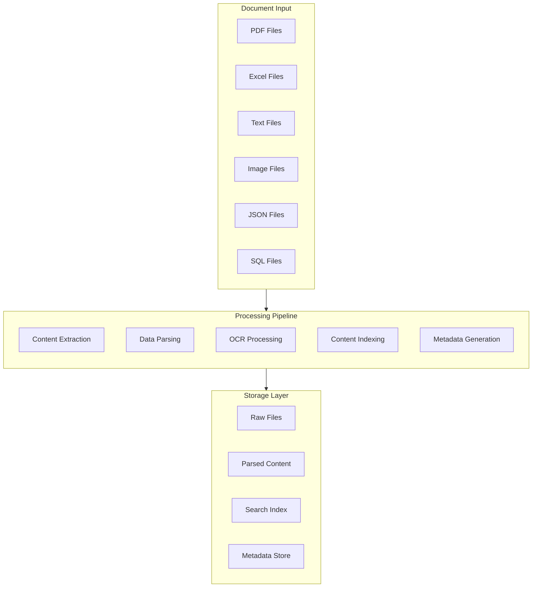
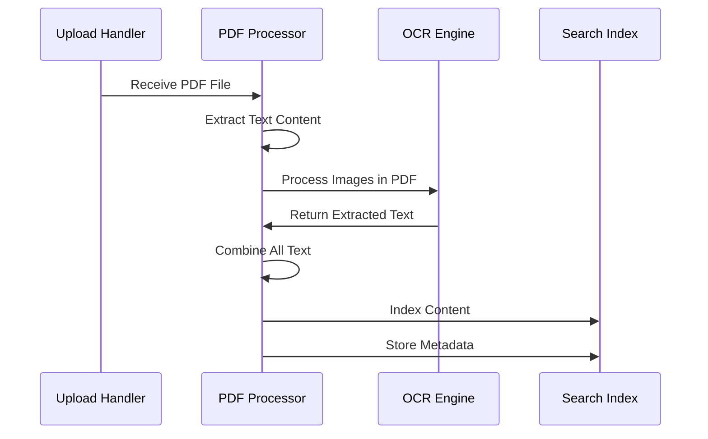
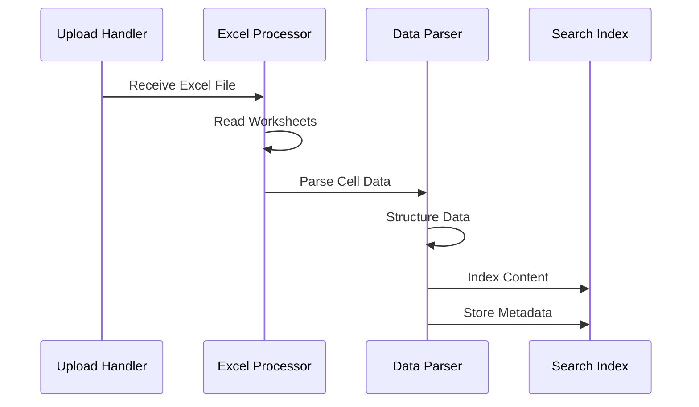
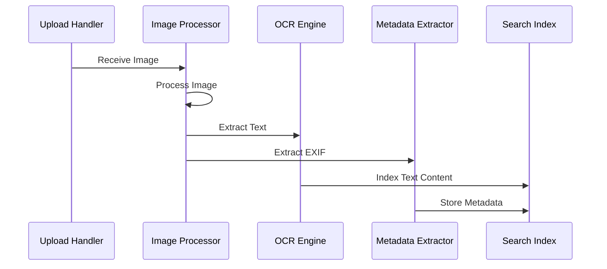
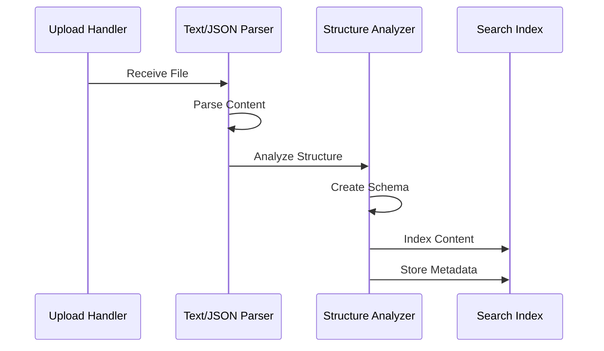
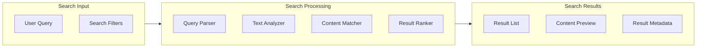
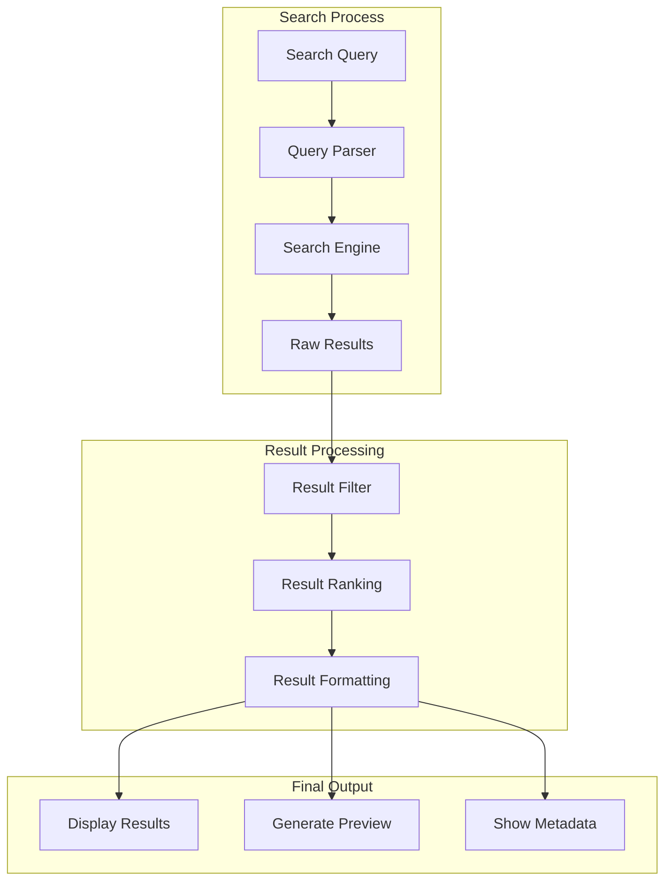

# Document Information Retrieval Process

## 1. Document Processing Pipeline



## 2. File Type Specific Processing

### 2.1 PDF Documents


#### Processing Steps:
1. Text Extraction
   - Extract raw text content
   - Maintain text formatting
   - Preserve document structure
   - Extract embedded metadata

2. Image Processing
   - Identify embedded images
   - Apply OCR to images
   - Extract image metadata
   - Process diagrams and charts

### 2.2 Excel Documents


#### Processing Steps:
1. Sheet Processing
   - Extract all worksheets
   - Parse cell formulas
   - Process data tables
   - Extract charts and graphs

2. Data Structuring
   - Identify headers
   - Determine data types
   - Map relationships
   - Create searchable format

### 2.3 Image Files


#### Processing Steps:
1. Image Analysis
   - Extract EXIF data
   - Analyze image content
   - Detect text regions
   - Identify visual elements

2. OCR Processing
   - Text recognition
   - Layout analysis
   - Character extraction
   - Language detection

### 2.4 Text and JSON Files


#### Processing Steps:
1. Content Parsing
   - Detect encoding
   - Parse structure
   - Validate format
   - Extract schema

2. Data Mapping
   - Identify relationships
   - Map data types
   - Create indices
   - Generate metadata

## 3. Information Retrieval Process

### 3.1 Search Pipeline


### 3.2 Retrieval Methods

#### Full-Text Search
```typescript
interface SearchQuery {
    keywords: string[];
    filters: {
        fileType?: string[];
        dateRange?: DateRange;
        metadata?: Record<string, any>;
    };
    options: {
        fuzzyMatch?: boolean;
        highlight?: boolean;
        limit?: number;
        offset?: number;
    };
}
```

#### Faceted Search
```typescript
interface FacetedSearch {
    mainQuery: string;
    facets: {
        fileType: string[];
        author: string[];
        tags: string[];
        date: DateRange[];
    };
    aggregations: {
        type: string;
        field: string;
        size?: number;
    }[];
}
```

### 3.3 Content Indexing Strategy

#### Document Index Structure
```json
{
  "document": {
    "id": "unique_id",
    "content": "indexed_content",
    "metadata": {
      "title": "string",
      "author": "string",
      "created": "date",
      "modified": "date",
      "fileType": "string",
      "tags": ["string"]
    },
    "extracted": {
      "text": "string",
      "entities": ["string"],
      "keywords": ["string"]
    },
    "statistics": {
      "wordCount": "number",
      "pageCount": "number",
      "size": "number"
    }
  }
}
```

### 3.4 Result Processing



## 4. Implementation Example

### 4.1 Document Processor Implementation
```javascript
class DocumentProcessor {
    async processDocument(file) {
        const fileType = this.detectFileType(file);
        const processor = this.getProcessor(fileType);
        
        // Extract content
        const content = await processor.extract(file);
        
        // Generate metadata
        const metadata = await this.generateMetadata(file, content);
        
        // Index content
        await this.indexContent(content, metadata);
        
        // Store document
        await this.storeDocument(file, content, metadata);
        
        return {
            id: metadata.id,
            status: 'processed',
            metadata
        };
    }
}
```

### 4.2 Search Implementation
```javascript
class SearchService {
    async search(query) {
        // Parse query
        const parsedQuery = this.parseQuery(query);
        
        // Apply filters
        const filteredResults = await this.applyFilters(parsedQuery);
        
        // Rank results
        const rankedResults = this.rankResults(filteredResults);
        
        // Format results
        return this.formatResults(rankedResults);
    }
}
```

Would you like me to:
1. Provide more detailed implementation examples?
2. Add more specific processing steps for certain file types?
3. Expand the search functionality?
4. Include additional retrieval methods?