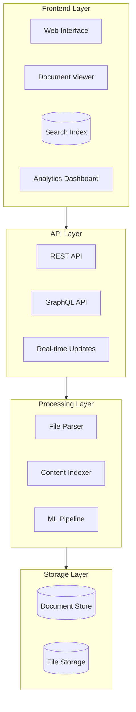
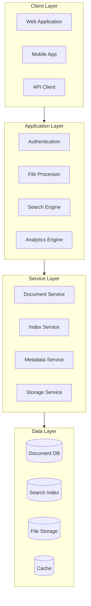
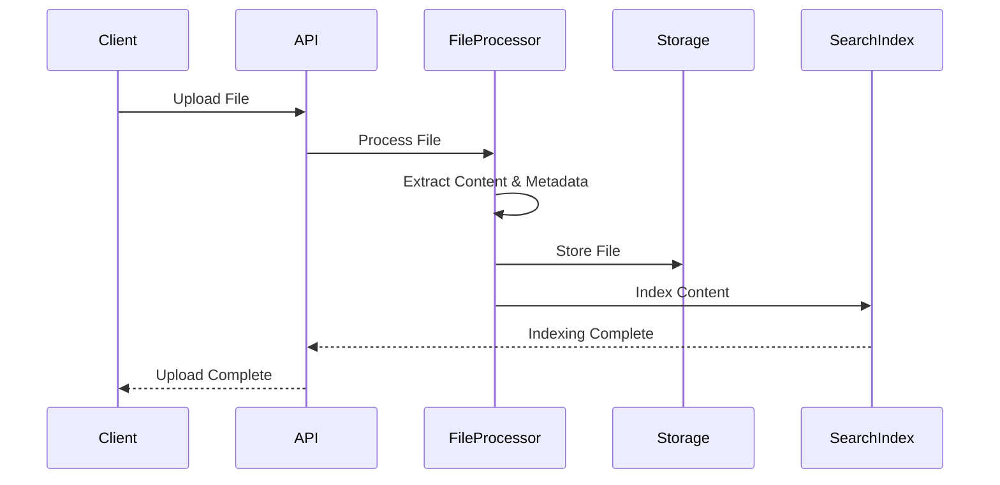
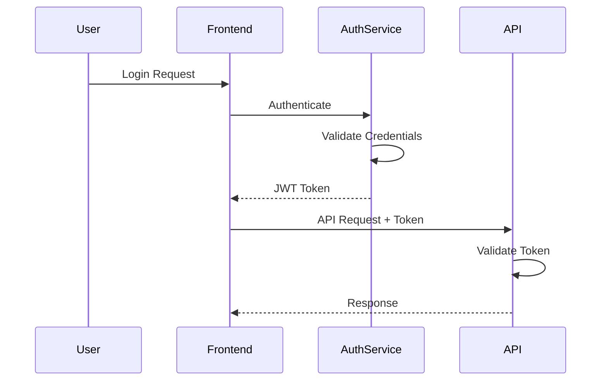
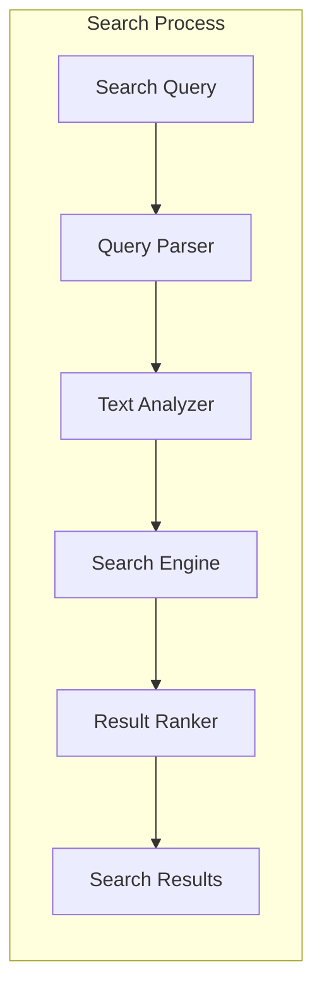
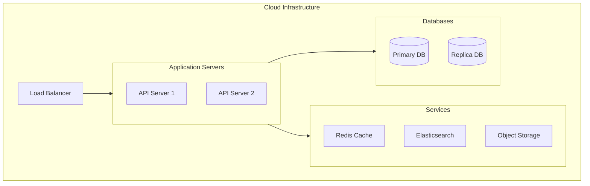

# Knowledge Management System
## Technical Design Document



## 1. System Overview

### 1.1 Purpose
The Knowledge Management System (KMS) is designed to centralize, organize, and make accessible various types of documents and data sources within an organization. It provides unified access to PDF, text, Excel, JSON, SQL, media, and image files through a single interface.

### 1.2 Key Objectives
- Centralized document storage and management
- Multi-format file support and processing
- Advanced search and retrieval capabilities
- Document versioning and access control
- Analytics and usage tracking
- Real-time collaboration features

### 1.3 Target Users
- Content Managers
- Knowledge Workers
- System Administrators
- End Users (Readers)
- Data Analysts

## 2. Architecture Design

### 2.1 System Architecture



### 2.2 Component Overview

#### Frontend Components
1. Document Upload Interface
2. Document Viewer
3. Search Interface
4. Analytics Dashboard
5. Admin Panel

#### Backend Services
1. Authentication Service
2. File Processing Service
3. Search Service
4. Analytics Service
5. Storage Service

## 3. Technical Specifications

### 3.1 File Processing Pipeline



### 3.2 Data Models

#### Document Schema
```json
{
  "id": "string",
  "title": "string",
  "type": "string",
  "content": "string",
  "metadata": {
    "author": "string",
    "createdAt": "datetime",
    "modifiedAt": "datetime",
    "version": "number",
    "tags": ["string"],
    "customFields": {}
  },
  "permissions": {
    "owners": ["userId"],
    "readers": ["userId"],
    "editors": ["userId"]
  },
  "fileInfo": {
    "size": "number",
    "format": "string",
    "path": "string"
  },
  "versions": [
    {
      "versionId": "string",
      "timestamp": "datetime",
      "userId": "string"
    }
  ]
}
```

#### User Schema
```json
{
  "id": "string",
  "email": "string",
  "role": "string",
  "permissions": ["string"],
  "preferences": {
    "defaultView": "string",
    "notifications": ["string"]
  }
}
```

### 3.3 API Endpoints

#### Document Management
```typescript
// Document endpoints
POST   /api/documents           // Upload new document
GET    /api/documents          // List documents
GET    /api/documents/:id      // Get document
PUT    /api/documents/:id      // Update document
DELETE /api/documents/:id      // Delete document

// Version management
POST   /api/documents/:id/versions     // Create version
GET    /api/documents/:id/versions     // List versions
GET    /api/documents/:id/versions/:vid // Get version

// Search endpoints
GET    /api/search            // Search documents
POST   /api/search/advanced   // Advanced search
```

### 3.4 Security Specifications

#### Authentication Flow


## 4. Implementation Details

### 4.1 File Processing Implementation

#### Supported File Types and Processors
| File Type | Processor | Libraries |
|-----------|-----------|-----------|
| PDF | PDF Extractor | pdf-parse |
| Excel | Excel Parser | xlsx |
| Text | Text Parser | Built-in |
| Images | Image Processor | sharp |
| JSON | JSON Parser | Built-in |
| SQL | SQL Parser | sql-parse |

### 4.2 Search Implementation

#### Search Features
- Full-text search
- Fuzzy matching
- Faceted search
- Advanced filters
- Relevance scoring



### 4.3 Analytics Implementation

#### Tracked Metrics
1. Document Usage
   - View count
   - Download count
   - Search frequency
   
2. User Behavior
   - Session duration
   - Search patterns
   - Navigation paths

3. System Performance
   - Processing time
   - Search latency
   - Storage usage

## 5. Deployment Architecture



## 6. Performance Considerations

### 6.1 Optimization Strategies
1. Content Caching
2. Search Index Optimization
3. CDN Integration
4. Database Sharding
5. Load Balancing

### 6.2 Scalability Plan
1. Horizontal Scaling
2. Microservices Architecture
3. Distributed Processing
4. Caching Layers
5. Async Processing

## 7. Monitoring and Maintenance

### 7.1 Monitoring Metrics
1. System Health
2. Performance Metrics
3. Error Rates
4. User Activity
5. Storage Usage

### 7.2 Maintenance Tasks
1. Index Optimization
2. Cache Management
3. Storage Cleanup
4. Security Updates
5. Backup Procedures

## 8. Future Enhancements

### 8.1 Planned Features
1. AI-powered document classification
2. Advanced OCR capabilities
3. Natural language processing
4. Collaborative editing
5. Mobile application

### 8.2 Integration Possibilities
1. Third-party storage providers
2. Enterprise systems
3. Communication platforms
4. Analytics tools
5. Authentication systems

## 9. Risk Mitigation

### 9.1 Identified Risks
1. Data Security
2. System Performance
3. Scalability Issues
4. Data Integrity
5. User Adoption

### 9.2 Mitigation Strategies
1. Regular security audits
2. Performance monitoring
3. Scalability testing
4. Data validation
5. User training

